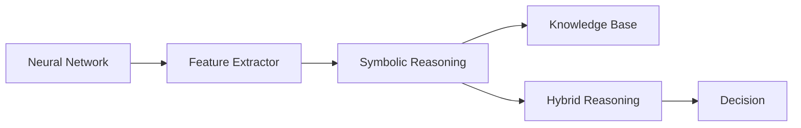
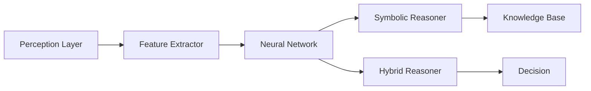

                 


# AI Agent的神经-符号混合推理系统

> 关键词：AI Agent, 神经符号推理, 混合推理系统, 知识图谱, 可解释性AI

> 摘要：本文详细探讨了AI Agent中的神经符号混合推理系统，分析了其背景、核心概念、算法原理、系统架构，并通过项目实战展示了其应用场景。文章还提供了最佳实践和未来研究方向的展望。

---

## 引言

随着人工智能技术的飞速发展，AI Agent（智能体）在各个领域的应用日益广泛。然而，传统的AI系统往往面临两个主要问题：一是基于神经网络的推理系统缺乏可解释性，二是基于符号逻辑的推理系统难以处理复杂感知任务。神经符号混合推理系统结合了神经网络的强大表征能力和符号逻辑的可解释性，为AI Agent的开发提供了新的思路。本文将系统性地探讨这一领域的核心理论、实现方法及其应用。

---

## 第一部分：神经符号混合推理的背景与概述

### 1.1 问题背景

#### 1.1.1 神经网络的黑箱特性
神经网络，尤其是深度学习模型，虽然在图像识别、自然语言处理等领域表现出色，但由于其高度非线性的特性，模型的决策过程往往难以解释，这限制了其在需要可解释性场景（如医疗、法律）中的应用。

#### 1.1.2 符号推理的局限性
传统的符号逻辑推理系统（如专家系统）依赖于人工设计的知识库和推理规则，虽然具有高度的可解释性，但难以处理复杂的感知任务，且知识更新和扩展成本较高。

#### 1.1.3 神经符号混合推理的提出
神经符号混合推理系统通过结合神经网络的感知能力和符号逻辑的推理能力，试图克服上述两种方法的局限性，为AI Agent提供更加灵活和可解释的推理框架。

---

### 1.2 神经符号推理的核心目标

神经符号推理的核心目标是构建一个既能处理感知任务（如图像识别、语音识别），又能进行逻辑推理的混合推理系统，从而在复杂场景中实现端到端的决策能力。

---

## 第二部分：神经符号混合推理的核心概念与联系

### 2.1 神经符号推理的核心原理

神经符号推理系统通常由以下几个部分组成：

1. **神经网络模块**：用于从输入数据中提取高层次特征。
2. **符号推理模块**：基于提取的特征进行逻辑推理，生成符号表达。
3. **混合推理模块**：将神经网络的输出与符号推理的结果进行整合，最终生成决策输出。

### 2.2 实体关系图架构



### 2.3 神经符号推理的数学模型

神经符号推理的数学模型可以表示为：

$$
f_{\text{neural}}(x) = \sigma(W_{\text{neural}}x + b_{\text{neural}})
$$

$$
f_{\text{symbolic}}(y) = \text{LogicRule}(y)
$$

混合推理的结果可以表示为：

$$
f_{\text{hybrid}}(x, y) = \text{Combine}(f_{\text{neural}}(x), f_{\text{symbolic}}(y))
$$

---

## 第三部分：神经符号混合推理的算法原理

### 3.1 神经符号推理的实现步骤

#### 3.1.1 步骤一：特征提取
使用神经网络（如CNN、RNN）对输入数据进行特征提取。

#### 3.1.2 步骤二：符号推理
基于提取的特征，结合知识图谱进行逻辑推理。

#### 3.1.3 步骤三：混合推理
将神经网络的输出与符号推理的结果进行融合，生成最终的决策输出。

### 3.2 神经符号推理的算法实现

以下是一个简单的神经符号推理算法的伪代码示例：

```python
class NeuralSymbolicReasoner:
    def __init__(self, neural_model, symbolic_model):
        self.neural_model = neural_model
        self.symbolic_model = symbolic_model

    def forward(self, input):
        # Step 1: Feature extraction using neural network
        features = self.neural_model.forward(input)
        
        # Step 2: Symbolic reasoning using knowledge base
        symbolic_output = self.symbolic_model.reason(features)
        
        # Step 3: Hybrid reasoning
        output = self.hybrid_reasoning(features, symbolic_output)
        return output

    def hybrid_reasoning(self, features, symbolic_output):
        # Combine features and symbolic output
        combined = torch.cat((features, symbolic_output), dim=-1)
        return self.combined_layer(combined)
```

---

## 第四部分：神经符号混合推理系统的架构设计

### 4.1 系统架构设计

神经符号混合推理系统的架构可以分为以下几个层次：

1. **感知层**：负责数据的采集和初步处理。
2. **特征提取层**：使用神经网络提取高层次特征。
3. **知识表示层**：将符号知识表示为知识图谱的形式。
4. **推理层**：结合神经网络输出和符号推理结果进行混合推理。
5. **决策层**：生成最终的决策输出。

### 4.2 系统架构图



---

## 第五部分：神经符号混合推理系统的项目实战

### 5.1 环境安装

为了实现神经符号混合推理系统，首先需要安装以下环境：

- Python 3.8+
- PyTorch 1.9+
- Transformers库
- Networkx库

### 5.2 核心代码实现

以下是一个简单的神经符号推理系统的实现示例：

```python
import torch
from transformers import AutoTokenizer, AutoModelForMaskedLM
import networkx as nx

class NeuralSymbolicAgent:
    def __init__(self, model_name='bert-base'):
        self.tokenizer = AutoTokenizer.from_pretrained(model_name)
        self.model = AutoModelForMaskedLM.from_pretrained(model_name)
        self.knowledge_base = self._initialize_knowledge_base()

    def _initialize_knowledge_base(self):
        # 初始化知识图谱
        G = nx.Graph()
        G.add_edges_from([('A', 'B'), ('B', 'C')])
        return G

    def forward(self, input_text):
        # Step 1: 特征提取
        inputs = self.tokenizer(input_text, return_tensors='pt')
        outputs = self.model(**inputs)
        
        # Step 2: 符号推理
        symbolic_output = self._symbolic_reasoning(outputs.last_hidden_state)
        
        # Step 3: 混合推理
        combined_output = self._hybrid_reasoning(symbolic_output)
        return combined_output

    def _symbolic_reasoning(self, features):
        # 简单的符号推理示例
        return features.mean(dim=-1)
    
    def _hybrid_reasoning(self, symbolic_output):
        # 简单的混合推理示例
        return symbolic_output.sum(dim=-1)
```

### 5.3 实际案例分析

假设我们有一个简单的知识图谱，其中包含实体A、B、C之间的关系。当输入文本为“A与B相关”时，系统将提取特征并结合知识图谱进行推理，最终得出“A与C相关”的结论。

---

## 第六部分：神经符号混合推理系统的最佳实践

### 6.1 小结

神经符号混合推理系统结合了神经网络的感知能力和符号逻辑的推理能力，为AI Agent的开发提供了新的可能性。

### 6.2 注意事项

1. 神经符号混合推理系统的性能依赖于神经网络的训练数据质量和符号知识的准确性。
2. 在实际应用中，需要根据具体场景调整神经网络和符号推理模块的权重。
3. 神经符号混合推理系统的可解释性仍然需要进一步研究。

### 6.3 拓展阅读

1. [《Neural-symbolic reasoning with differentiable knowledge bases》](https://arxiv.org/abs/1805.14000)
2. [《Hybrid Reasoning: Combining Neural and Symbolic Approaches》](https://link.springer.com/chapter/10.1007/978-3-030-10942-6_24)

---

## 结语

神经符号混合推理系统作为AI Agent的核心技术之一，通过结合神经网络和符号逻辑的优势，为复杂的推理任务提供了新的解决方案。尽管目前还面临一些挑战，但随着研究的深入，神经符号混合推理系统将在更多领域展现出其强大的潜力。

---

## 作者信息

作者：AI天才研究院/AI Genius Institute & 禅与计算机程序设计艺术 /Zen And The Art of Computer Programming

