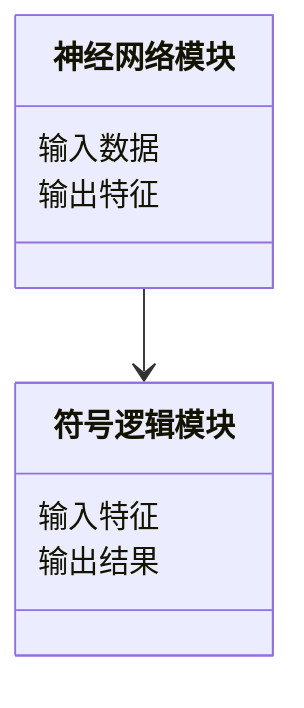
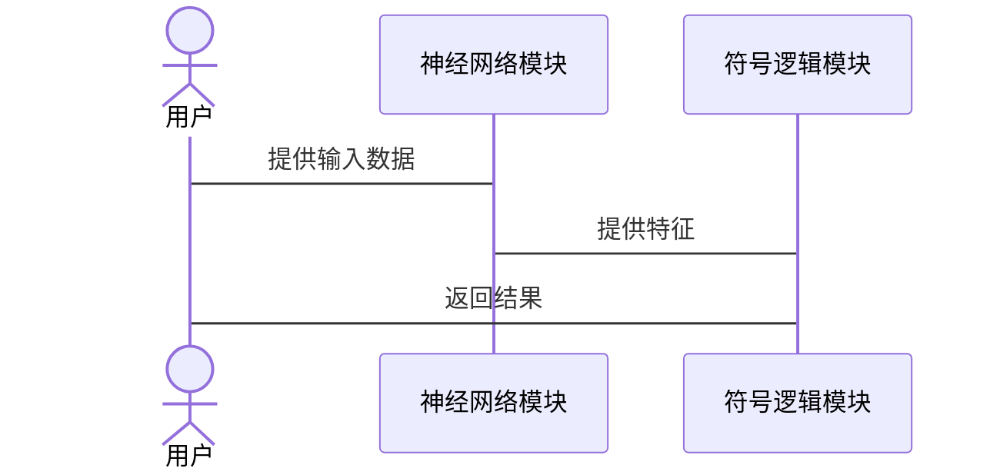

                 


---

# AI Agent的神经-符号混合架构实现

## 关键词：
神经符号混合架构, AI Agent, 神经网络, 符号逻辑, 混合AI系统

## 摘要：
神经-符号混合架构结合了神经网络的强大学习能力和符号逻辑的精确推理能力，为AI Agent提供了更高效、更灵活的处理方式。本文详细介绍了神经-符号混合架构的核心概念、实现原理、系统设计及实际应用，帮助读者全面理解并掌握这一前沿技术。

---

# 第1章: 引言

## 1.1 AI Agent的发展趋势
随着人工智能技术的飞速发展，AI Agent在各个领域的应用越来越广泛。传统的单一技术架构已难以满足复杂场景的需求，神经-符号混合架构应运而生，成为AI Agent技术发展的重要方向。

## 1.2 神经-符号混合架构的核心思想
神经-符号混合架构通过结合神经网络和符号逻辑的优势，实现了感知与推理的统一，为AI Agent提供了更强的智能处理能力。

## 1.3 神经-符号混合架构的应用场景
本文将重点分析神经-符号混合架构在自然语言处理、智能问答系统和自动驾驶等领域的应用，展示其独特的优势。

---

# 第2章: 神经-符号混合架构的基本概念

## 2.1 神经网络的基本原理
### 2.1.1 神经网络的定义与特点
神经网络是一种模拟人脑结构和功能的数学模型，具有强大的非线性表达能力和自适应学习能力。

### 2.1.2 神经网络的分类
- **卷积神经网络（CNN）**：适用于图像处理。
- **循环神经网络（RNN）**：适用于序列数据处理。
- **深度神经网络（DNN）**：广泛应用于各种任务。

## 2.2 符号逻辑的基本原理
### 2.2.1 符号逻辑的定义与特点
符号逻辑通过形式化的符号表达和推理规则，实现精确的逻辑推理。

### 2.2.2 常见的符号逻辑系统
- **一阶逻辑（FOL）**：具有强大的表达能力。
- **规则推理系统**：通过预定义规则进行推理。

## 2.3 神经网络与符号逻辑的结合
### 2.3.1 结合的必要性
单一技术架构在复杂任务中存在局限性，混合架构能够互补优势。

### 2.3.2 结合的方式
- **符号增强神经网络**：在神经网络中引入符号规则。
- **符号驱动神经网络**：通过符号推理指导神经网络学习。

---

# 第3章: 神经-符号混合架构的核心原理

## 3.1 混合架构的算法原理
### 3.1.1 神经符号模型的基本结构


### 3.1.2 神经符号模型的训练过程
1. 输入原始数据，提取特征。
2. 利用符号逻辑进行推理。
3. 神经网络基于推理结果进行优化。

## 3.2 神经符号模型的数学建模
### 3.2.1 神经网络部分的数学公式
$$ y = f(x) $$
其中，$x$ 是输入数据，$f$ 是神经网络的非线性变换函数。

### 3.2.2 符号逻辑部分的数学公式
$$ z = g(y) $$
其中，$g$ 是符号逻辑的推理函数。

## 3.3 混合架构的实现步骤
### 3.3.1 数据预处理
- 对输入数据进行清洗、归一化等处理。

### 3.3.2 神经网络训练
- 使用反向传播算法优化神经网络参数。

### 3.3.3 符号逻辑推理
- 基于神经网络输出进行符号推理。

### 3.3.4 结果整合
- 将符号推理结果与神经网络输出结合，得到最终结果。

---

# 第4章: 神经-符号混合架构的系统分析与设计

## 4.1 问题场景分析
### 4.1.1 问题背景
以智能问答系统为例，传统方法难以处理复杂语义理解，混合架构能够有效提升准确性。

## 4.2 系统功能设计
### 4.2.1 领域模型设计


### 4.2.2 系统架构设计


## 4.3 系统接口设计
- 神经网络模块与符号逻辑模块之间的接口定义。
- 外部系统与混合架构之间的接口设计。

## 4.4 系统交互设计


---

# 第5章: 项目实战

## 5.1 环境安装与配置
### 5.1.1 环境搭建步骤
- 安装Python、TensorFlow、逻辑推理库等工具。

### 5.1.2 工具链安装
- 使用pip安装所需的依赖包。

## 5.2 核心代码实现
### 5.2.1 数据预处理
```python
import numpy as np
# 假设输入数据为X，标签为y
X = np.array([...])
y = np.array([...])
```

### 5.2.2 神经网络模块实现
```python
import tensorflow as tf
model = tf.keras.Sequential([
    tf.keras.layers.Dense(64, activation='relu'),
    tf.keras.layers.Dense(10, activation='softmax')
])
model.compile(optimizer='adam', loss='sparse_categorical_crossentropy', metrics=['accuracy'])
model.fit(X, y, epochs=10, batch_size=32)
```

### 5.2.3 符号逻辑模块实现
```python
def symbolic_inference(features):
    # 假设features是神经网络输出的特征向量
    result = []
    for feature in features:
        # 进行符号逻辑推理
        result.append(infer(feature))
    return result
```

### 5.2.4 结果整合
```python
def hybrid_inference(X):
    # 神经网络预测
    features = model.predict(X)
    # 符号逻辑推理
    results = symbolic_inference(features)
    return results
```

## 5.3 项目案例分析
以智能问答系统为例，展示神经-符号混合架构如何提升问答准确率。

## 5.4 项目小结
通过实际项目，验证了神经-符号混合架构的有效性和优势。

---

# 第6章: 最佳实践与小结

## 6.1 最佳实践
### 6.1.1 神经网络的调参技巧
- 选择合适的网络结构和超参数。

### 6.1.2 符号逻辑的优化方法
- 设计合理的符号规则，提升推理效率。

## 6.2 注意事项
- 数据质量对结果影响重大，需做好数据清洗和特征工程。
- 神经网络和符号逻辑的结合需根据具体任务灵活调整。

## 6.3 未来展望
神经-符号混合架构将在更多领域得到应用，成为AI Agent的核心技术之一。

---

# 结论

神经-符号混合架构通过结合神经网络的深度学习能力和符号逻辑的精确推理能力，为AI Agent提供了更强大的智能处理能力。本文通过理论分析和实际案例，详细阐述了这一架构的核心概念、实现原理和应用方法，为读者提供了全面的指导。

---

# 作者

作者：AI天才研究院/AI Genius Institute & 禅与计算机程序设计艺术 /Zen And The Art of Computer Programming

---

