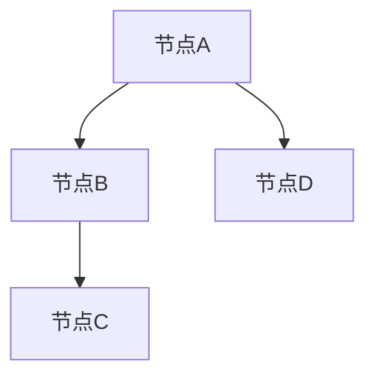

                 

# AI Agent的神经图网络推理能力实现

## 关键词：AI Agent，神经图网络，推理能力，知识图谱，符号推理，深度学习，图神经网络

## 摘要：本文将详细探讨AI Agent的神经图网络推理能力实现。从背景介绍到核心概念，从算法原理到系统架构，再到项目实战，最后给出最佳实践。我们将一步步分析推理，使用逻辑清晰、结构紧凑、简单易懂的专业技术语言，帮助读者全面理解并掌握AI Agent的神经图网络推理能力实现的核心技术和方法。

---

# 第1章: AI Agent与神经图网络概述

## 1.1 AI Agent的基本概念

### 1.1.1 AI Agent的定义与分类

AI Agent（人工智能代理）是一种智能体，能够感知环境、执行任务并做出决策。根据功能和智能水平，AI Agent可以分为以下几类：

1. **反应式Agent**：基于当前感知做出反应，适用于简单的任务。
2. **基于模型的规划Agent**：利用内部模型和规划算法，适用于复杂任务。
3. **学习增强型Agent**：通过机器学习提升智能体的性能和能力。
4. **人机协作Agent**：与人类协同工作的智能体，注重人机交互。

### 1.1.2 神经图网络的基本概念

神经图网络（Neural Graph Networks）是结合了图论和深度学习的模型，用于处理图结构数据。其核心思想是通过神经网络对图的节点和边进行特征学习，捕捉图的结构信息。

### 1.1.3 AI Agent与神经图网络的结合

AI Agent需要处理复杂、动态的环境信息，神经图网络的图结构建模能力能够帮助AI Agent理解环境中的关系和依赖，从而提升推理能力。

---

## 1.2 神经图网络推理能力的背景与意义

### 1.2.1 神经图网络在AI Agent中的作用

神经图网络能够帮助AI Agent进行图结构数据的建模、分析和推理，尤其是在处理复杂关系和依赖时表现出色。

### 1.2.2 神经图网络推理能力的重要性

推理能力是AI Agent的核心能力之一，神经图网络的引入能够显著提升AI Agent在复杂场景下的推理效率和准确性。

### 1.2.3 当前研究与应用现状

目前，神经图网络在社交网络分析、知识图谱构建、推荐系统等领域有广泛应用。AI Agent结合神经图网络的研究还处于起步阶段，但已经展现出巨大的潜力。

---

## 1.3 问题背景与目标

### 1.3.1 问题背景介绍

AI Agent需要具备强大的推理能力，以应对复杂多变的任务场景。传统的符号推理和概率推理方法在处理大规模复杂数据时存在效率瓶颈。

### 1.3.2 问题描述与分析

本文研究的核心问题是：如何利用神经图网络提升AI Agent的推理能力，使其能够高效处理图结构数据，并在动态环境中做出准确决策。

### 1.3.3 问题解决的思路与方法

通过构建神经图网络模型，结合符号推理和深度学习，实现AI Agent的高效推理能力。

### 1.3.4 边界与外延

本文仅关注神经图网络在AI Agent推理能力中的应用，不涉及其他类型的AI Agent或推理方法。

### 1.3.5 概念结构与核心要素组成

- **概念结构**：AI Agent、神经图网络、推理能力。
- **核心要素**：图结构数据、推理算法、神经网络模型。

---

## 1.4 本章小结

本章介绍了AI Agent和神经图网络的基本概念，分析了神经图网络在AI Agent推理能力中的作用和意义，明确了研究的目标和范围。

---

# 第2章: 神经图网络的核心概念与原理

## 2.1 神经图网络的基本原理

### 2.1.1 神经图网络的定义与特点

神经图网络是一种结合了图论和深度学习的模型，具有以下特点：

- **图结构建模**：能够处理复杂的图结构数据。
- **节点与边特征学习**：通过神经网络提取节点和边的特征。
- **全局与局部信息融合**：能够同时考虑局部和全局的信息。

### 2.1.2 神经图网络的组成部分

神经图网络由以下部分组成：

- **输入层**：图结构数据的输入。
- **隐藏层**：通过神经网络对节点和边进行特征提取。
- **输出层**：推理结果的输出。

### 2.1.3 神经图网络的数学模型

神经图网络的数学模型可以用以下公式表示：

$$
f: G \rightarrow Y
$$

其中，$G$ 是图结构数据，$Y$ 是推理结果。

---

## 2.2 AI Agent中的神经图网络推理能力

### 2.2.1 推理能力的定义与分类

推理能力是AI Agent的核心能力之一，包括以下几种类型：

- **符号推理**：基于符号逻辑进行推理。
- **概率推理**：基于概率论进行推理。
- **深度学习推理**：基于神经网络进行推理。

### 2.2.2 神经图网络在推理中的作用

神经图网络能够帮助AI Agent理解和处理复杂的图结构数据，提升推理的准确性和效率。

### 2.2.3 推理能力的实现机制

通过神经图网络对图结构数据进行建模和特征提取，结合符号推理和概率推理方法，实现推理能力。

---

## 2.3 神经图网络与传统图网络的对比

### 2.3.1 传统图网络的局限性

传统图网络在处理大规模复杂数据时，计算效率较低，难以应对动态变化的环境。

### 2.3.2 神经图网络的优势

神经图网络结合了深度学习和图论的优势，能够高效处理大规模复杂数据。

### 2.3.3 两者的异同点对比

| 特性 | 传统图网络 | 神经图网络 |
|------|------------|------------|
| 数据处理 | 基于规则 | 基于神经网络 |
| 计算效率 | 较低 | 较高 |
| 应用场景 | 简单任务 | 复杂任务 |

---

## 2.4 本章小结

本章详细介绍了神经图网络的核心概念和基本原理，分析了神经图网络在AI Agent推理中的作用，并对比了神经图网络与传统图网络的异同。

---

## 附录

### 附录A: 神经图网络与传统图网络的对比表格

| 特性 | 传统图网络 | 神经图网络 |
|------|------------|------------|
| 数据处理 | 基于规则 | 基于神经网络 |
| 计算效率 | 较低 | 较高 |
| 应用场景 | 简单任务 | 复杂任务 |

---

# 附录B: 神经图网络的实体关系图

---

通过以上内容，我们可以看到，神经图网络在AI Agent的推理能力实现中具有重要的作用。接下来，我们将深入探讨神经图网络推理能力的核心算法和数学模型。

---

**作者：AI天才研究院 & 禅与计算机程序设计艺术**

