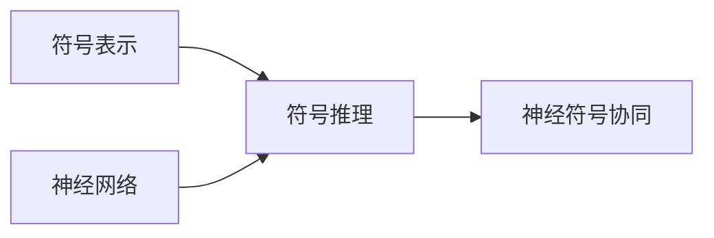
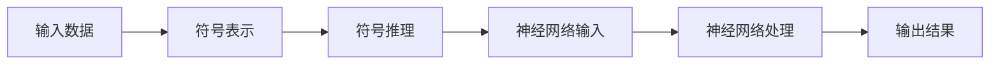

                 


# AI Agent的神经符号整合学习方法

> 关键词：AI Agent, 神经符号整合, 符号推理, 神经网络, 可解释性AI

> 摘要：本文探讨了AI Agent中神经符号整合学习方法的核心概念、算法原理、系统架构及实际应用。通过结合神经网络和符号推理的优势，提出了一种创新的神经符号整合框架，旨在提升AI Agent的推理能力、可解释性和任务处理效率。文章从理论到实践，详细分析了神经符号整合的关键技术，为AI Agent的未来发展提供了新的思路。

---

# 第一部分: AI Agent与神经符号学习的背景介绍

## 第1章: 神经符号学习的基本概念

### 1.1 什么是神经符号学习
神经符号学习（Neural-Symbolic Learning）是一种结合了神经网络和符号推理的人工智能方法。它通过将符号规则嵌入到神经网络中，利用神经网络强大的特征学习能力，同时保持符号推理的可解释性和灵活性。

### 1.2 问题背景
传统的神经网络虽然在模式识别和数据处理方面表现出色，但缺乏逻辑推理能力，难以处理需要符号操作的任务。而符号推理虽然具有推理能力，但在处理复杂数据时表现不佳。神经符号整合通过结合两者的优势，弥补了这一不足。

### 1.3 AI Agent的定义与特点
AI Agent是一种智能体，能够感知环境、自主决策并执行任务。它具有自主性、反应性、目标导向和社交能力等特点。

### 1.4 神经符号整合在AI Agent中的潜力
神经符号整合能够提升AI Agent的推理能力、可解释性和任务处理效率，使其在复杂环境中表现更出色。

---

# 第二部分: 神经符号整合的核心概念与联系

## 第2章: 神经符号整合的核心概念

### 2.1 符号表示与神经网络的结合
符号表示通过逻辑规则描述知识，神经网络则通过数据学习特征。两者的结合使得AI Agent能够同时处理结构化和非结构化数据。

### 2.2 符号推理与神经网络的协同工作
符号推理负责逻辑推理，神经网络负责数据处理。两者协同工作，提升了AI Agent的推理和决策能力。

### 2.3 神经符号整合的数学模型
通过将符号规则嵌入到神经网络中，构建神经符号整合的数学模型，实现符号与数值的结合。

### 2.4 实体关系图


---

# 第三部分: 神经符号整合的算法原理

## 第3章: 神经符号整合算法的实现

### 3.1 符号增强的神经网络
通过在神经网络中嵌入符号规则，提升网络的推理能力。例如，在图像分类任务中，结合逻辑规则进行特征选择。

### 3.2 神经符号协同推理
将符号推理的结果作为神经网络的输入，提升网络的推理精度。

### 3.3 算法流程图


### 3.4 算法实现代码
```python
class NeuralSymbolicModel:
    def __init__(self, symbols):
        self.symbols = symbols
        # 初始化神经网络
        self.neural_network = NeuralNetwork()

    def forward(self, input_data):
        # 符号表示
        symbolic_input = self.symbols.transform(input_data)
        # 神经网络处理
        output = self.neural_network.forward(symbolic_input)
        return output

    def backward(self, error):
        # 反向传播
        self.neural_network.backward(error)
```

### 3.5 数学模型
符号表示通过逻辑规则进行约束，神经网络通过损失函数优化。数学模型如下：
$$ \text{损失函数} = \text{神经网络损失} + \text{符号约束损失} $$

---

# 第四部分: 神经符号整合的系统设计

## 第4章: 系统分析与架构设计

### 4.1 系统功能模块
系统包括感知层、推理层和执行层。感知层负责数据采集，推理层进行符号推理和神经网络处理，执行层负责任务执行。

### 4.2 系统架构图


### 4.3 系统接口设计
定义清晰的接口，确保各模块之间的通信和数据传递。

### 4.4 交互流程图
```mermaid
sequenceDiagram
user -> A[输入请求]
A -> B[处理请求]
B -> C[执行任务]
C -> user[返回结果]
```

---

# 第五部分: 项目实战

## 第5章: 项目实现与分析

### 5.1 环境配置
安装必要的库和工具，如TensorFlow、PyTorch和符号逻辑库。

### 5.2 核心代码实现
```python
def neural_symbolic_integration():
    # 初始化符号规则
    symbols = SymbolRules()
    # 初始化神经网络
    model = NeuralSymbolicModel(symbols)
    # 训练模型
    model.train(data)
```

### 5.3 案例分析
通过实际案例分析，验证神经符号整合的效果，如在智能问答系统中的应用。

### 5.4 项目小结
总结项目实现的经验和教训，为未来的研究提供参考。

---

# 第六部分: 总结与展望

## 第6章: 总结与展望

### 6.1 本章总结
回顾全文，总结神经符号整合的核心内容和研究成果。

### 6.2 未来展望
展望神经符号整合的发展方向，如多模态数据处理和边缘计算中的应用。

### 6.3 最佳实践 tips
提供一些实用的建议，如数据质量的重要性、模型解释性等。

---

# 作者：AI天才研究院 & 禅与计算机程序设计艺术

---

通过以上目录和内容的详细阐述，我们可以看到神经符号整合在AI Agent中的巨大潜力。从理论到实践，神经符号整合为我们提供了一种新的方法，以提升AI Agent的智能性和实用性。未来，随着技术的不断发展，神经符号整合将在更多领域展现出其独特的优势。

