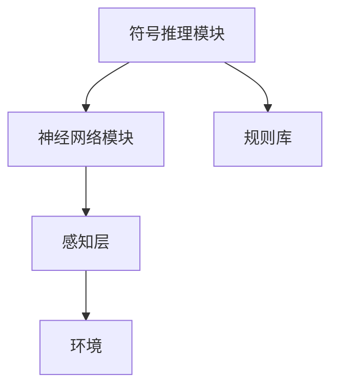

                 


# AI Agent的神经符号集成学习方法

> 关键词：AI Agent, 神经符号集成学习, 符号逻辑, 神经网络, 系统架构设计

> 摘要：本文深入探讨了AI Agent的神经符号集成学习方法，结合符号逻辑与神经网络的优势，分析其在复杂任务中的应用。通过系统架构设计和项目实战，展示了神经符号集成学习的实际价值和未来发展方向。

---

## 第一部分: AI Agent的神经符号集成学习基础

### 第1章: 神经符号集成学习的背景与概念

#### 1.1 神经符号集成学习的背景
神经符号集成学习结合了符号逻辑和神经网络，弥补了单一方法的不足。AI Agent需要处理结构化和非结构化数据，神经符号集成学习提供了高效的解决方案。

#### 1.2 AI Agent的基本概念
AI Agent通过感知环境、推理和行动实现目标。神经符号集成学习帮助其在复杂任务中具备高效的学习和推理能力。

#### 1.3 神经符号集成学习的意义
通过符号逻辑的可解释性和神经网络的泛化能力，神经符号集成学习提升了AI Agent的智能水平。

---

### 第2章: 神经符号集成学习的核心概念与联系

#### 2.1 神经符号集成学习的原理
符号逻辑提供先验知识，神经网络处理感知数据，两者结合实现端到端的学习与推理。

#### 2.2 核心概念对比分析
符号逻辑注重规则和推理，神经网络擅长模式识别，神经符号集成学习平衡了两者的优缺点。

#### 2.3 核心概念的ER实体关系图（Mermaid）
```mermaid
erDiagram
    actor 用户
    actor 环境
    actor 神经网络
    actor 符号逻辑
    用户 -> (环境) : 与环境交互
    神经网络 -> (符号逻辑) : 获取先验知识
    符号逻辑 -> (神经网络) : 指导学习
```

---

### 第3章: 神经符号集成学习的算法原理

#### 3.1 神经符号集成学习的算法框架
混合模型结合符号规则和神经网络，如Neural Symbolic Logic Learning。

#### 3.2 核心算法的Python代码实现
```python
# 示例代码：符号逻辑指导神经网络学习
class NeuralSymbolicAgent:
    def __init__(self, rules):
        self.rules = rules
        self.neural_network = NeuralNetwork()

    def perceive(self, input_data):
        return self.neural_network.predict(input_data)

    def reason(self, input_data):
        for rule in self.rules:
            if rule.condition(input_data):
                return rule.action(input_data)
        return None

    def act(self, input_data):
        perception = self.perceive(input_data)
        decision = self.reason(perception)
        return decision
```

---

### 第4章: 神经符号集成学习的系统架构设计

#### 4.1 系统分析与设计
模块化架构设计，包括符号推理模块和神经网络模块。

#### 4.2 系统架构图（Mermaid）


---

### 第5章: 神经符号集成学习的项目实战

#### 5.1 项目背景与目标
设计一个智能客服系统，结合符号规则和神经网络进行对话理解。

#### 5.2 核心代码实现
```python
# 示例代码：智能客服对话理解
class NeuralSymbolicAgent:
    def __init__(self):
        self.rule_set = RuleSet()
        self.neural_model = NeuralModel()

    def process_query(self, user_input):
        symbols = self.rule_set.apply(user_input)
        features = self.neural_model.extract_features(user_input, symbols)
        prediction = self.neural_model.predict(features)
        return prediction
```

---

## 第二部分: 高级应用与未来展望

### 第6章: 高级应用案例

#### 6.1 自动驾驶中的路径规划
结合符号逻辑的路径规则和神经网络的实时感知数据，提升决策准确性和响应速度。

#### 6.2 智能医疗中的诊断推理
利用符号逻辑的医学知识和神经网络的患者数据，提高诊断的准确性和效率。

### 第7章: 未来发展趋势

#### 7.1 更高效的算法
探索更高效的神经符号集成学习算法，如符号增强的自监督学习。

#### 7.2 更强大的模型架构
研究新的模型架构，如图神经网络与符号逻辑的结合。

#### 7.3 与其他技术的结合
将神经符号集成学习与其他技术如强化学习结合，提升AI Agent的智能水平。

---

## 结语

神经符号集成学习为AI Agent提供了强大的能力，结合符号逻辑的可解释性和神经网络的泛化能力，未来将在更多领域发挥重要作用。希望本文能为相关研究和实践提供有价值的参考。

---

作者：AI天才研究院/AI Genius Institute & 禅与计算机程序设计艺术 /Zen And The Art of Computer Programming

