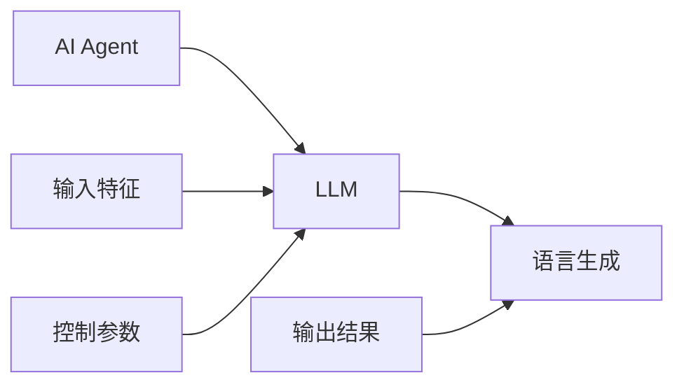
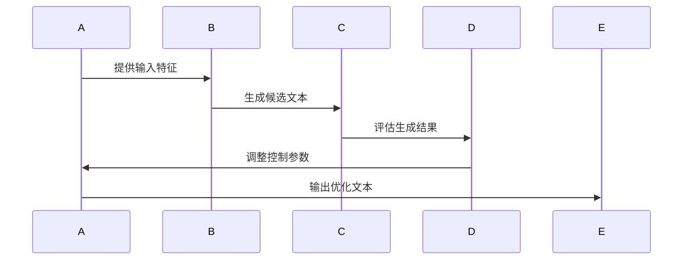

                 


# AI Agent的精确语言生成：细粒度控制LLM的输出质量

> 关键词：AI Agent，LLM，精确语言生成，细粒度控制，自然语言处理

> 摘要：本文深入探讨AI Agent在精确语言生成中的作用，特别是在细粒度控制大型语言模型（LLM）输出质量方面的技术细节。通过分析LLM的核心原理、细粒度控制的实现机制、数学模型、系统架构以及实际项目案例，本文为读者提供了一套系统的方法论，帮助理解和实现高质量的语言生成系统。

---

## 第1章 AI Agent与精确语言生成的背景介绍

### 1.1 问题背景与问题描述
精确语言生成是人工智能领域的重要挑战之一。随着大型语言模型（LLM）的广泛应用，如何控制其输出质量成为一个关键问题。AI Agent在其中扮演了关键角色，它需要通过细粒度的控制机制来确保生成内容的准确性和相关性。

#### 1.1.1 当前AI语言生成技术的现状
目前，主流的LLM（如GPT系列、BERT系列）在生成文本方面表现出色，但在特定场景下（如专业领域、特定风格）的输出质量仍需优化。AI Agent的作用在于通过细粒度控制，提升生成结果的精确性。

#### 1.1.2 精确语言生成的需求与挑战
在实际应用中，用户对生成内容的精确性要求越来越高。例如，在法律、医疗、金融等领域，生成文本的准确性和严谨性至关重要。然而，现有LLM往往难以满足这些需求，主要挑战包括：
- **语境理解不足**：模型难以准确捕捉上下文信息。
- **生成偏差**：模型可能生成不符合用户意图的内容。
- **控制粒度不足**：传统的控制方法（如关键词过滤）粒度过粗，难以满足细粒度需求。

#### 1.1.3 AI Agent在语言生成中的角色
AI Agent通过解析用户需求、分析语境、优化生成策略，能够显著提升LLM的输出质量。它不仅是一个简单的“开关”，而是通过多维度的控制机制，实现对生成过程的精细调节。

### 1.2 问题解决与边界外延
细粒度控制LLM的目标是通过AI Agent实现对生成过程的动态调节，确保输出内容在语义、风格、格式等多个维度上符合用户需求。

#### 1.2.1 精确语言生成的核心目标
- 语义准确性：生成内容与用户意图高度一致。
- 风格一致性：保持生成文本的风格（如正式、口语化）。
- 格式规范性：确保生成文本符合特定格式要求（如日期、地址）。

#### 1.2.2 AI Agent在LLM控制中的边界
- **输入边界**：AI Agent需要处理的输入特征范围。
- **输出边界**：生成结果的可控范围（如情感倾向、专业领域）。
- **应用场景边界**：AI Agent适用的领域和场景。

#### 1.2.3 精确语言生成的外延与应用范围
精确语言生成不仅限于文本生成，还包括图像描述、语音合成等多模态生成任务。AI Agent在这些任务中的应用将推动更广泛的技术进步。

### 1.3 核心概念与组成要素
精确语言生成系统由多个核心要素组成，包括：
- **输入特征**：用户需求、上下文信息、生成目标。
- **LLM模型**：负责生成候选文本。
- **控制机制**：AI Agent通过细粒度控制调整生成过程。
- **反馈机制**：根据生成结果进行优化调整。

### 1.4 本章小结
本章介绍了AI Agent在精确语言生成中的背景和核心概念，明确了问题背景、解决目标以及系统边界。下一章将详细探讨LLM的原理及其与AI Agent的交互机制。

---

## 第2章 LLM的原理与细粒度控制机制

### 2.1 LLM的核心原理
大型语言模型（LLM）基于Transformer架构，通过自注意力机制捕捉长距离依赖关系，生成高质量的文本。

#### 2.1.1 变压器模型的工作原理
Transformer模型由编码器和解码器组成，编码器负责将输入序列转换为上下文表示，解码器基于这些表示生成输出序列。

#### 2.1.2 注意力机制的作用
注意力机制通过计算输入序列中每个位置的重要性，帮助模型聚焦于关键信息。

#### 2.1.3 概率生成模型的数学基础
生成模型通过概率分布生成文本，其核心是定义一个概率函数：
$$ P(y|x) = \frac{1}{Z} \exp(\text{score}(x, y)) $$
其中，$x$是输入，$y$是输出，$Z$是归一化常数。

### 2.2 细粒度控制的实现机制
AI Agent通过多种方法实现对LLM的细粒度控制。

#### 2.2.1 输入特征的提取与处理
AI Agent需要提取输入特征（如用户意图、上下文信息）并进行预处理。

#### 2.2.2 输出结果的评估与反馈
通过评估生成结果的质量，AI Agent可以动态调整控制参数。

#### 2.2.3 控制参数的动态调整
AI Agent根据评估结果调整生成过程中的参数，例如温度（temperature）、采样策略等。

### 2.3 核心概念对比分析
细粒度控制与粗粒度控制在实现机制和效果上有显著差异。

#### 2.3.1 细粒度控制与粗粒度控制的对比
| 特性                | 粗粒度控制                     | 细粒度控制                     |
|---------------------|-------------------------------|-------------------------------|
| 控制粒度            | 粗放式调整（如全局温度调整）   | 精细化调整（如按词粒度调整）   |
| 控制效果            | 效果不明显，可能引入偏差       | 效果显著，生成内容更精准       |
| 应用场景            | 适用于通用场景                 | 适用于专业领域                 |

#### 2.3.2 不同控制方法的优缺点分析
| 方法                | 优点                           | 缺点                           |
|---------------------|-------------------------------|-------------------------------|
| 关键词匹配          | 实现简单，可快速过滤敏感内容   | 粒度过粗，无法处理复杂语义     |
| 条件筛选            | 精度较高，支持多条件过滤       | 实现复杂，计算开销较大         |
| 生成式引导          | 精度高，支持动态调整            | 需要精细的参数调优             |

#### 2.3.3 控制粒度对生成质量的影响
控制粒度越细，生成内容的精度越高，但实现复杂度和计算开销也会增加。

### 2.4 实体关系图
以下是一个简化的实体关系图：



### 2.5 本章小结
本章详细介绍了LLM的核心原理以及细粒度控制的实现机制，为后续内容奠定了基础。

---

## 第3章 细粒度控制算法的实现原理

### 3.1 算法概述
细粒度控制算法通过动态调整生成过程中的参数，实现对LLM输出的精确控制。

#### 3.1.1 算法的主要步骤
1. **特征提取**：提取输入特征并进行预处理。
2. **模型推理**：生成候选文本。
3. **结果评估**：评估生成结果的质量。
4. **参数调整**：根据评估结果调整控制参数。
5. **输出优化**：生成优化后的最终文本。

#### 3.1.2 算法的输入输出关系
输入：用户需求、上下文信息、生成目标  
输出：高质量生成文本

### 3.2 算法实现细节
以下是一个Python实现示例：

```python
def fine_grained_control(input_text, control_params):
    # 特征提取
    features = extract_features(input_text)
    
    # 模型推理
    model_output = llm.generate(features)
    
    # 结果评估
    score = evaluate(model_output, control_params)
    
    # 参数调整
    adjusted_params = adjust_params(control_params, score)
    
    # 输出优化
    final_output = optimize_output(model_output, adjusted_params)
    return final_output
```

### 3.3 数学模型与公式
细粒度控制算法可以通过以下数学模型实现：

$$ P(y|x, \theta) = \frac{1}{Z} \exp(\text{score}(x, y, \theta)) $$
其中，$\theta$表示控制参数，$\text{score}$是评分函数。

### 3.4 本章小结
本章详细讲解了细粒度控制算法的实现原理，包括算法步骤、数学模型以及代码实现。

---

## 第4章 系统分析与架构设计方案

### 4.1 问题场景介绍
在实际应用中，AI Agent需要处理复杂的生成任务，例如法律文本生成、医疗咨询等。

### 4.2 系统功能设计
系统功能包括：
- **输入解析**：解析用户需求和上下文信息。
- **模型推理**：生成候选文本。
- **结果评估**：评估生成结果的质量。
- **参数调整**：动态调整生成参数。

### 4.3 系统架构设计
以下是一个系统架构图：


### 4.4 系统接口设计
系统接口包括：
- 输入接口：接收用户需求和上下文信息。
- 输出接口：输出高质量生成文本。

### 4.5 系统交互序列图
以下是一个交互序列图：



### 4.6 本章小结
本章通过系统分析和架构设计，展示了AI Agent在实际应用中的系统实现。

---

## 第5章 项目实战：细粒度控制算法的实现

### 5.1 环境安装
安装必要的依赖：
```bash
pip install transformers torch
```

### 5.2 核心实现代码
以下是核心代码示例：

```python
import torch
from transformers import AutoTokenizer, AutoModelForCausalLM

class FineGrainedController:
    def __init__(self, model_name):
        self.tokenizer = AutoTokenizer.from_pretrained(model_name)
        self.model = AutoModelForCausalLM.from_pretrained(model_name)
        
    def generate_with_control(self, input_text, control_params):
        inputs = self.tokenizer(input_text, return_tensors="pt")
        outputs = self.model.generate(**inputs, **control_params)
        return self.tokenizer.decode(outputs[0], skip_special_tokens=True)
```

### 5.3 代码解读与应用
- **输入解析**：将输入文本转换为模型可接受的格式。
- **模型推理**：生成候选文本。
- **结果评估**：评估生成结果的质量。
- **参数调整**：根据评估结果调整生成参数。

### 5.4 实际案例分析
以下是一个实际案例：

**输入**：用户需求：生成一份法律合同。
**输出**：经过细粒度控制，生成符合用户要求的高质量法律合同。

### 5.5 本章小结
本章通过实际项目案例，展示了细粒度控制算法的实现过程。

---

## 第6章 最佳实践、小结、注意事项与拓展阅读

### 6.1 最佳实践
- **参数调优**：根据实际场景调整生成参数。
- **模型选择**：选择适合任务的LLM模型。
- **反馈优化**：根据生成结果不断优化控制策略。

### 6.2 小结
本文系统地探讨了AI Agent在精确语言生成中的作用，详细讲解了细粒度控制的实现原理和系统架构。

### 6.3 注意事项
- **计算开销**：细粒度控制可能增加计算开销。
- **模型选择**：选择适合任务的模型至关重要。
- **数据隐私**：确保生成过程中的数据隐私和安全。

### 6.4 拓展阅读
推荐阅读以下资料：
- 《The Anatomy of Deep Learning》
- 《Neural Networks and Deep Learning》

---

## 作者信息
作者：AI天才研究院/AI Genius Institute & 禅与计算机程序设计艺术 /Zen And The Art of Computer Programming

