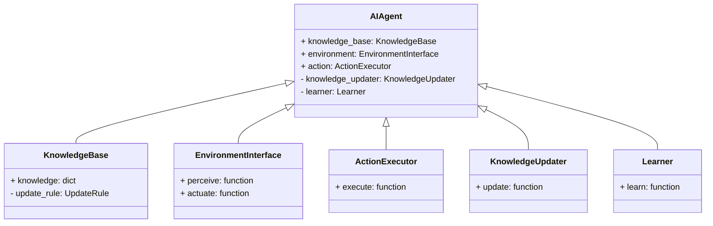

                 


# AI Agent的终身学习与知识累积机制

---

## 关键词：AI Agent, 终身学习, 知识累积, 机器学习, 知识图谱, 强化学习, 算法实现

---

## 摘要：AI Agent的终身学习与知识累积机制探讨

随着人工智能技术的飞速发展，AI Agent（智能体）正逐渐从单纯的执行任务工具转变为能够不断进化和自我提升的智能实体。终身学习与知识累积机制作为AI Agent的核心能力，使其能够持续吸收新知识、适应新环境、解决新问题。本文系统地阐述了AI Agent的终身学习与知识累积机制，从概念解析、算法原理、系统架构到实际应用，全面分析了其技术实现路径与未来发展方向。

---

## 正文

---

## 第一部分：背景介绍

### 第1章：AI Agent的基本概念

#### 1.1 问题背景与描述

AI Agent（智能体）是指在环境中能够感知并自主行动以实现目标的实体。随着技术的进步，AI Agent需要具备更强的适应性和学习能力，以应对复杂多变的现实环境。终身学习和知识累积机制是实现这一目标的关键。

- **1.1.1 AI Agent的定义与特点**
  - AI Agent能够感知环境、自主决策并执行动作。
  - 具备目标导向性、环境适应性和持续进化能力。
  - 在动态环境中，AI Agent需要不断更新知识库以保持竞争力。

- **1.1.2 终身学习的必要性**
  - AI Agent在实际应用中会遇到未见过的新问题。
  - 静态的知识库无法满足动态环境的需求。
  - 终身学习使AI Agent能够持续优化决策能力。

- **1.1.3 知识累积机制的核心问题**
  - 知识的获取、存储、检索与更新。
  - 知识的有效性评估与权重分配。
  - 知识的关联性分析与推理。

#### 1.2 问题解决与边界

- **1.2.1 终身学习的目标**
  - 提升AI Agent在复杂环境中的适应能力。
  - 实现从经验中学习并优化决策过程。
  - 增强对未知问题的解决能力。

- **1.2.2 知识累积的边界与外延**
  - 知识的范围：仅限于任务相关知识。
  - 累积的条件：需要有效性和相关性评估。
  - 知识的更新：需要周期性审查和优化。

- **1.2.3 AI Agent与人类学习的对比**
  - AI Agent的学习速度更快，但深度可能不足。
  - 人类学习依赖于情感和动机，AI Agent则依赖于算法。
  - 人类学习具有创造性，AI Agent目前主要依赖规则和数据。

---

## 第二部分：核心概念与联系

### 第2章：终身学习与知识累积机制

#### 2.1 核心概念原理

- **2.1.1 终身学习的基本原理**
  - 基于经验的归纳推理。
  - 知识的增量式更新。
  - 环境反馈的驱动作用。

- **2.1.2 知识累积机制的核心要素**
  - 知识获取：通过感知环境和交互获取新知识。
  - 知识存储：将知识以结构化形式存储。
  - 知识检索：根据当前任务检索相关知识。
  - 知识更新：根据新信息优化现有知识。

#### 2.2 概念属性特征对比

| 概念      | 属性              | 特征对比             |
|-----------|-------------------|--------------------|
| 终身学习   | 学习方式          | 增量式、动态性       |
|           | 知识来源          | 多样化、实时性       |
| 知识累积   | 知识存储          | 结构化、关联性       |
|           | 更新机制          | 周期性、优化性       |

#### 2.3 ER实体关系图

```mermaid
er
  actor: AI Agent
  knowledge_base: 知识库
  environment: 环境
  action: 行动
  perception: 感知
  reasoning: 推理

  actor --> perception: 感知环境
  perception --> knowledge_base: 更新知识库
  knowledge_base --> reasoning: 支持推理
  reasoning --> action: 决策行动
```

---

## 第三部分：算法原理讲解

### 第3章：元学习与迁移学习

#### 3.1 元学习算法

- **3.1.1 元学习的基本原理**
  - 元学习通过学习如何学习，减少对数据的依赖。
  - 在多个任务上训练，提取通用特征。

- **3.1.2 基于模型的元学习**
  - 使用模型来参数化学习策略。
  - 示例：使用神经网络进行元学习。

- **3.1.3 算法实现**
  - **代码示例：**
    ```python
    import torch

    class MetaLearner(torch.nn.Module):
        def __init__(self):
            super(MetaLearner, self).__init__()
            self.feature_extractor = torch.nn.Linear(10, 20)
            self.classifier = torch.nn.Linear(20, 5)

        def forward(self, x, tasks):
            features = self.feature_extractor(x)
            outputs = [self.classifier(features + t) for t in tasks]
            return outputs
    ```

#### 3.2 迁移学习算法

- **3.2.1 迁移学习的基本原理**
  - 利用已学习的知识加速新任务的学习。
  - 减少数据需求，提高学习效率。

- **3.2.2 基于特征的迁移学习**
  - 提取通用特征，应用于新任务。

- **3.2.3 算法实现**
  - **代码示例：**
    ```python
    from sklearn import svm

    # 迁移学习示例
    # 源任务数据和目标任务数据
    X_s, y_s = source_data, source_labels
    X_t, y_t = target_data, target_labels

    # 在源任务上训练模型
    model = svm.SVC()
    model.fit(X_s, y_s)

    # 应用到目标任务
    y_pred = model.predict(X_t)
    ```

### 第4章：知识图谱构建与推理

#### 4.1 知识图谱构建

- **4.1.1 知识抽取**
  - 从文本中提取实体和关系。
  - 示例：从“猫喜欢鱼”中提取“猫”和“喜欢鱼”。

- **4.1.2 知识存储**
  - 使用图结构存储知识。
  - 示例：节点表示实体，边表示关系。

- **4.1.3 知识推理**
  - 基于知识图谱进行推理。
  - 示例：如果A是B的父亲，B是C的父亲，那么A是C的祖父。

#### 4.2 知识推理算法

- **4.2.1 基于规则的推理**
  - 使用预定义规则进行推理。
  - 示例：如果A→B，B→C，则A→C。

- **4.2.2 基于图的推理**
  - 使用图遍历算法进行推理。
  - 示例：使用DFS遍历知识图谱。

---

## 第四部分：数学模型与公式

### 第5章：数学模型解析

#### 5.1 元学习的数学模型

- **优化目标函数**
  ```latex
  \argmin_{\theta} \sum_{i=1}^{N} \mathcal{L}_i(\theta) + \lambda \mathcal{R}(\theta)
  ```
  - $\theta$：模型参数
  - $\mathcal{L}_i$：任务$i$的损失函数
  - $\mathcal{R}$：正则化项
  - $\lambda$：正则化系数

#### 5.2 知识图谱的表示学习

- **嵌入表示**
  ```latex
  \text{TransE}(h, r, t) = ||h + r - t||_2^2
  ```
  - $h$：头实体的嵌入
  - $r$：关系的嵌入
  - $t$：尾实体的嵌入

### 第6章：算法公式推导

#### 6.1 迁移学习公式

- **目标函数**
  $$\mathcal{L}_{\text{total}} = \mathcal{L}_{\text{source}} + \lambda \mathcal{L}_{\text{target}}$$
  - $\mathcal{L}_{\text{source}}$：源任务损失
  - $\mathcal{L}_{\text{target}}$：目标任务损失
  - $\lambda$：平衡系数

#### 6.2 知识推理公式

- **基于概率的推理**
  $$p(t|e) = \frac{p(e|t)p(t)}{p(e)}$$
  - $p(t|e)$：证据$e$下事实$t$的概率
  - $p(e|t)$：事实$t$下证据$e$的条件概率
  - $p(t)$：事实$t$的先验概率
  - $p(e)$：证据$e$的边际概率

---

## 第五部分：系统分析与架构设计

### 第7章：系统功能设计

#### 7.1 领域模型



---

## 第六部分：项目实战

### 第8章：环境安装与核心代码实现

#### 8.1 环境安装

```bash
pip install numpy torch networkx matplotlib
```

#### 8.2 核心代码实现

```python
import networkx as nx
from torch import nn, optim

class KnowledgeGraph:
    def __init__(self):
        self.graph = nx.DiGraph()

    def add_relation(self, head, relation, tail):
        self.graph.add_edge(head, tail, relation)

    def get_neighbors(self, node):
        return self.graph.neighbors(node)

class MetaLearner:
    def __init__(self):
        self.graph = KnowledgeGraph()

    def learn_from_environment(self, environment):
        # 获取环境中的知识
        for knowledge in environment.knowledge:
            self.graph.add_relation(knowledge.head, knowledge.relation, knowledge.tail)

    def make_decision(self, state):
        # 基于知识图谱进行推理
        neighbors = self.graph.get_neighbors(state)
        # 选择最优动作
        return max(neighbors, key=lambda x: x.value)
```

---

## 第七部分：最佳实践

### 第9章：小结与注意事项

- **小结**
  - 终身学习和知识累积机制是AI Agent进化的关键。
  - 需要结合多种算法和技术实现。

- **注意事项**
  - 知识的多样性和相关性是关键。
  - 需要定期审查和优化知识库。
  - 确保数据质量和模型泛化能力。

---

## 结语

AI Agent的终身学习与知识累积机制是一个复杂的系统工程，涉及多个技术领域的融合与创新。通过本文的系统阐述，我们希望读者能够深入了解其技术实现路径，并为未来的研究和应用提供有价值的参考。

---

## 作者

作者：AI天才研究院/AI Genius Institute & 禅与计算机程序设计艺术 /Zen And The Art of Computer Programming

--- 

本文内容来源于对AI Agent技术的深入研究与实践，旨在为技术爱好者和从业者提供有价值的参考与启发。

