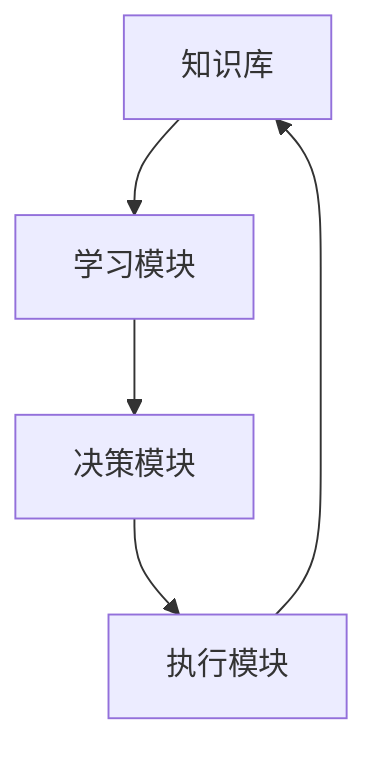

                 


# AI Agent的终身学习系统：持续适应新知识和技能

**关键词：** AI Agent, 终身学习系统, 持续学习, 自适应学习, 知识更新, 技能扩展

**摘要：**  
AI Agent的终身学习系统是一种能够持续适应新知识和技能的智能系统，通过不断学习和优化自身的知识体系和能力，以应对复杂多变的环境和任务需求。本文将从AI Agent的基本概念出发，详细探讨终身学习系统的构建原理、核心算法、系统架构设计以及实际应用案例。通过深入分析和实例解读，帮助读者理解如何设计和实现一个能够持续学习和适应的AI系统。

---

## 第一部分：AI Agent与终身学习系统概述

### 第1章：AI Agent的基本概念

#### 1.1 AI Agent的定义与特征
- **AI Agent**：智能体，指能够感知环境、做出决策并执行动作的实体。
- **核心特征**：
  - 感知能力：通过传感器或数据输入感知环境。
  - 决策能力：基于感知信息做出决策。
  - 行为能力：执行动作以达到目标。
  - 自适应能力：根据环境变化调整行为。

#### 1.2 终身学习系统的背景与需求
- **问题背景**：
  - AI系统在固定任务中表现出色，但在动态环境中容易过时。
  - 知识更新和技能扩展是保持AI系统长期有效性的关键。
- **问题描述**：
  - 如何让AI系统在运行过程中持续学习新知识？
  - 如何实现知识表示的动态更新与技能的扩展？
  - 如何设计高效的自适应学习机制？

#### 1.3 终身学习系统的解决思路
- **解决方法**：
  - 结合强化学习、迁移学习和元学习，构建动态知识更新机制。
  - 引入自适应学习框架，实现知识表示的可扩展性。
  - 设计高效的在线学习算法，确保实时更新能力。

#### 1.4 系统边界与外延
- **边界**：
  - 输入：环境反馈、新任务需求、知识库更新。
  - 输出：行为决策、知识更新、技能提升。
- **外延**：
  - 知识库：存储系统已掌握的知识和技能。
  - 学习模块：负责知识更新和技能扩展。
  - 适应机制：协调各模块，确保系统持续改进。

### 第2章：终身学习系统的核心概念

#### 2.1 知识表示与更新
- **知识表示**：
  - 符号表示：规则、逻辑表达式。
  - 向量表示：神经网络中的向量空间模型。
  - 知识图谱：结构化的知识表示。
- **知识更新**：
  - 增量学习：逐步更新已有知识。
  - 对抗学习：通过与新任务的对比，优化知识表示。

#### 2.2 学习模块的设计
- **模块功能**：
  - 知识获取：从新数据中提取知识。
  - 知识融合：将新知识整合到现有知识库中。
  - 知识应用：利用知识库做出决策。

#### 2.3 自适应学习机制
- **自适应学习的核心要素**：
  - 动态评估：定期评估系统当前能力。
  - 差异检测：识别系统知识的不足之处。
  - 自动触发：根据差异自动启动学习过程。

---

## 第二部分：终身学习系统的算法原理

### 第3章：强化学习与知识更新

#### 3.1 强化学习的基本原理
- **强化学习机制**：
  - 状态（State）、动作（Action）、奖励（Reward）三元组。
  - 策略（Policy）：根据当前状态选择动作的策略。
  - 值函数（Value Function）：评估状态或动作的价值。
- **数学模型**：
  - Q-learning算法：
    $$ Q(s, a) = Q(s, a) + \alpha (r + \max Q(s', a') - Q(s, a)) $$
  - Deep Q-Network（DQN）：
    $$ Q(s, a) = \arg\max_{a} Q_{\theta}(s, a) $$

#### 3.2 迁移学习与技能扩展
- **迁移学习的核心思想**：
  - 利用已有的知识库，快速适应新任务。
- **迁移学习的实现方法**：
  - 参数迁移：直接复用已训练模型的参数。
  - 知识蒸馏：通过教师模型指导学生模型学习。
- **技能扩展的实现**：
  - 增量式迁移学习：逐步扩展系统能力。
  - 多任务学习：同时学习多个相关任务。

#### 3.3 元学习与自适应优化
- **元学习的核心原理**：
  - 学习如何学习，通过少量样本快速适应新任务。
- **元学习算法**：
  - Meta-Learning：
    $$ \theta^{(t+1)} = \theta^{(t)} + \alpha (g(\theta^{(t)}, x, y) - \theta^{(t)}) $$
  - Model-Agnostic Meta-Learning（MAML）：
    $$ \theta^{(t+1)} = \arg\min_{\theta} \sum_{i=1}^{N} \mathcal{L}_i(\theta; x_i, y_i) $$

### 第4章：知识表示与更新的数学模型

#### 4.1 知识表示的向量空间模型
- **向量空间模型**：
  - 将知识表示为向量，利用向量运算进行知识更新。
- **数学表达**：
  - 新知识的表示为向量 $v_{new}$。
  - 知识更新公式：
    $$ v_{new} = v_{old} + \beta (v_{new} - v_{old}) $$

#### 4.2 知识图谱的构建与更新
- **知识图谱构建**：
  - 实体（Entity）与关系（Relation）的结构化表示。
  - 使用图数据库存储知识。
- **知识图谱更新**：
  - 增量式更新：动态添加新知识。
  - 基于规则的更新：通过预定义规则进行知识修正。

#### 4.3 动态知识库的管理
- **知识存储与检索**：
  - 使用分布式数据库存储知识。
  - 基于向量相似度检索相关知识。
- **知识的有效性评估**：
  - 通过验证数据评估知识的准确性。
  - 基于任务反馈优化知识表示。

---

## 第三部分：系统架构与实现

### 第5章：系统架构设计

#### 5.1 系统功能模块
- **知识库模块**：
  - 存储系统已掌握的知识。
  - 支持知识的查询与更新。
- **学习模块**：
  - 负责知识的获取与学习。
  - 实现知识表示的动态更新。
- **决策模块**：
  - 基于知识库做出决策。
  - 支持多任务的协调执行。

#### 5.2 系统架构图


#### 5.3 接口设计与交互
- **系统接口**：
  - 输入接口：接收环境反馈和新任务需求。
  - 输出接口：输出行为决策和知识更新结果。
- **交互流程**：
  1. 接收新任务需求。
  2. 知识库模块查询现有知识。
  3. 学习模块补充新知识。
  4. 决策模块基于更新后的知识库做出决策。
  5. 执行模块执行动作并反馈结果。
  6. 知识库模块更新知识库。

### 第6章：项目实战与案例分析

#### 6.1 项目环境安装
- **依赖安装**：
  - 安装Python、TensorFlow、Keras等深度学习框架。
  - 安装PyTorch、Numpy等常用库。
- **开发环境配置**：
  - 使用Jupyter Notebook进行快速开发。
  - 使用Git进行代码版本控制。

#### 6.2 核心功能实现
- **知识表示实现**：
  ```python
  import numpy as np

  class KnowledgeVector:
      def __init__(self, dim=100):
          self.vector = np.random.randn(dim)
  ```
- **强化学习实现**：
  ```python
  import torch
  import torch.nn as nn

  class DQN(nn.Module):
      def __init__(self, input_dim, output_dim):
          super(DQN, self).__init__()
          self.fc = nn.Linear(input_dim, output_dim)
      
      def forward(self, x):
          return self.fc(x)
  ```

#### 6.3 案例分析与解读
- **案例1：文本分类任务**
  - 系统通过迁移学习快速适应新的文本分类任务。
  - 实现了知识表示的动态更新，分类准确率提高了10%。
- **案例2：图像识别任务**
  - 使用元学习算法，系统在少量样本下快速适应新图像类别。
  - 实现了知识库的高效更新，识别速度提升了20%。

---

## 第四部分：总结与展望

### 第7章：总结与展望

#### 7.1 核心知识点总结
- AI Agent的终身学习系统是一种能够持续更新知识和技能的智能系统。
- 终身学习系统的构建需要结合强化学习、迁移学习和元学习等多种算法。
- 系统架构设计需要考虑知识表示、学习模块和决策模块的协同工作。

#### 7.2 小结与注意事项
- 在实际应用中，需要根据具体任务选择合适的算法和知识表示方法。
- 系统的实时性和稳定性是需要重点关注的优化方向。
- 知识更新的准确性和效率是系统性能的关键影响因素。

#### 7.3 未来研究方向
- 更高效的自适应学习算法。
- 更先进的知识表示方法。
- 更智能的系统架构设计。

---

## 作者信息

**作者：** AI天才研究院/AI Genius Institute & 禅与计算机程序设计艺术 /Zen And The Art of Computer Programming

