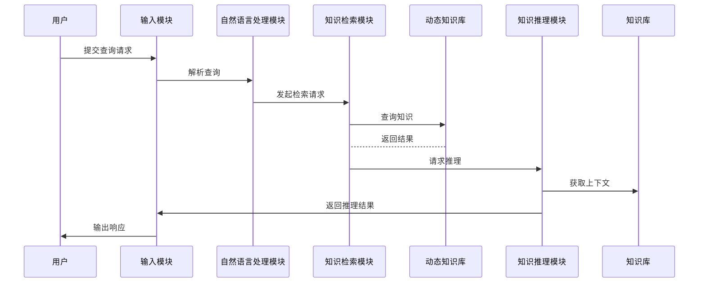

                 


# AI Agent的终身学习系统：构建LLM的动态知识库

> 关键词：AI Agent, 终身学习, 动态知识库, 大语言模型, 知识图谱, 对比学习, 强化学习

> 摘要：本文探讨AI Agent的终身学习系统，重点分析如何构建大语言模型（LLM）的动态知识库。通过详细阐述背景、核心概念、算法原理、系统架构及项目实战，为读者提供从理论到实践的全面指导。文章结合知识图谱、对比学习和强化学习等技术，展示如何设计高效的动态知识库，以实现AI Agent的持续进化和优化。

---

## 第一部分: 背景与核心概念

### 第1章: AI Agent与终身学习系统背景

#### 1.1 AI Agent的基本概念

##### 1.1.1 AI Agent的定义与分类
AI Agent（人工智能代理）是指能够感知环境、自主决策并执行任务的智能实体。根据功能和应用场景，AI Agent可以分为以下几类：
- **简单反射型代理**：基于预定义规则执行任务。
- **基于模型的反射型代理**：利用内部模型理解和决策。
- **目标驱动型代理**：根据目标选择最优行动。
- **效用驱动型代理**：通过最大化效用函数实现目标。

##### 1.1.2 AI Agent的核心特征
AI Agent的核心特征包括：
- **自主性**：无需外部干预，自主决策。
- **反应性**：能够实时感知环境并调整行为。
- **目标导向性**：基于目标选择行动策略。
- **学习能力**：通过经验改进性能。

##### 1.1.3 AI Agent的应用场景
AI Agent广泛应用于：
- **自动驾驶**：实时感知环境，做出驾驶决策。
- **智能助手**：如Siri、Alexa，提供信息查询和任务执行。
- **机器人**：在制造业和物流中执行复杂任务。
- **推荐系统**：根据用户行为推荐个性化内容。

#### 1.2 终身学习系统的背景与意义

##### 1.2.1 终身学习的概念
终身学习是指AI Agent在运行过程中持续更新知识库，以适应环境变化和新任务需求的能力。与传统静态知识库不同，终身学习系统能够实时更新和扩展知识。

##### 1.2.2 AI Agent需要终身学习的原因
AI Agent面临动态变化的环境，需要处理的新任务和复杂场景不断增加。传统的静态知识库无法应对这些变化，因此终身学习成为必然选择。

##### 1.2.3 动态知识库的重要性
动态知识库是AI Agent实现终身学习的核心。它能够实时更新，确保AI Agent始终拥有最新的知识，从而做出准确的决策和响应。

### 第2章: 动态知识库的基本概念

#### 2.1 动态知识库的定义与特点

##### 2.1.1 动态知识库的定义
动态知识库是指能够实时更新、扩展和适应变化的知识存储系统。它通过持续学习和知识推理，保持知识的准确性和完整性。

##### 2.1.2 动态知识库的特点
动态知识库具有以下特点：
- **实时更新**：能够根据新数据实时更新知识。
- **自适应性**：能够自动调整知识结构，适应新任务。
- **高可扩展性**：支持大规模知识的存储和管理。

##### 2.1.3 动态知识库与静态知识库的区别
| 特性         | 静态知识库       | 动态知识库       |
|--------------|------------------|------------------|
| 更新频率     | 定期或一次性     | 实时或持续性     |
| 知识结构     | 固定或静态       | 动态或灵活       |
| 适应性       | 低               | 高               |
| 应用场景     | 预测和决策       | 实时响应和复杂任务 |

#### 2.2 LLM与动态知识库的关系

##### 2.2.1 LLM的基本概念
大语言模型（LLM）如GPT系列，通过深度学习技术训练而成，能够理解并生成自然语言文本。LLM的核心是其巨大的参数规模和强大的上下文理解能力。

##### 2.2.2 LLM与动态知识库的结合
动态知识库为LLM提供实时更新的知识支持，而LLM则通过自然语言处理能力，将动态知识库中的信息转化为可理解和可执行的决策依据。

##### 2.2.3 LLM在动态知识库中的作用
LLM作为动态知识库的核心组件，负责知识的表示、推理和生成。它能够处理复杂语义，理解上下文，并生成准确的响应。

---

## 第二部分: 终身学习系统的构建原理

### 第3章: 终身学习系统的算法原理

#### 3.1 对比学习算法

##### 3.1.1 对比学习的定义
对比学习是一种通过比较不同数据点或样本之间的差异，来学习数据特征的方法。它通过最大化相似样本的相似性，最小化不相似样本的相似性，来提升模型的区分能力。

##### 3.1.2 对比学习的流程


##### 3.1.3 对比学习的数学公式
$$L = \frac{1}{N}\sum_{i=1}^{N} \text{loss}(x_i, y_i)$$

#### 3.2 强化学习算法

##### 3.2.1 强化学习的定义
强化学习是一种通过试错机制，让智能体在与环境交互中学习策略的方法。智能体通过执行动作，获得奖励或惩罚，逐步优化策略以最大化累积奖励。

##### 3.2.2 强化学习的流程


##### 3.2.3 强化学习的数学公式
$$Q(s, a) = r + \gamma \max_{a'} Q(s', a')$$

#### 3.3 自适应优化算法

##### 3.3.1 自适应优化的定义
自适应优化是一种动态调整模型参数，以适应数据分布变化的方法。它通过在线更新模型参数，保持模型在变化环境中的性能。

##### 3.3.2 自适应优化的流程


##### 3.3.3 自适应优化的数学公式
$$\theta_{t+1} = \theta_t - \eta \nabla L(\theta_t)$$

---

## 第三部分: 动态知识库的构建与优化

### 第4章: 动态知识库的构建算法

#### 4.1 知识表示学习

##### 4.1.1 知识表示的定义
知识表示是将知识以某种形式存储和表示的过程。常用的表示方法包括符号逻辑、向量表示和图结构表示。

##### 4.1.2 知识表示的方法
- **符号逻辑**：使用符号和规则表示知识，如逻辑推理。
- **向量表示**：使用向量空间模型表示知识，如Word2Vec。
- **图结构表示**：使用图论中的节点和边表示知识，如知识图谱。

##### 4.1.3 知识表示的案例分析
以知识图谱为例，节点表示实体，边表示关系。例如：
- 节点1：人名（李白）
- 节点2：职业（诗人）
- 边：李白是诗人。

#### 4.2 动态知识库的构建流程

##### 4.2.1 数据源的选择与预处理
动态知识库的构建需要多源数据，包括文本数据、结构化数据和非结构化数据。预处理包括清洗、去重和格式转换。

##### 4.2.2 知识融合与推理
知识融合是将多源数据整合到统一的知识表示中。知识推理是通过逻辑推理，发现新的知识。

##### 4.2.3 知识更新与维护
动态知识库需要实时更新，确保知识的准确性和及时性。更新机制包括增量式更新和全量式更新。

---

## 第四部分: 系统设计与实现

### 第5章: 系统架构与设计

#### 5.1 系统整体架构

##### 5.1.1 系统架构图


##### 5.1.2 功能模块划分
- **输入模块**：接收用户输入，解析需求。
- **知识检索模块**：从动态知识库中检索相关知识。
- **知识推理模块**：通过逻辑推理生成答案。
- **输出模块**：生成自然语言响应，输出结果。

#### 5.2 系统接口设计

##### 5.2.1 API接口
- **GET /knowledge/retrieve?query=...**
- **POST /knowledge/update**

##### 5.2.2 数据格式
- **输入格式**：JSON格式，包含查询参数。
- **输出格式**：JSON格式，包含响应内容。

#### 5.3 系统交互流程

##### 5.3.1 交互序列图


---

## 第五部分: 项目实战与优化

### 第6章: 项目实战

#### 6.1 环境搭建

##### 6.1.1 安装Python
```bash
python --version
pip install --upgrade pip
```

##### 6.1.2 安装依赖库
```bash
pip install numpy pandas torch transformers
```

#### 6.2 核心代码实现

##### 6.2.1 知识检索模块
```python
import torch
import torch.nn as nn
import torch.optim as optim

class SimpleNN(nn.Module):
    def __init__(self, input_size, output_size):
        super(SimpleNN, self).__init__()
        self.fc = nn.Linear(input_size, output_size)

    def forward(self, x):
        return self.fc(x)

# 初始化模型
model = SimpleNN(input_size, output_size)
criterion = nn.MSELoss()
optimizer = optim.SGD(model.parameters(), lr=0.01)
```

##### 6.2.2 知识推理模块
```python
def infer(model, input_data):
    output = model(input_data)
    return output
```

#### 6.3 案例分析与优化

##### 6.3.1 案例分析
假设我们有一个简单的知识图谱，包含“人名”、“职业”、“成就”等节点。用户查询“李白的职业是什么？”，系统需要从知识图谱中检索相关信息，并返回“诗人”。

##### 6.3.2 优化建议
- **模型优化**：使用更复杂的神经网络结构，如Transformer。
- **数据优化**：增加训练数据，尤其是领域内的高质量数据。
- **算法优化**：采用更先进的对比学习和强化学习算法，提升模型性能。

---

## 第六部分: 总结与展望

### 第7章: 总结与展望

#### 7.1 总结
本文详细探讨了AI Agent的终身学习系统，重点分析了动态知识库的构建方法。通过结合知识图谱、对比学习和强化学习等技术，展示了如何设计高效的动态知识库，以实现AI Agent的持续进化和优化。

#### 7.2 展望
未来的研究方向包括：
- **多模态知识表示**：结合文本、图像、语音等多种模态信息，提升知识表示的丰富性。
- **自适应学习算法**：开发更高效的自适应优化算法，提升模型的实时更新能力。
- **边缘计算与分布式学习**：在边缘计算环境下，实现动态知识库的分布式构建和更新。

---

## 作者

作者：AI天才研究院/AI Genius Institute & 禅与计算机程序设计艺术 /Zen And The Art of Computer Programming

---

这篇文章从理论到实践，全面探讨了AI Agent的终身学习系统及其动态知识库的构建方法。通过详细的背景介绍、算法原理、系统设计和项目实战，为读者提供了从理解到实现的完整指南。希望本文能为相关领域的研究和实践提供有价值的参考。

