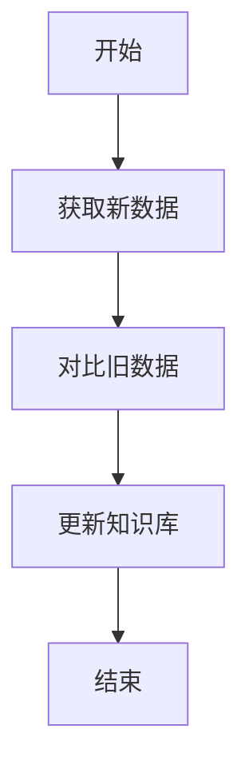
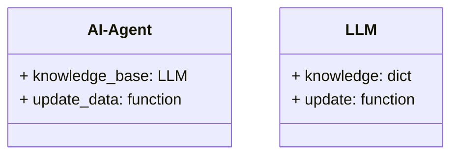
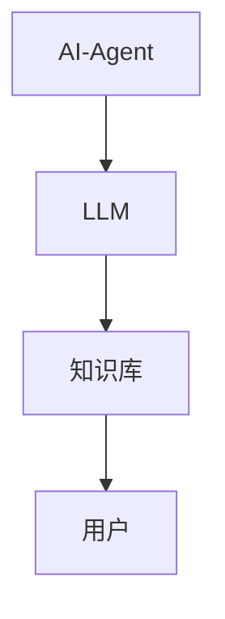

                 


# AI Agent的终身学习：持续更新LLM的知识库

## 关键词：AI Agent, 终身学习, LLM, 知识库更新, 对比学习, 强化学习, 迁移学习

## 摘要：AI Agent的终身学习是指AI代理能够持续更新其知识库，以保持其理解和响应能力的最新性。本文详细探讨了如何实现LLM的知识库更新，包括核心概念、算法原理、系统架构设计和项目实战，为技术实现提供了全面的指导。

---

## 第1章: AI Agent的终身学习概述

### 1.1 问题背景与描述
#### 1.1.1 知识更新的必要性
AI Agent需要处理不断变化的信息，如实时新闻、领域知识更新等，仅凭初始训练数据无法满足动态需求。

#### 1.1.2 LLM知识库的局限性
LLM的知识基于训练时的数据，无法涵盖后续的新信息，导致模型过时。

#### 1.1.3 终身学习的定义与目标
终身学习指模型在使用过程中持续学习新知识，保持竞争力和适应性。

### 1.2 问题解决与边界
#### 1.2.1 知识更新的方法
包括对比学习、强化学习和迁移学习。

#### 1.2.2 边界与外延
限定于LLM的知识库更新，不涉及模型结构的改变。

#### 1.2.3 核心要素组成
数据源、更新机制和评估指标。

### 1.3 核心概念结构
#### 1.3.1 AI Agent与LLM的关系
LLM作为知识库，AI Agent负责知识更新。

#### 1.3.2 知识库更新的机制
通过持续学习算法优化知识库。

#### 1.3.3 终身学习的实现路径
结合多种学习方法，实现动态更新。

---

## 第2章: 核心概念与联系

### 2.1 AI Agent与LLM的关系
#### 2.1.1 属性特征对比
| 属性 | AI Agent | LLM |
|------|----------|-----|
| 功能 | 执行任务 | 提供信息 |
| 学习 | 动态更新 | 静态训练 |

#### 2.1.2 ER实体关系图
```mermaid
er
  entity: AI Agent
  entity: LLM
  relationship: 知识库更新
```

### 2.2 知识更新的流程
#### 2.2.1 输入数据处理
对新数据进行清洗和预处理。

#### 2.2.2 知识整合机制
将新数据与现有知识结合。

#### 2.2.3 输出结果优化
优化模型输出，提升准确性。

### 2.3 案例分析
#### 2.3.1 实际应用场景
如实时新闻更新、领域知识库维护。

#### 2.3.2 案例对比分析
对比传统方法与终身学习方法的效果差异。

---

## 第3章: 算法原理讲解

### 3.1 知识更新算法
#### 3.1.1 对比学习流程
通过对比新旧数据，更新知识库。

#### 3.1.2 强化学习机制
通过奖励机制优化更新策略。

#### 3.1.3 迁移学习方法
利用已有知识加速新知识的吸收。

### 3.2 算法流程图
#### 对比学习流程图


---

## 第4章: 数学模型与公式

### 4.1 对比学习模型
#### 4.1.1 损失函数公式
$$ L = \text{ContrastiveLoss}(x_{\text{old}}, x_{\text{new}}) $$

### 4.2 强化学习模型
#### 4.2.1 奖励机制公式
$$ R = r(x_{\text{old}}, x_{\text{new}}) $$

### 4.3 迁移学习模型
#### 4.3.1 迁移公式
$$ f_{\text{student}} = \text{update}(f_{\text{teacher}}, x_{\text{new}}) $$

---

## 第5章: 系统分析与架构设计

### 5.1 系统场景介绍
#### 5.1.1 问题场景
AI Agent需要实时更新知识库。

#### 5.1.2 项目介绍
设计一个实时更新的知识库管理系统。

### 5.2 系统设计
#### 5.2.1 领域模型类图


#### 5.2.2 系统架构图


---

## 第6章: 项目实战

### 6.1 环境安装与配置
#### 6.1.1 开发环境搭建
安装Python、TensorFlow等工具。

### 6.2 核心代码实现
#### 6.2.1 数据预处理代码
```python
def preprocess(data):
    # 数据清洗和预处理
    return processed_data
```

---

## 第7章: 最佳实践与总结

### 7.1 最佳实践 tips
定期更新知识库，选择合适的算法。

### 7.2 小结
本文详细讲解了AI Agent终身学习的实现，为技术应用提供了指导。

### 7.3 注意事项
确保数据质量和更新频率。

### 7.4 拓展阅读
推荐学习对比学习和强化学习的相关论文。

---

## 作者：AI天才研究院/AI Genius Institute & 禅与计算机程序设计艺术 /Zen And The Art of Computer Programming

