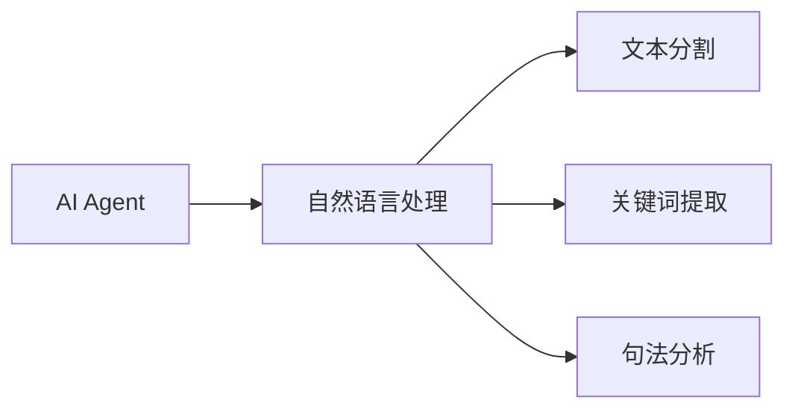
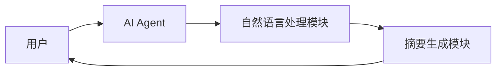

                 


# AI Agent的自然语言摘要生成技术

> 关键词：AI Agent, 自然语言处理, 摘要生成, 算法原理, 系统架构

> 摘要：本文探讨AI Agent在自然语言摘要生成技术中的应用，分析其核心原理、算法模型、系统架构设计，并通过实际案例展示其在不同场景下的实现与优化。

---

## 第1章 引言

自然语言处理（NLP）技术近年来取得了显著进展，AI Agent作为智能体，能够理解和生成人类语言，成为摘要生成领域的重要工具。本文将深入分析AI Agent如何助力自然语言摘要生成，涵盖背景、原理、算法、系统架构及实际应用。

---

## 第2章 背景介绍

### 2.1 AI Agent的基本概念

AI Agent是一种智能体，能够感知环境、执行任务并做出决策。它通过自然语言处理技术理解用户输入，生成摘要等输出，实现人机交互。

### 2.2 自然语言处理技术

自然语言处理技术包括文本分割、关键词提取和句法分析，这些技术为AI Agent生成摘要提供了基础支持。

### 2.3 问题背景

随着信息量爆炸式增长，用户需要快速获取关键信息，AI Agent的自然语言摘要生成技术能够高效解决这一问题。

---

## 第3章 核心概念与联系

### 3.1 AI Agent的核心原理

AI Agent通过感知环境、理解需求、执行任务生成摘要，涵盖文本分割、关键词提取等步骤。

### 3.2 自然语言摘要生成技术的核心原理

摘要生成技术利用文本相似度计算和机器学习模型，提取关键信息生成简洁摘要。

### 3.3 实体关系图

使用Mermaid流程图展示AI Agent与自然语言处理的实体关系：



---

## 第4章 算法原理与数学模型

### 4.1 摘要生成算法原理

摘要生成算法包括文本分割、关键词提取和句法分析，确保摘要的准确性和简洁性。

### 4.2 数学模型与公式

文本相似度计算公式：

$$ \text{相似度} = \frac{\sum_{i=1}^{n} w_i \cdot s_i}{\sum_{i=1}^{n} w_i} $$

其中，$w_i$ 是词的权重，$s_i$ 是相似度得分。

---

## 第5章 系统分析与架构设计

### 5.1 应用场景

AI Agent应用于新闻摘要生成、会议纪要自动生成等领域。

### 5.2 系统功能设计

系统功能包括文本输入、摘要生成、结果输出和用户反馈。

### 5.3 系统架构设计

使用Mermaid架构图展示系统架构：



---

## 第6章 项目实战

### 6.1 环境安装

安装Python、相关库（如NLTK、spaCy）和深度学习框架（如TensorFlow）。

### 6.2 核心代码实现

```python
import nltk
from sklearn.metrics.pairwise import cosine_similarity

def text_segmentation(text):
    # 使用nltk进行文本分割
    sentences = nltk.sent_tokenize(text)
    return sentences

def keyword_extraction(sentences):
    # 提取关键词
    words = []
    for sentence in sentences:
        words.extend(nltk.word_tokenize(sentence))
    return words

def text_summarization(text):
    sentences = text_segmentation(text)
    keywords = keyword_extraction(sentences)
    # 计算相似度
    matrix = cosine_similarity([keywords], [keywords])
    # 选择最相关的句子
    summary = ""
    for i in range(len(matrix[0])):
        if matrix[0][i] > 0.8:
            summary += sentences[i] + " "
    return summary
```

### 6.3 代码解读与分析

上述代码实现文本分割、关键词提取和基于相似度的摘要生成，适用于简单的摘要任务。

### 6.4 案例分析

以新闻文本为例，展示代码运行结果，并分析优化空间。

---

## 第7章 最佳实践与小结

### 7.1 注意事项

选择合适的NLP库和模型，确保摘要生成的准确性和效率。

### 7.2 拓展阅读

推荐相关书籍和论文，深入学习AI Agent和自然语言处理技术。

---

## 作者信息

作者：AI天才研究院（AI Genius Institute） & 禅与计算机程序设计艺术（Zen And The Art of Computer Programming）

---

本文系统地介绍了AI Agent在自然语言摘要生成中的应用，从原理到实践，为读者提供了全面的技术指导。通过详细讲解算法、架构设计和实际案例，帮助读者深入理解并掌握相关技术。

