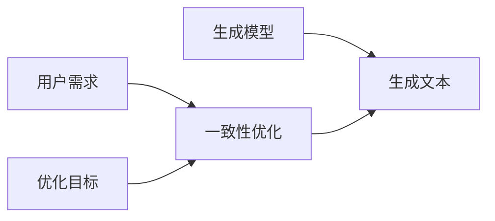
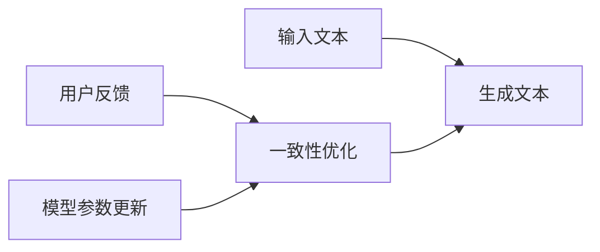
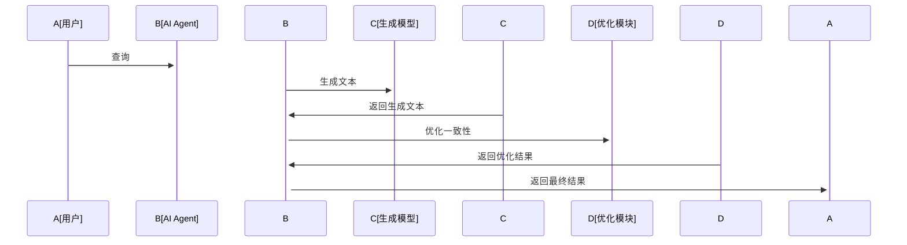

                 


# AI Agent的自然语言生成一致性优化

> 关键词：AI Agent, 自然语言生成, 一致性优化, 监督学习, 强化学习, 深度学习, 生成模型

> 摘要：本文深入探讨了AI Agent在自然语言生成中的一致性优化问题。我们从AI Agent的基本概念出发，分析了自然语言生成一致性优化的核心原理，详细介绍了基于监督学习和强化学习的优化算法，并通过系统架构设计和实战案例展示了如何实现一致性优化。最后，我们总结了优化方法的最佳实践和未来发展方向。

---

## 第一部分: AI Agent与自然语言生成概述

### 第1章: AI Agent的基本概念

#### 1.1 AI Agent的定义与特点
AI Agent（智能体）是指在计算机系统中能够感知环境并采取行动以实现目标的实体。其特点包括：
- **自主性**：能够独立决策。
- **反应性**：能够实时感知环境并做出反应。
- **目标导向**：所有行动都以实现特定目标为导向。

#### 1.2 自然语言生成在AI Agent中的作用
自然语言生成（Natural Language Generation, NLG）是AI Agent实现人机交互的核心技术之一。通过NLP技术，AI Agent能够将结构化的数据转化为自然语言文本，从而与用户进行有效沟通。

#### 1.3 一致性优化的背景与意义
在实际应用中，AI Agent生成的文本可能会出现语义不一致、逻辑不通顺等问题。一致性优化的目标是确保生成文本在语法、语义和逻辑上的一致性，提升用户体验和系统的可信度。

---

## 第2章: 自然语言生成一致性优化的核心概念

### 2.1 一致性优化的原理
一致性优化的核心在于通过算法调整生成模型的输出，使其生成的文本在语法、语义和逻辑上保持一致。具体包括：
- **内部一致性**：生成文本在语法和逻辑上自洽。
- **外部一致性**：生成文本与上下文或用户需求保持一致。

### 2.2 核心概念对比分析

#### 2.2.1 不同一致性优化方法的对比表格
| 方法             | 优点                   | 缺点                   |
|------------------|------------------------|------------------------|
| 基于监督学习       | 易实现，效果稳定         | 需大量标注数据           |
| 基于强化学习       | 可处理复杂场景           | 需大量计算资源           |
| 对比学习           | 提高生成文本多样性       | 实现复杂度较高           |

#### 2.2.2 优化方法的ER实体关系图



---

## 第3章: 一致性优化的算法原理

### 3.1 基于监督学习的优化算法

#### 3.1.1 损失函数设计
交叉熵损失函数是监督学习中常用的损失函数：
$$ \text{Loss} = -\sum_{i=1}^{n} y_i \log p(y_i) $$
其中，$y_i$ 表示真实标签，$p(y_i)$ 表示模型预测概率。

#### 3.1.2 优化器选择
常用的优化器包括Adam和SGD。Adam优化器在大多数场景下表现更优。

#### 3.1.3 训练流程
1. 输入训练数据。
2. 模型生成预测文本。
3. 计算损失函数。
4. 反向传播并更新模型参数。

### 3.2 基于强化学习的优化算法

#### 3.2.1 奖励机制设计
强化学习通过奖励机制指导模型生成更优的文本。常用的奖励函数包括基于BLEU、ROUGE等指标的奖励。

#### 3.2.2 智能体与环境交互
AI Agent与环境的交互过程如下：
1. 环境提供输入文本。
2. 智能体根据当前状态生成响应。
3. 环境给予奖励或反馈。
4. 智能体根据反馈调整策略。

---

## 第4章: 一致性优化的数学模型与公式

### 4.1 基于交叉熵的损失函数
交叉熵损失函数用于衡量生成文本与真实文本的差异：
$$ \text{Loss} = -\sum_{i=1}^{n} y_i \log p(y_i) $$

### 4.2 基于强化学习的奖励函数
强化学习的奖励函数通常是一个累加的形式：
$$ R = \sum_{t=1}^{T} r_t $$
其中，$r_t$ 表示时间步$t$的奖励值，$T$表示总时间步数。

### 4.3 基于对比学习的优化公式
对比学习通过对比正样本和负样本的相似性来优化模型：
$$ \text{Loss} = -\log \frac{p(x,y)}{\sum_{y'} p(x,y')} $$
其中，$x$ 表示输入，$y$ 表示目标输出。

---

## 第5章: 系统分析与架构设计方案

### 5.1 问题场景介绍
AI Agent在自然语言生成中需要处理多种场景，如客服对话、智能助手等。这些场景对生成文本的一致性提出了更高的要求。

### 5.2 系统功能设计
系统功能包括：
- 文本生成模块。
- 一致性优化模块。
- 用户反馈模块。

### 5.3 系统架构设计



### 5.4 系统接口设计
系统接口包括：
- API输入接口。
- API输出接口。
- 反馈接口。

### 5.5 系统交互流程



---

## 第6章: 项目实战

### 6.1 环境安装
安装必要的库：
```bash
pip install numpy torch transformers
```

### 6.2 核心代码实现

#### 6.2.1 损失函数实现
```python
import torch

def cross_entropy_loss(logits, labels):
    return torch.nn.CrossEntropyLoss()(logits, labels)
```

#### 6.2.2 优化器实现
```python
optimizer = torch.optim.Adam(model.parameters(), lr=0.001)
```

#### 6.2.3 训练流程实现
```python
def train(model, optimizer, criterion, inputs, labels):
    outputs = model(inputs)
    loss = criterion(outputs, labels)
    optimizer.zero_grad()
    loss.backward()
    optimizer.step()
    return loss.item()
```

### 6.3 代码解读与分析
1. **输入处理**：将输入文本转换为模型可接受的格式。
2. **生成文本**：模型生成初步文本。
3. **一致性优化**：通过损失函数优化生成文本。
4. **结果输出**：输出优化后的文本。

### 6.4 实际案例分析
以客服对话为例，输入用户问题，生成一致的回复。

---

## 第7章: 总结与展望

### 7.1 一致性优化总结
本文详细介绍了AI Agent自然语言生成一致性优化的核心方法，包括监督学习和强化学习的实现。

### 7.2 未来发展方向
未来，一致性优化可以结合大语言模型（如GPT）进行更复杂的优化。

### 7.3 最佳实践Tips
- 确保数据质量。
- 选择合适的优化算法。
- 定期更新模型。

---

## 作者

作者：AI天才研究院/AI Genius Institute & 禅与计算机程序设计艺术 /Zen And The Art of Computer Programming

---

**全文完**

