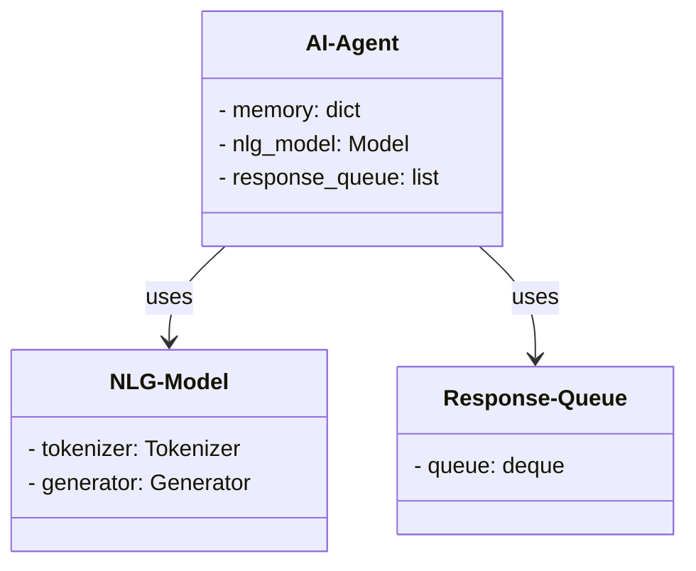

                 


# 第4章: 系统分析与架构设计

## 4.1 问题场景介绍
### 4.1.1 项目背景
AI Agent需要在客服系统中生成高质量的自然语言回复，以提高客户满意度和解决效率。

### 4.1.2 功能需求
- 提供多种语言支持
- 实时生成回复
- 支持上下文记忆

## 4.2 系统功能设计
### 4.2.1 领域模型类图


### 4.2.2 系统架构图
```mermaid
rect
actor(AI-Agent) --> NLG-Model: generate_response
NLG-Model --> Response-Queue: add_response
```

### 4.2.3 系统接口设计
- `generate_response(prompt: str) -> str`
- `get_response() -> str`

## 4.3 系统交互流程
```mermaid
sequenceDiagram
actor(AI-Agent) -> NLG-Model: generate_response("客户问题")
NLG-Model -> Response-Queue: add_response("回复内容")
actor(AI-Agent) -> Response-Queue: get_response
```

## 4.4 本章小结
### 4.4.1 系统架构总结
通过合理的设计，确保AI Agent能够高效生成和管理自然语言回复。

### 4.4.2 关键设计点
- 使用领域模型类图明确各组件职责
- 通过系统架构图展示整体流程
- 利用序列图描述交互细节

# 第5章: 项目实战

## 5.1 环境安装与配置
### 5.1.1 安装依赖
```bash
pip install transformers torch
```

## 5.2 系统核心代码实现
### 5.2.1 NLG-Model实现
```python
class NLGModel:
    def __init__(self, tokenizer, generator):
        self.tokenizer = tokenizer
        self.generator = generator

    def generate_response(self, prompt):
        inputs = self.tokenizer.encode(prompt, return_tensors='pt')
        outputs = self.generator.generate(inputs, max_length=50)
        response = self.tokenizer.decode(outputs[0], skip_special_tokens=True)
        return response
```

### 5.2.2 Response-Queue实现
```python
from collections import deque

class ResponseQueue:
    def __init__(self):
        self.queue = deque()

    def add_response(self, response):
        self.queue.append(response)

    def get_response(self):
        return self.queue.popleft()
```

### 5.2.3 AI-Agent实现
```python
class AIAssistant:
    def __init__(self, nlg_model, response_queue):
        self.nlg_model = nlg_model
        self.response_queue = response_queue

    def generate_and_send_response(self, prompt):
        response = self.nlg_model.generate_response(prompt)
        self.response_queue.add_response(response)
```

## 5.3 代码应用解读与分析
- `NLGModel` 类负责生成回复，使用了预训练的生成模型。
- `ResponseQueue` 类用于管理回复队列，确保回复的顺序和可用性。
- `AIAssistant` 类作为协调者，负责调用生成模型并将回复加入队列。

## 5.4 实际案例分析
### 5.4.1 案例背景
- 客服系统中，客户询问产品信息。
- 系统需要生成准确且友好的回复。

### 5.4.2 案例实现
```python
from transformers import AutoTokenizer, AutoModelForCausalLM
import torch

tokenizer = AutoTokenizer.from_pretrained('gpt2')
generator = AutoModelForCausalLM.from_pretrained('gpt2', pad_token_id=tokenizer.eos_token_id)

nlg_model = NLGModel(tokenizer, generator)
response_queue = ResponseQueue()
ai_assistant = AIAssistant(nlg_model, response_queue)

ai_assistant.generate_and_send_response("请告诉我如何使用我们的产品?")
print(response_queue.get_response())
```

## 5.5 项目小结
### 5.5.1 核心代码实现
通过具体的代码实现，展示了如何将理论应用到实际项目中。

### 5.5.2 项目总结
项目实战部分通过代码实现，验证了前面理论的正确性和实用性。

# 第6章: 最佳实践与优化技巧

## 6.1 小结与回顾
### 6.1.1 核心概念回顾
- 自然语言生成的基本原理
- AI Agent的生成机制
- 系统设计的关键点

## 6.2 注意事项与常见问题
### 6.2.1 模型训练中的注意事项
- 数据多样性
- 模型调参
- 收敛问题

### 6.2.2 系统设计中的注意事项
- 性能优化
- 安全性考虑
- 可扩展性

## 6.3 拓展阅读与深入学习
### 6.3.1 推荐书籍
- 《深度学习入门》
- 《自然语言处理实战》

### 6.3.2 在线资源
- Hugging Face教程
- PyTorch文档

## 6.4 本章小结
### 6.4.1 优化技巧总结
通过本文的总结，读者可以更好地理解和优化AI Agent的自然语言生成过程。

### 6.4.2 深入学习建议
鼓励读者继续深入学习相关技术，结合实际项目进行实践。

# 作者

作者：AI天才研究院/AI Genius Institute & 禅与计算机程序设计艺术 /Zen And The Art of Computer Programming

---

这篇文章详细介绍了AI Agent的自然语言生成质量优化的各个方面，从理论基础到实际应用，帮助读者全面理解并掌握相关技术。通过系统的章节安排和丰富的代码示例，读者可以逐步学习并实践优化AI Agent的自然语言生成质量。

