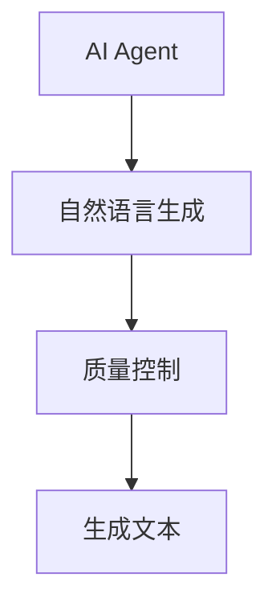
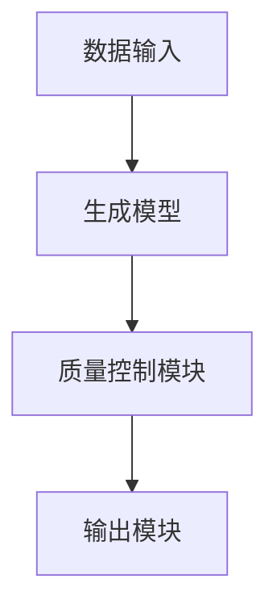

                 


# AI Agent的自然语言生成质量控制

> 关键词：AI Agent，自然语言生成，质量控制，生成模型，深度学习

> 摘要：本文将深入探讨AI Agent在自然语言生成中的质量控制问题，分析其核心概念、算法原理、系统设计以及项目实战，帮助读者全面理解并掌握AI Agent自然语言生成质量控制的关键技术与实践方法。

---

## 第一部分: AI Agent与自然语言生成质量控制的背景与概念

### 第1章: AI Agent与自然语言生成概述

#### 1.1 AI Agent的基本概念
##### 1.1.1 AI Agent的定义与特点
AI Agent（人工智能代理）是指能够感知环境、自主决策并执行任务的智能实体。它具备以下特点：
- **自主性**：能够自主决策，无需外部干预。
- **反应性**：能够实时感知环境并做出反应。
- **目标导向性**：以实现特定目标为导向。
- **学习能力**：能够通过数据和经验进行学习和优化。

##### 1.1.2 自然语言生成的基本原理
自然语言生成（Natural Language Generation, NLG）是将结构化数据转化为自然语言文本的过程。其基本原理包括：
1. **数据理解**：解析输入数据，提取关键信息。
2. **内容规划**：确定生成文本的结构和内容。
3. **语言生成**：将内容转化为自然语言文本。
4. **输出优化**：对生成的文本进行优化，提高可读性和准确性。

##### 1.1.3 AI Agent在自然语言生成中的作用
AI Agent通过自然语言生成技术，能够以人类可读的方式输出信息，例如生成报告、回答问题或提供建议。这种能力使得AI Agent能够更有效地与人类交互，并在实际应用中发挥重要作用。

#### 1.2 自然语言生成质量控制的必要性
##### 1.2.1 质量控制的定义与目标
质量控制是指在生成文本的过程中，对生成内容的准确性、相关性和可读性进行监控和优化的过程。其目标是确保生成的文本既符合用户需求，又具备良好的表达能力。

##### 1.2.2 质量控制在AI Agent中的重要性
在AI Agent中，质量控制是确保生成文本准确性和可靠性的关键环节。如果生成的文本存在错误或不准确，将导致用户信任度下降，甚至影响系统的正常使用。

##### 1.2.3 质量控制的边界与外延
质量控制的边界主要在于生成文本的内容和表达方式，而不涉及文本的格式或排版问题。外延则包括对生成文本的后续优化和改进。

---

### 第2章: 自然语言生成质量控制的核心概念与联系

#### 2.1 质量控制的核心概念
##### 2.1.1 生成质量的评估指标
生成质量的评估指标可以从以下几个方面进行考量：
- **准确性**：生成内容是否准确反映了输入数据。
- **相关性**：生成内容是否与用户需求相关。
- **可读性**：生成文本是否通顺易懂。
- **一致性**：生成文本是否在逻辑上一致。

##### 2.1.2 质量控制的实现方法
质量控制的实现方法主要包括：
- **基于规则的控制**：通过预定义的规则对生成内容进行检查。
- **基于统计的控制**：通过统计方法对生成内容进行评估。
- **基于深度学习的控制**：利用深度学习模型对生成内容进行优化。

##### 2.1.3 质量控制与生成模型的关系
质量控制与生成模型是相辅相成的关系。生成模型负责生成文本，而质量控制则对生成结果进行优化和调整，确保最终输出的质量。

#### 2.2 核心概念的联系
##### 2.2.1 生成质量评估的ER实体关系图


---

## 第二部分: 自然语言生成质量控制的算法与原理

### 第3章: 自然语言生成模型的算法原理

#### 3.1 生成模型的算法概述
##### 3.1.1 Transformer架构
Transformer是一种基于注意力机制的深度学习模型，由编码器和解码器组成。编码器负责将输入数据编码为向量，解码器则根据编码结果生成输出文本。

##### 3.1.2 解码器的实现原理
解码器通过自注意力机制和前馈网络生成输出文本。自注意力机制用于捕捉输入序列中不同位置之间的关系，前馈网络则用于将注意力输出转换为最终的生成结果。

##### 3.1.3 模型训练的流程
模型训练的流程主要包括数据预处理、模型训练和模型评估。数据预处理包括数据清洗、分词和标注等步骤。模型训练使用预处理后的数据，通过反向传播算法优化模型参数。模型评估则通过验证集和测试集评估模型的性能。

#### 3.2 质量控制的算法实现
##### 3.2.1 基于概率的生成质量评估
基于概率的生成质量评估通过计算生成文本的概率分布，评估生成内容的合理性和准确性。

##### 3.2.2 基于规则的质量控制方法
基于规则的质量控制方法通过预定义的规则对生成内容进行检查，例如检查生成文本是否包含敏感词汇或语法错误。

##### 3.2.3 基于深度学习的质量控制模型
基于深度学习的质量控制模型通过训练一个辅助模型，对生成内容进行优化和调整。例如，可以使用一个二分类模型对生成内容进行质量评分。

---

### 第4章: 自然语言生成质量控制的数学模型

#### 4.1 生成模型的数学表达
##### 4.1.1 Transformer的注意力机制
$$\text{Attention}(Q,K,V) = \text{softmax}\left(\frac{QK^T}{\sqrt{d_k}}\right)V$$

##### 4.1.2 解码器的损失函数
$$\mathcal{L} = -\sum_{t=1}^{T} \log p(y_t|x_{<t})$$

---

## 第三部分: 自然语言生成质量控制的系统分析与架构设计

### 第5章: 系统分析与架构设计

#### 5.1 系统功能设计
##### 5.1.1 系统功能模块
系统功能模块包括数据输入、生成模型、质量控制模块和输出模块。数据输入模块负责接收输入数据，生成模型负责生成文本，质量控制模块对生成文本进行优化，输出模块将最终结果输出。

##### 5.1.2 系统功能流程
系统功能流程包括数据预处理、生成模型训练、生成文本质量控制和结果输出。每个步骤都需要进行详细设计和优化。

#### 5.2 系统架构设计
##### 5.2.1 系统架构图


#### 5.3 接口设计与交互流程
##### 5.3.1 系统接口设计
系统接口设计包括输入接口和输出接口。输入接口负责接收输入数据，输出接口负责将生成文本输出给用户。

##### 5.3.2 系统交互流程
系统交互流程包括用户输入、生成模型处理、质量控制模块优化和结果输出。每个步骤都需要进行详细设计和优化。

---

## 第四部分: 项目实战

### 第6章: 项目实战

#### 6.1 环境安装
##### 6.1.1 安装Python
安装Python 3.8或更高版本。

##### 6.1.2 安装相关库
安装必要的库，例如`tensorflow`、`pytorch`和`transformers`。

#### 6.2 系统核心实现
##### 6.2.1 生成模型实现
实现一个基于Transformer的生成模型，包括编码器和解码器部分。

##### 6.2.2 质量控制模块实现
实现一个质量控制模块，对生成文本进行优化和调整。

#### 6.3 代码实现与解读
##### 6.3.1 生成模型代码
```python
import torch
class TransformerGenerator(torch.nn.Module):
    def __init__(self, vocab_size, d_model, n_head, dff):
        super(TransformerGenerator, self).__init__()
        self.embedding = torch.nn.Embedding(vocab_size, d_model)
        self.transformer = torch.nn.Transformer(d_model=d_model, nhead=n_head, dff=dff)
        self.output_layer = torch.nn.Linear(d_model, vocab_size)
    
    def forward(self, x):
        x = self.embedding(x)
        x = self.transformer(x)
        x = self.output_layer(x)
        return x
```

##### 6.3.2 质量控制模块代码
```python
import torch
class QualityControlModule(torch.nn.Module):
    def __init__(self, vocab_size, d_model, n_head, dff):
        super(QualityControlModule, self).__init__()
        self.embedding = torch.nn.Embedding(vocab_size, d_model)
        self.transformer = torch.nn.Transformer(d_model=d_model, nhead=n_head, dff=dff)
        self.output_layer = torch.nn.Linear(d_model, 2)  # 0表示质量低，1表示质量高
    
    def forward(self, x):
        x = self.embedding(x)
        x = self.transformer(x)
        x = torch.sigmoid(self.output_layer(x))
        return x
```

#### 6.4 案例分析与解读
##### 6.4.1 案例分析
通过实际案例分析，展示生成模型和质量控制模块的实际应用效果。

##### 6.4.2 案例解读
对生成文本的质量控制结果进行详细解读，分析生成文本的优缺点。

---

## 第五部分: 最佳实践与总结

### 第7章: 最佳实践与总结

#### 7.1 最佳实践
##### 7.1.1 数据质量的重要性
数据质量对生成模型的性能至关重要，需要确保训练数据的多样性和准确性。

##### 7.1.2 模型调优的技巧
模型调优的技巧包括选择合适的超参数、优化训练策略和使用有效的验证方法。

##### 7.1.3 用户反馈的利用
用户反馈是提升生成模型质量的重要手段，可以通过用户反馈不断优化生成模型。

#### 7.2 总结
本文全面介绍了AI Agent在自然语言生成质量控制的关键技术与实践方法，包括生成模型的算法原理、质量控制的实现方法以及系统设计与优化。通过实际案例分析和代码实现，帮助读者更好地理解和掌握相关技术。

#### 7.3 展望
未来的研究方向包括更高效的生成模型、更智能的质量控制方法以及更广泛的应用场景。

---

作者：AI天才研究院/AI Genius Institute & 禅与计算机程序设计艺术 /Zen And The Art of Computer Programming

