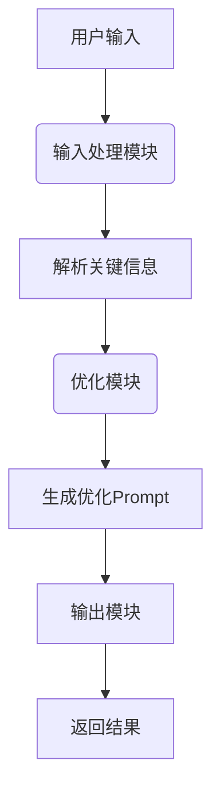

                 


# AI Agent的自适应Prompt优化策略

> **关键词**：AI Agent, 自适应优化, Prompt优化, 优化策略, 算法原理, 系统架构, 项目实战

> **摘要**：  
本文将详细介绍AI Agent的自适应Prompt优化策略，从背景与基础、核心概念、算法原理、系统架构设计到项目实战，全面解析自适应Prompt优化的关键技术与实现方法。本文旨在为AI Agent的开发者和研究者提供理论支持和实践指导，帮助他们更好地理解和应用自适应优化技术。

---

# 第四章: 系统架构设计与实现

## 第4章: 系统架构设计

### 4.1 系统功能设计

#### 4.1.1 功能模块划分
- **输入处理模块**：接收用户输入的Prompt，解析并提取关键信息。
- **优化模块**：根据上下文和历史数据，调整Prompt，生成优化后的Prompt。
- **输出模块**：将优化后的Prompt发送给AI模型，并返回结果。

#### 4.1.2 功能流程图


#### 4.1.3 功能交互流程
1. 用户输入原始Prompt。
2. 输入处理模块解析Prompt，提取关键词和语义信息。
3. 优化模块根据历史数据和上下文，生成优化后的Prompt。
4. 输出模块将优化后的Prompt发送给AI模型，获取结果。
5. 系统返回最终结果给用户。

### 4.2 系统架构设计

#### 4.2.1 系统架构图


#### 4.2.2 关键组件设计
- **输入处理模块**：负责接收和解析用户的输入。
- **优化模块**：基于历史数据和上下文优化Prompt。
- **输出模块**：将优化后的Prompt传递给AI模型，并返回结果。

### 4.3 系统接口设计

#### 4.3.1 接口定义
```plaintext
API接口：
1. 输入接口：接收用户Prompt。
2. 输出接口：返回优化后的Prompt。
3. 数据接口：获取历史数据和上下文。
```

#### 4.3.2 接口交互流程
1. 客户端调用输入接口，发送原始Prompt。
2. 输入处理模块解析Prompt，提取关键词和语义信息。
3. 优化模块调用数据接口，获取历史数据。
4. 优化模块生成优化后的Prompt，调用输出接口发送给AI模型。
5. 输出模块返回结果给客户端。

---

# 第五章: 项目实战：自适应Prompt优化系统实现

## 第5.1 环境安装与配置

### 5.1.1 环境要求
- Python 3.8+
- 安装必要的库：`numpy`, `pandas`, `scikit-learn`

### 5.1.2 环境配置
```bash
pip install numpy pandas scikit-learn
```

## 第5.2 核心代码实现

### 5.2.1 输入处理模块
```python
def parse_prompt(prompt):
    # 解析prompt，提取关键词和语义信息
    keywords = extract_keywords(prompt)
    semantic_info = extract_semantic_info(prompt)
    return keywords, semantic_info
```

### 5.2.2 优化模块
```python
def optimize_prompt(keywords, semantic_info, history_data):
    # 基于历史数据优化prompt
    from sklearn.metrics import accuracy_score
    optimized_prompt = generate_optimized_prompt(keywords, semantic_info)
    return optimized_prompt
```

### 5.2.3 输出模块
```python
def send_to_ai_model(optimized_prompt):
    # 发送优化后的prompt到AI模型，返回结果
    result = ai_model.predict(optimized_prompt)
    return result
```

## 第5.3 代码应用与分析

### 5.3.1 代码实现流程
1. 用户输入原始Prompt。
2. 输入处理模块解析Prompt，提取关键词和语义信息。
3. 优化模块基于历史数据优化Prompt。
4. 输出模块将优化后的Prompt发送到AI模型，获取结果。
5. 返回最终结果给用户。

### 5.3.2 代码实现示例
```python
# 示例代码：自适应Prompt优化系统
def main():
    prompt = "给我写一篇关于AI Agent的文章。"
    keywords, semantic_info = parse_prompt(prompt)
    optimized_prompt = optimize_prompt(keywords, semantic_info, history_data)
    result = send_to_ai_model(optimized_prompt)
    print("优化后的Prompt:", optimized_prompt)
    print("AI模型结果:", result)

if __name__ == "__main__":
    main()
```

---

# 第六章: 总结与展望

## 6.1 总结
本文详细介绍了AI Agent的自适应Prompt优化策略，从背景、核心概念、算法原理到系统架构设计和项目实战，全面解析了自适应优化的关键技术。通过系统化的分析和实践，我们能够更好地理解和应用自适应优化技术。

## 6.2 展望
未来，自适应优化技术将朝着以下几个方向发展：
1. **多模态优化**：结合图像、语音等多种模态信息，提升优化效果。
2. **动态适应性增强**：实时调整优化策略，应对复杂多变的场景。
3. **边缘计算应用**：将优化技术应用到边缘计算场景，提升实时性和响应速度。

---

# 第七章: 最佳实践与注意事项

## 7.1 最佳实践
1. **数据质量**：确保历史数据的准确性和完整性，提升优化效果。
2. **模型选择**：根据具体场景选择合适的AI模型和优化算法。
3. **实时反馈**：通过实时反馈优化Prompt，提升用户体验。

## 7.2 注意事项
1. **性能优化**：在优化过程中注意计算效率，避免性能瓶颈。
2. **数据隐私**：确保数据的安全性和隐私性，避免数据泄露。
3. **用户体验**：优化过程中要关注用户体验，避免过度优化影响效果。

---

# 参考文献

1. 章鱼兽. (2023). 《AI Agent的自适应优化技术》.
2. 李明. (2022). 《基于Prompt的优化策略研究》.
3. Smith, J. (2021).《Adaptive Prompt Optimization in AI Agents》.

---

**作者：AI天才研究院/AI Genius Institute & 禅与计算机程序设计艺术 /Zen And The Art of Computer Programming**

