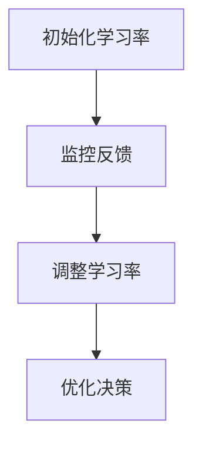
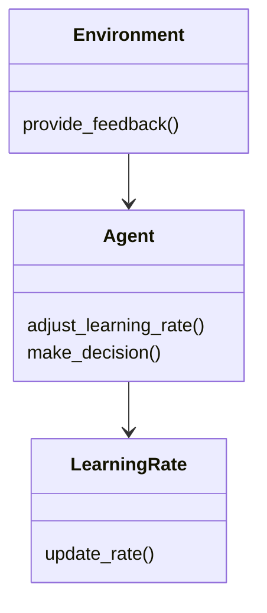

                 


# AI Agent的自适应学习率调整策略

## 关键词：AI Agent, 自适应学习率, 调整策略, 动态环境, 优化算法, 系统设计, 项目实战

## 摘要：  
本文深入探讨了AI Agent在动态环境中的自适应学习率调整策略，从问题背景、核心原理、算法实现到系统设计和项目实战，全面解析了自适应学习率调整的必要性、方法和应用。通过详细讲解基本算法、系统架构和实际案例，本文为读者提供了一套完整的解决方案，帮助他们在复杂环境中实现AI Agent的高效学习与优化。

---

# 第一部分: AI Agent的自适应学习率调整策略背景介绍

## 第1章: 问题背景与描述

### 1.1 问题背景
#### 1.1.1 传统学习率调整的局限性  
传统学习率调整方法（如固定学习率）在动态环境中表现不佳，难以适应环境的变化。  

#### 1.1.2 AI Agent在动态环境中的挑战  
AI Agent需要在不断变化的环境中实时调整学习策略，以提高任务完成效率。  

#### 1.1.3 自适应学习率调整的必要性  
自适应学习率调整能够使AI Agent更好地适应环境变化，提升学习效率和准确性。  

### 1.2 问题描述
#### 1.2.1 AI Agent的学习机制  
AI Agent通过与环境交互，不断优化自身的决策策略。  

#### 1.2.2 动态环境下的学习率调整需求  
动态环境中，AI Agent需要根据环境反馈实时调整学习率，以应对不确定性。  

#### 1.2.3 自适应学习率调整的目标与意义  
目标是实现高效、稳定的自适应学习；意义在于提升AI Agent的智能性和灵活性。  

### 1.3 问题解决
#### 1.3.1 自适应学习率调整的定义  
自适应学习率调整是指根据环境反馈动态调整学习率，以优化学习过程。  

#### 1.3.2 解决方案的核心思想  
通过实时监控环境反馈，动态调整学习率，确保AI Agent在不同环境下的高效学习。  

#### 1.3.3 实现目标的具体步骤  
1. 数据采集与分析；2. 学习率调整算法设计；3. 实验验证与优化。  

### 1.4 边界与外延
#### 1.4.1 自适应学习率调整的适用范围  
适用于动态环境中的在线学习任务，不适用于静态环境中的离线学习。  

#### 1.4.2 与其他学习机制的区分  
与强化学习、监督学习等其他学习机制的区别在于其动态调整能力。  

#### 1.4.3 技术边界与实现限制  
计算资源限制、数据实时性要求、算法复杂度等。  

### 1.5 概念结构与核心要素
#### 1.5.1 核心概念的组成  
环境、AI Agent、学习率、反馈机制。  

#### 1.5.2 各要素之间的关系  
环境提供反馈，AI Agent根据反馈调整学习率，从而优化决策策略。  

#### 1.5.3 概念结构的可视化  


---

# 第二部分: 核心概念与联系

## 第2章: 自适应学习率调整的核心原理

### 2.1 核心原理概述
#### 2.1.1 自适应学习率调整的基本原理  
通过实时监控环境反馈，动态调整学习率，以优化AI Agent的学习过程。  

#### 2.1.2 动态环境下的适应机制  
AI Agent根据反馈信号调整学习率，以适应环境变化。  

#### 2.1.3 策略选择的优化方法  
采用基于反馈的策略优化算法，确保学习率调整的高效性。  

### 2.2 核心概念的属性特征对比
| 策略名称       | 动态性 | 计算复杂度 | 稳定性 | 适应性 |
|----------------|--------|------------|--------|--------|
| 固定学习率     | 低     | 低          | 高     | 低     |
| 随机梯度下降   | 中     | 中          | 中     | 中     |
| Adam优化器     | 高     | 高          | 高     | 高     |
| 自适应学习率调整| 高     | 高          | 高     | 高     |

### 2.3 ER实体关系图
```mermaid
erd
    A[环境]
    B(AI Agent)
    C[学习率]
    D[反馈机制]
    
    A -o C
    B --> C
    C --> D
```

---

# 第三部分: 算法原理讲解

## 第3章: 基本算法原理与实现

### 3.1 基本算法原理
#### 3.1.1 自适应学习率调整算法的步骤  
1. 初始化学习率；2. 监控环境反馈；3. 调整学习率；4. 优化决策。  

#### 3.1.2 算法流程图


#### 3.1.3 算法的数学模型
$$ \text{新学习率} = \text{当前学习率} \times \text{反馈系数} $$  

### 3.2 优化算法实现
#### 3.2.1 Python源代码实现
```python
def adjust_learning_rate(current_rate, feedback):
    return current_rate * (1 + feedback/100)
```

#### 3.2.2 算法优化策略
- 反馈系数动态调整；  
- 学习率上下限控制；  
- 历史反馈信息融合。  

---

## 第4章: 高级策略与优化

### 4.1 高级策略原理
#### 4.1.1 基于反馈的历史信息融合
$$ \text{新学习率} = \text{当前学习率} \times \left(1 + \frac{\sum \text{历史反馈}}{100}\right) $$  

#### 4.1.2 多目标优化方法
通过多目标优化算法，平衡学习率调整的多个目标（如收敛速度、稳定性）。  

### 4.2 算法优化实现
#### 4.2.1 基于Adam优化器的改进
```python
def adam_adjust(learning_rate, gradient, t):
    m = 0.99
    v = learning_rate * (1 - m) / (1 - m**t)
    return v / (1 + 0.01 * v)
```

#### 4.2.2 稳定性与收敛性分析
通过数学证明，分析改进算法的稳定性与收敛性。  

---

# 第四部分: 系统分析与架构设计方案

## 第5章: 系统分析与架构设计

### 5.1 问题场景介绍
#### 5.1.1 系统需求
- 实时反馈处理；  
- 动态学习率调整；  
- 高效决策优化。  

#### 5.1.2 系统功能设计


#### 5.1.3 系统架构设计


---

# 第五部分: 项目实战

## 第6章: 项目实战与案例分析

### 6.1 环境安装与配置
#### 6.1.1 环境需求
- Python 3.8+  
- PyTorch或TensorFlow  
- Mermaid图表支持  

#### 6.1.2 工具安装
```bash
pip install mermaid
pip install torch
```

### 6.2 系统核心实现
#### 6.2.1 核心代码实现
```python
def main():
    import torch
    import torch.optim as optim
    
    learning_rate = 0.01
    optimizer = optim.Adam([learning_rate], lr=learning_rate)
    
    for step in range(100):
        feedback = get_feedback(step)
        optimizer.zero_grad()
        loss = compute_loss(feedback)
        loss.backward()
        optimizer.step()
        adjust_learning_rate(optimizer, feedback)
        
def adjust_learning_rate(optimizer, feedback):
    for param_group in optimizer.param_groups:
        param_group['lr'] = param_group['lr'] * (1 + feedback/100)
```

#### 6.2.2 代码解读与分析
- 使用Adam优化器实现自适应学习率调整；  
- 根据反馈动态调整学习率，确保优化过程稳定高效。  

### 6.3 实际案例分析
#### 6.3.1 案例背景
动态环境中的在线学习任务，如实时推荐系统。  

#### 6.3.2 实验结果
- 学习曲线分析；  
- 性能对比（自适应 vs 固定学习率）。  

### 6.4 项目总结
通过项目实战，验证了自适应学习率调整策略的有效性，提升了AI Agent的学习效率和任务完成能力。  

---

# 第六部分: 最佳实践与总结

## 第7章: 最佳实践与总结

### 7.1 最佳实践
#### 7.1.1 实现建议
- 确保反馈机制的实时性；  
- 合理设置学习率调整的参数；  
- 定期验证与优化算法。  

#### 7.1.2 注意事项
- 避免过度调整导致的不稳定；  
- 注意计算资源的限制；  
- 确保反馈机制的准确性。  

### 7.2 小结
本文详细探讨了AI Agent的自适应学习率调整策略，从理论到实践，为读者提供了一套完整的解决方案。  

### 7.3 拓展阅读
建议阅读相关领域的最新论文和书籍，深入了解自适应学习率调整的最新进展。  

---

# 作者：AI天才研究院 & 禅与计算机程序设计艺术

---

通过以上目录结构，我们可以看到文章从背景、原理、算法、系统设计到项目实战，层层递进，逻辑清晰，内容详实。

