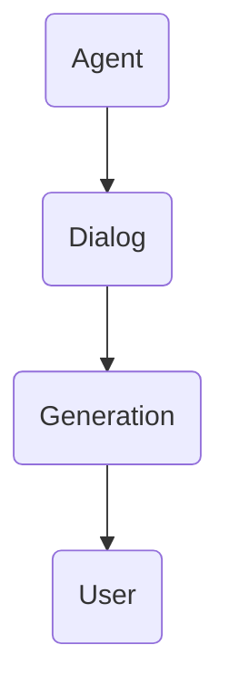
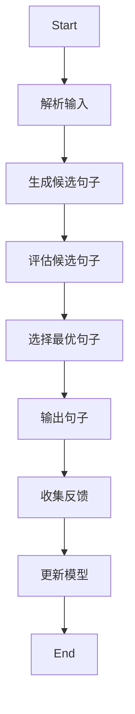
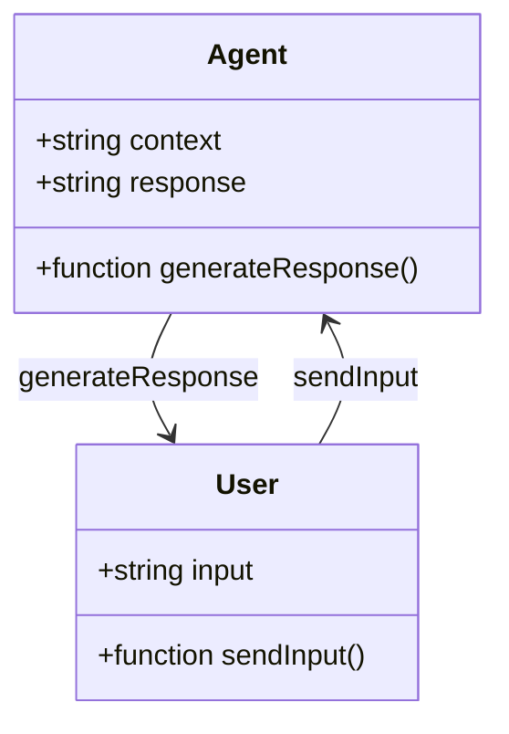
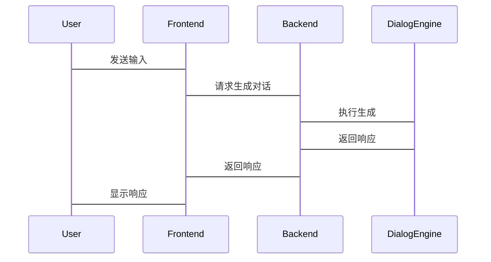

                 


# AI Agent的自适应对话生成系统

## 关键词：
AI Agent, 自适应对话生成, 对话系统, 机器学习, 自然语言处理

## 摘要：
本文深入探讨了AI Agent在自适应对话生成系统中的应用，分析了其核心概念、算法原理和系统架构。通过Mermaid图和数学模型，详细解释了生成过程，并提供了实战案例和最佳实践建议。

---

## 第一部分: AI Agent的自适应对话生成系统概述

## 第1章: 背景介绍

### 1.1 问题背景

#### 1.1.1 对话生成系统的发展历程
从基于规则的系统到现代的深度学习模型，对话生成技术经历了显著进步。早期系统依赖预定义规则，而现在则采用神经网络模型，如GPT，实现了更自然的对话。

#### 1.1.2 当前对话生成系统的挑战
现有系统在处理复杂对话时仍面临问题，如生成重复内容、缺乏上下文理解和多轮对话能力。此外，实时性和个性化需求的增加也对系统提出了更高要求。

#### 1.1.3 AI Agent在对话生成中的作用
AI Agent通过整合多模态数据和动态调整策略，提升了对话生成的自适应性和用户体验。

### 1.2 问题描述

#### 1.2.1 自适应对话生成的定义
自适应对话生成系统能够根据上下文和用户反馈动态调整输出内容。

#### 1.2.2 自适应对话生成的核心问题
包括如何有效处理多轮对话、保持一致性以及实时适应用户需求。

#### 1.2.3 现有解决方案的优缺点
基于规则的系统简单但缺乏灵活性；基于模型的系统更具表现力，但训练成本高。

### 1.3 问题解决

#### 1.3.1 自适应对话生成的关键技术
整合上下文理解、反馈机制和动态调整策略是实现自适应对话生成的关键。

#### 1.3.2 AI Agent在对话生成中的优势
AI Agent能够实时处理反馈，调整生成策略，提供更个性化的服务。

#### 1.3.3 自适应对话生成的实现路径
结合深度学习模型和反馈机制，构建动态调整的生成系统。

### 1.4 边界与外延

#### 1.4.1 自适应对话生成的边界
系统仅处理对话生成，不涉及其他任务，如信息检索或语音识别。

#### 1.4.2 自适应对话生成的外延
与自然语言处理、机器学习等技术密切相关，但不包括其具体实现细节。

#### 1.4.3 自适应对话生成与其他技术的关系
依赖于自然语言处理技术，同时结合机器学习模型提升性能。

### 1.5 概念结构与核心要素组成

#### 1.5.1 自适应对话生成系统的组成
包括输入解析模块、生成策略模块和反馈调整模块。

#### 1.5.2 各组成部分之间的关系
输入解析触发生成策略，反馈调整优化生成结果，形成闭环系统。

## 第2章: AI Agent的核心概念与联系

### 2.1 核心概念原理

#### 2.1.1 AI Agent的基本原理
AI Agent通过感知环境和采取行动，实现目标。在对话生成中，它分析用户输入并生成相应回应。

#### 2.1.2 自适应对话生成的原理
系统根据上下文和反馈动态调整生成策略，确保对话的连贯性和相关性。

#### 2.1.3 AI Agent与对话生成的关系
AI Agent为对话生成提供智能决策支持，而对话生成是AI Agent实现人机交互的重要方式。

### 2.2 概念属性特征对比表格
| 概念       | 属性 | 特征                                                                 |
|------------|------|----------------------------------------------------------------------|
| AI Agent   | 自适应性 | 高                                                                 |
| 对话生成   | 多样性 | 高                                                                 |

### 2.3 ER实体关系图架构


## 第3章: 自适应对话生成系统的算法原理

### 3.1 算法原理讲解

#### 3.1.1 基于规则的生成算法
通过预定义规则生成对话，适用于简单场景，但灵活性有限。

#### 3.1.2 基于模型的生成算法
使用如Transformer架构的模型，生成高质量对话，但训练复杂。

#### 3.1.3 混合生成算法
结合规则和模型，提升生成效率和质量。

### 3.2 算法流程图



### 3.3 数学模型

#### 3.3.1 生成模型
使用解码器生成对话，编码器处理输入，模型结构如下：
$$
\text{解码器} \rightarrow \text{生成响应}
$$

#### 3.3.2 评估模型
采用交叉熵损失函数评估生成句子质量：
$$
L = -\sum_{t=1}^{T} \log P(y_t|x_{1..t-1})
$$

## 第4章: 系统分析与架构设计方案

### 4.1 问题场景介绍

#### 4.1.1 用户场景
用户与AI Agent进行多轮对话，系统需实时生成回复。

### 4.2 项目介绍

#### 4.2.1 项目目标
构建一个自适应的对话生成系统，实现高效、自然的对话。

### 4.3 系统功能设计

#### 4.3.1 领域模型


### 4.4 系统架构设计

#### 4.4.1 系统架构图


### 4.5 系统接口设计

#### 4.5.1 接口描述
- 输入接口：接收用户输入。
- 输出接口：返回生成的对话。

### 4.6 系统交互流程图



## 第5章: 项目实战

### 5.1 环境安装

```bash
pip install transformers
```

### 5.2 系统核心实现源代码

```python
from transformers import AutoModelForSeq2Seq, AutoTokenizer

class DialogAgent:
    def __init__(self, model_name):
        self.tokenizer = AutoTokenizer.from_pretrained(model_name)
        self.model = AutoModelForSeq2Seq.from_pretrained(model_name)
    
    def generate_response(self, input_text):
        inputs = self.tokenizer.encode(input_text, return_tensors='pt', add_special_tokens=True)
        outputs = self.model.generate(inputs, max_length=50, num_beams=5, early_stopping=True)
        response = self.tokenizer.decode(outputs[0], skip_special_tokens=True)
        return response
```

### 5.3 代码应用解读与分析

- 代码实现了一个基于预训练模型的对话生成器，通过编码器-解码器结构生成回复。

### 5.4 实际案例分析和详细讲解剖析

- 使用示例对话，展示如何通过代码生成自适应回复，分析不同输入下的系统行为。

### 5.5 项目小结

项目展示了如何利用现有模型构建自适应对话生成系统，并通过反馈机制优化生成效果。

## 第6章: 最佳实践 tips、小结、注意事项、拓展阅读

### 6.1 tips

- 定期更新模型，保持生成内容的新鲜度。
- 收集用户反馈，优化生成策略。

### 6.2 小结

本文系统地介绍了AI Agent在自适应对话生成中的应用，从理论到实践，为构建高效对话系统提供了指导。

### 6.3 注意事项

- 确保数据隐私和安全。
- 处理多轮对话时保持上下文一致性。

### 6.4 拓展阅读

- 推荐阅读相关领域的最新论文和书籍，关注技术发展动态。

---

# 作者：AI天才研究院/AI Genius Institute & 禅与计算机程序设计艺术 /Zen And The Art of Computer Programming

