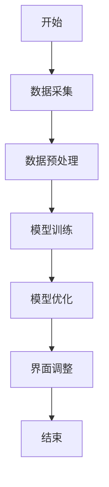
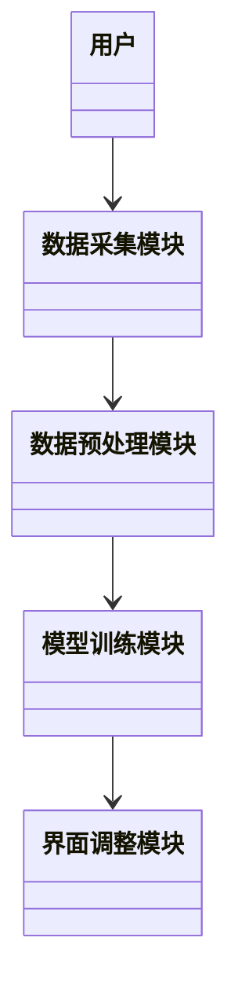
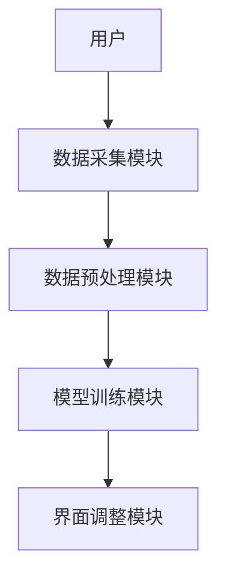

                 


# AI Agent的自适应用户界面：个性化人机交互体验

## 关键词：AI Agent，自适应用户界面，个性化人机交互，人机交互体验，用户界面设计，自适应算法，交互体验优化

## 摘要：本文深入探讨AI Agent在自适应用户界面设计中的应用，分析个性化人机交互体验的实现原理，结合实际案例，详细讲解自适应算法、系统架构设计和数学模型，为读者提供全面的技术指导。

---

# 第一部分: AI Agent与自适应用户界面的背景

## 第1章: AI Agent与自适应界面的背景

### 1.1 AI Agent的基本概念
#### 1.1.1 AI Agent的定义
AI Agent（人工智能代理）是一种能够感知环境、自主决策并执行任务的智能实体。它通过传感器获取信息，利用算法进行分析和推理，并通过执行器与环境交互。

#### 1.1.2 自适应用户界面的定义
自适应用户界面是一种能够根据用户行为、偏好和环境动态调整界面布局、交互方式和内容呈现的智能界面。

#### 1.1.3 个性化人机交互体验的背景
个性化人机交互体验是通过AI技术实现的，旨在根据用户的独特需求和习惯，提供高度个性化的交互方式和界面设计。

---

### 1.2 问题背景与描述
#### 1.2.1 当前人机交互的痛点
传统的人机交互界面通常是静态的，无法根据用户需求和行为动态调整，导致用户体验不佳。

#### 1.2.2 自适应界面的需求
随着AI技术的发展，用户对个性化和智能化的交互体验需求日益增长，传统界面已无法满足。

#### 1.2.3 个性化交互的目标
通过AI Agent实现个性化交互，提升用户满意度和操作效率。

---

### 1.3 问题解决与边界
#### 1.3.1 解决方案概述
利用AI Agent分析用户行为数据，动态调整界面布局和交互方式。

#### 1.3.2 边界与外延
AI Agent的自适应界面设计需要在特定场景和用户群体范围内进行。

#### 1.3.3 核心概念与要素
AI Agent、用户数据、自适应算法、个性化交互。

---

### 1.4 概念结构与核心要素
#### 1.4.1 AI Agent的组成
感知模块、决策模块、执行模块。

#### 1.4.2 自适应界面的核心要素
用户数据采集、算法模型、动态调整机制。

#### 1.4.3 个性化交互的实现机制
数据采集、模型训练、动态调整。

---

## 第2章: AI Agent与自适应界面的核心概念

### 2.1 AI Agent的原理
#### 2.1.1 AI Agent的工作原理
通过数据采集、模型训练和执行反馈不断优化交互体验。

#### 2.1.2 自适应界面的原理
根据用户行为数据调整界面布局和内容呈现。

#### 2.1.3 个性化交互的实现机制
利用机器学习模型分析用户行为数据，生成个性化界面。

---

### 2.2 核心概念对比表
#### 2.2.1 AI Agent与传统Agent的对比
| 属性       | AI Agent                  | 传统Agent                |
|------------|---------------------------|--------------------------|
| 智能性     | 高，能够学习和优化         | 低，仅能执行预定义任务   |
| 交互方式   | 支持个性化交互             | 静态交互                 |
| 应用场景   | 智能助手、推荐系统         | 简单任务执行             |

#### 2.2.2 自适应界面与静态界面的对比
| 属性       | 自适应界面                | 静态界面                |
|------------|---------------------------|--------------------------|
| 界面调整   | 动态调整                  | 静态                    |
| 用户体验   | 高，个性化                | 低，统一                |
| 技术复杂度 | 高，需要AI算法支持        | 低，仅需基本编程技能    |

#### 2.2.3 个性化交互与其他交互方式的对比
| 属性       | 个性化交互               | 批量交互                | 单一交互              |
|------------|---------------------------|--------------------------|-----------------------|
| 用户体验   | 高，个性化                | 中，统一                | 低，单一              |
| 适用场景   | 高端用户需求             | 大众用户需求            | 特定用户需求          |

---

### 2.3 ER实体关系图
```mermaid
er
    actor(Agent)
    actor(用户)
    actor(界面)
    actor(交互体验)
    actor(数据)
    actor(模型)
```

---

## 第3章: AI Agent的算法原理

### 3.1 算法原理概述
#### 3.1.1 AI Agent的核心算法
基于用户行为数据的预测和推荐算法。

#### 3.1.2 自适应界面的算法实现
利用机器学习模型动态调整界面布局。

#### 3.1.3 个性化交互的算法优化
通过反馈机制不断优化交互体验。

---

### 3.2 算法流程图


---

### 3.3 算法实现代码
```python
import numpy as np
from sklearn import linear_model

# 数据准备
X = np.array([1, 2, 3, 4, 5])
y = np.array([2, 4, 6, 8, 10])

# 模型训练
model = linear_model.LinearRegression()
model.fit(X.reshape(-1, 1), y)

# 预测
new_X = np.array([6]).reshape(-1, 1)
predicted_y = model.predict(new_X)
print(predicted_y)
```

---

## 第4章: 数学模型和公式

### 4.1 用户偏好预测模型
$$ y = \beta_0 + \beta_1 x + \epsilon $$

其中，$$ y $$ 是用户偏好，$$ x $$ 是用户行为数据，$$ \beta_0 $$ 和 $$ \beta_1 $$ 是模型参数。

---

### 4.2 个性化推荐算法
$$ P(i,j) = \theta_i^T \theta_j + b_i + b_j $$

其中，$$ P(i,j) $$ 是用户i对物品j的偏好，$$ \theta_i $$ 和 $$ \theta_j $$ 是用户的特征向量，$$ b_i $$ 和 $$ b_j $$ 是偏置项。

---

## 第5章: 系统分析与架构设计

### 5.1 系统功能设计


---

### 5.2 系统架构设计


---

### 5.3 系统接口设计
- 用户与系统的交互接口：API调用、事件触发。
- 系统内部接口：模块之间的数据传输。

---

## 第6章: 项目实战

### 6.1 环境安装
- 安装Python和相关库：`pip install numpy scikit-learn`

### 6.2 核心代码实现
```python
import numpy as np
from sklearn import linear_model

# 数据准备
X = np.array([1, 2, 3, 4, 5])
y = np.array([2, 4, 6, 8, 10])

# 模型训练
model = linear_model.LinearRegression()
model.fit(X.reshape(-1, 1), y)

# 预测
new_X = np.array([6]).reshape(-1, 1)
predicted_y = model.predict(new_X)
print(predicted_y)
```

---

### 6.3 案例分析
通过实际案例分析，展示如何利用AI Agent优化自适应用户界面设计。

---

## 第7章: 最佳实践与总结

### 7.1 最佳实践
- 定期更新模型，保持用户体验。
- 结合用户反馈不断优化算法。

### 7.2 小结
AI Agent的自适应用户界面设计是个性化人机交互体验的关键，通过不断优化算法和界面设计，能够显著提升用户体验。

### 7.3 注意事项
- 数据隐私保护
- 算法的可解释性
- 系统的实时性

### 7.4 拓展阅读
- 推荐书籍：《人机交互的未来》
- 推荐论文：《自适应用户界面设计的研究与应用》

---

## 作者：AI天才研究院/AI Genius Institute & 禅与计算机程序设计艺术 /Zen And The Art of Computer Programming

