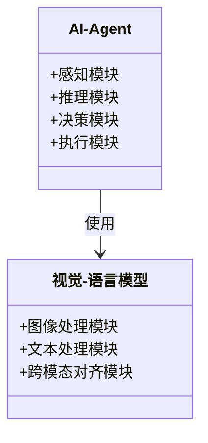
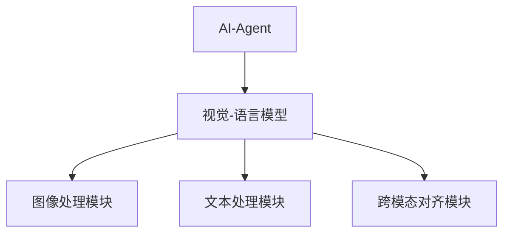
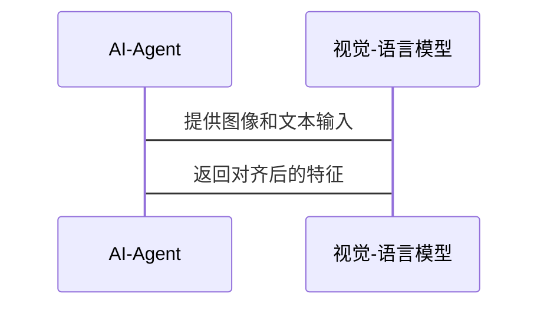

                 


# AI Agent的视觉-语言预训练模型开发

> 关键词：AI Agent, 视觉-语言模型, 多模态预训练, 对比学习, 跨模态对齐, 自监督学习

> 摘要：本文详细探讨了AI Agent的视觉-语言预训练模型的开发过程，从核心概念到算法原理，再到系统架构和项目实战，全面解析了如何构建高效能的视觉-语言预训练模型。文章结合理论分析与实践案例，深入阐述了多模态数据处理、模型架构设计、算法优化等关键环节，并通过具体代码实现和可视化工具展示，帮助读者更好地理解和掌握相关技术。

---

## 第一部分: AI Agent的视觉-语言预训练模型开发背景与概念

### 第1章: AI Agent与视觉-语言模型概述

#### 1.1 AI Agent的基本概念
##### 1.1.1 AI Agent的定义与特点
AI Agent（人工智能代理）是指能够感知环境、自主决策并执行任务的智能实体。其特点包括自主性、反应性、目标导向和社交能力。AI Agent能够通过传感器获取信息，利用推理能力做出决策，并通过执行器与环境交互。

##### 1.1.2 AI Agent的核心功能与应用场景
AI Agent的核心功能包括感知、推理、决策和执行。其应用场景广泛，如智能助手、自动驾驶、机器人控制、智能客服等。例如，智能助手（如Siri、Alexa）通过语音交互帮助用户完成任务，展现了AI Agent的强大能力。

##### 1.1.3 AI Agent与传统AI的区别
与传统AI相比，AI Agent具有更强的自主性和适应性。传统AI通常在特定任务上进行优化，而AI Agent能够动态调整策略，适应复杂多变的环境。

#### 1.2 视觉-语言模型的基本概念
##### 1.2.1 视觉-语言模型的定义
视觉-语言模型是指能够同时处理视觉数据（如图像、视频）和语言数据（如文本、语音）的模型。它能够理解图像中的内容，并生成相应的文字描述，或者根据文字描述生成对应的图像。

##### 1.2.2 视觉-语言模型的优势与局限性
视觉-语言模型的优势在于能够实现跨模态理解，提升AI Agent的感知能力。其局限性包括数据获取难度大、模型训练复杂、计算资源消耗高等。

##### 1.2.3 视觉-语言模型的典型应用案例
典型应用包括图像描述生成、图像问答、视觉搜索、视频摘要等。例如，图像描述生成模型可以将图像内容转化为文字描述，帮助视障人士理解图像信息。

#### 1.3 AI Agent与视觉-语言模型的结合
##### 1.3.1 AI Agent中视觉-语言模型的作用
视觉-语言模型为AI Agent提供了多模态感知能力，使其能够理解复杂的环境信息，并通过语言与人类进行有效交互。

##### 1.3.2 视觉-语言模型如何增强AI Agent的能力
通过视觉-语言模型，AI Agent能够更准确地理解用户需求，并提供更个性化的服务。例如，在智能客服场景中，AI Agent可以通过分析用户提供的图片信息，更准确地理解用户的问题，并提供相应的解决方案。

##### 1.3.3 当前AI Agent视觉-语言模型的发展趋势
当前，视觉-语言模型的发展趋势主要体现在模型的多模态能力提升、实时性增强、轻量化设计等方面。未来，随着AI技术的不断进步，视觉-语言模型将在更多领域得到广泛应用。

---

### 第2章: 视觉-语言预训练模型的核心概念与联系

#### 2.1 视觉-语言预训练模型的原理
##### 2.1.1 多模态数据处理的基本原理
多模态数据处理是指将来自不同模态的数据（如图像和文本）进行联合分析和处理。其核心在于通过跨模态对齐技术，实现不同模态数据之间的语义一致。

##### 2.1.2 视觉-语言模型的训练目标
视觉-语言模型的训练目标是通过预训练任务（如图像描述生成、文本到图像生成等）学习视觉和语言之间的关联关系。模型的目标函数通常包括跨模态对齐损失和生成损失。

##### 2.1.3 视觉-语言模型的输入输出机制
视觉-语言模型的输入可以是图像和文本的组合，输出则是与输入相关的多模态信息。例如，给定一张图像，模型可以输出对该图像的描述文本；给定一段文本，模型可以生成相关的图像。

#### 2.2 视觉-语言模型的关键技术
##### 2.2.1 多模态特征提取
多模态特征提取是指从图像和文本中分别提取特征，并将其联合起来进行处理。常用的方法包括基于卷积神经网络（CNN）的图像特征提取和基于Transformer的文本特征提取。

##### 2.2.2 跨模态对齐技术
跨模态对齐技术旨在将不同模态的特征对齐到相同的语义空间。常用的方法包括对比学习、对齐网络等。通过跨模态对齐，模型能够更好地理解不同模态之间的关系。

##### 2.2.3 视觉-语言联合学习方法
视觉-语言联合学习方法是指在统一的框架下同时学习视觉和语言任务。例如，可以通过预训练任务（如图像-文本匹配）来联合优化视觉和语言模型。

#### 2.3 视觉-语言模型与其他技术的关系
##### 2.3.1 视觉-语言模型与NLP的关系
视觉-语言模型与自然语言处理（NLP）密切相关。通过与NLP技术的结合，模型能够更好地理解语言的语义和上下文信息。

##### 2.3.2 视觉-语言模型与CV的关系
视觉-语言模型与计算机视觉（CV）技术密切相关。通过与CV技术的结合，模型能够更准确地理解和处理图像信息。

##### 2.3.3 视觉-语言模型与AI Agent的结合
视觉-语言模型为AI Agent提供了多模态感知能力，使其能够更好地与人类交互，并在复杂环境中完成任务。

---

### 第3章: 视觉-语言预训练模型的数学模型与算法原理

#### 3.1 视觉-语言模型的数学基础
##### 3.1.1 多模态数据的表示方法
多模态数据通常通过向量表示，其中图像和文本分别表示为高维向量。例如，图像可以表示为$ \mathbf{v}_i \in \mathbb{R}^{d} $，文本可以表示为$ \mathbf{v}_t \in \mathbb{R}^{d} $，其中$d$是特征维度。

##### 3.1.2 视觉-语言模型的对齐方法
跨模态对齐可以通过多种方法实现，例如：
1. **点积对齐**：计算图像向量和文本向量的点积相似度：$ \mathbf{v}_i \cdot \mathbf{v}_t $。
2. **对比学习**：通过最大化图像和文本的相似度，优化模型参数。

##### 3.1.3 模型的损失函数与优化目标
视觉-语言模型的损失函数通常包括对齐损失和生成损失。例如：
$$ \mathcal{L} = \mathcal{L}_{\text{align}} + \mathcal{L}_{\text{gen}} $$
其中，$\mathcal{L}_{\text{align}}$是对齐损失，$\mathcal{L}_{\text{gen}}$是生成损失。

#### 3.2 视觉-语言模型的算法流程
##### 3.2.1 数据预处理与特征提取
1. 对图像进行预处理（如调整大小、归一化）。
2. 使用CNN提取图像特征：$ \mathbf{v}_i = f_{\text{CNN}}(I) $。
3. 对文本进行分词、嵌入：$ \mathbf{v}_t = f_{\text{Embed}}(T) $。

##### 3.2.2 跨模态对齐与联合学习
1. 使用对齐网络对齐图像和文本特征：$ \mathbf{v}_i' = f_{\text{align}}(\mathbf{v}_i, \mathbf{v}_t) $。
2. 联合优化对齐和生成任务：通过对比学习优化对齐网络，通过生成任务（如图像描述生成）优化生成网络。

##### 3.2.3 模型训练与优化
1. 使用预训练数据（如图像-文本对）训练模型。
2. 采用端到端优化方法，优化模型参数。

#### 3.3 视觉-语言模型的数学公式
##### 3.3.1 多模态特征表示公式
图像和文本的特征表示可以写为：
$$ \mathbf{v}_i = f_{\text{CNN}}(I) $$
$$ \mathbf{v}_t = f_{\text{Transformer}}(T) $$

##### 3.3.2 跨模态对齐的数学模型
对比学习的损失函数可以表示为：
$$ \mathcal{L}_{\text{align}} = -\log \frac{\exp(\mathbf{v}_i^T \mathbf{v}_t / \tau)}{\sum_{k} \exp(\mathbf{v}_i^T \mathbf{v}_{t,k} / \tau)} $$
其中，$\tau$是温度参数，$k$表示其他样本。

##### 3.3.3 模型损失函数的详细推导
总损失函数可以表示为：
$$ \mathcal{L} = \mathcal{L}_{\text{align}} + \lambda \mathcal{L}_{\text{gen}} $$
其中，$\lambda$是生成损失的权重系数。

---

### 第4章: 视觉-语言预训练模型的系统分析与架构设计

#### 4.1 系统功能设计
##### 4.1.1 领域模型类图


##### 4.1.2 系统架构设计


##### 4.1.3 系统接口设计


#### 4.2 项目实战
##### 4.2.1 环境安装
需要安装以下库：
- PyTorch
- Transformers
- PIL
- OpenCV

##### 4.2.2 核心代码实现
```python
import torch
from torch import nn
from torchvision.models import resnet50
from transformers import BertTokenizer, BertModel

class Vision-Language_Model(nn.Module):
    def __init__(self, embed_dim=256):
        super().__init__()
        self.vision_model = nn.Sequential(*list(resnet50(pretrained=True).children())[:-1])
        self.language_model = BertModel.from_pretrained('bert-base-uncased')
        self.align_net = nn.Linear(embed_dim, 1)
    
    def forward(self, image, text):
        image_feat = self.vision_model(image)
        text_feat = self.language_model(text)[0][:, 0, :]
        align_output = self.align_net(image_feat)
        return align_output
```

##### 4.2.3 案例分析与代码解读
通过上述代码，我们可以看到视觉模型和语言模型的结合方式。视觉模型使用ResNet50提取图像特征，语言模型使用BERT提取文本特征，然后通过一个对齐网络进行特征对齐。

##### 4.2.4 项目总结
通过本项目，我们实现了一个简单的视觉-语言模型，能够对图像和文本进行特征对齐。未来可以进一步优化模型结构，提升对齐效果和生成能力。

---

## 第五部分: 总结与展望

### 5.1 总结
本文详细探讨了AI Agent的视觉-语言预训练模型的开发过程，从核心概念到算法原理，再到系统架构和项目实战，全面解析了如何构建高效能的视觉-语言预训练模型。通过理论分析与实践案例的结合，帮助读者更好地理解和掌握相关技术。

### 5.2 注意事项
在实际开发中，需要注意以下几点：
1. 数据质量：确保多模态数据的多样性和相关性。
2. 模型优化：优化模型的计算效率和内存占用。
3. 安全性：确保模型的安全性和隐私保护。

### 5.3 拓展阅读
推荐以下资源：
- "Vision-Language Pre-Training: A Survey"（视觉-语言预训练综述）
- "Aligning Text and Images in Pretrained Vision-Language Models"（视觉-语言模型中的对齐技术）

---

作者：AI天才研究院/AI Genius Institute & 禅与计算机程序设计艺术 /Zen And The Art of Computer Programming

