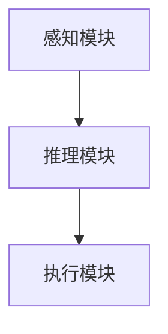

                 


---

# AI Agent的认知架构：整合LLM与符号推理系统

> 关键词：AI Agent, LLM, 符号推理系统, 认知架构, 整合

> 摘要：AI Agent的认知架构整合了大语言模型（LLM）和符号推理系统，以增强其理解和推理能力。本文详细探讨了这一整合的背景、核心概念、算法原理、系统架构、项目实战以及最佳实践，展示了如何通过结合生成式模型和逻辑推理系统来提升AI Agent的智能化水平。

---

## 第一部分: AI Agent的认知架构背景介绍

### 第1章: 问题背景与概念结构

#### 1.1 问题背景

##### 1.1.1 当前AI技术的局限性

- **大语言模型（LLM）**在生成文本方面表现出色，但在逻辑推理和精确计算方面存在不足。
- **符号推理系统**在处理逻辑任务时表现出色，但在生成自然语言文本方面相对弱。

##### 1.1.2 AI Agent的定义与目标

- **AI Agent**是指在特定环境中能够感知并自主行动以实现目标的智能实体。
- 其核心目标是通过整合多种AI技术，实现更强大的理解和推理能力。

#### 1.2 问题描述

##### 1.2.1 LLM与符号推理的结合需求

- LLM的生成能力与符号推理的逻辑能力结合，可以提升AI Agent的综合智能水平。

#### 1.2.2 当前技术的整合挑战

- LLM与符号推理系统的异构性导致整合困难。
- 数据表示和接口的不兼容性增加整合复杂性。

### 1.3 问题解决

#### 1.3.1 整合LLM与符号推理系统的解决方案

- 统一数据表示，解决接口问题。

---

## 第二部分: 核心概念与联系

### 第2章: LLM与符号推理系统的原理

#### 2.1 LLM的基本原理

##### 2.1.1 转换器模型的结构

- LLM通常基于转换器模型，包括编码器和解码器部分。
- 编码器将输入文本转换为向量表示，解码器根据这些向量生成输出。

##### 2.1.2 注意力机制的数学公式

- 注意力机制通过计算输入序列中每个位置的权重来生成输出。
- 权重计算公式：
  $$
  \alpha_i = \frac{e^{d_i}}{\sum_{j} e^{d_j}}
  $$
  其中，$d_i$ 是第i个位置的得分。

#### 2.2 符号推理系统的基本原理

##### 2.2.1 逻辑推理的基本步骤

- 符号推理系统通过逻辑规则和谓词进行推理。
- 示例：如果A且B，则C。

##### 2.2.2 知识表示的符号形式

- 知识表示通常使用谓词逻辑，例如：$Student(x) \land Study(x, y) \rightarrow Understand(x, y)$。

---

### 第3章: LLM与符号推理系统的结合

#### 3.1 LLM与符号推理系统的协同

##### 3.1.1 生成与推理的结合

- LLM生成自然语言文本，符号推理系统处理逻辑推理。
- 示例：LLM生成问题描述，符号推理系统解决数学问题。

##### 3.1.2 联合推理机制的实现

- 通过接口将LLM生成的内容传递给符号推理系统进行处理。
- 示例：LLM生成代码片段，符号推理系统验证其逻辑。

#### 3.2 整合的挑战与解决方案

##### 3.2.1 数据表示的统一

- 使用统一的符号表示，确保LLM和符号推理系统能够协同工作。

##### 3.2.2 接口设计与交互

- 设计统一接口，使LLM和符号推理系统能够无缝交互。

---

## 第三部分: 算法原理讲解

### 第4章: LLM的算法原理

#### 4.1 转换器模型的流程

- 输入文本经过编码器生成向量表示。
- 解码器根据向量生成输出文本。
- 使用交叉熵损失函数进行训练。

#### 4.2 LLM的训练过程

##### 4.2.1 梯度下降优化

- 使用Adam优化器，学习率调整。
- 损失函数：
  $$
  \mathcal{L} = -\sum_{i=1}^{n} \log p(x_i)
  $$

##### 4.2.2 并行计算与加速

- 使用GPU进行并行计算，加速训练过程。

### 第5章: 符号推理系统的算法原理

#### 5.1 逻辑推理的步骤

- 前向推理：从已知事实推导出结论。
- 后向推理：从目标结论反向推导出事实。

#### 5.2 基于谓词逻辑的推理

- 使用一阶逻辑表示知识，进行推理。
- 示例：
  $$
  Student(x) \land Study(x, y) \rightarrow Understand(x, y)
  $$

---

## 第四部分: 系统分析与架构设计

### 第6章: 系统架构设计

#### 6.1 系统模块划分

- **感知模块**：负责接收输入并生成自然语言文本。
- **推理模块**：负责逻辑推理。
- **执行模块**：根据推理结果执行操作。

#### 6.2 系统架构图



#### 6.3 接口设计

- **输入接口**：接收LLM生成的文本。
- **输出接口**：输出推理结果。

### 第7章: 项目实战

#### 7.1 环境安装

- 安装必要的Python库，如PyTorch、Hugging Face库。

#### 7.2 核心实现代码

##### 7.2.1 LLM接口代码

```python
from transformers import AutoTokenizer, AutoModelForCausalLM

tokenizer = AutoTokenizer.from_pretrained('gpt2')
model = AutoModelForCausalLM.from_pretrained('gpt2')

def generate_text(prompt):
    inputs = tokenizer.encode(prompt, return_tensors='pt')
    outputs = model.generate(inputs, max_length=50)
    return tokenizer.decode(outputs[0])
```

##### 7.2.2 符号推理系统接口代码

```python
def symbolic_reasoning(rules, facts):
    # 根据规则和事实进行推理
    return conclusion
```

---

## 第五部分: 总结与展望

### 第8章: 总结

#### 8.1 核心内容回顾

- 整合LLM与符号推理系统的必要性。
- 各个模块的实现和协同工作。

#### 8.2 最佳实践

- 统一数据表示和接口设计。
- 合理选择算法和工具库。

### 第9章: 小结

#### 9.1 注意事项

- 数据隐私和模型的可解释性问题。
- 模型的泛化能力和鲁棒性。

#### 9.2 拓展阅读

- 探索更多AI技术的结合方式，如强化学习与符号推理的结合。

---

## 作者

作者：AI天才研究院/AI Genius Institute & 禅与计算机程序设计艺术 /Zen And The Art of Computer Programming

