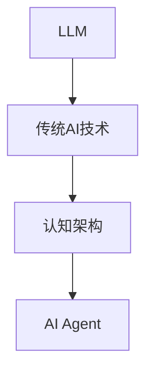
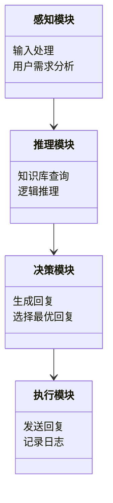

                 


# AI Agent的认知架构：融合LLM与传统AI技术

> 关键词：AI Agent，认知架构，LLM，传统AI技术，算法原理，系统架构，项目实战

> 摘要：本文详细探讨了AI Agent的认知架构，重点分析了如何将大语言模型（LLM）与传统AI技术相结合，构建更强大的AI代理。文章从基本概念、核心原理、算法实现、系统架构到项目实战，全面解析了这一融合过程。

---

# 第1章: AI Agent的认知架构概述

## 1.1 AI Agent的基本概念

### 1.1.1 什么是AI Agent

AI Agent（人工智能代理）是指具备感知环境、自主决策和执行任务能力的智能体。它可以理解并响应用户的请求，执行复杂任务，如自动驾驶、智能客服和机器人控制等。AI Agent的核心特点包括自主性、反应性、目标导向和学习能力。

### 1.1.2 AI Agent的特点

1. **自主性**：AI Agent能够独立运作，无需外部干预。
2. **反应性**：能够实时感知环境变化并做出反应。
3. **目标导向**：通过设定目标来驱动行为，优化决策。
4. **学习能力**：通过数据和经验不断优化自身性能。

### 1.1.3 AI Agent的类型

1. **简单反射型Agent**：基于规则的简单反应，适用于低复杂度任务。
2. **基于模型的反应型Agent**：利用环境模型进行决策，适合动态环境。
3. **目标驱动型Agent**：以实现特定目标为导向，具备规划能力。
4. **效用驱动型Agent**：通过最大化效用函数来优化决策。

## 1.2 认知架构的基本原理

### 1.2.1 认知架构的定义

认知架构是AI Agent的核心部分，负责处理信息、推理和决策。它通常包括感知层、知识层、推理层和决策层。

### 1.2.2 AI Agent的认知架构层次

1. **感知层**：接收环境输入，如传感器数据和用户指令。
2. **知识层**：存储和处理知识，如知识图谱和规则库。
3. **推理层**：利用逻辑推理或概率推理，推导出可能的行动。
4. **决策层**：基于推理结果，选择最优行动，并通过执行层执行。

### 1.2.3 LLM与传统AI技术的融合

大语言模型（LLM）如GPT具备强大的自然语言处理能力，而传统AI技术如专家系统在特定领域表现优异。通过结合两者，AI Agent可以实现更高效的自然语言理解和复杂的逻辑推理。

---

# 第2章: AI Agent认知架构的核心概念与联系

## 2.1 认知架构的原理

### 2.1.1 知识表示

知识表示是认知架构的关键，常用知识图谱或符号逻辑表示。例如，知识图谱中的节点代表实体，边表示关系。

### 2.1.2 逻辑推理

逻辑推理包括规则推理和概率推理。规则推理基于专家系统，概率推理使用贝叶斯网络。

### 2.1.3 行为决策

行为决策依赖于多目标优化或强化学习，通过评估多个目标的权重，选择最优行动。

## 2.2 LLM与传统AI技术的对比

### 2.2.1 概念属性对比表

| 属性        | LLM                      | 传统AI技术              |
|-------------|--------------------------|-------------------------|
| 处理能力     | 强大的自然语言处理       | 专注于特定任务或领域     |
| 可解释性     | 较低                     | 较高                    |
| 学习方式     | 基于大量数据的无监督学习   | 基于规则或有监督学习      |
| 适应性       | 高，适用于多种任务       | 低，适用于固定场景        |

### 2.2.2 实体关系图



---

# 第3章: LLM的算法原理

## 3.1 LLM的训练过程

### 3.1.1 前向传播

输入文本通过词嵌入层、自注意力机制和前馈网络，生成输出概率分布。

### 3.1.2 损失函数

交叉熵损失函数用于衡量预测概率与真实标签的差异。

### 3.1.3 反向传播

使用梯度下降优化模型参数，降低损失函数值。

## 3.2 LLM的数学模型

### 3.2.1 注意力机制公式

$$
\text{Attention}(Q, K, V) = \text{softmax}\left(\frac{QK^T}{\sqrt{d_k}}\right)V
$$

### 3.2.2 前馈网络公式

$$
f(x) = \text{ReLU}(Wx + b)
$$

---

# 第4章: 强化学习在AI Agent中的应用

## 4.1 强化学习的基本原理

### 4.1.1 马尔可夫决策过程（MDP）

定义状态、动作、奖励和转移概率，通过最大化累积奖励来优化策略。

### 4.1.2 Q-learning算法

使用Q表记录状态-动作对的期望奖励，通过经验回放和目标网络更新Q值。

---

# 第5章: 系统分析与架构设计

## 5.1 问题场景介绍

以智能客服系统为例，AI Agent需要处理用户咨询、问题解答和任务执行。

## 5.2 系统功能设计

### 5.2.1 功能模块

- **感知模块**：接收用户输入。
- **推理模块**：分析用户需求。
- **决策模块**：选择最优回复。
- **执行模块**：生成并发送回复。

### 5.2.2 领域模型图



---

# 第6章: 项目实战

## 6.1 环境安装

安装必要的库：

```bash
pip install tensorflow numpy
```

## 6.2 核心代码实现

### 6.2.1 感知模块

```python
class PerceiveModule:
    def __init__(self):
        self.model = load_model('perceive_model.h5')
```

### 6.2.2 推理模块

```python
class ReasoningModule:
    def __init__(self):
        self.knowledge_base = load KnowledgeBase()
```

## 6.3 案例分析

分析智能客服系统的实际运行，优化模型参数，提高准确率。

---

# 第7章: 总结与展望

## 7.1 总结

本文详细探讨了AI Agent的认知架构，分析了LLM与传统AI技术的融合方式，展示了系统的实现过程。

## 7.2 展望

未来研究方向包括更高效的知识表示方法、更强大的推理算法和更智能的决策机制。

## 7.3 最佳实践 tips

- 数据预处理是关键。
- 模型调参需谨慎。
- 注重系统的可解释性。

---

作者：AI天才研究院/AI Genius Institute & 禅与计算机程序设计艺术 /Zen And The Art of Computer Programming

---

这篇技术博客文章系统地介绍了AI Agent的认知架构，详细分析了融合LLM与传统AI技术的实现方法，为读者提供了理论与实践的全面指导。

