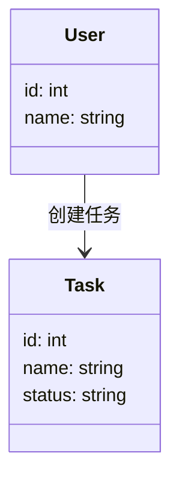
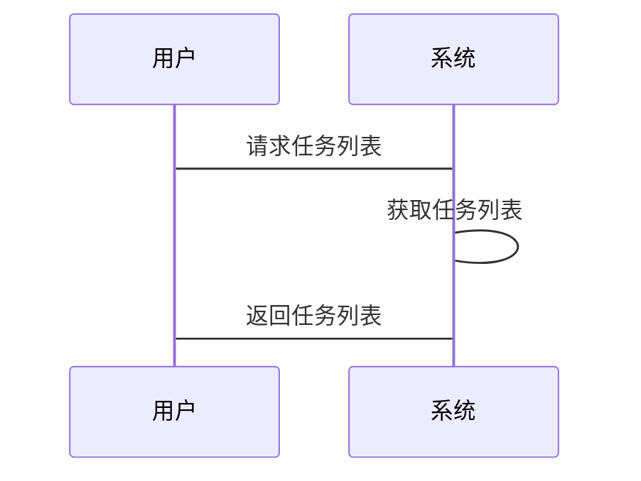

                 


# AI Agent的认知计算模型：模拟人类思维过程

**关键词**：AI Agent，认知模型，知识表示，推理算法，决策机制，认知计算

**摘要**：  
本文深入探讨AI Agent的认知计算模型，分析其如何模拟人类思维过程。从认知模型的基本概念到具体实现的算法原理，再到实际项目中的应用，全面解析AI Agent的认知计算模型的结构、原理和实现方法。通过详细的理论分析和实际案例，帮助读者理解如何构建一个能够模拟人类思维的AI Agent。

---

# 第1章: AI Agent的基本概念与认知模型

## 1.1 AI Agent的定义与特点

### 1.1.1 AI Agent的定义  
AI Agent（人工智能代理）是一种智能系统，能够感知环境、自主决策并执行任务。它具备主动性、反应性、目标导向和情境适应性等特点。  

### 1.1.2 AI Agent的核心特点  
- **主动性**：AI Agent能够主动采取行动，而非被动响应。  
- **反应性**：能够实时感知环境变化并做出反应。  
- **目标导向**：具备明确的目标，能够在复杂环境中找到最优解决方案。  
- **情境适应性**：能够根据环境变化调整自身行为和决策策略。  

### 1.1.3 AI Agent与传统AI的区别  
AI Agent与传统AI的区别在于其自主性和目标导向性。传统AI通常依赖于预定义规则或数据驱动的模式识别，而AI Agent具备更强的自主性和适应性，能够根据环境动态调整行为。

---

## 1.2 认知模型的基本概念

### 1.2.1 认知模型的定义  
认知模型是对人类认知过程的模拟，包括感知、记忆、推理、决策和行动等环节。  

### 1.2.2 认知模型的核心要素  
- **感知**：通过传感器或数据输入获取环境信息。  
- **知识表示**：将感知到的信息转化为结构化的知识表示。  
- **推理**：基于知识表示进行逻辑推理或概率推理。  
- **决策**：根据推理结果制定行动方案。  
- **执行**：将决策结果转化为实际行动。  

### 1.2.3 认知模型的应用场景  
认知模型广泛应用于智能助手、自动驾驶、智能客服、机器人控制等领域，能够帮助AI Agent更好地理解和适应复杂环境。

---

## 1.3 本章小结  
本章介绍了AI Agent的基本概念及其与传统AI的区别，详细阐述了认知模型的核心要素和应用场景，为后续章节的分析奠定了基础。

---

# 第2章: 认知模型的结构与组成

## 2.1 认知模型的组成要素

### 2.1.1 感知与输入处理  
AI Agent通过传感器或数据输入接口获取环境信息，例如图像、文本、语音等。  

### 2.1.2 知识表示  
知识表示是认知模型的核心，常用符号逻辑、语义网络或知识图谱等方式表示。  

### 2.1.3 推理与决策  
推理是基于知识表示进行逻辑推理或概率推理的过程，决策是根据推理结果制定行动方案。  

### 2.1.4 输出与执行  
AI Agent根据决策结果执行具体动作，例如发送指令、输出结果等。  

---

## 2.2 认知模型的层次结构

### 2.2.1 感知层  
感知层负责获取环境信息，例如图像识别、语音识别等。  

### 2.2.2 知识层  
知识层负责知识的存储和管理，例如知识图谱或数据库。  

### 2.2.3 推理层  
推理层负责基于知识进行逻辑推理或概率推理，例如基于符号逻辑的推理或基于神经网络的推理。  

### 2.2.4 执行层  
执行层负责将推理结果转化为具体行动，例如发送指令或执行任务。  

---

## 2.3 本章小结  
本章详细分析了认知模型的组成要素及其层次结构，为后续章节的算法实现奠定了基础。

---

# 第3章: AI Agent认知模型的核心原理

## 3.1 知识表示的原理与方法

### 3.1.1 符号表示法  
符号表示法通过符号和规则表示知识，例如用谓词逻辑表示“如果A，则B”。  

### 3.1.2 语义网络表示法  
语义网络表示法通过节点和边表示知识的语义关系，例如“猫是动物的一种”。  

### 3.1.3 知识图谱表示法  
知识图谱表示法通过图结构表示知识，例如使用知识图谱表示“猫属于动物类别”。  

---

## 3.2 推理机制的原理与算法

### 3.2.1 基于符号逻辑的推理  
基于符号逻辑的推理通过谓词逻辑和规则进行推理，例如“如果A且B，则C”。  

### 3.2.2 基于概率的推理  
基于概率的推理通过概率论进行推理，例如贝叶斯网络推理。  

### 3.2.3 基于神经网络的推理  
基于神经网络的推理通过深度学习模型进行推理，例如基于Transformer的推理。  

---

## 3.3 决策机制的原理与算法

### 3.3.1 基于规则的决策  
基于规则的决策通过预定义的规则进行决策，例如“如果天气晴朗，则建议穿短袖”。  

### 3.3.2 基于强化学习的决策  
基于强化学习的决策通过奖励机制进行决策优化，例如自动驾驶中的路径规划。  

### 3.3.3 基于模糊逻辑的决策  
基于模糊逻辑的决策通过模糊规则进行决策，例如处理不确定性较高的场景。  

---

## 3.4 本章小结  
本章详细分析了知识表示和推理的核心原理，并介绍了几种常见的决策机制，为后续章节的算法实现提供了理论基础。

---

# 第4章: 知识表示与推理算法

## 4.1 知识表示的算法实现

### 4.1.1 符号表示法的实现  
符号表示法的实现通常使用谓词逻辑和规则引擎，例如Prolog语言。  

### 4.1.2 语义网络表示法的实现  
语义网络表示法的实现通常使用图数据库，例如Neo4j。  

### 4.1.3 知识图谱表示法的实现  
知识图谱表示法的实现通常使用知识图谱构建工具，例如Ubergraph。  

---

## 4.2 推理算法的实现

### 4.2.1 基于符号逻辑的推理算法  
基于符号逻辑的推理算法通常使用规则引擎或逻辑编程语言实现，例如Prolog。  

### 4.2.2 基于概率的推理算法  
基于概率的推理算法通常使用贝叶斯网络或马尔可夫链实现，例如朴素贝叶斯分类器。  

### 4.2.3 基于神经网络的推理算法  
基于神经网络的推理算法通常使用深度学习模型实现，例如Transformer模型。  

---

## 4.3 本章小结  
本章详细分析了知识表示与推理算法的实现方法，为后续章节的系统设计提供了技术支撑。

---

# 第5章: 决策算法的实现

## 5.1 基于规则的决策算法

### 5.1.1 规则表示方法  
基于规则的决策算法通常使用条件语句或规则引擎表示，例如“如果A，则B”。  

### 5.1.2 规则匹配与执行  
基于规则的决策算法通过规则匹配引擎执行决策，例如Drools规则引擎。  

---

## 5.2 基于强化学习的决策算法

### 5.2.1 强化学习的基本原理  
强化学习通过奖励机制优化决策策略，例如Q-Learning算法。  

### 5.2.2 强化学习的实现步骤  
1. 初始化策略；  
2. 与环境交互，获取奖励；  
3. 更新策略；  
4. 重复直到收敛。  

---

## 5.3 本章小结  
本章详细分析了基于规则和强化学习的决策算法的实现方法，为后续章节的系统设计提供了技术支撑。

---

# 第6章: AI Agent认知模型的系统设计

## 6.1 系统功能设计

### 6.1.1 领域模型  
领域模型通常使用类图表示，例如：



### 6.1.2 系统架构设计  
系统架构设计通常使用分层架构，例如：


### 6.1.3 系统接口设计  
系统接口设计通常使用RESTful API，例如：

- GET /tasks  
- POST /tasks  
- PUT /tasks/{id}  
- DELETE /tasks/{id}  

### 6.1.4 系统交互设计  
系统交互设计通常使用序列图，例如：



---

## 6.2 系统实现与优化

### 6.2.1 环境安装  
安装Python、Java等开发环境，以及相关依赖库，例如TensorFlow、PyTorch。  

### 6.2.2 核心实现  
实现知识表示、推理和决策的核心算法，例如符号逻辑推理、强化学习决策。  

### 6.2.3 代码实现  
以下是Python实现的符号逻辑推理示例代码：

```python
def infer(fact1, fact2):
    if fact1 and fact2:
        return True
    else:
        return False

fact1 = True
fact2 = True
result = infer(fact1, fact2)
print(result)
```

---

## 6.3 本章小结  
本章详细分析了AI Agent认知模型的系统设计与实现，为后续章节的项目实战奠定了基础。

---

# 第7章: 项目实战：AI Agent的认知模型实现

## 7.1 项目背景与目标  
本项目旨在实现一个简单的AI Agent认知模型，能够进行基本的知识表示、推理和决策。  

## 7.2 项目实现

### 7.2.1 环境安装  
安装Python、TensorFlow、Keras等依赖库。  

### 7.2.2 核心实现  
实现知识表示、推理和决策的核心算法，例如符号逻辑推理和强化学习决策。  

### 7.2.3 代码实现  
以下是Python实现的强化学习决策示例代码：

```python
import numpy as np

# 状态空间
states = [0, 1, 2]
# 行动空间
actions = [0, 1]
# 奖励函数
rewards = {
    (0, 0): 0,
    (0, 1): -1,
    (1, 0): -1,
    (1, 1): 1,
    (2, 0): 0,
    (2, 1): 0
}

# Q-Learning算法实现
class QLearning:
    def __init__(self):
        self.q_table = np.zeros((3, 2))

    def choose_action(self, state):
        if np.random.uniform() < 0.1:
            return np.random.choice(actions)
        else:
            return np.argmax(self.q_table[state])

    def update_q(self, state, action, reward):
        self.q_table[state][action] += 0.1 * (reward + 0.9 * np.max(self.q_table[state]) - self.q_table[state][action])

# 初始化
agent = QLearning()

# 训练过程
for _ in range(1000):
    state = np.random.choice(states)
    action = agent.choose_action(state)
    reward = rewards[(state, action)]
    agent.update_q(state, action, reward)

# 测试
test_state = 2
test_action = agent.choose_action(test_state)
print(f"测试状态：{test_state}, 测试动作：{test_action}")
```

## 7.3 项目小结  
本章通过实际项目展示了AI Agent认知模型的实现过程，帮助读者更好地理解和掌握相关技术。

---

# 第8章: 总结与展望

## 8.1 本章总结  
本文详细探讨了AI Agent的认知计算模型，分析了其如何模拟人类思维过程，从理论到实践全面解析了认知模型的结构、原理和实现方法。

## 8.2 未来展望  
未来，AI Agent的认知计算模型将在更多领域得到应用，例如更复杂的决策任务和多智能体协作。同时，如何结合符号逻辑和神经网络，进一步提升认知模型的性能，将是研究的重点方向。

---

**作者：AI天才研究院/AI Genius Institute & 禅与计算机程序设计艺术 /Zen And The Art of Computer Programming**

