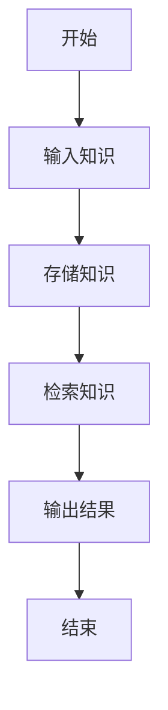
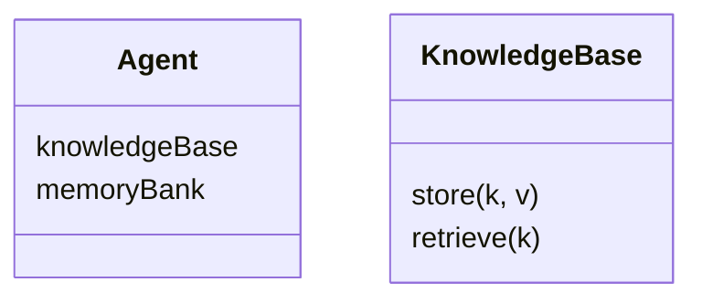
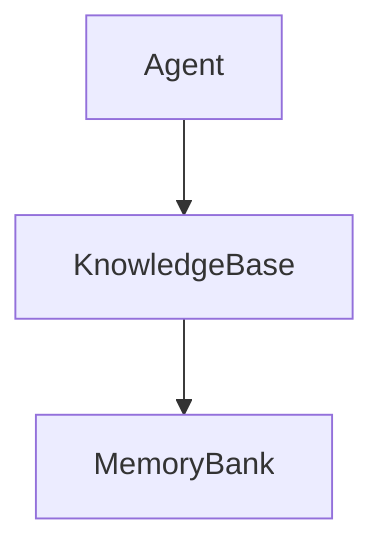

                 


# AI Agent的记忆增强网络：长期知识存储与检索

> 关键词：AI Agent，记忆增强网络，长期知识存储，知识检索，知识图谱，神经网络，数据存储与检索

> 摘要：本文深入探讨AI Agent的记忆增强网络在长期知识存储与检索中的应用。从基本概念到核心算法，从系统设计到项目实战，全面解析记忆增强网络的原理与实现。通过实际案例分析，展示如何构建高效的长期知识存储与检索系统。

---

## 第一部分: AI Agent的记忆增强网络基础

### 第1章: AI Agent与记忆增强网络概述

#### 1.1 问题背景与挑战

##### 1.1.1 AI Agent的定义与应用领域
AI Agent（人工智能代理）是指能够感知环境、自主决策并执行任务的智能实体。它广泛应用于自动驾驶、智能助手、推荐系统、机器人控制等领域。AI Agent的核心能力在于其能够通过感知和学习，适应复杂环境并完成任务。

##### 1.1.2 长期知识存储与检索的重要性
在动态和复杂的环境中，AI Agent需要处理大量的信息，并能够快速检索和应用这些知识。长期知识存储与检索是AI Agent实现智能决策的关键技术。传统的方法在存储和检索效率、准确性方面存在局限性，尤其是在处理大规模、异构的知识时。

##### 1.1.3 当前技术的局限性与问题描述
现有的知识存储与检索技术主要依赖传统的数据库或知识图谱，但在动态更新、实时检索和复杂语义理解方面存在不足。AI Agent需要一种更高效、更智能的记忆机制，能够支持快速学习、推理和决策。

#### 1.2 记忆增强网络的核心概念

##### 1.2.1 记忆增强网络的定义
记忆增强网络（Memory Augmented Neural Network，MANN）是一种结合了神经网络和外部存储结构的深度学习模型。它通过在神经网络之外引入可寻址的记忆存储，增强了模型的长期记忆能力。

##### 1.2.2 记忆增强网络的核心要素
- **记忆存储**：外部存储结构，用于存储知识片段。
- **神经网络**：用于处理输入并生成查询或命令，以访问或更新存储。
- **寻址机制**：用于定位存储中的特定知识片段。

##### 1.2.3 网络结构与功能特点
记忆增强网络结合了神经网络的处理能力和外部存储的灵活性，能够实现知识的动态存储和高效检索。

#### 1.3 记忆增强网络的边界与外延

##### 1.3.1 记忆增强网络的适用场景
适用于需要长期记忆和动态更新的场景，如对话系统、推荐系统、自动驾驶等。

##### 1.3.2 与其他记忆机制的对比
与其他记忆机制（如注意力机制、记忆网络）相比，记忆增强网络具有更强的存储和检索能力。

##### 1.3.3 网络设计的边界条件
包括存储容量、查询效率、存储一致性等。

#### 1.4 本章小结
本章介绍了AI Agent和记忆增强网络的基本概念，分析了长期知识存储与检索的重要性，以及记忆增强网络的核心要素和特点。

---

## 第2章: 记忆增强网络的核心概念与联系

### 2.1 核心概念原理

#### 2.1.1 知识存储的基本原理
记忆增强网络通过外部存储结构存储知识片段，每个片段包含键和值，键用于检索，值用于存储内容。

#### 2.1.2 知识检索的机制分析
通过查询机制，生成查询向量，匹配存储中的键，实现知识检索。

#### 2.1.3 网络结构的优化策略
通过优化存储结构和查询机制，提高存储和检索效率。

### 2.2 核心概念属性特征对比表

| 对比项 | 内存网络 | 注意力机制 | 记忆增强网络 |
|--------|----------|------------|--------------|
| 储存方式 | 基于向量 | 基于权重 | 基于键值对 |
| 检索效率 | 低 | 中 | 高 |
| 动态更新 | 不能 | 可以 | 可以 |

### 2.3 ER实体关系图
```mermaid
er
actor(Agent, MemoryBank)
```

### 2.4 本章小结
本章详细解释了记忆增强网络的核心概念和工作原理，通过对比分析和ER图展示了其与其它记忆机制的区别和联系。

---

## 第3章: 记忆增强网络的算法原理

### 3.1 算法概述

#### 3.1.1 算法的基本思想
通过神经网络生成查询向量，访问外部存储中的知识片段，实现知识的存储和检索。

#### 3.1.2 算法的主要步骤
1. 输入处理：将输入转换为查询向量。
2. 存储访问：通过查询向量访问存储，获取知识片段。
3. 知识应用：将知识片段应用于任务。

### 3.2 算法流程图


### 3.3 Python实现代码

```python
class MemoryBank:
    def __init__(self):
        self.storage = {}

    def store(self, key, value):
        self.storage[key] = value

    def retrieve(self, key):
        return self.storage.get(key, None)
```

### 3.4 数学模型与公式

#### 3.4.1 知识存储的数学模型
$$ storage = \{ (k, v) | k \in K, v \in V \} $$

#### 3.4.2 知识检索的数学模型
$$ retrieval(k) = v \text{ 如果 } k \in storage \text{ 否则 } None $$

### 3.5 本章小结
本章详细讲解了记忆增强网络的算法原理，通过流程图和代码示例展示了其实现过程。

---

## 第4章: 系统分析与架构设计方案

### 4.1 问题场景介绍

#### 4.1.1 系统目标
构建一个高效的长期知识存储与检索系统，支持动态更新和实时检索。

#### 4.1.2 使用场景
应用于对话系统、推荐系统、智能助手等领域。

#### 4.1.3 用户需求
用户需要快速检索知识，支持动态更新和异构数据存储。

### 4.2 系统功能设计

#### 4.2.1 领域模型


### 4.3 系统架构设计



### 4.4 接口设计

#### 4.4.1 存储接口
```python
def store(key, value):
    # 实现存储逻辑
```

#### 4.4.2 检索接口
```python
def retrieve(key):
    # 实现检索逻辑
```

### 4.5 本章小结
本章通过系统分析与架构设计，展示了如何构建一个高效的长期知识存储与检索系统。

---

## 第5章: 项目实战

### 5.1 环境安装

#### 5.1.1 安装Python
```bash
python --version
```

#### 5.1.2 安装依赖库
```bash
pip install numpy
pip install matplotlib
```

### 5.2 系统核心实现源代码

#### 5.2.1 存储模块实现
```python
class MemoryBank:
    def __init__(self):
        self.storage = {}

    def store(self, key, value):
        self.storage[key] = value

    def retrieve(self, key):
        return self.storage.get(key, None)
```

#### 5.2.2 神经网络实现
```python
import numpy as np

class NeuralNetwork:
    def __init__(self, input_size, output_size):
        self.weights = np.random.randn(input_size, output_size)
        self.bias = np.random.randn(output_size)

    def forward(self, x):
        return np.dot(x, self.weights) + self.bias
```

### 5.3 代码应用解读与分析

#### 5.3.1 存储模块的应用
通过`MemoryBank`类实现知识的存储和检索。

#### 5.3.2 神经网络的应用
通过神经网络生成查询向量，实现知识的动态更新。

### 5.4 案例分析和详细讲解剖析

#### 5.4.1 案例背景
构建一个智能助手，支持用户查询历史对话记录。

#### 5.4.2 实现步骤
1. 用户输入查询请求。
2. 神经网络生成查询向量。
3. 记忆增强网络检索相关知识片段。
4. 返回结果。

### 5.5 项目小结
本章通过项目实战，展示了记忆增强网络的实际应用，详细讲解了实现过程和注意事项。

---

## 第6章: 总结与展望

### 6.1 最佳实践 tips

#### 6.1.1 设计原则
- 采用高效的存储结构。
- 定期更新存储内容。
- 优化查询算法。

#### 6.1.2 技术选型建议
- 使用高效的数据库。
- 采用分布式存储。
- 结合神经网络优化查询效率。

### 6.2 小结
本文系统地介绍了AI Agent的记忆增强网络的原理与实现，通过理论分析和项目实战，展示了其在长期知识存储与检索中的应用。

### 6.3 注意事项
- 确保存储的安全性。
- 优化查询算法。
- 定期维护存储内容。

### 6.4 拓展阅读
- 《Memory Augmented Neural Networks》
- 《神经网络与深度学习》

---

## 作者：AI天才研究院/AI Genius Institute & 禅与计算机程序设计艺术 /Zen And The Art of Computer Programming

