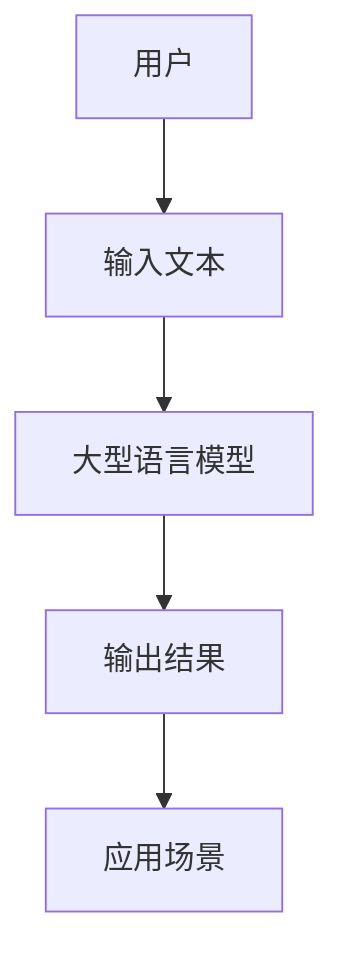
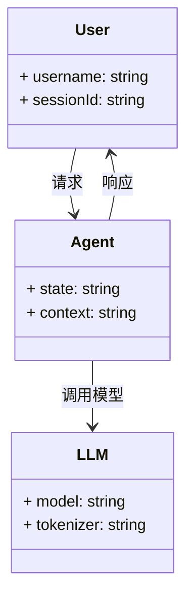
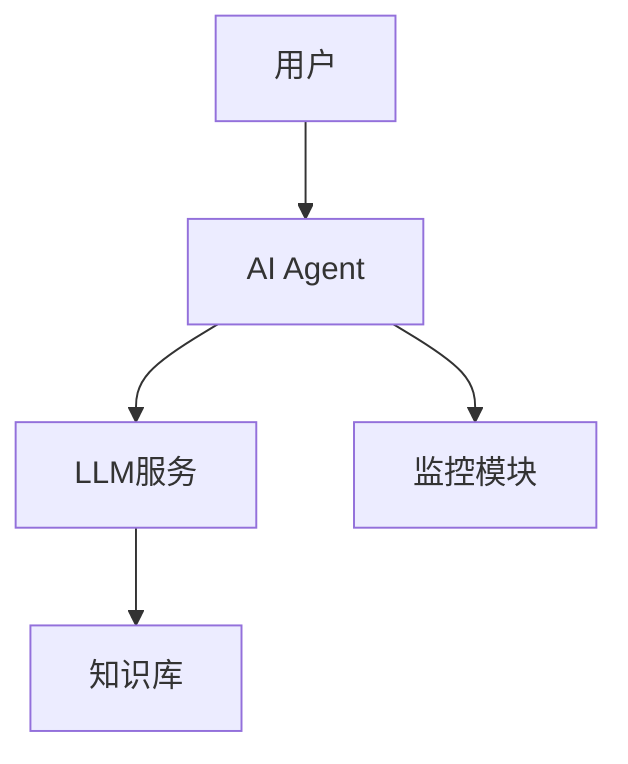
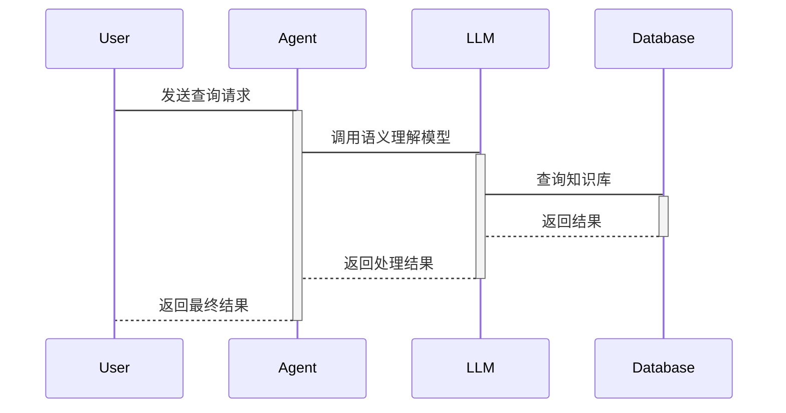

                 


# AI Agent的语义理解：提升LLM的深层文本分析

> 关键词：AI Agent，语义理解，LLM，大型语言模型，文本分析，深度学习，自然语言处理

> 摘要：本文深入探讨AI Agent的语义理解能力，分析其在提升大型语言模型（LLM）深层文本分析中的重要作用。通过详细阐述语义理解的核心原理、算法优化策略、系统架构设计以及实际应用场景，本文旨在为读者提供一套系统化的方法论，帮助他们更好地理解和应用AI Agent的语义理解技术。文章结合理论与实践，从背景分析到系统实现，全面解析提升LLM语义理解能力的关键要素。

---

## 第一部分: AI Agent语义理解基础

### 第1章: AI Agent与语义理解概述

#### 1.1 AI Agent的基本概念

##### 1.1.1 什么是AI Agent
AI Agent（人工智能代理）是指能够感知环境并采取行动以实现目标的智能实体。它通过传感器获取信息，利用计算能力进行决策，并通过执行器与环境交互。AI Agent可以是软件程序、机器人或其他智能系统。

##### 1.1.2 AI Agent的核心特征
- **自主性**：能够独立决策和行动。
- **反应性**：能够实时感知环境并做出反应。
- **目标导向**：所有行动都围绕特定目标展开。
- **社会能力**：能够与其他AI Agent或人类进行交互。

##### 1.1.3 AI Agent的应用场景
- 智能助手（如Siri、Alexa）
- 自动驾驶系统
- 智能客服
- 金融交易机器人

#### 1.2 语义理解的基本概念

##### 1.2.1 什么是语义理解
语义理解是指计算机对自然语言文本的深层含义进行解析的能力。它不仅仅是对文本表面意思的识别，还包括对上下文、意图和情感的理解。

##### 1.2.2 语义理解的关键技术
- **自然语言处理（NLP）**：包括分词、语法分析、实体识别等基础技术。
- **深度学习模型**：如Transformer、BERT、GPT等。
- **上下文理解**：基于上下文信息进行语义推理。

##### 1.2.3 语义理解的应用领域
- 智能问答系统
- 文本摘要
- 情感分析
- 机器翻译

#### 1.3 AI Agent语义理解的背景与意义

##### 1.3.1 当前AI Agent的发展现状
AI Agent正在从简单的规则驱动向复杂的深度学习驱动转变，尤其是在自然语言处理领域取得了显著进展。

##### 1.3.2 语义理解在AI Agent中的作用
语义理解是AI Agent实现复杂任务的核心能力，例如对话生成、意图识别和多轮交互。

##### 1.3.3 提升语义理解能力的重要性
提升语义理解能力可以增强AI Agent的智能化水平，使其能够更好地与人类交互并完成复杂任务。

---

### 第2章: 问题背景与目标

#### 2.1 问题背景分析

##### 2.1.1 当前AI Agent语义理解的痛点
- **语义理解的准确性不足**：现有模型在复杂语境下容易出现理解偏差。
- **上下文依赖性**：语义理解需要依赖上下文信息，但现有模型在处理动态上下文时存在挑战。
- **多语言支持**：当前语义理解模型主要针对单一语言优化，多语言支持能力较弱。

##### 2.1.2 语义理解在LLM中的挑战
- **计算资源消耗**：深度语义理解需要大量计算资源。
- **数据质量**：高质量标注数据的获取成本较高。
- **模型泛化能力**：模型在不同领域和场景中的泛化能力有限。

##### 2.1.3 提升语义理解能力的必要性
提升语义理解能力可以增强AI Agent的智能化水平，使其能够更好地服务于人类。

#### 2.2 问题描述与解决思路

##### 2.2.1 语义理解的具体问题描述
如何在复杂语境下准确理解用户意图，并实现高效的语义推理。

##### 2.2.2 提升语义理解能力的解决思路
- **优化模型结构**：采用更先进的深度学习模型，如多层Transformer架构。
- **增强上下文理解**：引入记忆机制和注意力机制。
- **多模态融合**：结合视觉、听觉等多模态信息，提升语义理解的准确性。

##### 2.2.3 边界与外延分析
语义理解的边界在于模型的计算能力，而外延则涉及多语言、多模态和跨领域的应用。

#### 2.3 核心概念与目标

##### 2.3.1 核心概念的定义与属性
- **语义理解**：基于上下文的自然语言文本深层含义解析。
- **LLM**：大型语言模型，具有强大的文本生成和理解能力。

##### 2.3.2 核心概念之间的关系
语义理解是LLM的核心能力，LLM通过语义理解实现与用户的交互。

##### 2.3.3 本章小结
本章通过分析AI Agent语义理解的背景、挑战和目标，为后续章节的深入探讨奠定了基础。

---

### 第3章: 核心概念与联系

#### 3.1 语义理解的核心原理

##### 3.1.1 语义理解的原理概述
语义理解基于深度学习模型，通过多层特征提取和语义推理，实现对文本的深层理解。

##### 3.1.2 基于LLM的语义理解模型
- **BERT**：基于Transformer的双向编码器
- **GPT**：生成式预训练模型
- **DeBERTa**：结合了BERT和GPT的优势

##### 3.1.3 模型的输入输出关系
输入为自然语言文本，输出为语义表示或生成文本。

#### 3.2 核心概念的属性对比

##### 3.2.1 不同模型的性能对比
| 模型 | 参数量 | 上下游任务表现 | 适用场景 |
|------|--------|----------------|-----------|
| BERT | 中等 | 优秀 | 文本理解 |
| GPT  | 大 | 优秀 | 文本生成 |
| DeBERTa | 大 | 优秀 | 综合任务 |

##### 3.2.2 模型参数与效果的关系
参数越多，模型的表达能力越强，但计算资源消耗也越大。

##### 3.2.3 训练数据对模型的影响
高质量的训练数据可以显著提升模型的语义理解能力。

#### 3.3 实体关系图



---

### 第4章: 算法原理与数学模型

#### 4.1 算法原理

##### 4.1.1 LLM的训练过程
- **预训练**：使用大规模数据进行无监督学习。
- **微调**：针对特定任务进行有监督优化。

##### 4.1.2 语义理解的优化策略
- **注意力机制**：聚焦于重要文本片段。
- **位置编码**：考虑文本顺序信息。

##### 4.1.3 基于上下文的语义分析
通过多层Transformer结构，模型可以逐步提取上下文信息。

#### 4.2 数学模型

##### 4.2.1 损失函数
$$ \text{损失函数} = -\sum_{i=1}^{n} \log P(y_i|x_i) $$

##### 4.2.2 优化器
$$ \text{Adam} = \text{Adam}( \eta, \beta_1, \beta_2, \epsilon ) $$

##### 4.2.3 生成过程
$$ P(y|x) = \text{softmax}(QK^T/V) $$

---

### 第5章: 系统分析与架构设计

#### 5.1 问题场景介绍
构建一个基于LLM的AI Agent，用于智能客服领域。

#### 5.2 系统功能设计

##### 5.2.1 领域模型设计


#### 5.3 系统架构设计

##### 5.3.1 总体架构


#### 5.4 系统接口设计
- **输入接口**：接收用户输入文本。
- **输出接口**：返回处理结果。
- **API接口**：提供给其他系统调用。

#### 5.5 系统交互流程

##### 5.5.1 序列图


---

### 第6章: 项目实战

#### 6.1 环境配置
```bash
pip install transformers torch
```

#### 6.2 系统核心实现源代码

##### 6.2.1 模型加载
```python
from transformers import AutoTokenizer, AutoModelForMaskedLM

model_name = "bert-base-uncased"
tokenizer = AutoTokenizer.from_pretrained(model_name)
model = AutoModelForMaskedLM.from_pretrained(model_name)
```

##### 6.2.2 语义理解实现
```python
def semantic_understanding(input_text):
    inputs = tokenizer(input_text, return_tensors="pt")
    outputs = model(**inputs)
    return outputs.last_hidden_state
```

##### 6.2.3 功能解读
- **输入处理**：将输入文本转换为模型可处理的格式。
- **模型调用**：使用预训练模型进行语义理解。
- **结果分析**：解析模型输出，生成最终结果。

#### 6.3 案例分析
- **输入**：用户查询“如何预约医生？”
- **输出**：生成步骤说明。

#### 6.4 实际案例分析
通过具体案例，展示AI Agent如何基于LLM实现高效的语义理解。

---

### 第7章: 总结与展望

#### 7.1 提升语义理解能力的关键点
- 模型优化
- 数据质量
- 上下文处理

#### 7.2 当前问题与未来改进方向
- **计算资源**：优化模型以降低计算成本。
- **多语言支持**：提升模型对多种语言的适应性。
- **实时性**：提高模型的实时响应能力。

#### 7.3 实际应用中的注意事项
- 数据隐私
- 模型泛化能力
- 用户体验优化

#### 7.4 拓展阅读
推荐相关领域的优秀书籍和论文。

---

### 作者：AI天才研究院/AI Genius Institute & 禅与计算机程序设计艺术/Zen And The Art of Computer Programming

