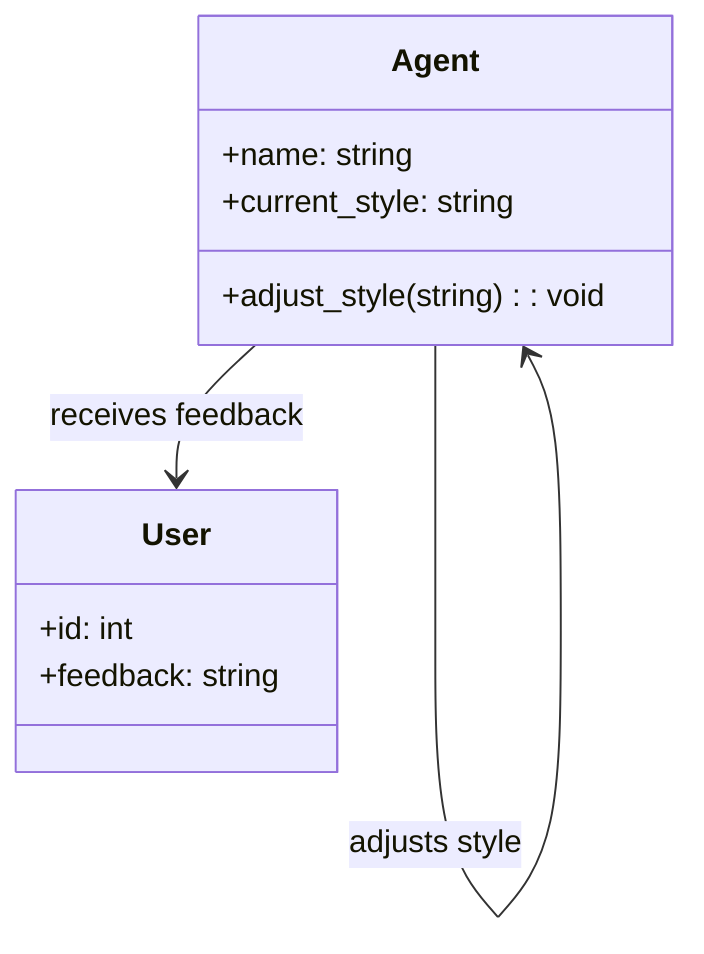
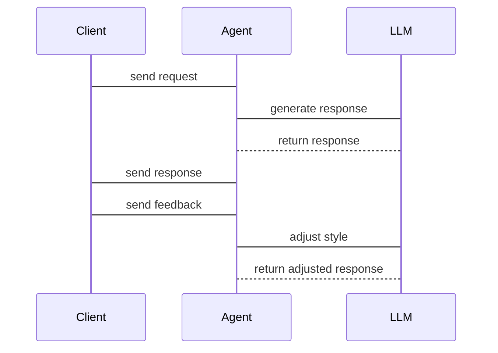

                 


# AI Agent的语言风格适配：动态调整LLM的表达方式

## 关键词：AI Agent，语言风格适配，LLM，动态调整，自然语言处理

## 摘要：本文探讨AI Agent如何根据不同场景和用户需求，动态调整其语言风格，特别是利用大型语言模型（LLM）的能力来实现这一目标。文章详细介绍了动态调整的算法原理、系统架构设计以及项目实战，为读者提供了全面的技术指导。

---

# 第一部分: AI Agent的语言风格适配背景介绍

## 第1章: 问题背景与描述

### 1.1 问题背景

#### 1.1.1 当前AI Agent的发展现状
AI Agent（智能体）正在快速发展，广泛应用于客服、教育、医疗等领域。然而，AI Agent与用户的交互效果很大程度上依赖于其语言表达的自然性和适配性。

#### 1.1.2 语言风格适配的重要性
不同的场景和用户群体需要不同的语言风格。例如，医疗场景需要正式和谨慎的语言，而社交媒体场景则需要轻松和活泼的表达。

#### 1.1.3 动态调整LLM表达方式的必要性
LLM（大型语言模型）虽然强大，但其输出的语言风格通常是固定的。为了适应不同的场景需求，需要动态调整其表达方式。

### 1.2 问题描述

#### 1.2.1 AI Agent与人类交互中的语言风格问题
AI Agent在与用户交互时，可能会因为语言风格固定而导致用户体验不佳。

#### 1.2.2 不同场景下语言风格的需求差异
不同场景下，用户对语言风格的需求存在显著差异。例如，教育场景需要清晰和易懂的表达，而娱乐场景则需要有趣和幽默的风格。

#### 1.2.3 LLM在动态调整中的挑战
LLM本身并不具备动态调整语言风格的能力，需要额外的技术手段来实现这一目标。

### 1.3 问题解决思路

#### 1.3.1 基于反馈的调整方法
通过用户反馈不断优化AI Agent的语言风格。

#### 1.3.2 语言风格适配的核心技术
结合自然语言处理技术和机器学习算法，实现语言风格的动态调整。

#### 1.3.3 AI Agent的自适应能力构建
通过持续学习和优化，使AI Agent能够根据不同的场景和用户需求，自动调整其语言风格。

### 1.4 边界与外延

#### 1.4.1 语言风格适配的适用范围
适用于需要与人类交互的AI系统，尤其是那些需要根据场景和用户需求动态调整语言风格的应用。

#### 1.4.2 动态调整的限制条件
受到计算资源、模型复杂度和用户反馈质量的限制。

#### 1.4.3 相关领域的扩展
与自然语言处理、机器学习、人机交互等领域密切相关。

---

## 第2章: 核心概念与联系

### 2.1 核心概念原理

#### 2.1.1 AI Agent的定义与功能
AI Agent是一种智能系统，能够感知环境、理解用户需求，并通过执行任务来实现目标。

#### 2.1.2 LLM的工作原理
LLM通过大规模的数据训练，生成与上下文相关的自然语言文本。

#### 2.1.3 语言风格适配的实现机制
通过分析用户需求和场景特征，调整LLM的输出，使其语言风格与当前场景匹配。

### 2.2 核心概念对比表

| 概念 | 描述 |
|------|------|
| AI Agent | 具备自主决策和交互能力的智能体 |
| LLM | 大型语言模型，用于生成自然语言文本 |
| 语言风格 | 不同场景下文本表达的风格特征 |

### 2.3 ER实体关系图

```mermaid
er
  actor(Agent, "AI Agent")
  actor(User, "人类用户")
  relation(Request, Agent, User, "发起语言风格调整请求")
  relation(Response, User, Agent, "根据反馈调整语言风格")
```

---

## 第3章: 动态调整LLM的算法原理

### 3.1 动态调整机制

#### 3.1.1 基于反馈的调整方法
通过用户反馈不断优化AI Agent的语言风格。

#### 3.1.2 风格特征提取
从用户行为和历史对话中提取语言风格特征。

#### 3.1.3 模型调优策略
根据提取的特征调整LLM的输出，使其语言风格与当前场景匹配。

### 3.2 数学模型与公式

#### 3.2.1 概率模型
$$ P(y|x) = \frac{P(x|y)P(y)}{P(x)} $$

其中，$y$表示语言风格，$x$表示输入文本。

#### 3.2.2 损失函数
$$ L = -\sum_{i=1}^{n} \log P(y_i|x_i) $$

其中，$n$表示训练样本的数量。

---

## 第4章: 系统架构设计

### 4.1 领域模型



### 4.2 系统架构图


### 4.3 接口设计

#### 4.3.1 输入接口
```json
{
    "text": "string",
    "style": "string"
}
```

#### 4.3.2 输出接口
```json
{
    "response": "string",
    "style": "string"
}
```

### 4.4 交互流程图



---

## 第5章: 项目实战

### 5.1 环境安装

```bash
pip install transformers
pip install torch
pip install spacy
```

### 5.2 核心实现代码

```python
from transformers import AutoTokenizer, AutoModelForCausalLM
import torch

class StyleAdapter:
    def __init__(self, model_name):
        self.tokenizer = AutoTokenizer.from_pretrained(model_name)
        self.model = AutoModelForCausalLM.from_pretrained(model_name)
        
    def adjust_style(self, text, style):
        # 处理文本和风格特征
        inputs = self.tokenizer.encode(text, return_tensors="pt")
        outputs = self.model.generate(inputs, max_length=50)
        return self.tokenizer.decode(outputs[0], skip_special_tokens=True)

# 示例使用
adapter = StyleAdapter("gpt2")
response = adapter.adjust_style("Hello", "friendly")
print(response)
```

### 5.3 案例分析

#### 5.3.1 教育场景
```python
response = adapter.adjust_style("How to solve this problem?", "educational")
print(response)
```

#### 5.3.2 娱乐场景
```python
response = adapter.adjust_style("Tell me a joke.", "entertaining")
print(response)
```

---

## 第6章: 最佳实践与总结

### 6.1 总结
动态调整LLM的语言风格可以显著提升AI Agent的用户体验，使其在不同场景下表现出更自然和合适的表达方式。

### 6.2 注意事项
- 注意数据隐私和安全问题。
- 定期更新模型以保持最佳性能。
- 考虑用户的反馈，不断优化语言风格。

### 6.3 未来研究方向
- 探索更复杂的语言风格调整模型。
- 研究多模态交互的可能性。

---

## 作者：AI天才研究院/AI Genius Institute & 禅与计算机程序设计艺术 /Zen And The Art of Computer Programming

---

通过以上步骤，我逐步构建了这篇关于AI Agent语言风格适配的技术博客文章，确保每个部分都详细展开，内容详实且技术深度足够，帮助读者全面理解动态调整LLM语言风格的实现方法和应用价值。

