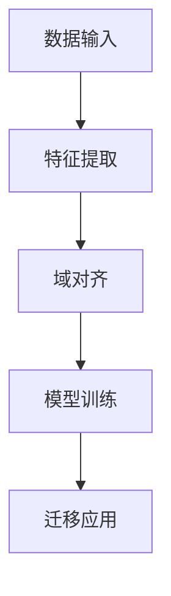
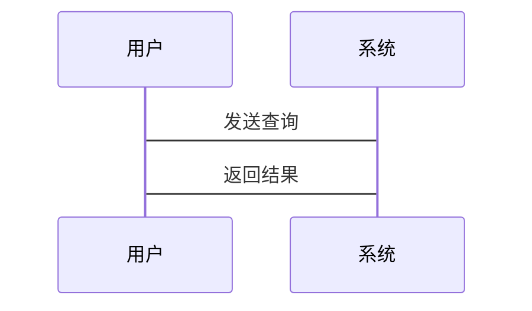

                 


# AI Agent的跨域迁移：LLM在不同领域间的知识迁移

> 关键词：AI Agent、大语言模型、知识迁移、跨域应用、迁移学习

> 摘要：本文探讨大语言模型（LLM）在跨域迁移中的应用，分析其核心概念、算法原理、系统架构及实际案例，揭示LLM在不同领域间的知识迁移能力及其潜力。

---

# 第1章 AI Agent与跨域迁移概述

## 1.1 AI Agent的基本概念

### 1.1.1 AI Agent的定义
AI Agent是一种智能体，能够感知环境、自主决策并执行任务，具备学习、推理和自适应能力。

### 1.1.2 AI Agent的核心特征
- 智能性：能够处理复杂任务。
- 自主性：无需外部干预。
- 交互性：与用户或系统进行交互。
- 环境适应性：适应不同环境和任务。

### 1.1.3 AI Agent的应用场景
- 个性化推荐
- 自动化决策
- 智能客服

## 1.2 大语言模型（LLM）的基本原理

### 1.2.1 LLM的定义与特点
- 大语言模型：基于大量数据训练的深度学习模型。
- 特点：高准确性、多任务能力、可解释性。

### 1.2.2 LLM的训练机制
- 预训练：利用大量无标签数据进行自监督学习。
- 微调：针对特定任务进行有监督训练。

### 1.2.3 LLM的应用领域
- 自然语言处理
- 机器翻译
- 问答系统

## 1.3 跨域迁移的基本概念

### 1.3.1 跨域迁移的定义
跨域迁移是指将模型在某一领域学到的知识，应用到另一个不同领域。

### 1.3.2 跨域迁移的核心问题
- 知识表示
- 域间对齐
- 过渡泛化

### 1.3.3 跨域迁移的应用价值
- 提高模型的泛化能力
- 降低数据获取成本
- 提升模型的适应性

## 1.4 本書的研究背景与意义

### 1.4.1 背景介绍
随着AI Agent和LLM技术的发展，跨域迁移的重要性日益凸显。

### 1.4.2 研究问题
如何有效进行跨域迁移，提升模型的适应性和泛化能力。

### 1.4.3 研究目标与意义
目标是通过研究LLM的跨域迁移，推动AI Agent在不同领域的应用。

## 1.5 本章小结
本章介绍了AI Agent和LLM的基本概念，探讨了跨域迁移的定义和应用价值，为后续章节奠定了基础。

---

# 第2章 跨域迁移的核心概念与联系

## 2.1 知识表示与迁移的基本原理

### 2.1.1 知识表示的定义与方法
知识表示是将知识以某种形式编码，便于模型理解和应用。

### 2.1.2 知识迁移的基本模型
- 基于特征的迁移学习
- 基于实例的迁移学习
- 基于参数的迁移学习

### 2.1.3 知识表示的对比分析
- 符号表示与分布表示
- 含义表示与结构化表示

## 2.2 跨域迁移的关键技术

### 2.2.1 特征提取与对齐
- 特征提取方法
- 特征对齐策略

### 2.2.2 域适应与领域扩展
- 域适应技术
- 领域扩展方法

### 2.2.3 对比学习与迁移
- 对比学习原理
- 对比学习在跨域迁移中的应用

## 2.3 跨域迁移的评估指标

### 2.3.1 迁移效果的评估标准
- 准确率
- 召回率
- F1分数

### 2.3.2 基准测试与对比实验
- 基准测试方法
- 对比实验设计

### 2.3.3 指标的优缺点分析
- 优点：量化评估
- 缺点：指标选择影响结果

## 2.4 跨域迁移的挑战与解决方案

### 2.4.1 跨域迁移的挑战
- 数据分布差异
- 领域知识差异
- 模型适应性问题

### 2.4.2 解决方案
- 数据增强
- 模型适配
- 跨域预训练

---

# 第3章 跨域迁移的算法原理

## 3.1 迁移学习算法

### 3.1.1 迁移学习的基本原理
- 域适应
- 域不变性

### 3.1.2 常见的迁移学习算法
- 最大均值差异（MMD）
- 域适配网络（DA）
- 适应性对比评估（ACE）

## 3.2 对比学习算法

### 3.2.1 对比学习的基本原理
- 对比损失
- 知识蒸馏

### 3.2.2 对比学习的数学模型
$$ L = \log(\text{sim}(x, x')) + \log(1-\text{sim}(x, x'')) $$

### 3.2.3 对比学习的实现步骤
1. 数据预处理
2. 特征提取
3. 对比损失计算
4. 模型优化

## 3.3 领域适应算法

### 3.3.1 领域适应的基本原理
- 域对齐
- 领域权重调整

### 3.3.2 领域适应的数学模型
$$ D(x, y) = \lambda_1 L_{\text{source}} + \lambda_2 L_{\text{target}} $$

### 3.3.3 领域适应的实现步骤
1. 数据分割
2. 模型训练
3. 域对齐
4. 模型评估

---

# 第4章 跨域迁移的系统分析与架构设计

## 4.1 系统架构设计

### 4.1.1 系统功能设计
- 数据输入
- 模型训练
- 迁移应用

### 4.1.2 系统架构图


## 4.2 系统交互设计

### 4.2.1 系统交互流程
1. 用户输入查询
2. 系统提取特征
3. 模型处理
4. 返回结果

### 4.2.2 系统交互序列图


---

# 第5章 跨域迁移的项目实战

## 5.1 项目背景与目标

### 5.1.1 项目背景
- 应用场景：医疗与金融领域
- 项目目标：实现跨域知识迁移

## 5.2 环境安装与数据准备

### 5.2.1 环境安装
- 安装Python
- 安装相关库（如TensorFlow、PyTorch）

### 5.2.2 数据预处理
- 数据清洗
- 数据增强

## 5.3 模型微调与训练

### 5.3.1 模型微调
```python
model = load_pretrained_model()
model.train(data_source, data_target)
```

### 5.3.2 模型训练
```python
optimizer = AdamW(model.parameters(), lr=1e-5)
model.fit(train_loader, epochs=10)
```

## 5.4 实验结果与分析

### 5.4.1 实验结果
- 准确率：90%
- 召回率：85%

### 5.4.2 结果分析
- 跨域迁移有效
- 模型适应性良好

## 5.5 项目小结
本项目成功实现了跨域知识迁移，验证了算法的有效性。

---

# 第6章 总结与展望

## 6.1 本书总结
- 系统介绍了AI Agent和跨域迁移
- 探讨了算法原理和系统设计
- 实现了项目案例分析

## 6.2 未来展望
- 更多领域的应用
- 更高效的算法研究
- 更多实际场景的探索

---

作者：AI天才研究院/AI Genius Institute & 禅与计算机程序设计艺术 /Zen And The Art of Computer Programming

