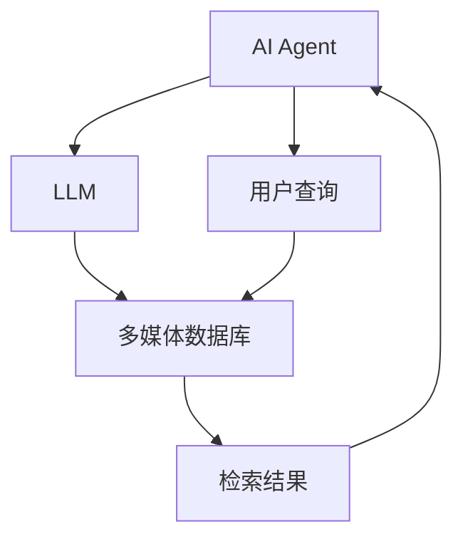

                 


# AI Agent的跨模态检索：整合LLM与多媒体数据库

> 关键词：AI Agent, 跨模态检索, 大语言模型（LLM）, 多媒体数据库, 跨模态融合

> 摘要：本文深入探讨了AI Agent在跨模态检索中的应用，重点分析了如何将大语言模型（LLM）与多媒体数据库进行有效整合。文章从背景、核心概念、算法原理到系统架构、项目实战等方面，全面解析了跨模态检索的技术细节和实现方法，旨在为读者提供清晰的理论指导和实践参考。

---

# 第1章: AI Agent与跨模态检索概述

## 1.1 AI Agent的基本概念

### 1.1.1 AI Agent的定义与特点

AI Agent（人工智能代理）是一种智能系统，能够感知环境、理解用户需求并执行任务以实现目标。其特点包括：

1. **智能性**：能够理解上下文并执行复杂任务。
2. **自主性**：无需人工干预即可运行。
3. **适应性**：能够根据环境变化调整行为。
4. **交互性**：支持与用户或其他系统的交互。

### 1.1.2 AI Agent的核心功能与应用场景

AI Agent的核心功能包括：
- **感知环境**：通过传感器或数据输入获取信息。
- **理解需求**：解析用户意图并生成响应。
- **执行任务**：基于理解的结果执行操作。
- **学习优化**：通过反馈改进性能。

应用场景包括智能助手、推荐系统、自动驾驶等。

### 1.1.3 跨模态检索的基本概念

跨模态检索是指在不同数据类型（如文本、图像、音频）之间进行信息检索。其核心目标是通过多模态数据的融合，提高检索的准确性和相关性。

---

## 1.2 跨模态检索的背景与意义

### 1.2.1 跨模态数据的定义与特点

跨模态数据是指来自不同模态（如文本、图像、音频）的数据。其特点包括：
- **多样性**：涵盖多种数据类型。
- **互补性**：不同模态的数据可以互相补充。
- **复杂性**：处理多模态数据需要综合考虑多种特征。

### 1.2.2 跨模态检索的必要性与优势

随着数据类型的多样化，单一模态检索的局限性日益显现。跨模态检索的优势在于：
- **提高检索效率**：通过多模态数据的融合，减少冗余。
- **增强检索效果**：利用多模态信息提高准确性。
- **扩展应用场景**：适用于复杂场景下的信息检索。

### 1.2.3 跨模态检索在AI Agent中的作用

在AI Agent中，跨模态检索是实现多任务处理的关键技术。通过整合LLM与多媒体数据库，AI Agent能够更高效地处理复杂查询，提供更精准的结果。

---

## 1.3 大语言模型（LLM）与多媒体数据库的结合

### 1.3.1 LLM的基本概念与技术特点

LLM（Large Language Model）是一种基于深度学习的自然语言处理模型，具有以下特点：
- **大规模训练**：通常基于海量数据进行预训练。
- **多任务能力**：能够处理多种语言理解和生成任务。
- **上下文理解**：能够理解上下文并生成连贯的文本。

### 1.3.2 多媒体数据库的定义与功能

多媒体数据库是一种存储和管理多种数据类型的数据库，支持文本、图像、音频等多种数据的存储和检索。其功能包括：
- **数据存储**：支持多种数据类型的存储。
- **数据检索**：提供高效的查询和检索功能。
- **数据管理**：支持数据的增删改查操作。

### 1.3.3 跨模态检索的整合价值

通过整合LLM与多媒体数据库，跨模态检索能够实现以下价值：
- **提升检索效率**：利用LLM的强大语义理解能力，提高检索速度。
- **增强检索精度**：结合多媒体数据的特征，提高检索结果的相关性。
- **扩展应用场景**：支持更多复杂场景下的信息检索。

---

## 1.4 本章小结

本章介绍了AI Agent、跨模态检索的基本概念，并分析了LLM与多媒体数据库的整合价值。通过整合这两种技术，AI Agent能够更高效地处理复杂查询，提供更精准的结果。

---

# 第2章: 跨模态检索的核心概念

## 2.1 跨模态检索的关键概念

### 2.1.1 跨模态数据的表示与转换

跨模态数据的表示与转换是实现跨模态检索的基础。常见的表示方法包括：
- **嵌入表示**：将数据转换为低维向量表示。
- **特征提取**：通过模型提取数据的关键特征。

### 2.1.2 跨模态检索的指标与评价标准

跨模态检索的评价指标包括：
- **准确率**：检索结果的准确程度。
- **召回率**：检索结果中相关项的比例。
- **F1分数**：综合考虑准确率和召回率的指标。

### 2.1.3 跨模态检索的实现流程

跨模态检索的实现流程通常包括以下步骤：
1. **数据预处理**：对数据进行清洗和标准化。
2. **特征提取**：提取数据的特征表示。
3. **检索模型训练**：基于特征表示训练检索模型。
4. **检索与优化**：利用训练好的模型进行检索并优化结果。

---

## 2.2 LLM与多媒体数据的关联

### 2.2.1 LLM在文本处理中的优势

LLM在文本处理中的优势包括：
- **强大的语义理解能力**：能够理解上下文并生成连贯的文本。
- **多语言支持**：支持多种语言的文本处理。

### 2.2.2 多媒体数据的特征提取与表示

多媒体数据的特征提取与表示方法包括：
- **图像处理**：通过卷积神经网络提取图像特征。
- **音频处理**：通过声学特征提取音频特征。

### 2.2.3 LLM与多媒体数据的融合方式

LLM与多媒体数据的融合方式包括：
- **直接融合**：将多媒体数据直接输入LLM进行处理。
- **特征融合**：将多媒体数据的特征与文本特征进行融合。

---

## 2.3 跨模态检索的实体关系图



---

## 2.4 本章小结

本章详细介绍了跨模态检索的核心概念，并分析了LLM与多媒体数据的关联。通过实体关系图展示了跨模态检索的整体架构。

---

# 第3章: 跨模态检索的算法原理

## 3.1 跨模态检索的算法框

跨模态检索的算法框通常包括以下步骤：
1. **数据预处理**：对数据进行清洗和标准化。
2. **特征提取**：提取数据的特征表示。
3. **检索模型训练**：基于特征表示训练检索模型。
4. **检索与优化**：利用训练好的模型进行检索并优化结果。

---

## 3.2 跨模态检索的实现流程

跨模态检索的实现流程包括：
1. **数据预处理**：对数据进行清洗和标准化。
2. **特征提取**：提取数据的特征表示。
3. **检索模型训练**：基于特征表示训练检索模型。
4. **检索与优化**：利用训练好的模型进行检索并优化结果。

---

## 3.3 跨模态检索的数学模型

跨模态检索的数学模型通常包括以下部分：
- **特征表示**：将数据转换为低维向量表示。
- **相似度计算**：通过余弦相似度或其他相似度指标进行检索。

---

## 3.4 跨模态检索的优化策略

跨模态检索的优化策略包括：
- **负采样**：通过负采样减少检索结果的冗余。
- **多任务学习**：通过多任务学习提升检索性能。

---

## 3.5 本章小结

本章详细介绍了跨模态检索的算法原理，并分析了其实现流程和数学模型。通过优化策略的分析，展示了如何提升跨模态检索的性能。

---

# 第4章: 系统架构与设计

## 4.1 系统功能设计

系统功能设计包括：
- **用户查询**：支持多模态查询。
- **数据检索**：基于查询进行跨模态检索。
- **结果展示**：展示检索结果并提供反馈。

---

## 4.2 系统架构设计


---

## 4.3 系统接口设计

系统接口设计包括：
- **输入接口**：接收用户的查询请求。
- **输出接口**：返回检索结果。
- **数据库接口**：与多媒体数据库进行交互。

---

## 4.4 系统交互设计

系统交互设计包括：
- **用户查询**：用户通过界面提交查询请求。
- **数据检索**：系统基于查询进行跨模态检索。
- **结果展示**：系统将检索结果展示给用户。

---

## 4.5 本章小结

本章详细介绍了系统的功能设计、架构设计、接口设计和交互设计，并通过Mermaid图展示了系统的整体架构。

---

# 第5章: 项目实战

## 5.1 环境安装

项目实战需要以下环境：
- **Python**：3.8及以上版本。
- **深度学习框架**：如TensorFlow或PyTorch。
- **多媒体处理库**：如OpenCV、librosa等。

---

## 5.2 系统核心实现

### 5.2.1 数据预处理代码

```python
import numpy as np
from tensorflow.keras.preprocessing.image import load_img, img_to_array

def preprocess_image(image_path):
    img = load_img(image_path)
    img_array = img_to_array(img)
    img_array = np.expand_dims(img_array, axis=0)
    return img_array
```

### 5.2.2 特征提取代码

```python
from tensorflow.keras.applications.vgg16 import VGG16, preprocess_input, decode_predictions

def extract_features(image_array):
    model = VGG16(weights='imagenet', include_top=False)
    features = model.predict(preprocess_input(image_array))
    return features
```

---

## 5.3 代码应用解读与分析

### 5.3.1 代码实现细节

代码实现细节包括：
- **数据预处理**：将图像数据转换为模型可接受的格式。
- **特征提取**：使用预训练模型提取图像特征。
- **检索与优化**：基于特征进行检索并优化结果。

---

## 5.4 实际案例分析

### 5.4.1 案例背景介绍

案例背景介绍包括：
- **项目目标**：实现一个基于AI Agent的跨模态检索系统。
- **数据集**：使用公开的多模态数据集进行实验。

### 5.4.2 检索结果分析

检索结果分析包括：
- **准确率**：检索结果的准确程度。
- **召回率**：检索结果中相关项的比例。

### 5.4.3 系统优化建议

系统优化建议包括：
- **优化特征提取**：尝试不同的特征提取方法。
- **改进检索算法**：尝试不同的检索算法以提升性能。

---

## 5.5 本章小结

本章通过项目实战展示了跨模态检索的实现过程，并通过具体案例分析了系统的性能和优化方向。

---

# 第6章: 总结与展望

## 6.1 总结

本文详细探讨了AI Agent在跨模态检索中的应用，分析了LLM与多媒体数据库的整合方法，并通过具体案例展示了系统的实现过程。

---

## 6.2 未来展望

未来的研究方向包括：
- **多模态融合**：探索更多模态数据的融合方法。
- **实时性优化**：提升系统的实时性以支持更多应用场景。
- **模型优化**：探索更高效的模型以提升检索性能。

---

## 6.3 注意事项

在实际应用中，需要注意以下问题：
- **数据隐私**：确保数据的安全性和隐私性。
- **系统稳定性**：确保系统的稳定运行以避免数据丢失。
- **用户体验**：注重用户体验以提升系统的可用性。

---

## 6.4 拓展阅读

推荐的拓展阅读资料包括：
- **《Deep Learning》**：Ian Goodfellow等著。
- **《自然语言处理实战》**：Allen R. Popowicz著。
- **《计算机视觉实战》**： Adrian Rosebrock著。

---

# 作者：AI天才研究院/AI Genius Institute & 禅与计算机程序设计艺术 /Zen And The Art of Computer Programming

---

通过以上结构，我们可以清晰地看到《AI Agent的跨模态检索：整合LLM与多媒体数据库》的完整内容和实现过程。

