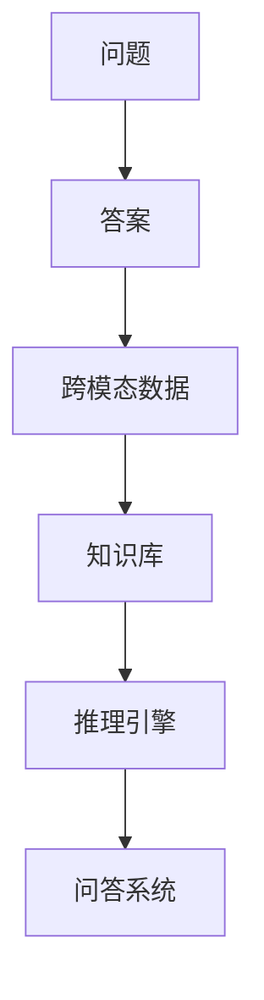
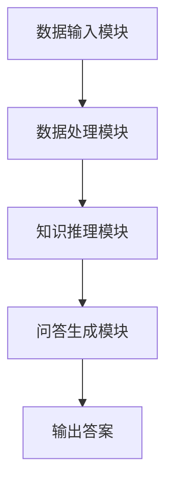
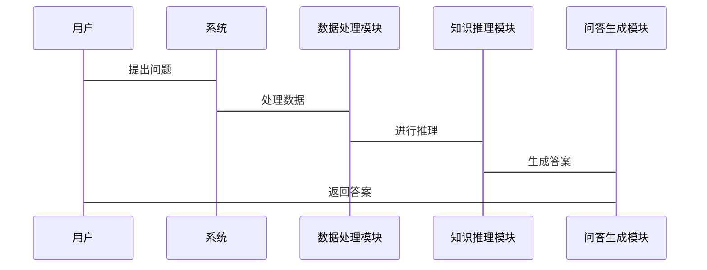

                 


```markdown
# AI Agent的跨模态知识推理与问答

> 关键词：AI Agent, 跨模态知识推理, 跨模态问答, 知识图谱, 注意力机制, 多模态学习, 问答系统

> 摘要：本文深入探讨AI Agent在跨模态知识推理与问答系统中的应用，结合实际案例和系统架构设计，详细讲解算法原理、数学模型以及系统实现。通过本文，读者将全面理解跨模态知识推理的核心概念、实现方法及其在问答系统中的应用。

---

## 第1章: 跨模态知识推理与问答的背景介绍

### 1.1 跨模态知识推理与问答的問題背景
跨模态数据处理是当前人工智能领域的研究热点，尤其是在AI Agent中，如何处理多模态数据并进行推理是实现智能问答系统的关键。传统问答系统主要依赖于单一模态的数据，如文本，而现实场景中，用户可能需要结合图像、语音等多种信息进行问答。

#### 1.1.1 跨模态数据的定义与特点
- **定义**：跨模态数据指的是来自不同感官渠道的数据，如文本、图像、语音、视频等。
- **特点**：
  - **多样性**：数据来源多样化。
  - **复杂性**：数据类型多样，处理难度大。
  - **互补性**：不同模态的数据可以相互补充，提高推理准确性。

#### 1.1.2 跨模态推理的必要性
- 在复杂场景下，单一模态的数据往往不足以支持准确的推理。
- 跨模态推理能够结合多种信息，提高系统的智能性和准确性。

#### 1.1.3 跨模态问答的应用场景
- **图像问答**：用户提出与图像相关的问题，系统结合图像和文本信息进行回答。
- **多模态客服**：结合文本和语音信息，提供更智能的客户服务。
- **智能助手**：如Siri、Alexa等，能够处理多种模态的数据，提供更丰富的交互方式。

### 1.2 跨模态知识推理与问答的核心概念
#### 1.2.1 跨模态数据的处理方式
- **数据融合**：将不同模态的数据进行整合，形成统一的表示形式。
- **信息提取**：从不同模态的数据中提取有用的信息，用于推理和问答。

#### 1.2.2 知识推理的基本原理
- **知识表示**：将知识以某种形式表示，如图结构、向量等。
- **推理机制**：基于知识表示，利用推理规则或算法进行推理。

#### 1.2.3 跨模态问答的实现方式
- **端到端模型**：直接从输入数据到输出答案，不依赖于显式知识库。
- **基于知识库的问答**：结合外部知识库进行推理和回答。

### 1.3 跨模态知识推理与问答的边界与外延
#### 1.3.1 跨模态推理的边界
- 数据模态的种类和数量有限。
- 推理深度和广度有限。

#### 1.3.2 跨模态问答的应用范围
- 适用于需要多模态数据支持的复杂问题。
- 在医疗、教育、客服等领域有广泛应用。

#### 1.3.3 跨模态推理与问答的未来发展方向
- 更多模态数据的融合。
- 更复杂的推理算法。
- 更高效的计算方法。

### 1.4 跨模态知识推理与问答的概念结构与核心要素
#### 1.4.1 跨模态数据的结构化表示
- 将不同模态的数据转化为统一的结构化形式，如向量、图结构等。

#### 1.4.2 知识推理的核心要素
- 知识表示、推理规则、推理引擎。

#### 1.4.3 跨模态问答的实现流程
1. 数据输入：接收多模态数据。
2. 数据处理：对数据进行预处理和融合。
3. 知识推理：基于知识库进行推理。
4. 生成答案：根据推理结果生成最终答案。

### 1.5 本章小结
本章介绍了跨模态知识推理与问答的基本概念、核心要素和实现流程，为后续章节奠定了基础。

---

## 第2章: 跨模态知识推理与问答的核心概念与联系

### 2.1 跨模态知识推理的原理
#### 2.1.1 跨模态数据的融合方法
- **特征对齐**：将不同模态的数据转换为相同的特征空间。
- **联合学习**：在统一的框架下学习不同模态的数据。

#### 2.1.2 知识推理的逻辑结构
- **知识图谱**：构建领域知识图谱，用于推理。
- **推理规则**：定义推理规则，如逻辑推理、概率推理。

#### 2.1.3 跨模态推理的算法选择
- **多模态嵌入**：将不同模态的数据嵌入到同一空间。
- **注意力机制**：用于重点关注重要信息。

### 2.2 跨模态问答的核心概念
#### 2.2.1 跨模态问答的定义
- 结合多种模态信息进行问答。

#### 2.2.2 跨模态问答的关键技术
- 多模态特征提取、知识推理、生成模型。

#### 2.2.3 跨模态问答的实现步骤
1. 数据输入：接收多模态输入。
2. 特征提取：提取各模态的特征。
3. 知识推理：结合知识库进行推理。
4. 生成答案：生成最终的问答结果。

### 2.3 跨模态知识推理与问答的ER实体关系图


### 2.4 本章小结
本章详细讲解了跨模态知识推理与问答的核心概念和实现原理，为后续章节的算法和系统设计奠定了基础。

---

## 第3章: 跨模态知识推理与问答的算法原理

### 3.1 多模态嵌入算法
#### 3.1.1 算法原理
- 将不同模态的数据嵌入到同一空间，便于后续处理。

#### 3.1.2 算法流程
1. 对每个模态的数据进行预处理。
2. 将每个模态的数据映射到嵌入空间。
3. 融合各模态的嵌入向量，得到最终的表示。

#### 3.1.3 算法实现
```python
import torch

# 示例代码：多模态嵌入
class MultiModalEmbedding:
    def __init__(self, embed_dim, num_modals):
        self.embed_dim = embed_dim
        self.num_modals = num_modals
        self.embedding = nn.ModuleList([
            nn.Embedding(input_dim, embed_dim) for _ in range(num_modals)
        ])
    
    def forward(self, inputs):
        embeds = []
        for i, input in enumerate(inputs):
            embed = self.embedding[i](input)
            embeds.append(embed)
        return torch.cat(embeds, dim=1)
```

#### 3.1.4 算法数学模型
$$ \text{最终表示} = \text{多模态嵌入向量的融合} $$

### 3.2 注意力机制
#### 3.2.1 注意力机制的原理
- 通过计算各模态数据的重要性，进行加权求和。

#### 3.2.2 注意力机制的实现
```python
def attention(query, key, value):
    # 计算注意力权重
    scores = torch.matmul(query, key.transpose(-2, -1)) / (query.size(-1) ** 0.5)
    scores = F.softmax(scores, dim=-1)
    # 加权求和
    output = torch.matmul(scores, value)
    return output
```

#### 3.2.3 注意力机制的应用
- 在跨模态数据处理中，用于关注重要模态的信息。

### 3.3 知识图谱构建
#### 3.3.1 知识图谱的构建方法
- 数据抽取、实体识别、关系抽取。

#### 3.3.2 知识图谱的存储与查询
- 使用图数据库，如Neo4j，进行高效的查询。

#### 3.3.3 知识图谱的推理
- 基于规则的推理和基于学习的推理。

### 3.4 本章小结
本章详细讲解了跨模态知识推理与问答中的关键算法，包括多模态嵌入、注意力机制和知识图谱构建。

---

## 第4章: 跨模态知识推理与问答的系统架构设计

### 4.1 问题场景介绍
- 系统需要支持多模态数据的输入和处理。
- 系统需要结合知识库进行推理，并生成准确的答案。

### 4.2 系统功能设计
- 数据输入模块：接收多模态数据。
- 数据处理模块：对数据进行预处理和融合。
- 知识推理模块：基于知识库进行推理。
- 问答生成模块：生成最终的问答结果。

### 4.3 系统架构设计


### 4.4 系统接口设计
- 输入接口：接收多模态数据。
- 输出接口：返回问答结果。

### 4.5 系统交互序列图


### 4.6 本章小结
本章详细设计了跨模态知识推理与问答系统的架构和接口，为后续的实现提供了指导。

---

## 第5章: 跨模态知识推理与问答的项目实战

### 5.1 环境安装
- 安装必要的库，如PyTorch、Transformers、Neo4j等。

### 5.2 系统核心实现源代码
#### 5.2.1 数据处理模块
```python
def process_data(text, image):
    # 处理文本数据
    text_embed = text_encoder(text)
    # 处理图像数据
    image_embed = image_encoder(image)
    # 融合数据
    combined = combine_embeddings(text_embed, image_embed)
    return combined
```

#### 5.2.2 知识推理模块
```python
def knowledge_reasoning(knowledge_base, combined Embed):
    # 查询知识库
    result = knowledge_base.query(combined_embed)
    # 进行推理
    inference = infer_engine(result)
    return inference
```

#### 5.2.3 问答生成模块
```python
def generate_answer(inference_result):
    # 生成答案
    answer = answer_generator(inference_result)
    return answer
```

### 5.3 代码应用解读与分析
- 数据处理模块负责将多模态数据转换为统一的表示形式。
- 知识推理模块结合知识库进行推理，生成中间结果。
- 问答生成模块根据推理结果生成最终的答案。

### 5.4 实际案例分析
- 案例1：图像问答。
- 案例2：多模态客服问答。

### 5.5 本章小结
本章通过实际案例展示了跨模态知识推理与问答系统的实现过程。

---

## 第6章: 跨模态知识推理与问答的最佳实践与小结

### 6.1 小结
- 跨模态知识推理与问答系统的核心在于多模态数据的融合和知识的推理。

### 6.2 注意事项
- 数据质量对系统性能影响重大。
- 知识库的构建和维护需要投入大量资源。

### 6.3 拓展阅读
- 多模态学习的最新研究。
- 注意力机制的改进方法。
- 知识图谱的构建技术。

### 6.4 本章小结
本章总结了跨模态知识推理与问答系统的最佳实践，为读者提供了进一步学习和研究的方向。

---

## 作者信息

作者：AI天才研究院/AI Genius Institute & 禅与计算机程序设计艺术 /Zen And The Art of Computer Programming
```

