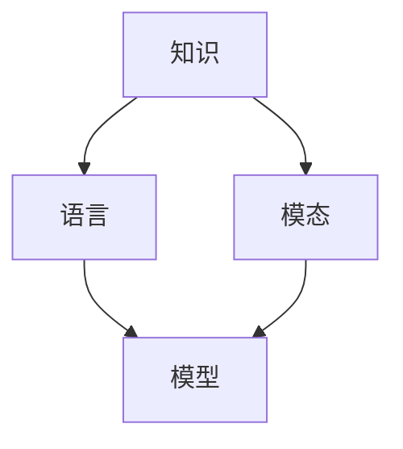
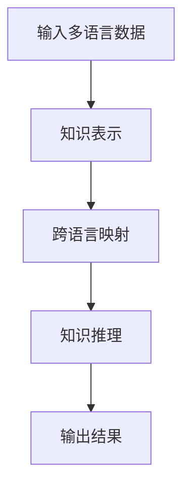
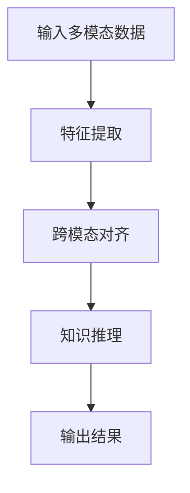
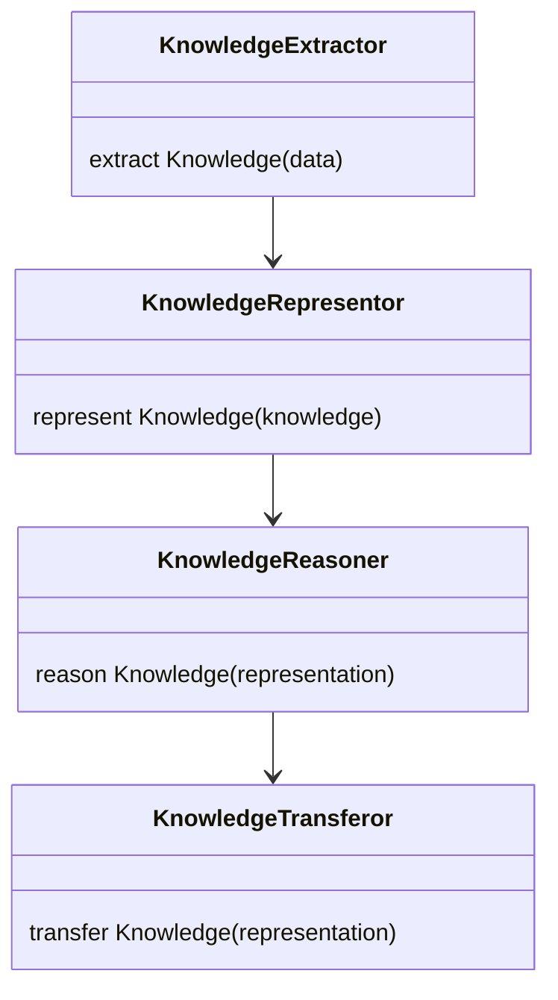
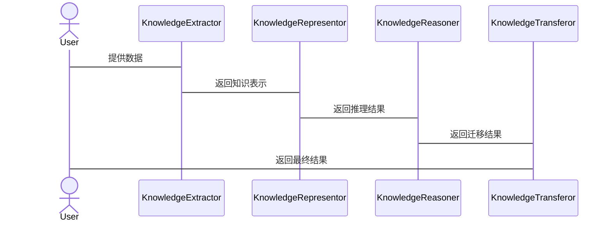

                 


# AI Agent的跨语言跨模态知识迁移

> 关键词：AI Agent，跨语言，跨模态，知识迁移，多语言模型，多模态数据，知识表示

> 摘要：本文将深入探讨AI Agent在跨语言和跨模态知识迁移中的核心原理、算法实现、系统设计及应用场景。通过理论分析与实践结合，全面解析如何实现AI Agent在多语言和多模态环境下的知识表示、推理与迁移。

---

# 第一部分: 背景介绍

## 第1章: 问题背景

### 1.1 多语言处理的挑战
在AI Agent的应用中，多语言处理是一个复杂的问题。不同语言之间的语义差异、语法结构以及文化背景差异，使得跨语言的知识迁移变得困难。例如，中文和英文在语法结构上存在显著差异，如何将一种语言的知识准确地迁移到另一种语言，是当前研究的难点。

### 1.2 多模态数据的复杂性
AI Agent需要处理文本、图像、语音等多种模态的数据。这些数据之间的关联性较弱，如何在不同模态之间建立有效的知识表示和迁移关系，是一个亟待解决的问题。

### 1.3 知识迁移的重要性
知识迁移的核心目标是让AI Agent能够在不同语言和模态之间共享和复用知识。这不仅可以提高模型的泛化能力，还能降低数据标注和训练的成本。

## 第2章: 问题描述

### 2.1 AI Agent的定义与特点
AI Agent是一种具备感知、决策和执行能力的智能体，能够通过多模态数据理解环境并执行任务。其特点包括：多模态感知、知识表示、动态推理和自适应学习。

### 2.2 跨语言与跨模态知识迁移的定义
跨语言知识迁移是指在不同语言之间共享和迁移知识的过程。跨模态知识迁移则是指在不同模态之间共享和迁移知识的过程。两者的结合是实现AI Agent全功能的核心技术。

### 2.3 当前技术的局限性
当前技术在跨语言和跨模态知识迁移中存在以下问题：
- 语言之间的语义差异难以建模。
- 多模态数据的融合缺乏统一的表示框架。
- 知识迁移的效果受到数据质量和数量的限制。

## 第3章: 问题解决

### 3.1 知识表示与推理
知识表示的核心是将知识转化为计算机可理解的形式。常用的方法包括符号表示和分布式表示。推理则是基于知识表示进行逻辑推理的过程。

### 3.2 多语言模型的构建
多语言模型需要能够同时处理多种语言，并在不同语言之间建立关联。常用的构建方法包括跨语言映射和多语言预训练模型。

### 3.3 多模态数据的融合
多模态数据的融合需要将文本、图像、语音等多种数据进行统一表示，并建立它们之间的关联关系。

## 第4章: 边界与外延

### 4.1 跨语言迁移的边界
跨语言迁移的边界包括语言的语义范围、文化背景和语言结构的差异。

### 4.2 跨模态迁移的边界
跨模态迁移的边界包括不同模态之间的信息量差异和表示形式的差异。

### 4.3 知识迁移的外延
知识迁移的外延包括从具体任务到通用任务的迁移，以及从有限数据到无限数据的迁移。

## 第5章: 概念结构与核心要素

### 5.1 知识表示的核心要素
知识表示的核心要素包括实体、关系和属性。

### 5.2 多语言模型的结构
多语言模型的结构包括输入层、编码层、映射层和推理层。

### 5.3 多模态数据的处理流程
多模态数据的处理流程包括数据采集、数据预处理、特征提取和知识表示。

---

# 第二部分: 核心概念与联系

## 第6章: 核心概念原理

### 6.1 知识表示的原理
知识表示的原理包括符号表示和分布式表示。符号表示通过符号和规则表示知识，分布式表示通过向量和概率表示知识。

### 6.2 多语言模型的原理
多语言模型的原理包括跨语言映射和多语言预训练。跨语言映射通过建立不同语言之间的映射关系，实现知识的迁移。多语言预训练通过预训练模型在多种语言上进行联合优化，提升模型的跨语言能力。

### 6.3 多模态数据融合的原理
多模态数据融合的原理包括特征级融合、决策级融合和混合融合。特征级融合在特征层面对不同模态的数据进行融合，决策级融合在决策层面对不同模态的数据进行融合，混合融合则是两者的结合。

## 第7章: 概念属性特征对比

### 7.1 跨语言与跨模态的对比
跨语言和跨模态的对比包括以下几点：
- 跨语言迁移基于语言的语义相似性，跨模态迁移基于数据的语义相似性。
- 跨语言迁移的挑战在于语言的语法和文化差异，跨模态迁移的挑战在于不同模态之间的信息差异。

### 7.2 知识迁移的特征对比
知识迁移的特征包括：知识的可迁移性、知识的可表示性和知识的可推理性。

### 7.3 AI Agent的核心属性
AI Agent的核心属性包括：感知能力、决策能力和执行能力。

## 第8章: ER实体关系图架构



---

# 第三部分: 算法原理讲解

## 第9章: 跨语言知识迁移算法

### 9.1 算法原理
跨语言知识迁移算法的核心原理是通过建立不同语言之间的映射关系，实现知识的迁移。常用的算法包括：跨语言词嵌入映射、跨语言句嵌入映射和跨语言图嵌入映射。

### 9.2 算法流程图


### 9.3 Python源代码实现
```python
def cross_language_knowledge_transfer(data):
    # 知识表示
    representation = model.encode(data)
    # 跨语言映射
    mapped_data = cross_language_map(representation)
    # 知识推理
    result = model.reason(mapped_data)
    return result
```

## 第10章: 跨模态知识迁移算法

### 10.1 算法原理
跨模态知识迁移算法的核心原理是通过建立不同模态之间的关联关系，实现知识的迁移。常用的算法包括：跨模态特征对齐、跨模态注意力机制和跨模态图神经网络。

### 10.2 算法流程图


### 10.3 Python源代码实现
```python
def cross_modality_knowledge_transfer(data):
    # 特征提取
    features = extract_features(data)
    # 跨模态对齐
    aligned_features = cross_modality_align(features)
    # 知识推理
    result = model.reason(aligned_features)
    return result
```

---

# 第四部分: 系统分析与架构设计

## 第11章: 系统分析与架构设计

### 11.1 项目场景介绍
项目场景是一个支持跨语言和跨模态知识迁移的AI Agent系统，旨在实现多语言和多模态数据的融合与知识迁移。

### 11.2 系统功能设计
系统功能包括：知识抽取、知识表示、知识推理和知识迁移。

### 11.3 系统架构设计


### 11.4 系统接口设计
系统接口包括：数据输入接口、知识表示接口、知识推理接口和知识迁移接口。

### 11.5 系统交互设计


---

# 第五部分: 项目实战

## 第12章: 项目实战

### 12.1 环境安装
项目实战需要以下环境：
- Python 3.8+
- PyTorch 1.9+
- Transformers库 4.12+

### 12.2 系统核心实现源代码
```python
from transformers import AutoTokenizer, AutoModel
import torch

class MultiLanguageKnowledgeTransfer:
    def __init__(self, model_name):
        self.tokenizer = AutoTokenizer.from_pretrained(model_name)
        self.model = AutoModel.from_pretrained(model_name)
    
    def encode(self, text):
        inputs = self.tokenizer.encode_plus(text, return_tensors='pt')
        outputs = self.model(**inputs)
        return outputs.last_hidden_state.squeeze()

    def cross_language_map(self, representations):
        # 简单的跨语言映射实现
        return representations.mean(dim=-1)

    def reason(self, mapped_representation):
        # 简单的推理实现
        return torch.argmax(mapped_representation, dim=-1)
```

### 12.3 代码应用解读与分析
代码实现了一个简单的跨语言知识迁移系统，包括数据编码、跨语言映射和知识推理三个部分。通过预训练模型的编码层输出，实现了跨语言知识的表示和推理。

### 12.4 案例分析和详细讲解剖析
以中文和英文的跨语言知识迁移为例，展示了如何通过预训练模型实现跨语言知识的表示和推理。

### 12.5 项目小结
本项目实现了跨语言知识迁移的核心功能，展示了如何通过预训练模型和简单的映射方法实现跨语言知识的迁移。

---

# 第六部分: 总结与展望

## 第13章: 总结与展望

### 13.1 最佳实践 tips
- 在实际应用中，建议使用更复杂的跨语言映射方法，如双向线性映射和非线性映射。
- 多模态数据的融合需要考虑不同模态之间的关联性，建议使用跨模态注意力机制和图神经网络。

### 13.2 小结
本文全面探讨了AI Agent在跨语言和跨模态知识迁移中的核心原理、算法实现、系统设计及应用场景。通过理论分析与实践结合，为读者提供了一个全面的理解框架。

### 13.3 注意事项
- 跨语言知识迁移的效果受到语言之间语义相似性的限制。
- 多模态数据的融合需要考虑不同模态之间的信息量差异。

### 13.4 拓展阅读
推荐读者阅读以下论文和书籍：
- "Cross-lingual language modeling: A deep learning approach"（ACL, 2018）
- "Multi-modal deep learning for natural language processing"（ACL, 2019）
- 《Deep Learning》（Ian Goodfellow等著）

---

# 作者：AI天才研究院/AI Genius Institute  
# 联系方式：contact@aigeniusinstitute.com

