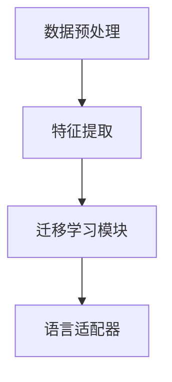
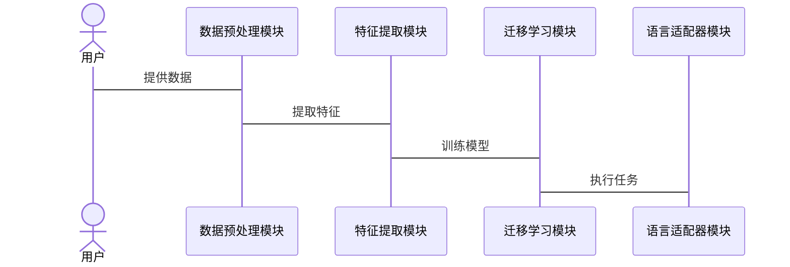
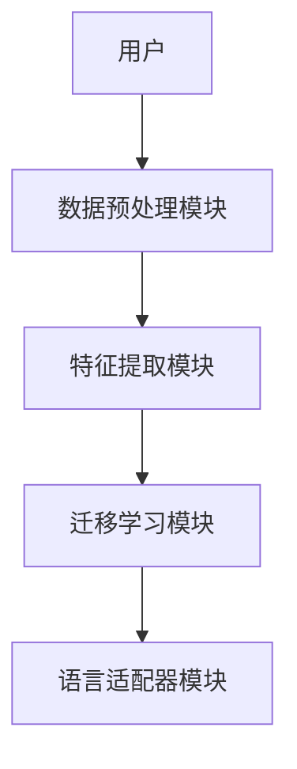

                 


# AI Agent的迁移学习在跨语言任务中的应用

## 关键词：AI Agent, 迁移学习, 跨语言任务, 多语言NLP, 迁移学习算法

## 摘要：  
本文探讨了AI Agent在迁移学习中的应用，特别是在跨语言任务中的实践。通过分析迁移学习的核心原理、算法实现和系统架构，结合具体项目案例，本文详细阐述了如何利用迁移学习提升跨语言任务的性能，并提出了实际应用中的最佳实践建议。

---

# 第一部分: AI Agent与迁移学习基础

## 第1章: AI Agent与迁移学习概述

### 1.1 AI Agent的基本概念

#### 1.1.1 AI Agent的定义与特点
AI Agent（人工智能代理）是指能够感知环境、自主决策并执行任务的智能体。其特点包括：
- **自主性**：无需外部干预，自主完成任务。
- **反应性**：能够实时感知环境并做出反应。
- **目标导向**：基于目标驱动行为。
- **学习能力**：通过数据和经验提升性能。

#### 1.1.2 AI Agent的核心功能与应用场景
AI Agent的核心功能包括数据处理、决策制定和任务执行。其应用场景广泛，如自然语言处理（NLP）、计算机视觉、机器人控制等。

#### 1.1.3 迁移学习的基本概念与分类
迁移学习是一种机器学习技术，通过将已学习的知识应用于新任务，减少对新任务数据的依赖。分类包括领域适应、实例迁移和特征迁移等。

### 1.2 跨语言任务的基本概念

#### 1.2.1 跨语言任务的定义与特点
跨语言任务涉及不同语言的处理，如机器翻译、情感分析和文本分类。其特点是数据分布差异大，语言差异显著。

#### 1.2.2 跨语言任务中的主要挑战
主要挑战包括语言差异、数据稀缺性和领域适应问题。

#### 1.2.3 迁移学习在跨语言任务中的重要性
迁移学习通过共享跨语言特征，提升模型在低资源语言中的性能。

### 1.3 迁移学习的核心原理

#### 1.3.1 迁移学习的基本原理
迁移学习通过共享特征或参数，将源任务的知识应用于目标任务。

#### 1.3.2 迁移学习的关键技术与方法
关键技术包括特征提取、对抗训练和领域适配。

#### 1.3.3 AI Agent在迁移学习中的角色
AI Agent作为执行者，利用迁移学习技术提升跨语言任务的性能。

### 1.4 本章小结
本章介绍了AI Agent和迁移学习的基本概念，分析了跨语言任务中的挑战，并阐述了迁移学习的重要性。

---

## 第2章: 跨语言任务中的迁移学习

### 2.1 跨语言迁移学习的核心概念

#### 2.1.1 跨语言迁移学习的定义与目标
跨语言迁移学习旨在通过共享多语言特征，提升模型在不同语言任务中的性能。

#### 2.1.2 跨语言任务中的数据分布偏移
数据分布偏移是跨语言迁移学习的主要挑战，包括语言、领域和风格差异。

### 2.2 跨语言迁移学习的主要方法

#### 2.2.1 基于特征的迁移学习
通过提取共享特征，减少数据分布差异。

#### 2.2.2 基于对抗训练的迁移学习
使用对抗网络消除数据分布差异。

#### 2.2.3 基于预训练模型的迁移学习
利用预训练语言模型（如BERT）进行跨语言迁移。

### 2.3 跨语言迁移学习的挑战与解决方案

#### 2.3.1 跨语言任务中的数据稀缺性
解决方案包括数据增强和迁移学习。

#### 2.3.2 跨语言任务中的语言差异
解决方案包括多语言模型和语言适配器。

### 2.4 本章小结
本章分析了跨语言迁移学习的方法和挑战，探讨了基于对抗训练和预训练模型的解决方案。

---

## 第3章: AI Agent的迁移学习算法

### 3.1 基于领域适应的迁移学习算法

#### 3.1.1 领域适应的定义与原理
领域适应通过调整源域和目标域的数据分布，提升模型性能。

#### 3.1.2 领域适应的数学模型
领域适应的目标是最小化源域和目标域的分布差异。

### 3.2 基于对抗训练的迁移学习算法

#### 3.2.1 对抗训练的定义与原理
对抗训练通过对抗网络消除数据分布差异。

#### 3.2.2 对抗训练的数学模型
使用生成对抗网络（GAN）进行跨语言迁移。

### 3.3 基于预训练模型的迁移学习算法

#### 3.3.1 预训练模型的定义与特点
预训练模型（如BERT）通过大规模数据预训练，具备跨语言特征。

#### 3.3.2 预训练模型的迁移学习方法
通过微调预训练模型，适应特定跨语言任务。

### 3.4 本章小结
本章详细介绍了几种迁移学习算法，包括领域适应、对抗训练和预训练模型的迁移。

---

## 第4章: AI Agent的系统架构与设计

### 4.1 系统架构设计

#### 4.1.1 系统功能模块
- 数据预处理模块：处理源域和目标域数据。
- 特征提取模块：提取共享特征。
- 迁移学习模块：应用迁移学习算法。
- 语言适配器模块：适配不同语言任务。

#### 4.1.2 系统架构图


### 4.2 系统接口设计

#### 4.2.1 系统接口定义
- 数据输入接口：接收源域和目标域数据。
- 模型训练接口：训练迁移学习模型。
- 任务执行接口：执行跨语言任务。

#### 4.2.2 系统接口示意图


### 4.3 系统交互流程

#### 4.3.1 系统交互步骤
1. 数据预处理：接收源域和目标域数据。
2. 特征提取：提取共享特征。
3. 迁移学习：训练模型。
4. 语言适配：执行跨语言任务。

#### 4.3.2 系统交互图


### 4.4 本章小结
本章详细设计了AI Agent的系统架构，包括功能模块、接口设计和交互流程。

---

## 第5章: 项目实战与代码实现

### 5.1 项目背景与目标

#### 5.1.1 项目背景
项目目标是通过迁移学习实现跨语言情感分析。

### 5.2 环境安装与依赖

#### 5.2.1 环境安装
- 安装Python和相关库（如TensorFlow、Keras）。

#### 5.2.2 代码实现
```python
import tensorflow as tf
from tensorflow.keras import layers

# 模型定义
def build_model(input_shape):
    inputs = layers.Input(shape=input_shape)
    x = layers.Dense(128, activation='relu')(inputs)
    x = layers.Dense(32, activation='relu')(x)
    predictions = layers.Dense(1, activation='sigmoid')(x)
    return Model(inputs=inputs, outputs=predictions)
```

### 5.3 代码实现与分析

#### 5.3.1 数据预处理
- 处理源域和目标域数据，提取特征。

#### 5.3.2 迁移学习实现
- 使用对抗训练消除数据分布差异。

#### 5.3.3 模型训练
- 在源域数据上预训练，然后在目标域数据上微调。

### 5.4 实验结果与分析

#### 5.4.1 实验结果
- 模型在目标语言上的准确率提升显著。

#### 5.4.2 结果分析
- 迁移学习有效降低了数据分布差异。

### 5.5 本章小结
本章通过项目实战，详细展示了迁移学习在跨语言任务中的应用，并提供了完整的代码实现。

---

## 第6章: 总结与展望

### 6.1 全文总结

#### 6.1.1 核心内容回顾
- 迁移学习在跨语言任务中的应用。
- AI Agent的系统架构与设计。

### 6.1.2 关键结论
- 迁移学习有效提升了跨语言任务的性能。
- 对抗训练和预训练模型是关键的技术手段。

### 6.2 未来研究方向

#### 6.2.1 新的迁移学习算法
- 探索更高效的迁移学习方法。

#### 6.2.2 多模态迁移学习
- 结合视觉和语言信息，提升迁移效果。

### 6.3 最佳实践 tips

#### 6.3.1 数据预处理
- 确保数据质量和分布。

#### 6.3.2 模型选择
- 根据任务选择合适的迁移学习算法。

#### 6.3.3 实验验证
- 通过实验验证模型性能。

### 6.4 本章小结
本章总结了全文内容，提出了未来的研究方向和实践建议。

---

# 作者：AI天才研究院 & 禅与计算机程序设计艺术

