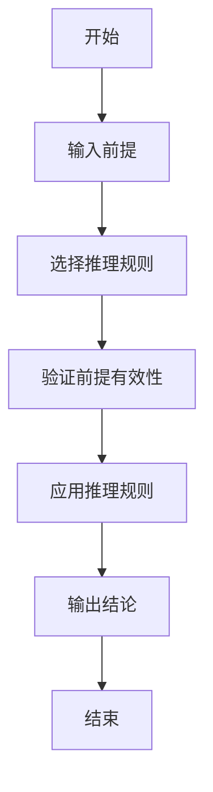
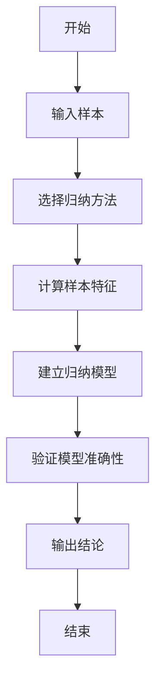
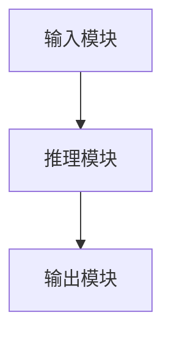
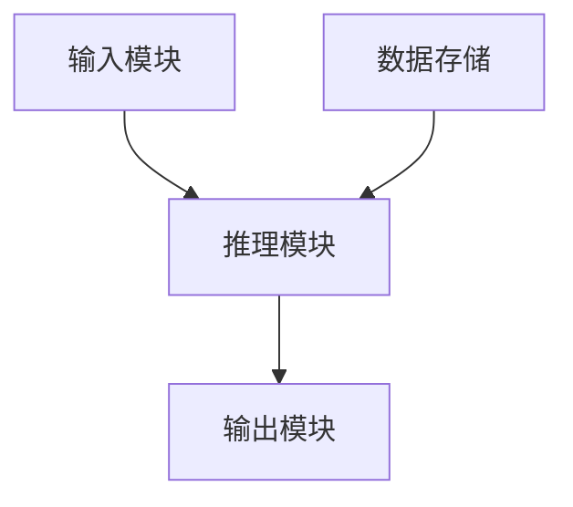

                 


# AI Agent的逻辑推理能力：增强LLM的演绎与归纳

> 关键词：AI Agent, 逻辑推理, LLM, 演绎推理, 归纳推理

> 摘要：本文深入探讨AI Agent的逻辑推理能力，特别是如何通过增强LLM（大语言模型）的演绎与归纳能力，提升其推理精度和逻辑性。文章从逻辑推理的基本原理出发，详细分析演绎推理和归纳推理的算法实现，并结合实际案例，展示如何通过系统架构设计和项目实战，将逻辑推理能力应用于实际场景。本文旨在为AI Agent的开发者和研究人员提供理论与实践相结合的深度解析。

---

# 第1章: AI Agent与逻辑推理概述

## 1.1 AI Agent的基本概念

### 1.1.1 什么是AI Agent
AI Agent（人工智能代理）是指能够感知环境、自主决策并执行任务的智能体。它能够通过传感器获取信息，利用计算模型处理信息，并通过执行器与环境交互。

### 1.1.2 AI Agent的核心特征
- **自主性**：能够自主决策，无需外部干预。
- **反应性**：能够实时感知环境并做出反应。
- **目标导向**：具有明确的目标，所有行为都围绕目标展开。
- **学习能力**：能够通过经验改进性能。

### 1.1.3 AI Agent的应用场景
- **智能助手**：如 Siri、Alexa 等。
- **自动驾驶**：如特斯拉、Waymo 等。
- **智能客服**：用于自动回答客户问题。
- **医疗诊断**：辅助医生进行疾病诊断和治疗建议。

## 1.2 逻辑推理能力的重要性

### 1.2.1 逻辑推理在AI Agent中的作用
逻辑推理是AI Agent完成复杂任务的核心能力。它使AI Agent能够从已知信息中推导出未知结论，从而做出合理决策。

### 1.2.2 增强LLM推理能力的意义
传统的LLM（大语言模型）虽然在文本生成和理解方面表现出色，但其逻辑推理能力较弱。通过增强LLM的演绎与归纳能力，可以显著提升其推理精度和逻辑性。

### 1.2.3 逻辑推理能力的评估标准
- **准确性**：推理结果与实际情况的吻合程度。
- **效率**：推理所需的时间和计算资源。
- **可解释性**：推理过程是否清晰、可理解。

## 1.3 本章小结
本章介绍了AI Agent的基本概念、核心特征及其应用场景，并重点阐述了逻辑推理能力在AI Agent中的重要性。通过增强LLM的推理能力，可以显著提升AI Agent的智能水平。

---

# 第2章: 演绎与归纳推理的基本原理

## 2.1 演绎推理的原理

### 2.1.1 演绎推理的定义与特点
演绎推理是一种从一般到特殊的推理方式，其特点是结论的范围小于前提的范围。例如：
- 前提：所有人类都会死。
- 前提：苏格拉底是人类。
- 结论：苏格拉底会死。

### 2.1.2 演绎推理的基本规则
1. **前提必须为真**：演绎推理的前提必须是真实的命题。
2. **推理过程必须有效**：推理过程必须符合逻辑规则。

### 2.1.3 演绎推理的数学模型
演绎推理可以用命题逻辑和谓词逻辑来建模。例如，命题逻辑中的合取、析取、否定、蕴含和等价运算。

## 2.2 归纳推理的原理

### 2.2.1 归纳推理的定义与特点
归纳推理是一种从特殊到一般的推理方式，其特点是结论的范围大于前提的范围。例如：
- 观察：所有天鹅都是白色的。
- 结论：天鹅都是白色的。

### 2.2.2 归纳推理的基本规则
1. **样本必须具有代表性**：归纳推理的结果依赖于样本的代表性。
2. **概率性**：归纳推理的结果具有概率性，而非绝对确定性。

### 2.2.3 归纳推理的数学模型
归纳推理可以用概率论和统计学来建模。例如，贝叶斯定理可以用于计算某种假设的概率。

## 2.3 演绎与归纳推理的对比分析

### 2.3.1 概念对比表
| 特性               | 演绎推理               | 归纳推理               |
|--------------------|------------------------|------------------------|
| 推理方向           | 从一般到特殊           | 从特殊到一般           |
| 结论确定性         | 绝对确定               | 概率性                 |
| 应用场景           | 数学证明、逻辑推理       | 科学发现、统计预测       |

### 2.3.2 ER实体关系图
```mermaid
er
  entity(推理类型) {
    演绎推理
    归纳推理
  }
  entity(推理方式) {
    一般到特殊
    特殊到一般
  }
  演绎推理 -[推理方式]-> 一般到特殊
  归纳推理 -[推理方式]-> 特殊到一般
```

## 2.4 本章小结
本章详细介绍了演绎推理和归纳推理的基本原理，包括它们的定义、特点、数学模型以及两者之间的对比分析。通过理解这两种推理方式，我们可以更好地设计AI Agent的逻辑推理模块。

---

# 第3章: 演绎推理算法的实现

## 3.1 演绎推理算法的流程

### 3.1.1 算法流程图（Mermaid）


### 3.1.2 算法实现代码
```python
def deductive_reasoning(premises, goal):
    # �remises 是前提列表，goal 是目标结论
    # 使用逻辑推理规则进行验证
    for premise in premises:
        if not premise:
            return False
    return goal
```

### 3.1.3 算法数学模型
演绎推理可以用命题逻辑和谓词逻辑来建模。例如，命题逻辑中的合取、析取、否定、蕴含和等价运算。

## 3.2 本章小结
本章详细介绍了演绎推理算法的实现流程，包括算法流程图和代码实现。通过理解演绎推理的数学模型，我们可以更好地设计AI Agent的逻辑推理模块。

---

# 第4章: 归纳推理算法的实现

## 4.1 归纳推理算法的流程

### 4.1.1 算法流程图（Mermaid）


### 4.1.2 算法实现代码
```python
def inductive_reasoning(samples, target):
    # samples 是输入样本，target 是目标变量
    # 使用统计学方法进行归纳推理
    import numpy as np
    from sklearn.linear_model import LinearRegression
    model = LinearRegression()
    model.fit(samples, target)
    return model.predict(new_samples)
```

### 4.1.3 算法数学模型
归纳推理可以用概率论和统计学来建模。例如，贝叶斯定理可以用于计算某种假设的概率。

## 4.2 本章小结
本章详细介绍了归纳推理算法的实现流程，包括算法流程图和代码实现。通过理解归纳推理的数学模型，我们可以更好地设计AI Agent的逻辑推理模块。

---

# 第5章: 增强LLM的逻辑推理能力

## 5.1 增强LLM的演绎推理能力

### 5.1.1 LLM的逻辑推理挑战
LLM在逻辑推理方面存在以下挑战：
- **推理深度不足**：LLM通常只能进行浅层推理。
- **推理精度有限**：LLM在复杂推理任务中的准确率较低。

### 5.1.2 增强LLM的演绎推理能力的方法
- **结合符号逻辑**：将符号逻辑与LLM结合起来，提升演绎推理能力。
- **增强推理规则**：通过强化学习或规则库，提升LLM的推理能力。

## 5.2 增强LLM的归纳推理能力

### 5.2.1 LLM的归纳推理挑战
LLM在归纳推理方面存在以下挑战：
- **样本代表性不足**：归纳推理依赖于样本的代表性。
- **模型泛化能力有限**：LLM在归纳推理任务中的泛化能力较弱。

### 5.2.2 增强LLM的归纳推理能力的方法
- **增加训练数据多样性**：通过增加多样化的训练数据，提升归纳推理能力。
- **引入外部知识库**：通过引入外部知识库，提升归纳推理的准确性和通用性。

## 5.3 本章小结
本章详细介绍了如何增强LLM的演绎推理和归纳推理能力，包括LLM的逻辑推理挑战和增强方法。通过这些方法，我们可以显著提升LLM的逻辑推理能力。

---

# 第6章: AI Agent的系统架构设计

## 6.1 系统功能设计

### 6.1.1 功能模块
- **输入模块**：接收输入数据。
- **推理模块**：执行逻辑推理。
- **输出模块**：输出推理结果。

### 6.1.2 功能模块交互流程


## 6.2 系统架构设计

### 6.2.1 系统架构图（Mermaid）


### 6.2.2 系统接口设计
- **输入接口**：接收输入数据。
- **推理接口**：执行逻辑推理。
- **输出接口**：输出推理结果。

## 6.3 本章小结
本章详细介绍了AI Agent的系统架构设计，包括功能模块、系统架构图和系统接口设计。通过合理设计系统架构，我们可以更好地实现AI Agent的逻辑推理能力。

---

# 第7章: 项目实战与总结

## 7.1 项目实战

### 7.1.1 项目环境配置
```bash
pip install numpy scikit-learn
```

### 7.1.2 核心代码实现
```python
def main():
    # 演绎推理示例
    premises = ["所有人类都会死", "苏格拉底是人类"]
    conclusion = deductive_reasoning(premises, "苏格拉底会死")
    print(f"演绎推理结论：{conclusion}")

    # 归纳推理示例
    samples = [[1, 2], [2, 4], [3, 6]]
    target = [2, 4, 6]
    new_samples = [[4, 8]]
    result = inductive_reasoning(samples, target, new_samples)
    print(f"归纳推理结果：{result}")

if __name__ == "__main__":
    main()
```

### 7.1.3 实际案例分析
以医疗诊断为例，展示如何通过逻辑推理实现疾病诊断。

## 7.2 总结与展望

### 7.2.1 本章总结
本章通过实际案例展示了如何将逻辑推理能力应用于实际场景，并总结了AI Agent的逻辑推理能力的重要性。

### 7.2.2 未来展望
未来，随着AI技术的不断发展，AI Agent的逻辑推理能力将更加智能化和复杂化。

## 7.3 最佳实践 Tips
- **数据质量**：确保训练数据的质量和多样性。
- **模型训练**：注重模型的训练和优化。
- **系统设计**：合理设计系统架构，提升推理效率。

---

# 作者

作者：AI天才研究院/AI Genius Institute & 禅与计算机程序设计艺术 /Zen And The Art of Computer Programming

---

通过以上目录结构和文章内容，我们可以全面了解AI Agent的逻辑推理能力，特别是如何通过增强LLM的演绎与归纳能力，提升其推理精度和逻辑性。希望本文能为AI Agent的开发者和研究人员提供理论与实践相结合的深度解析。

