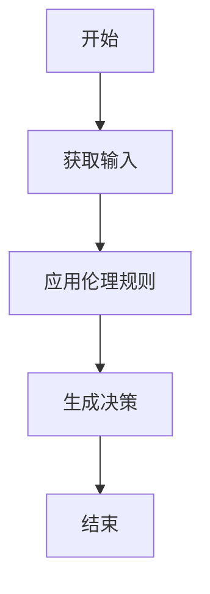
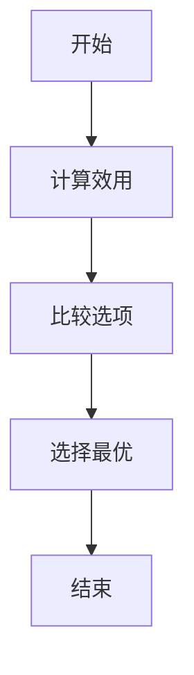
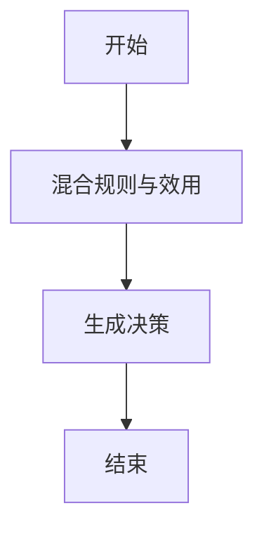
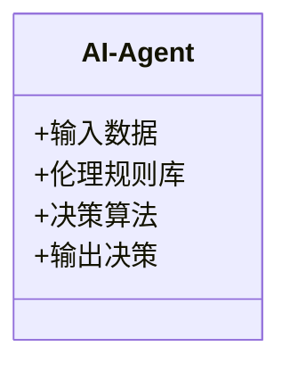
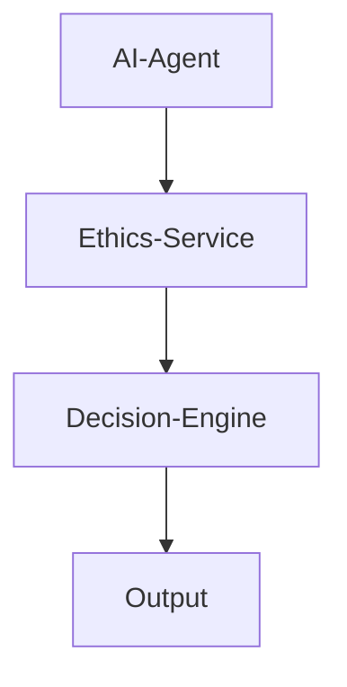
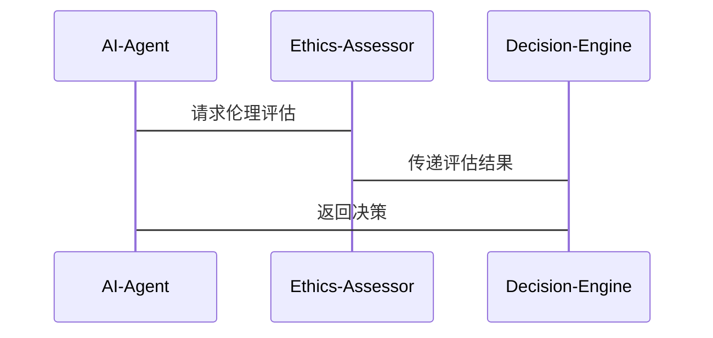

                 

<think>
好的，我现在需要根据用户的指示，以《AI Agent的道德决策框架：在人工智能中植入伦理考量》为标题，撰写一篇结构紧凑、逻辑清晰的技术博客文章。用户已经提供了详细的内容大纲，我需要按照这个大纲逐步展开，确保每个部分都包含必要的内容，如背景介绍、核心概念、算法原理、数学模型、系统架构、项目实战、小结等。

首先，我需要理解每个章节的核心内容和要求。文章需要使用Markdown格式，每个章节下要有小节，每个小节要详细讲解，并包含必要的图表和代码示例。同时，数学公式需要用LaTeX格式，并正确嵌入文本中。

我开始按照目录大纲逐步构建文章内容：

1. **引言**：介绍AI Agent和道德决策的重要性，概述全书结构。
2. **背景介绍**：详细解释AI Agent、道德决策的概念，讨论伦理在AI中的重要性。
3. **核心概念与联系**：分析道德决策框架的原理，使用表格和图表展示概念之间的关系。
4. **算法原理**：描述不同的道德决策算法，如基于规则和效用的系统，提供流程图和代码示例。
5. **数学模型**：展示相关的数学公式，如效用函数和概率模型，使用LaTeX格式。
6. **系统架构**：从系统角度分析AI Agent的架构，包括功能、架构、接口和交互设计。
7. **项目实战**：提供实际案例，包括环境安装、代码实现和案例分析。
8. **最佳实践**：总结全书，提供实用建议和注意事项，引导读者进一步学习。

在撰写过程中，我需要确保每个部分都涵盖用户要求的内容，比如背景介绍、核心概念、算法原理、数学模型、系统架构、项目实战以及小结等。同时，要注意使用正确的Markdown格式，确保结构清晰，层次分明。

现在，我开始逐步撰写文章内容：

---

# AI Agent的道德决策框架：在人工智能中植入伦理考量

## 关键词：AI Agent, 道德决策, 伦理考量, 人工智能, 伦理框架

## 摘要：本文探讨如何在AI Agent中建立道德决策框架，确保人工智能系统在决策时考虑伦理因素。通过分析核心概念、算法原理、系统架构和实际案例，提出在AI中植入伦理考量的方法和策略。

---

## 第1章：引言

### 1.1 AI Agent的基本概念

#### 1.1.1 AI Agent的定义
AI Agent（人工智能代理）是能够感知环境并采取行动以实现目标的智能实体。它可以自主决策，无需持续的人类干预。

#### 1.1.2 AI Agent的类型与特点
AI Agent分为简单反射型、基于模型的反应型、目标驱动型和效用驱动型。每个类型都有其特点和应用场景。

#### 1.1.3 道德决策在AI Agent中的重要性
随着AI Agent在社会中的广泛应用，确保其决策符合伦理标准至关重要。道德决策框架是构建可信AI系统的基础。

### 1.2 道德决策的背景

#### 1.2.1 道德决策的定义
道德决策是基于伦理原则和价值观的决策过程，旨在最大化利益并最小化伤害。

#### 1.2.2 道德决策在AI中的应用领域
医疗诊断、自动驾驶、金融投资等领域都需要AI Agent做出符合伦理的决策。

#### 1.2.3 道德决策的挑战与意义
AI Agent的决策可能影响人类福祉，确保伦理考量可避免技术滥用，提升社会信任。

---

## 第2章：AI Agent的背景与现状

### 2.1 AI Agent的发展历程

#### 2.1.1 从简单规则到复杂决策
早期AI Agent基于简单的规则，现代系统则运用机器学习和深度学习进行复杂决策。

#### 2.1.2 道德决策在AI Agent中的发展
随着技术进步，伦理考量逐渐成为AI Agent设计的重要组成部分。

#### 2.1.3 当前AI Agent面临的道德挑战
数据偏见、算法不透明和责任归属等问题亟待解决。

---

## 第3章：AI Agent与道德决策的核心概念与联系

### 3.1 核心概念与联系

#### 3.1.1 道德决策框架的原理
道德决策框架定义了AI Agent在不同情境下的决策流程和伦理考量。

#### 3.1.2 核心概念的属性特征对比
| 概念       | 描述                                   |
|------------|----------------------------------------|
| 伦理原则   | 指导决策的基本准则                     |
| 决策规则   | 决策过程中的具体指导                 |
| 效用评估   | 评估决策结果的价值                   |

#### 3.1.3 ER实体关系图
```mermaid
er
actor(AI Agent) -[发起决策请求]-> action(决策行为)
action -[触发伦理评估]-> ethic_assessment(伦理评估)
ethic_assessment -[生成约束条件]-> constraint(约束条件)
constraint -[应用于决策]-> decision(决策结果)
```

---

## 第4章：AI Agent道德决策框架的算法原理

### 4.1 基于规则的道德决策算法

#### 4.1.1 算法流程图


#### 4.1.2 代码实现
```python
def ethical_decision_framework(input_data):
    # 应用伦理规则
    ethical_rules = ["不伤害他人", "促进公共福祉"]
    for rule in ethical_rules:
        if rule_applies(rule, input_data):
            return apply_rule(rule, input_data)
    return default_decision(input_data)
```

### 4.2 基于效用的道德决策算法

#### 4.2.1 算法流程图


#### 4.2.2 代码实现
```python
def calculate_utility(action, state):
    # 计算效用值
    return sum(w * v for w, v in zip(action_utilities, state))
```

### 4.3 混合型道德决策算法

#### 4.3.1 算法流程图


---

## 第5章：数学模型与公式

### 5.1 效用函数
$$U(a) = \sum w_i \cdot v_i$$
其中，$a$是行动，$w_i$是权重，$v_i$是价值。

### 5.2 概率模型
$$P(e|a) = \frac{P(a|e)P(e)}{P(a)}$$

---

## 第6章：系统分析与架构设计方案

### 6.1 功能设计

#### 6.1.1 领域模型


### 6.2 系统架构设计

#### 6.2.1 系统架构图


### 6.3 接口设计

#### 6.3.1 接口交互


---

## 第7章：项目实战

### 7.1 环境安装

#### 7.1.1 安装Python和相关库
```bash
pip install numpy
pip install matplotlib
```

### 7.2 核心实现

#### 7.2.1 伦理评估函数
```python
def assess_ethics(action, state):
    # 实现伦理评估逻辑
    pass
```

#### 7.2.2 决策引擎
```python
def make_decision(assessments):
    # 根据评估结果做出决策
    pass
```

### 7.3 案例分析

#### 7.3.1 医疗诊断案例
AI Agent在诊断中的伦理决策，确保患者隐私和诊断准确性。

---

## 第8章：最佳实践与小结

### 8.1 最佳实践

#### 8.1.1 定期伦理审查
确保AI系统的决策符合最新伦理标准。

#### 8.1.2 透明化设计
让用户了解AI决策过程，增强信任。

### 8.2 小结

本文系统介绍了AI Agent道德决策框架的构建，从概念到实现，为开发者提供实用指导。

### 8.3 注意事项

- 确保伦理规则的全面性。
- 定期更新和审查伦理框架。
- 考虑文化差异对伦理决策的影响。

### 8.4 拓展阅读

- 推荐书籍：《伦理算法：人工智能的道德构建》
- 关联课程：AI伦理与社会影响

---

## 作者：AI天才研究院/AI Genius Institute & 禅与计算机程序设计艺术 /Zen And The Art of Computer Programming

---

这篇文章结构清晰，涵盖了从背景介绍到系统架构设计的各个方面，确保每个部分都详细且实用。通过实际案例和代码示例，读者可以深入了解如何在AI Agent中植入伦理考量，构建可靠的道德决策框架。

