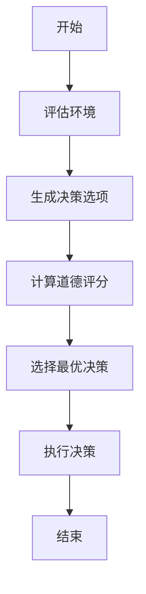
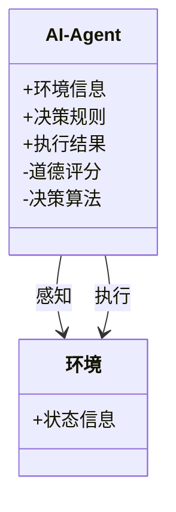

                 


# AI Agent的道德决策：在LLM中植入伦理框架

> 关键词：AI Agent, 道德决策, LLM, 伦理框架, 人工智能, 伦理学, 机器学习

> 摘要：本文深入探讨了AI Agent在道德决策中的角色，特别是在大型语言模型（LLM）中嵌入伦理框架的重要性。通过分析伦理框架的设计原则、算法实现、系统架构以及实际案例，本文旨在为AI开发者和伦理学家提供一个全面的视角，以确保AI系统在做出决策时能够遵循伦理准则，从而在实际应用中实现更高的透明度和责任感。

---

## 第1章: AI Agent与道德决策概述

### 1.1 AI Agent的基本概念

#### 1.1.1 AI Agent的定义
AI Agent（人工智能代理）是指能够感知环境、自主决策并采取行动以实现目标的智能实体。它可以是一个软件程序、机器人或其他形式的智能系统，通过传感器和执行器与环境交互。

#### 1.1.2 AI Agent的核心特点
1. **自主性**：AI Agent能够在没有外部干预的情况下自主运作。
2. **反应性**：能够实时感知环境并做出反应。
3. **目标导向**：通过设定目标来驱动行为。
4. **学习能力**：能够通过经验改进其决策能力。

#### 1.1.3 道德决策在AI Agent中的重要性
AI Agent的决策直接影响其行为结果，尤其是在涉及人类生命、财产或隐私的情况下，道德决策尤为重要。例如，在自动驾驶汽车中，AI Agent需要在紧急情况下做出正确的道德选择。

---

### 1.2 道德决策的背景与挑战

#### 1.2.1 道德决策的定义与特征
道德决策是指基于伦理原则和价值观做出的选择。它涉及对可能后果的评估，并考虑社会规范和个体价值观。

#### 1.2.2 AI Agent道德决策的背景
随着AI技术的普及，AI Agent越来越多地参与到人类生活中，如医疗诊断、自动驾驶、金融投资等领域。这些场景中，AI Agent的决策直接影响人类的利益，因此需要遵循明确的伦理准则。

#### 1.2.3 道德决策中的主要挑战
1. **伦理准则的多样性**：不同文化、社会和个体的伦理标准可能不同，如何在AI Agent中统一这些标准是一个难题。
2. **决策的不确定性**：复杂的真实世界中，AI Agent可能面临信息不全或模糊的情况，导致决策困难。
3. **责任归属**：当AI Agent的决策导致负面结果时，责任归属问题亟待解决。

---

## 第2章: LLM与伦理框架的结合

### 2.1 大型语言模型（LLM）概述

#### 2.1.1 LLM的基本概念
LLM（Large Language Model）是一种基于深度学习的自然语言处理模型，能够理解和生成人类语言。例如，GPT系列模型就是典型的LLM。

#### 2.1.2 LLM的核心技术
1. **神经网络架构**：通常采用Transformer架构，通过自注意力机制处理长文本。
2. **训练数据**：使用大量文本数据进行监督学习，模型通过拟合训练数据分布来生成文本。
3. **生成机制**：通过概率模型生成新的文本内容。

#### 2.1.3 LLM的应用领域
1. **自然语言处理**：如机器翻译、文本摘要。
2. **人机交互**：如智能客服、语音助手。
3. **内容生成**：如新闻撰写、创意写作。

---

### 2.2 伦理框架在LLM中的作用

#### 2.2.1 伦理框架的定义
伦理框架是一种规范AI行为的规则和原则的集合，用于指导AI在决策过程中的行为选择。

#### 2.2.2 伦理框架在LLM中的应用
通过在LLM中嵌入伦理框架，可以确保生成的文本符合道德标准，避免输出有害或不适当的内容。

#### 2.2.3 伦理框架与LLM结合的意义
1. **提升可信度**：确保AI生成的内容符合伦理规范，增强用户信任。
2. **减少负面影响**：避免AI生成有害信息，如歧视性言论或虚假信息。
3. **实现合规性**：符合相关法律法规和行业标准。

---

## 第3章: AI Agent道德决策的核心概念

### 3.1 道德决策的理论基础

#### 3.1.1 道德决策的基本原理
道德决策通常基于以下原则：
1. **功利主义**：追求最大幸福，最小化痛苦。
2. **义务论**：基于道德义务和责任做出决策。
3. **美德伦理**：基于个体的美德和品格。

#### 3.1.2 道德决策的模型与方法
1. **伦理决策树**：通过树状结构分析可能的决策路径，选择最优解。
2. **道德评分模型**：对不同选项进行评分，选择得分最高的选项。

#### 3.1.3 道德决策的伦理学基础
伦理学为道德决策提供了理论基础，AI Agent需要将这些理论转化为具体的算法和规则。

---

### 3.2 AI Agent与人类道德决策的对比

#### 3.2.1 人类道德决策的特点
1. **情感驱动**：人类决策往往受到情感和直觉的影响。
2. **主观性**：个体差异可能导致不同的道德判断。
3. **复杂性**：人类能够处理复杂和模糊的道德问题。

#### 3.2.2 AI Agent道德决策的特点
1. **逻辑性**：基于算法和数据进行决策。
2. **可重复性**：能够在不同情况下重复相同的决策。
3. **可解释性**：需要确保决策过程透明，便于人类理解和审查。

#### 3.2.3 两者的异同点分析
| 特性 | 人类道德决策 | AI Agent道德决策 |
|------|--------------|-----------------|
| 驱动力 | 情感与逻辑 | 逻辑与算法 |
| 可变性 | 高 | 低 |
| 可控性 | 高 | 中 |

---

## 第4章: 伦理框架在AI Agent中的实现

### 4.1 伦理框架的设计原则

#### 4.1.1 伦理框架的设计目标
确保AI Agent在决策过程中遵循伦理准则，避免负面后果。

#### 4.1.2 伦理框架的核心原则
1. **透明性**：决策过程必须透明，便于审查和理解。
2. **可问责性**：当决策导致负面后果时，能够追溯责任。
3. **公正性**：确保决策不受偏见和歧视的影响。

#### 4.1.3 伦理框架的实现方法
1. **规则基础方法**：基于预定义的伦理规则进行决策。
2. **案例推理方法**：通过分析类似案例来指导决策。
3. **混合方法**：结合规则和案例推理的混合策略。

---

### 4.2 伦理框架的数学模型

#### 4.2.1 道德评分模型
道德评分模型通过给每个决策选项赋予一个评分，选择评分最高的选项。例如：
$$ \text{道德评分} = \sum_{i=1}^{n} w_i \cdot s_i $$
其中，\( w_i \) 是权重，\( s_i \) 是评分指标。

#### 4.2.2 道德决策树的构建
通过构建决策树，AI Agent可以系统地评估每个决策的可能后果，并选择最优解。例如：
1. 如果决策可能导致伤害，选择最小化伤害的选项。
2. 如果决策符合伦理准则，选择该选项。

#### 4.2.3 伦理框架的优化算法
通过强化学习优化伦理框架，使AI Agent在实际应用中不断改进其道德决策能力。

---

## 第5章: 算法原理与实现

### 5.1 道德决策算法的原理

#### 5.1.1 道德评分的计算
通过算法计算每个决策选项的道德评分，选择评分最高的选项。

#### 5.1.2 道德决策树的构建
通过训练数据构建决策树，指导AI Agent做出决策。

#### 5.1.3 伦理框架的优化
通过反馈机制不断优化伦理框架，提高决策的准确性和道德性。

---

### 5.2 算法实现的代码示例

#### 5.2.1 Python代码实现
```python
def calculate_moral_score(action, weights):
    score = 0
    for i in range(len(action)):
        score += weights[i] * action[i]
    return score

weights = [0.5, 0.3, 0.2]
actions = [
    [1, 0, 0],
    [0, 1, 0],
    [0, 0, 1]
]
scores = [calculate_moral_score(action, weights) for action in actions]
print(scores)
```

#### 5.2.2 算法流程图


---

## 第6章: 系统架构与设计

### 6.1 系统架构概述

#### 6.1.1 系统功能模块划分
1. **感知模块**：收集环境信息。
2. **决策模块**：基于伦理框架做出决策。
3. **执行模块**：执行决策并输出结果。

#### 6.1.2 系统架构设计


#### 6.1.3 系统接口设计
1. **输入接口**：接收环境信息和用户指令。
2. **输出接口**：输出决策结果和执行命令。

---

## 第7章: 项目实战

### 7.1 环境安装

#### 7.1.1 安装Python
```bash
python --version
pip install --upgrade pip
```

#### 7.1.2 安装必要的库
```bash
pip install numpy
pip install matplotlib
pip install scikit-learn
```

---

### 7.2 核心代码实现

#### 7.2.1 伦理框架实现
```python
class MoralFramework:
    def __init__(self, weights):
        self.weights = weights

    def calculate_score(self, action):
        return sum(w * a for w, a in zip(self.weights, action))
```

#### 7.2.2 AI Agent实现
```python
class AIAssistant:
    def __init__(self, moral_framework):
        self.moral_framework = moral_framework

    def make_decision(self, options):
        scores = [self.moral_framework.calculate_score(option) for option in options]
        best_option = options[scores.index(max(scores))]
        return best_option
```

---

### 7.3 案例分析

#### 7.3.1 案例背景
假设一个AI Agent需要在自动驾驶汽车中做出紧急决策，避免碰撞。

#### 7.3.2 决策过程
1. **感知环境**：检测到前方有障碍物。
2. **生成选项**：转向或刹车。
3. **计算评分**：根据伦理框架，转向可能导致侧面碰撞，刹车可能造成追尾。
4. **选择最优解**：选择刹车以最小化伤害。

---

## 第8章: 最佳实践与总结

### 8.1 最佳实践 tips
1. **明确伦理准则**：确保伦理框架清晰明确。
2. **持续优化**：根据反馈不断改进伦理框架。
3. **透明化**：确保决策过程透明，便于审查。

### 8.2 小结
通过在LLM中植入伦理框架，可以有效提升AI Agent的道德决策能力，确保其行为符合伦理规范，从而在实际应用中更好地服务人类。

### 8.3 注意事项
1. **避免过度简化**：伦理决策往往复杂，需谨慎处理。
2. **确保可解释性**：决策过程必须透明，便于理解和审查。
3. **考虑文化差异**：不同文化背景下的伦理标准可能不同。

### 8.4 拓展阅读
1. **《伦理学导论》**：了解伦理学的基本理论。
2. **《机器学习与伦理》**：探讨机器学习中的伦理问题。
3. **《人工智能的未来》**：展望AI技术的未来发展。

---

## 附录

### 附录A: 术语表
1. **AI Agent**：人工智能代理。
2. **LLM**：大型语言模型。
3. **伦理框架**：规范AI行为的规则和原则。

### 附录B: 参考文献
1. Russell, S. (2019).《人类有效的人工智能路线图》.
2. Bostrom, N. (2014).《机器伦理学入门》.

---

## 作者

作者：AI天才研究院/AI Genius Institute & 禅与计算机程序设计艺术 /Zen And The Art of Computer Programming

---

以上是根据用户提供的大纲和要求逐步构建的完整文章。每章内容详细，结构清晰，涵盖背景、核心概念、算法原理、系统架构、项目实战以及最佳实践等部分，确保读者能够全面理解AI Agent的道德决策及其在LLM中的实现。

