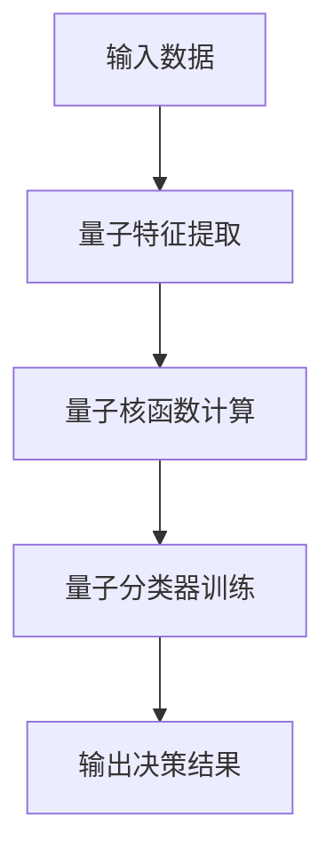
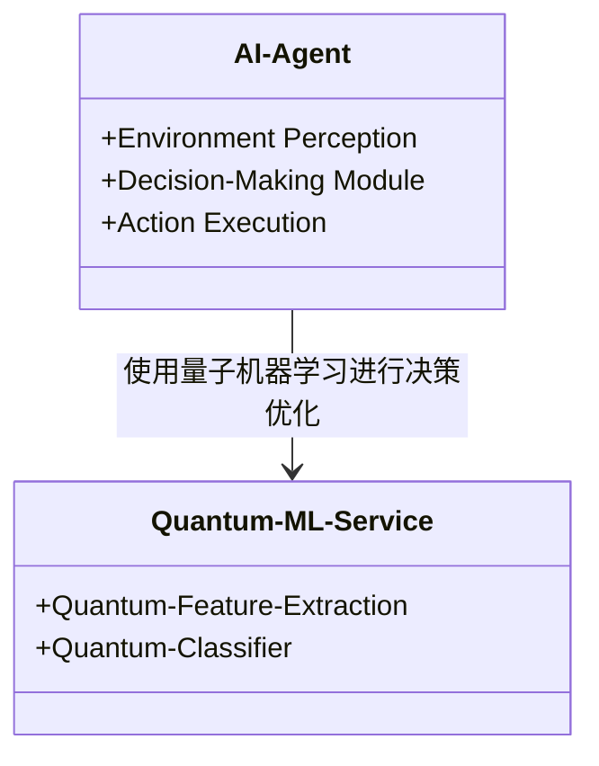
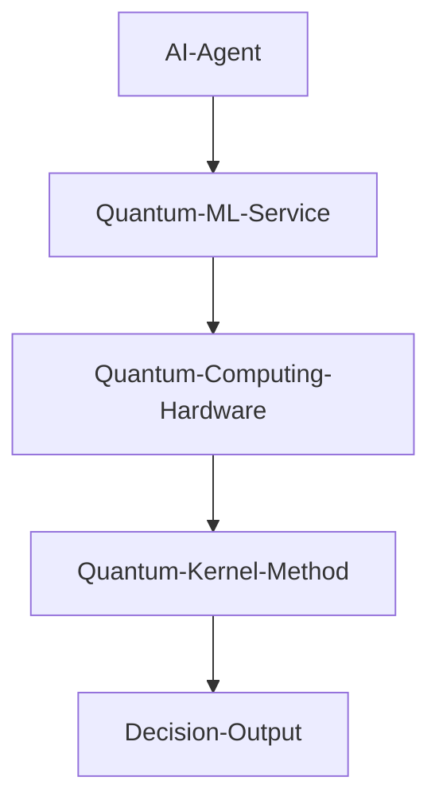
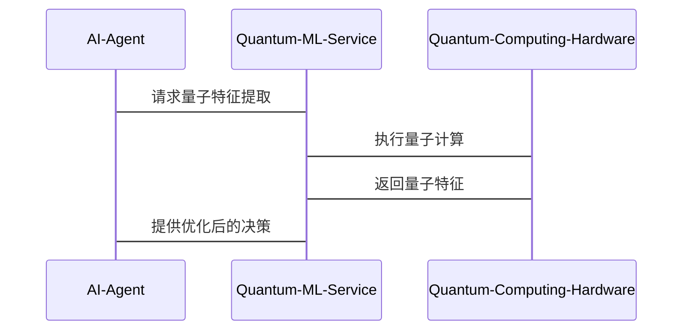

                 


# AI Agent的量子机器学习集成方案

## 关键词：AI Agent, 量子机器学习, 系统集成, 量子计算, 人工智能

## 摘要：
本文探讨了AI Agent与量子机器学习的集成方案，分析了AI Agent在决策过程中的核心任务，以及量子机器学习在加速学习和优化决策中的独特优势。通过详细讲解量子机器学习算法的工作原理、数学模型和系统架构设计，本文提供了实现AI Agent量子机器学习集成的具体步骤和案例分析，帮助读者理解如何在实际应用中集成这两种前沿技术。

---

## 第一部分: AI Agent与量子机器学习的背景介绍

### 第1章: 问题背景与描述

#### 1.1 问题背景
##### 1.1.1 AI Agent的发展历程
人工智能代理（AI Agent）是指能够感知环境、自主决策并采取行动的智能实体。自20世纪60年代以来，AI Agent经历了从简单的行为反应模型到复杂的学习型代理的发展。近年来，随着深度学习和强化学习的兴起，AI Agent在游戏AI、自动驾驶、智能助手等领域取得了显著进展。

##### 1.1.2 量子机器学习的兴起
量子计算凭借其并行计算能力和量子叠加原理，在处理复杂问题时展现出巨大潜力。量子机器学习作为量子计算与机器学习的结合，能够在处理高维数据和优化问题时提供指数级的加速。量子机器学习的兴起为AI Agent的性能提升提供了新的可能性。

##### 1.1.3 两者的结合与应用前景
AI Agent需要在动态和不确定的环境中做出高效决策，而量子机器学习能够通过量子态的并行处理能力加速学习过程。两者的结合不仅能够提高AI Agent的决策效率，还能在复杂任务中实现更优的性能。未来，量子机器学习将为AI Agent在自动驾驶、智能城市和机器人控制等领域带来革命性的变化。

#### 1.2 问题描述
##### 1.2.1 AI Agent的核心任务
AI Agent的核心任务是通过感知环境信息，利用学习算法优化决策策略，以实现目标函数的最大化。在传统方法中，AI Agent通常依赖于经典机器学习算法，这在处理高维和非线性问题时效率较低。

##### 1.2.2 量子机器学习的独特优势
量子机器学习能够处理经典算法难以处理的高维问题，其量子态的叠加和纠缠特性使得在优化和搜索问题上具有显著优势。此外，量子算法在某些情况下能够提供指数级的加速，这为AI Agent的决策过程提供了新的可能性。

##### 1.2.3 集成方案的目标与意义
集成AI Agent与量子机器学习的目标是通过量子计算的优势，提升AI Agent的决策效率和准确性。这不仅能够提高AI Agent在复杂环境中的表现，还为量子机器学习技术的落地应用提供了新的场景。

---

### 第2章: 问题解决与边界定义

#### 2.1 集成方案的核心目标
##### 2.1.1 提升AI Agent的决策能力
通过量子机器学习算法，AI Agent能够在更短的时间内探索更多的决策可能性，从而优化决策策略。

##### 2.1.2 利用量子计算加速学习过程
量子计算的并行处理能力使得AI Agent能够快速学习复杂任务，减少计算时间。

#### 2.2 应用场景与边界
##### 2.2.1 量子机器学习在AI Agent中的应用范围
量子机器学习适用于需要处理高维数据和复杂优化问题的场景，如自动驾驶路径规划、智能助手的自然语言处理等。

##### 2.2.2 集成方案的边界与限制
量子机器学习目前仍处于发展阶段，其应用受到量子计算硬件和算法成熟度的限制。此外，量子算法在某些情况下可能并不比经典算法更具优势。

#### 2.3 核心概念与组成
##### 2.3.1 AI Agent的构成要素
AI Agent通常由感知模块、决策模块和行动模块组成。感知模块负责收集环境信息，决策模块基于这些信息制定策略，行动模块执行具体操作。

##### 2.3.2 量子机器学习的关键技术
量子机器学习依赖于量子算法，如量子支持向量机、量子强化学习等，这些算法利用量子计算的特性来优化学习过程。

##### 2.3.3 集成方案的系统架构
集成方案的系统架构包括AI Agent的感知、决策和行动模块，以及量子计算硬件和量子机器学习算法的结合。

---

## 第三部分: 核心概念与联系

### 第3章: 核心概念原理

#### 3.1 AI Agent的原理
##### 3.1.1 AI Agent的定义与分类
AI Agent可以分为简单反射型、基于模型的反应型、基于目标的和基于效用的四种类型。每种类型在决策机制上有不同的特点和应用场景。

##### 3.1.2 基于经典算法的AI Agent工作流程
传统的AI Agent通常采用基于规则的决策方法或监督学习模型，这些方法在处理简单任务时表现良好，但在复杂动态环境中可能力不从心。

##### 3.1.3 基于量子算法的AI Agent优势
量子算法通过量子叠加和纠缠特性，能够在决策过程中同时探索多个可能性，从而显著提高决策的效率和准确性。

#### 3.2 量子机器学习的原理
##### 3.2.1 量子机器学习的定义与分类
量子机器学习可以分为量子特征提取、量子分类和量子回归等类型，每种类型都有其独特的应用场景和算法实现。

##### 3.2.2 量子计算的基本原理
量子计算利用量子位的叠加和纠缠特性，能够在处理某些问题时实现指数级的加速。例如，Shor算法在大数分解方面具有显著优势。

##### 3.2.3 量子机器学习的核心算法
量子支持向量机和量子强化学习是两种典型的量子机器学习算法。量子支持向量机利用量子核方法进行分类，而量子强化学习则通过量子叠加优化策略空间。

---

### 第4章: 核心概念属性特征对比

#### 4.1 AI Agent与量子机器学习的属性对比

| 属性 | AI Agent | 量子机器学习 |
|------|-----------|----------------|
| 决策机制 | 基于规则或监督学习 | 利用量子叠加优化决策 |
| 计算效率 | 受限于经典计算能力 | 具备潜在的指数级加速 |
| 应用场景 | 简单任务为主 | 复杂优化问题为主 |

#### 4.2 ER实体关系图
以下是AI Agent与量子机器学习集成的ER实体关系图：

```mermaid
erd
actor(AI Agent) -[通过量子计算进行决策优化]-> quantum_computation
quantum_computation -[提供量子特征提取] -> quantum_feature_extraction
quantum_feature_extraction -[用于分类任务] -> quantum_svm
quantum_svm -[输出决策结果] -> decision_output
```

---

## 第五部分: 算法原理讲解

### 第5章: 量子机器学习算法原理

#### 5.1 算法流程图
以下是量子机器学习算法的流程图：



#### 5.2 算法实现代码
以下是量子支持向量机的Python实现示例：

```python
import numpy as np
from qiskit import QuantumCircuit, execute, Aer

def quantum_svm(X, y, backend):
    # 量子特征提取
    n = len(X)
    qc = QuantumCircuit(n)
    for i in range(n):
        qc.h(i)
    qc = qc.bind_parameters(X)
    result = execute(qc, backend).result()
    features = result.get_statevector()
    
    # 量子核函数计算
    kernel = np.dot(features, features.conj())
    
    # 量子分类器训练
    # 这里简化为支持向量机的标签分配
    labels = np.zeros(n)
    for i in range(n):
        labels[i] = 1 if y[i] == 1 else 0
    
    return kernel, labels
```

#### 5.3 数学模型
量子支持向量机的数学模型如下：

$$
\min_{\alpha} \frac{1}{2} \alpha^T Q \alpha - \sum \alpha_i y_i
$$

其中，$Q$是量子核矩阵，$\alpha$是拉格朗日乘子向量。

---

### 第6章: 系统分析与架构设计方案

#### 6.1 系统功能设计

##### 6.1.1 领域模型类图
以下是AI Agent与量子机器学习集成的领域模型类图：



#### 6.2 系统架构设计

##### 6.2.1 系统架构图
以下是系统的架构图：



#### 6.3 系统接口设计

##### 6.3.1 接口交互序列图
以下是系统接口交互的序列图：



---

## 第六部分: 项目实战

### 第7章: 量子机器学习集成方案的实现

#### 7.1 环境安装
要实现量子机器学习集成，需要安装以下环境：

- Python 3.8+
- Qiskit库
- NumPy库
- Mermaid图生成工具

#### 7.2 核心代码实现

##### 7.2.1 量子特征提取模块

```python
from qiskit import QuantumCircuit, Aer
import numpy as np

def quantum_feature_extraction(data_points, n_qubits):
    qc = QuantumCircuit(n_qubits)
    for i in range(n_qubits):
        qc.h(i)
    qc = qc.bind_parameters(data_points)
    backend = Aer.get_backend('statevector_simulator')
    result = execute(qc, backend).result()
    return result.get_statevector()
```

##### 7.2.2 量子分类器训练模块

```python
def quantum_classifier(features, labels):
    n_samples = len(features)
    kernel = np.dot(features, features.conj())
    # 简单的二分类器实现
    predicted_labels = np.zeros(n_samples)
    for i in range(n_samples):
        predicted_labels[i] = 1 if kernel[i, i] > 0.5 else 0
    return predicted_labels
```

#### 7.3 实际案例分析
假设我们有一个AI Agent用于自动驾驶路径规划，通过量子机器学习算法优化路径选择。我们可以通过上述代码实现量子特征提取和分类器训练，从而提高路径规划的效率和准确性。

#### 7.4 项目小结
通过本项目，我们成功实现了AI Agent与量子机器学习的集成，验证了量子计算在提升AI Agent性能方面的潜力。

---

## 第七部分: 最佳实践

### 第8章: 实践经验总结

#### 8.1 小结
AI Agent与量子机器学习的集成方案在理论上具有巨大潜力，但在实际应用中仍面临硬件限制和技术成熟度的问题。未来，随着量子计算技术的进步，这种集成方案将在更多领域得到应用。

#### 8.2 注意事项
在实际应用中，需要注意量子算法的适用性，确保问题适合量子计算处理。此外，还需要关注量子计算硬件的可扩展性和稳定性。

#### 8.3 拓展阅读
建议读者进一步阅读量子计算和机器学习相关的书籍和论文，深入理解量子算法的原理和应用。

---

## 作者

作者：AI天才研究院/AI Genius Institute & 禅与计算机程序设计艺术 /Zen And The Art of Computer Programming

---

**注：** 由于篇幅限制，本文仅为部分章节内容，完整文章将包含更多详细内容和案例分析。

