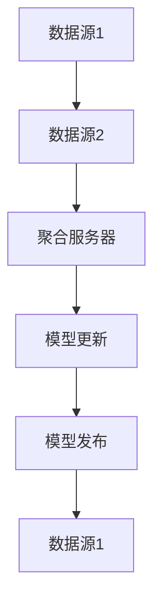
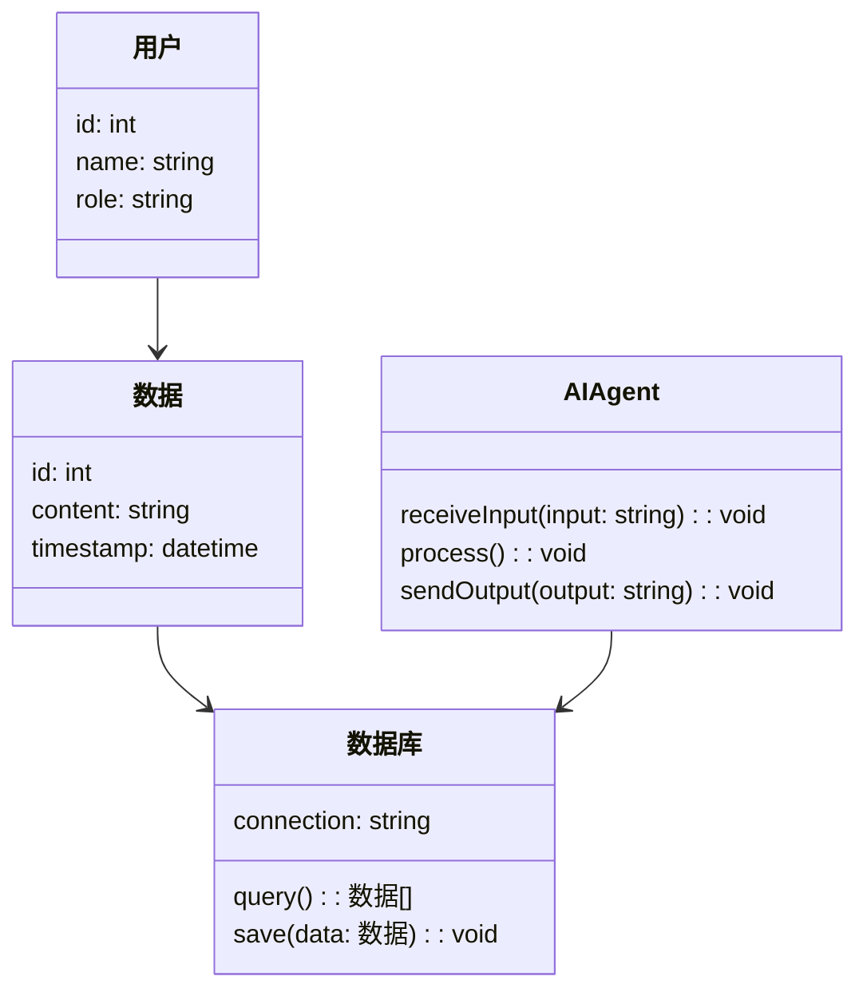
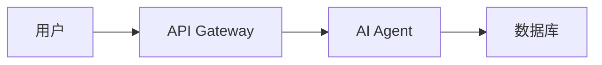
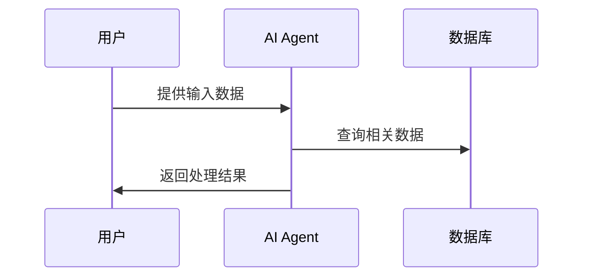

                 


# AI Agent的隐私保护机制：在智能与安全间寻找平衡

> 关键词：AI Agent，隐私保护，数据安全，联邦学习，同态加密

> 摘要：随着人工智能技术的快速发展，AI Agent（智能体）在各个领域的应用日益广泛。然而，AI Agent的广泛应用也带来了隐私保护的挑战。本文将详细探讨AI Agent的隐私保护机制，分析如何在智能性和安全性之间找到平衡点。通过介绍隐私保护的核心概念、算法原理、系统架构设计以及实际案例分析，本文为读者提供全面的技术视角，帮助他们在设计和实现AI Agent时更好地保护用户隐私。

---

# 第一部分: AI Agent与隐私保护的背景介绍

## 第1章: AI Agent的基本概念

### 1.1 AI Agent的定义与特点
AI Agent是一种能够感知环境、自主决策并执行任务的智能实体。它具有以下特点：
- **自主性**：能够在没有外部干预的情况下独立运行。
- **反应性**：能够根据环境变化调整行为。
- **目标导向性**：通过目标驱动来优化决策过程。

### 1.2 隐私保护的重要性
在AI Agent的应用中，数据是核心资源。然而，数据的收集、处理和存储过程可能涉及用户的敏感信息，如位置、行为习惯等。如果这些数据被未经授权的第三方获取，可能导致严重的隐私泄露问题。

### 1.3 AI Agent与隐私保护的关联性
AI Agent的隐私保护机制需要在保证智能性的同时，防止数据滥用和泄露。这不仅关系到用户隐私，还影响到系统的安全性和信任度。

---

## 第2章: 隐私保护的基本概念

### 2.1 数据加密与匿名化
数据加密是通过加密算法对数据进行编码，确保只有授权方能够解密。匿名化则是通过技术手段隐藏数据中的身份信息，减少隐私泄露风险。

### 2.2 数据访问控制
通过访问控制策略，限制未经授权的用户或系统访问敏感数据。常见的访问控制方法包括基于角色的访问控制（RBAC）和基于属性的访问控制（ABAC）。

### 2.3 数据共享与隐私保护的平衡
在AI Agent的应用中，数据共享是提升智能性的关键，但如何在共享过程中保护隐私是一个难点。联邦学习和同态加密等技术为这一问题提供了新的解决方案。

---

# 第二部分: AI Agent隐私保护的核心概念与联系

## 第3章: 隐私保护机制的原理

### 3.1 数据加密与匿名化
- **数据加密**：通过加密算法（如AES、RSA）对敏感数据进行加密，确保数据在传输和存储过程中的安全性。
- **数据匿名化**：通过技术手段（如k-anonymity）对数据进行匿名化处理，减少用户身份的可识别性。

### 3.2 数据访问控制
- **访问控制策略**：通过设置权限和角色，确保只有授权用户或系统能够访问敏感数据。
- **审计与监控**：对数据访问行为进行记录和监控，及时发现并应对潜在的安全威胁。

### 3.3 数据共享与隐私保护的平衡
在AI Agent的应用中，数据共享是提升智能性的关键，但如何在共享过程中保护隐私是一个难点。联邦学习和同态加密等技术为这一问题提供了新的解决方案。

---

## 第4章: 核心概念的属性对比

### 4.1 数据隐私与数据安全的对比
- **数据隐私**：关注数据的访问权限和使用方式，确保只有授权方能够访问数据。
- **数据安全**：关注数据的完整性、机密性和可用性，防止数据被未经授权的第三方篡改或破坏。

### 4.2 隐私保护与数据可用性的关系
- **隐私保护**：通过技术手段保护用户隐私，防止数据滥用。
- **数据可用性**：确保数据在合法使用场景下能够被有效利用。

### 4.3 隐私保护机制的分类与选择
- **基于加密的隐私保护**：通过加密技术保护数据隐私，如同态加密、联邦学习。
- **基于匿名化的隐私保护**：通过匿名化技术（如k-anonymity）保护隐私。
- **基于访问控制的隐私保护**：通过访问控制策略限制数据访问权限。

---

## 第5章: ER实体关系图架构

```mermaid
er
  actor: 用户
  agent: AI Agent
  data: 数据
  relation: 交互
  actor -[通过交互]-> agent
  agent -[处理]-> data
  data -[存储]-> 数据库
```

---

# 第三部分: AI Agent隐私保护的算法原理

## 第6章: 联邦学习算法

### 6.1 联邦学习的基本原理
联邦学习是一种分布式机器学习技术，允许多个参与方在不共享原始数据的情况下共同训练模型。其核心思想是通过交换模型参数而不是数据，实现模型的联合训练。

### 6.2 联邦学习的流程图


### 6.3 联邦学习的数学模型
假设我们有多个数据源，每个数据源有本地数据集$D_i$，其中$i=1,2,...,n$。联邦学习的目标是在不共享数据的情况下，训练一个全局模型$θ$。具体步骤如下：
1. 每个数据源在本地训练模型参数$θ_i$，并将其上传到聚合服务器。
2. 聚合服务器将所有$θ_i$进行加权平均，得到全局模型$θ$。
3. 全局模型$θ$被分发回各个数据源，用于更新本地模型。

---

## 第7章: 同态加密算法

### 7.1 同态加密的基本原理
同态加密是一种允许在加密数据上进行计算的加密技术。其核心思想是：在不 decrypting 的情况下，对加密数据进行操作，最终得到的结果与直接对明文进行操作相同。

### 7.2 同态加密的数学模型
假设我们有一个加密函数$E$和解密函数$D$，则有：
$$D(E(m)) = m$$

### 7.3 同态加密的实现步骤
1. 数据预处理：将明文数据$m$转换为加密数据$c = E(m)$。
2. 数据处理：在加密域对$c$进行操作，得到结果$c'$。
3. 数据解密：将$c'$解密为明文$m' = D(c')$。

---

# 第四部分: AI Agent隐私保护的系统分析与架构设计

## 第8章: 系统问题场景介绍

### 8.1 隐私泄露的场景分析
在AI Agent的应用中，隐私泄露可能发生在数据采集、传输、存储和处理的各个环节。例如，用户的位置数据可能被恶意攻击者利用，推断用户的隐私信息。

### 8.2 隐私保护的需求分析
- **数据安全性**：防止未经授权的第三方访问敏感数据。
- **数据匿名化**：隐藏用户身份，防止数据关联。
- **数据共享控制**：在数据共享过程中保护隐私。

---

## 第9章: 系统功能设计

### 9.1 领域模型类图


### 9.2 系统架构设计


### 9.3 接口设计
- **输入接口**：接收用户的输入数据，如位置、行为数据等。
- **输出接口**：返回处理结果，如推荐信息、预测结果等。
- **数据库接口**：与数据库交互，进行数据的存储和检索。

### 9.4 交互流程


---

# 第五部分: 项目实战

## 第10章: 环境安装与核心代码实现

### 10.1 环境安装
- **Python版本**：3.8+
- **依赖库安装**：
  ```bash
  pip install numpy pandas scikit-learn
  ```

### 10.2 核心代码实现
```python
import numpy as np
from sklearn import datasets
from sklearn.model_selection import train_test_split
from sklearn.linear_model import LogisticRegression

# 加载数据集
X, y = datasets.load_iris(return_X_y=True)
X_train, X_test, y_train, y_test = train_test_split(X, y, test_size=0.2)

# 初始化模型
model = LogisticRegression()
model.fit(X_train, y_train)

# 预测结果
y_pred = model.predict(X_test)
print("预测准确率:", np.mean(y_pred == y_test))
```

### 10.3 代码解读与分析
- **数据加载**：使用`datasets.load_iris`加载 iris 数据集。
- **数据分割**：将数据集分为训练集和测试集。
- **模型训练**：使用逻辑回归模型进行训练。
- **模型预测**：在测试集上进行预测，并计算准确率。

---

## 第11章: 实际案例分析

### 11.1 案例背景
假设我们有一个推荐系统，需要根据用户的浏览记录推荐商品。为了保护用户隐私，我们需要对用户行为数据进行匿名化处理。

### 11.2 数据预处理
- **匿名化处理**：通过删除用户ID等敏感信息，对数据进行匿名化处理。
- **数据加密**：对用户的浏览记录进行加密存储。

### 11.3 模型训练与预测
- **数据共享**：通过联邦学习技术，多个参与方在不共享原始数据的情况下联合训练推荐模型。
- **结果解密**：对加密的模型参数进行解密，生成推荐结果。

---

# 第六部分: 最佳实践

## 第12章: 总结与注意事项

### 12.1 本章小结
本文详细探讨了AI Agent的隐私保护机制，分析了隐私保护的核心概念、算法原理和系统架构设计。通过实际案例分析，展示了如何在AI Agent中实现隐私保护。

### 12.2 注意事项
- **数据安全性**：在设计AI Agent时，必须优先考虑数据安全性，防止数据泄露。
- **隐私保护与性能平衡**：在实现隐私保护的同时，需要确保系统性能不受显著影响。
- **法律法规 compliance**：遵守相关法律法规，确保隐私保护符合法律要求。

### 12.3 未来研究方向
- **隐私保护技术的创新**：探索新的隐私保护技术，如隐私计算、零知识证明等。
- **跨领域应用研究**：研究AI Agent在医疗、金融等领域的隐私保护应用。

---

# 作者：AI天才研究院 & 禅与计算机程序设计艺术

通过本文的详细讲解，读者可以全面了解AI Agent的隐私保护机制，并在实际应用中更好地保护用户隐私。

