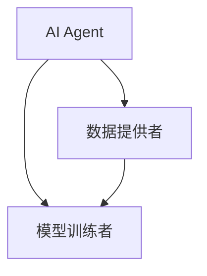
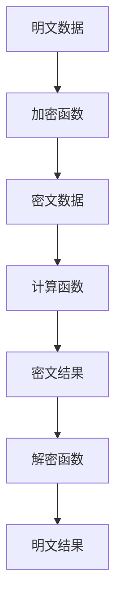
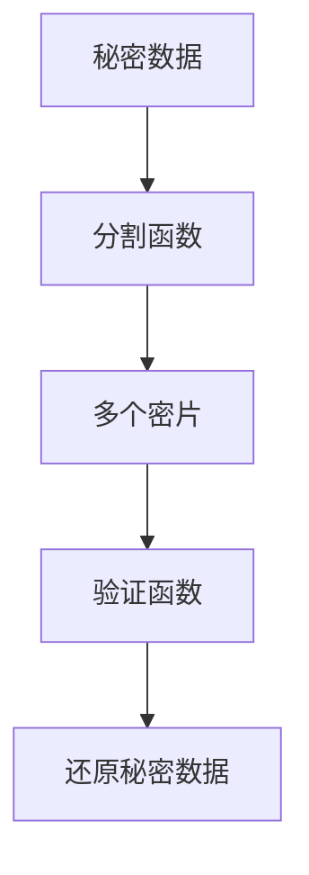
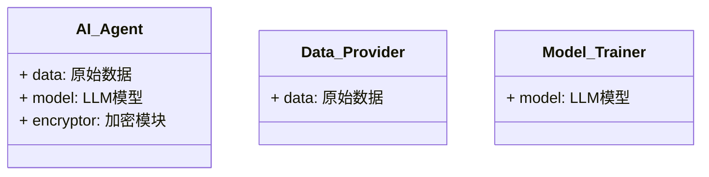
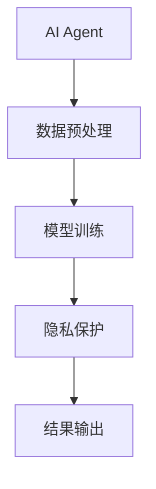
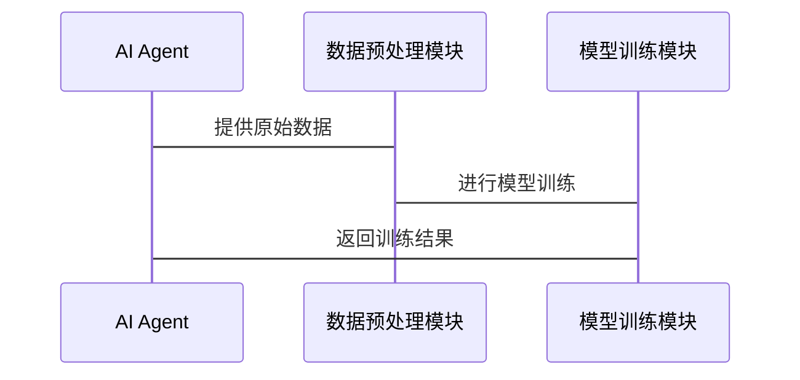

                 


# AI Agent的隐私计算：在保护数据隐私的同时应用LLM

> **关键词**: AI Agent, 隐私计算, 大语言模型, 数据隐私, 隐私保护, 算法原理

> **摘要**: 本文探讨了在AI Agent中应用大语言模型（LLM）时的隐私保护问题，分析了隐私计算的核心概念、算法原理和系统架构设计，提供了实际案例和最佳实践。

---

# 第一部分: AI Agent的隐私计算背景与核心概念

# 第1章: AI Agent与隐私计算的背景介绍

## 1.1 AI Agent的基本概念

### 1.1.1 AI Agent的定义与特点

AI Agent（人工智能代理）是指能够感知环境、自主决策并执行任务的智能实体。与传统的AI系统相比，AI Agent具有以下特点：

- **自主性**：能够在没有外部干预的情况下独立运行。
- **反应性**：能够实时感知环境并做出响应。
- **主动性**：主动采取行动以实现目标。

### 1.1.2 AI Agent的核心功能与应用场景

AI Agent的核心功能包括：

- **感知环境**：通过传感器或其他数据源获取信息。
- **决策制定**：基于获取的信息进行推理和决策。
- **执行操作**：根据决策结果执行具体操作。

AI Agent的应用场景包括自动驾驶、智能助手、智能客服等。

### 1.1.3 AI Agent与传统AI的区别

传统AI系统通常依赖于预定义的规则和数据，而AI Agent具备更强的自主性和适应性，能够根据动态环境调整行为。

---

## 1.2 隐私计算的核心概念

### 1.2.1 隐私计算的定义与目标

隐私计算是指在保护数据隐私的前提下进行数据处理和计算。其目标是在不泄露原始数据的情况下，实现数据的分析和计算。

### 1.2.2 隐私计算的主要技术手段

隐私计算的主要技术手段包括：

- **同态加密**：允许在加密数据上进行计算，结果仍为加密状态。
- **秘密分享**：将数据分割成多个部分，每个部分都无法单独还原原始数据。
- **联邦学习**：在分布式数据源上进行联合训练，避免数据集中存储。

### 1.2.3 隐私计算的数学基础

隐私计算的数学基础主要包括加密算法、概率论和组合数学等。

---

## 1.3 LLM与隐私计算的结合

### 1.3.1 大语言模型（LLM）的基本原理

LLM是一种基于深度学习的自然语言处理模型，能够理解和生成人类语言。其基本原理包括词嵌入、注意力机制和解码器等。

### 1.3.2 LLM在隐私保护中的应用需求

在AI Agent中应用LLM时，需要保护用户的隐私数据，如个人信息和交互记录。

### 1.3.3 AI Agent与LLM的结合场景

AI Agent可以利用LLM进行自然语言理解、对话生成和知识推理，同时通过隐私计算技术保护数据隐私。

---

## 1.4 本章小结

本章介绍了AI Agent的基本概念、隐私计算的核心概念以及LLM在隐私保护中的应用需求。

---

# 第2章: 隐私计算的核心概念与联系

## 2.1 隐私计算的数学模型

### 2.1.1 同态加密的数学基础

同态加密是一种允许在加密数据上进行计算的技术。其数学基础主要包括模运算和加密函数。

### 2.1.2 隐私计算中的加密函数

加密函数是隐私计算的核心，常见的加密函数包括加法同态加密和乘法同态加密。

### 2.1.3 隐私计算的数学公式

$$ \text{加密函数} = f(x) $$

$$ \text{解密函数} = g(f(x)) = x $$

---

## 2.2 隐私计算与AI Agent的实体关系

### 2.2.1 实体关系图



---

## 2.3 LLM与隐私计算的结合原理

### 2.3.1 数据流的隐私保护机制

数据在AI Agent中经过加密、计算和解密的过程，确保数据隐私。

### 2.3.2 LLM在隐私保护中的角色

LLM负责处理和生成文本，而隐私计算技术负责保护数据。

---

## 2.4 本章小结

本章详细讲解了隐私计算的数学模型和实体关系，并探讨了LLM在隐私保护中的作用。

---

# 第3章: 隐私计算的算法原理

## 3.1 同态加密算法

### 3.1.1 同态加密的原理与流程



### 3.1.2 同态加密的Python代码实现

```python
def encrypt(x, key):
    return x ^ key

def decrypt(c, key):
    return c ^ key
```

### 3.1.3 同态加密的数学公式

$$ \text{加密} = x \oplus k $$

$$ \text{解密} = (x \oplus k) \oplus k = x $$

---

## 3.2 秘密分享算法

### 3.2.1 秘密分享的原理与流程



### 3.2.2 秘密分享的Python代码实现

```python
def share_secret(x, k):
    return [x % k, x // k]

def recover_secret(shares):
    return shares[0] + shares[1] * k
```

---

## 3.3 本章小结

本章详细讲解了同态加密和秘密分享的算法原理及其代码实现。

---

# 第4章: 系统分析与架构设计

## 4.1 系统功能设计

### 4.1.1 领域模型



### 4.1.2 系统架构设计



---

## 4.2 系统接口设计

系统接口包括数据输入接口、模型训练接口和结果输出接口。

---

## 4.3 系统交互设计



---

## 4.4 本章小结

本章设计了AI Agent的系统架构和交互流程，并展示了系统的各个模块之间的关系。

---

# 第5章: 项目实战

## 5.1 环境配置

安装必要的库：

```bash
pip install transformers numpy
```

---

## 5.2 核心实现

### 5.2.1 数据预处理

```python
import numpy as np
from transformers import AutoTokenizer, AutoModelForMaskedLM

tokenizer = AutoTokenizer.from_pretrained('bert-base-uncased')
model = AutoModelForMaskedLM.from_pretrained('bert-base-uncased')
```

### 5.2.2 模型训练

```python
def train_model(model, tokenizer):
    # 训练代码
    pass

train_model(model, tokenizer)
```

### 5.2.3 隐私保护

```python
def encrypt_data(data, key):
    return data ^ key

def decrypt_data(cipher, key):
    return cipher ^ key
```

---

## 5.3 实际案例分析

通过具体案例展示如何在AI Agent中应用LLM进行隐私保护。

---

## 5.4 本章小结

本章通过实际案例展示了AI Agent中应用LLM进行隐私保护的实现过程。

---

# 第6章: 最佳实践、小结与拓展

## 6.1 最佳实践

- 在实际应用中，建议结合多种隐私保护技术。
- 定期进行安全审计和漏洞修复。

## 6.2 小结

本文详细探讨了AI Agent的隐私计算问题，分析了核心概念、算法原理和系统架构设计，并提供了实际案例和最佳实践。

## 6.3 注意事项

- 确保隐私计算技术的安全性和有效性。
- 定期更新模型和算法，以应对新的安全威胁。

## 6.4 拓展阅读

推荐相关书籍和论文，供读者进一步学习。

---

# 作者

作者：AI天才研究院/AI Genius Institute & 禅与计算机程序设计艺术/Zen And The Art of Computer Programming

---

以上是文章的完整目录结构和内容框架，您可以根据需要进一步扩展每个部分的具体内容。

