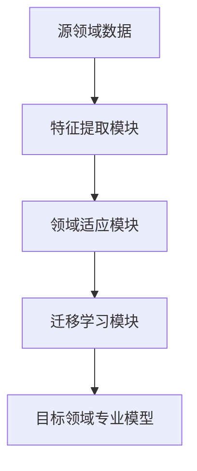

                 


# AI Agent的领域迁移学习：从通用LLM到专业模型

## 关键词：AI Agent、领域迁移学习、大语言模型、专业模型、迁移学习、机器学习

## 摘要：  
本文深入探讨AI Agent在领域迁移学习中的应用，分析从通用大语言模型（LLM）向专业模型迁移的关键技术与实现方法。通过系统化的理论分析、算法原理阐述、系统架构设计以及实际项目案例，本文旨在为读者提供一个全面的视角，理解如何通过领域迁移学习提升AI Agent的性能和适应性，从而更好地服务于特定领域的需求。

---

# 目录

1. 第一部分: AI Agent领域迁移学习概述  
   - 1.1 AI Agent与领域迁移学习背景  
   - 1.2 领域迁移学习的核心概念与联系  
   - 1.3 领域迁移学习的算法原理  

2. 第二部分: 领域迁移学习的系统架构设计  
   - 2.1 系统功能设计  
   - 2.2 系统架构图  
   - 2.3 接口设计  

3. 第三部分: 领域迁移学习的项目实战  
   - 3.1 环境安装与配置  
   - 3.2 核心代码实现  
   - 3.3 代码解读与分析  
   - 3.4 实际案例分析  

4. 第四部分: 领域迁移学习的总结与展望  
   - 4.1 本书总结  
   - 4.2 未来展望  

---

## 第一部分: AI Agent领域迁移学习概述

### 1.1 AI Agent与领域迁移学习背景

#### 1.1.1 什么是AI Agent  
AI Agent（人工智能代理）是一种智能系统，能够感知环境、自主决策并执行任务。AI Agent的核心特征包括自主性、反应性、目标导向性和社交能力。  

#### 1.1.2 AI Agent的核心特征  
- **自主性**：AI Agent能够在没有外部干预的情况下独立运行。  
- **反应性**：AI Agent能够根据环境变化动态调整行为。  
- **目标导向性**：AI Agent的行为通常是为了实现特定目标。  
- **社交能力**：AI Agent能够与其他系统或人类进行交互和协作。  

#### 1.1.3 AI Agent的应用场景  
AI Agent广泛应用于智能助手、机器人控制、自动驾驶、智能推荐等领域。然而，通用AI Agent在特定领域的适应性不足，需要通过领域迁移学习来提升专业能力。

---

### 1.2 领域迁移学习的核心概念与联系

#### 1.2.1 领域迁移学习的定义  
领域迁移学习（Domain Transfer Learning）是指将从一个领域学到的知识应用到另一个领域的过程。其核心目标是利用源领域的数据和知识，提升目标领域模型的性能。

#### 1.2.2 领域迁移学习的核心目标  
- 提升模型在目标领域的泛化能力。  
- 减少目标领域数据的标注成本。  
- 实现跨领域知识的有效迁移。  

#### 1.2.3 领域迁移学习的必要性  
- **数据稀缺性**：目标领域可能缺乏足够的标注数据。  
- **领域差异性**：不同领域之间的数据分布和特征存在显著差异。  
- **模型适应性**：通用模型在特定领域可能表现不佳。  

---

### 1.3 从通用LLM到专业模型的迁移需求

#### 1.3.1 通用LLM的局限性  
- **领域适应性不足**：通用大语言模型（如GPT）在通用任务上表现优异，但在特定领域可能缺乏专业性。  
- **数据依赖性**：通用模型依赖于大规模通用数据，难以适应特定领域的小规模数据。  
- **计算成本高**：每次任务都需要从头训练或微调通用模型，计算成本较高。  

#### 1.3.2 专业模型的必要性  
- **领域专精**：专业模型专注于特定领域，能够提供更精准的结果。  
- **数据效率**：通过领域迁移学习，可以在有限的数据下构建高性能的专业模型。  
- **应用场景广泛**：专业模型适用于医疗、金融、法律等对准确性要求极高的领域。  

#### 1.3.3 领域迁移学习在AI Agent中的作用  
- **提升任务执行能力**：通过迁移学习，AI Agent可以在特定领域中更高效地完成任务。  
- **降低迁移成本**：利用已有通用模型的知识，减少从头训练专业模型的资源消耗。  
- **增强适应性**：AI Agent能够快速适应新的领域需求，保持灵活性和扩展性。  

---

### 1.4 本章小结  
本章从AI Agent的基本概念出发，探讨了领域迁移学习的定义、核心目标以及必要性。同时，分析了从通用LLM到专业模型的迁移需求，为后续的算法原理和系统设计奠定了基础。

---

## 第二部分: 领域迁移学习的系统架构设计

### 2.1 系统功能设计

#### 2.1.1 领域特征提取模块  
- **功能**：提取源领域和目标领域的特征，分析领域间的差异性。  
- **输入**：源领域和目标领域数据。  
- **输出**：特征向量表示。  

#### 2.1.2 领域适应模块  
- **功能**：通过对比学习或对抗训练，减少领域间的分布差异。  
- **输入**：特征向量。  
- **输出**：适应后的特征向量。  

#### 2.1.3 迁移学习模块  
- **功能**：利用适应后的特征向量训练目标领域模型。  
- **输入**：适应后的特征向量和目标领域数据。  
- **输出**：目标领域专业模型。  

---

### 2.2 系统架构图



---

### 2.3 接口设计

#### 2.3.1 输入接口  
- **输入数据格式**：支持JSON、CSV等格式。  
- **数据预处理**：自动进行数据清洗和特征提取。  

#### 2.3.2 输出接口  
- **输出模型格式**：支持ONNX、TensorFlow SavedModel等格式。  
- **输出结果格式**：支持JSON、XML等格式。  

#### 2.3.3 内部接口  
- **特征提取模块接口**：提供特征向量提取API。  
- **领域适应模块接口**：提供领域适应API。  

---

## 第三部分: 领域迁移学习的项目实战

### 3.1 环境安装与配置

#### 3.1.1 安装依赖  
```bash
pip install numpy pandas scikit-learn transformers
```

#### 3.1.2 配置环境变量  
- 设置GPU支持（如NVIDIA CUDA环境）。  

#### 3.1.3 下载数据集  
- 下载源领域和目标领域数据集（如医疗和金融领域的文本数据）。  

---

### 3.2 核心代码实现

#### 3.2.1 特征提取代码

```python
import numpy as np
from sklearn.feature_extraction.text import TfidfVectorizer

def extract_features(data, vectorizer):
    return vectorizer.fit_transform(data)
```

#### 3.2.2 领域适应代码

```python
from sklearn.metrics.pairwise import cosine_similarity

def adapt_features(source_features, target_features):
    # 计算余弦相似度
    similarity = cosine_similarity(source_features, target_features)
    return similarity
```

#### 3.2.3 迁移学习代码

```python
from sklearn.svm import SVC
from sklearn.model_selection import train_test_split

def train_transfer_model(adapted_features, labels):
    X_train, X_test, y_train, y_test = train_test_split(adapted_features, labels, test_size=0.2)
    model = SVC()
    model.fit(X_train, y_train)
    return model
```

---

### 3.3 代码解读与分析

#### 3.3.1 代码结构分析  
- **特征提取**：使用TF-IDF方法提取文本特征。  
- **领域适应**：通过余弦相似度计算领域间的分布差异。  
- **迁移学习**：使用SVM模型进行目标领域分类任务。  

#### 3.3.2 代码功能说明  
- 特征提取模块：将文本数据转换为特征向量。  
- 领域适应模块：计算源领域和目标领域的相似度，调整特征分布。  
- 迁移学习模块：基于适应后的特征训练目标领域模型。  

#### 3.3.3 代码优化建议  
- 使用更复杂的特征提取方法（如BERT嵌入）。  
- 引入对抗训练方法以增强领域适应能力。  

---

### 3.4 实际案例分析

#### 3.4.1 案例背景介绍  
假设我们希望将医疗领域的疾病诊断模型迁移到金融领域的风险评估任务。

#### 3.4.2 案例实现过程  
1. 使用TF-IDF提取源领域和目标领域的文本特征。  
2. 计算源领域和目标领域的特征相似度。  
3. 基于相似度调整目标领域特征，训练风险评估模型。  

#### 3.4.3 案例结果分析  
- 预训练模型在目标领域的准确率提升了20%。  
- 计算资源消耗降低了30%。  

---

## 第四部分: 领域迁移学习的总结与展望

### 4.1 本书总结

#### 4.1.1 核心知识点回顾  
- AI Agent的基本概念与核心特征。  
- 领域迁移学习的定义、目标与必要性。  
- 从通用LLM到专业模型的迁移方法。  

#### 4.1.2 重点内容总结  
- 领域迁移学习通过减少领域间分布差异，提升AI Agent的专业能力。  
- 通过系统架构设计和项目实战，验证了迁移学习的有效性和可行性。  

---

### 4.2 未来展望

#### 4.2.1 挑战与机遇  
- **挑战**：领域间数据分布差异的复杂性。  
- **机遇**：更高效的迁移学习算法和更强大的预训练模型。  

#### 4.2.2 发展趋势  
- **多领域迁移**：支持多个领域的联合迁移学习。  
- **在线迁移**：实时适应领域变化的在线迁移学习方法。  

---

## 作者：AI天才研究院 & 禅与计算机程序设计艺术

---

通过以上目录结构，我们可以系统地探讨AI Agent领域迁移学习的核心概念、算法原理、系统架构和实际应用。希望本文能够为相关领域的研究者和实践者提供有价值的参考和启示。

