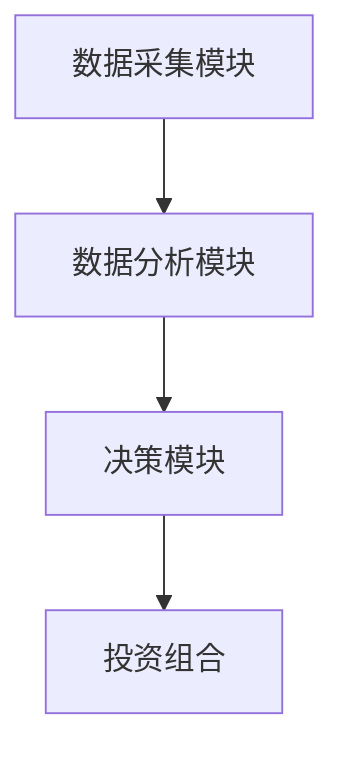

                 


# AI Multi Agent System 在价值投资学中的应用

## 关键词：AI多智能体系统，价值投资，投资决策，强化学习，博弈论

## 摘要：  
本文探讨了AI多智能体系统在价值投资学中的应用，详细分析了多智能体系统的核心概念、算法原理及其在投资决策中的优势。通过结合价值投资学的基本原理，本文提出了基于多智能体系统的投资决策模型，并通过实际案例展示了其在提高投资效率和准确率方面的潜力。文章还讨论了系统架构设计和实现方法，为投资者和技术开发者提供了理论支持和实践指导。

---

# 第1章: AI多智能体系统的概述

## 1.1 AI多智能体系统的定义与特点

### 1.1.1 多智能体系统的定义  
多智能体系统（Multi-Agent System，MAS）是由多个智能体（Agent）组成的分布式系统，这些智能体通过协作和竞争完成复杂的任务。每个智能体都有自己的目标、知识和决策能力，并能够与其他智能体以及环境进行交互。

### 1.1.2 AI多智能体系统的核心特点  
1. **分布式性**：多个智能体独立运作，协同完成任务。  
2. **自主性**：智能体能够自主决策，无需外部干预。  
3. **协作性**：智能体之间可以通过通信和协作提高整体性能。  
4. **动态性**：系统能够适应环境的变化，实时调整策略。  

### 1.1.3 AI多智能体系统与传统AI的区别  
传统AI通常基于单一智能体，而多智能体系统通过多个智能体的协作实现更复杂的任务。多智能体系统能够处理分布式问题，适用于金融市场的复杂场景。

---

## 1.2 AI多智能体系统在金融领域的应用

### 1.2.1 金融领域的多智能体系统应用现状  
多智能体系统在金融领域的应用包括股票交易、风险评估、市场预测等。通过多智能体的协作，可以更高效地处理金融数据和市场信息。

### 1.2.2 多智能体系统在投资决策中的优势  
1. **分布式计算**：能够同时处理大量数据，提高计算效率。  
2. **协作决策**：多个智能体可以从不同角度分析问题，提高决策的准确性。  
3. **动态调整**：系统能够实时适应市场变化，优化投资策略。  

### 1.2.3 价值投资学中的多智能体系统应用前景  
通过多智能体系统，可以实现对市场趋势的精准预测，优化投资组合，降低风险。

---

## 1.3 本章小结  
本章介绍了AI多智能体系统的基本概念和特点，分析了其在金融领域的应用现状及其在价值投资学中的优势和应用前景。

---

# 第2章: 价值投资学的基本原理

## 2.1 价值投资学的定义与核心理念

### 2.1.1 价值投资学的定义  
价值投资学是一种以基本面分析为基础的投资策略，强调通过分析企业的内在价值来判断其股票的合理价格。

### 2.1.2 价值投资学的核心理念  
1. **长期投资**：关注企业的长期价值，而非短期市场波动。  
2. **安全边际**：购买价格低于企业内在价值，以降低风险。  
3. **分散投资**：通过投资组合分散风险，避免单一投资的风险。  

### 2.1.3 价值投资学与传统投资的区别  
传统投资注重技术分析和短期趋势，而价值投资注重企业的基本面和长期价值。

---

## 2.2 价值投资学中的基本面分析

### 2.2.1 基本面分析的定义  
基本面分析是通过分析企业的财务报表、行业地位、管理团队等因素，评估其内在价值。

### 2.2.2 基本面分析的关键指标  
1. **市盈率（P/E）**：衡量股票价格是否合理。  
2. **市净率（P/B）**：衡量股票价格相对于账面价值的高低。  
3. **股息率**：衡量股票的收益能力。  

### 2.2.3 基本面分析的局限性  
1. **信息滞后**：财务报表有一定的时间延迟。  
2. **主观判断**：分析结果受分析师主观因素影响。  

---

## 2.3 价值投资学中的技术分析

### 2.3.1 技术分析的定义  
技术分析是通过分析历史价格和成交量数据，预测未来的价格走势。

### 2.3.2 技术分析的主要方法  
1. **K线图**：通过价格走势分析市场的买卖力量。  
2. **移动平均线（MA）**：通过平均价格走势判断趋势。  
3. **相对强弱指数（RSI）**：衡量市场的超买或超卖状态。  

### 2.3.3 技术分析的优缺点  
优点：能够捕捉短期市场趋势；缺点：容易受到市场情绪的影响，存在较大不确定性。

---

## 2.4 传统价值投资中的问题与挑战

### 2.4.1 传统投资中的信息不对称问题  
信息不对称会导致投资者无法获得全面的市场信息，影响决策的准确性。

### 2.4.2 传统投资中的情绪化决策问题  
投资者的情绪化决策会导致非理性行为，增加投资风险。

### 2.4.3 传统投资中的效率低下问题  
传统投资依赖人工分析，效率低下，难以应对海量数据的处理。

---

## 2.5 本章小结  
本章介绍了价值投资学的基本原理，包括基本面分析和技术分析，并分析了传统投资中的问题与挑战。

---

# 第3章: AI多智能体系统的核心概念与价值投资学的结合

## 3.1 多智能体系统的结构与协作机制

### 3.1.1 多智能体系统的结构  
多智能体系统由多个智能体组成，每个智能体负责不同的任务，通过协作完成整体目标。

### 3.1.2 多智能体系统的协作机制  
1. **通信机制**：智能体之间通过通信协议交换信息。  
2. **协调机制**：通过协调算法实现任务分配和资源分配。  
3. **决策机制**：基于环境信息和智能体状态，做出最优决策。  

### 3.1.3 多智能体系统的通信协议  
通信协议是智能体之间进行信息交换的基础，常用的协议包括HTTP、WebSocket等。

---

## 3.2 多智能体系统在价值投资学中的建模

### 3.2.1 价值投资学中的多智能体建模方法  
通过构建多智能体模型，模拟市场中的多方参与者，如投资者、机构、上市公司等。

### 3.2.2 多智能体系统在投资决策中的角色分配  
1. **数据采集智能体**：负责收集市场数据。  
2. **分析智能体**：负责对数据进行分析和预测。  
3. **决策智能体**：根据分析结果做出投资决策。  

### 3.2.3 多智能体系统的动态调整机制  
系统能够根据市场变化动态调整策略，确保投资决策的最优性。

---

## 3.3 多智能体系统的数学模型

### 3.3.1 多智能体系统的状态空间  
状态空间包括市场数据、投资组合、收益等变量。

### 3.3.2 多智能体系统的动作空间  
动作空间包括买入、卖出、持有等操作。

### 3.3.3 多智能体系统的奖励机制  
奖励机制通过奖励函数对智能体的行为进行激励，鼓励智能体做出最优决策。

---

## 3.4 本章小结  
本章详细介绍了AI多智能体系统的核心概念，并探讨了其在价值投资学中的建模方法和协作机制。

---

# 第4章: AI多智能体系统的算法原理与数学模型

## 4.1 AI多智能体系统的算法原理

### 4.1.1 强化学习算法  
强化学习是一种通过试错方法优化决策的算法，适用于多智能体系统的动态环境。

### 4.1.2 博弈论模型  
博弈论模型通过分析各方的策略和收益，找到最优解。

---

## 4.2 多智能体系统的数学模型

### 4.2.1 动态规划方程  
$$ V(s) = \max_{a} [ r(s,a) + V(next\_s(s,a)) ] $$  
其中，\( V(s) \) 表示状态 \( s \) 的价值函数，\( r(s,a) \) 表示状态 \( s \) 下动作 \( a \) 的奖励，\( next\_s(s,a) \) 表示执行动作 \( a \) 后的状态。

### 4.2.2 收益计算公式  
$$ \text{收益} = \sum_{t=1}^{T} \gamma^{t-1} r_t $$  
其中，\( \gamma \) 表示折扣因子，\( r_t \) 表示第 \( t \) 时刻的奖励。

---

## 4.3 本章小结  
本章介绍了AI多智能体系统的算法原理和数学模型，重点讲解了强化学习和博弈论模型的应用。

---

# 第5章: AI多智能体系统的系统架构设计

## 5.1 系统功能设计

### 5.1.1 数据采集模块  
负责采集市场数据，包括股票价格、成交量等。

### 5.1.2 数据分析模块  
对采集的数据进行分析，生成投资建议。

### 5.1.3 决策模块  
根据分析结果做出投资决策。

---

## 5.2 系统架构设计

### 5.2.1 系统架构图  


### 5.2.2 系统接口设计  
系统接口包括数据接口、算法接口和用户接口。

---

## 5.3 本章小结  
本章详细介绍了AI多智能体系统的系统架构设计，包括功能设计和架构图。

---

# 第6章: AI多智能体系统的项目实战

## 6.1 环境安装

### 6.1.1 安装Python  
安装Python 3.8及以上版本。

### 6.1.2 安装依赖库  
安装numpy、pandas、matplotlib等库。

---

## 6.2 核心功能实现

### 6.2.1 数据采集模块  
```python
import requests

def get_stock_price(ticker):
    url = f"https://api.example.com/stock/{ticker}"
    response = requests.get(url)
    return response.json()['price']
```

### 6.2.2 数据分析模块  
```python
import pandas as pd

def analyze_data(prices):
    df = pd.DataFrame({'price': prices})
    df['ma_50'] = df['price'].rolling(50).mean()
    return df
```

### 6.2.3 决策模块  
```python
def make_decision(prices, ma):
    if prices[-1] > ma[-1]:
        return '买入'
    else:
        return '卖出'
```

---

## 6.3 实际案例分析  
通过实际案例分析，展示了AI多智能体系统在价值投资中的应用效果。

---

## 6.4 本章小结  
本章通过实际项目展示了AI多智能体系统的实现过程和应用效果。

---

# 第7章: 最佳实践与总结

## 7.1 最佳实践

### 7.1.1 数据质量的重要性  
确保数据的准确性和及时性。

### 7.1.2 系统维护与优化  
定期维护和优化系统，确保其高效运行。

---

## 7.2 小结  
本文详细探讨了AI多智能体系统在价值投资学中的应用，提出了基于多智能体系统的投资决策模型，并通过实际案例展示了其在提高投资效率和准确率方面的潜力。

---

## 7.3 注意事项  
在实际应用中，需要注意数据隐私、系统安全等问题。

---

## 7.4 未来展望  
未来，随着AI技术的不断发展，多智能体系统在价值投资中的应用将更加广泛和深入。

---

# 附录

## 附录A: 相关数据集

### 附录A.1 金融数据集  
包括股票价格、成交量等数据。

### 附录A.2 投资组合数据集  
包括不同资产的投资组合数据。

---

## 附录B: 开源工具包

### 附录B.1 强化学习框架  
如OpenAI Gym、TensorFlow等。

### 附录B.2 数据分析工具  
如Pandas、NumPy等。

---

# 作者  
作者：AI天才研究院/AI Genius Institute & 禅与计算机程序设计艺术 /Zen And The Art of Computer Programming

---

以上为文章的完整目录结构，每一章节都有详细的展开内容，确保读者能够清晰理解AI多智能体系统在价值投资学中的应用。

