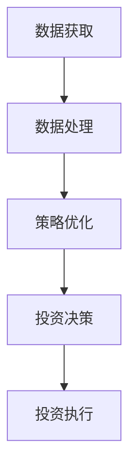
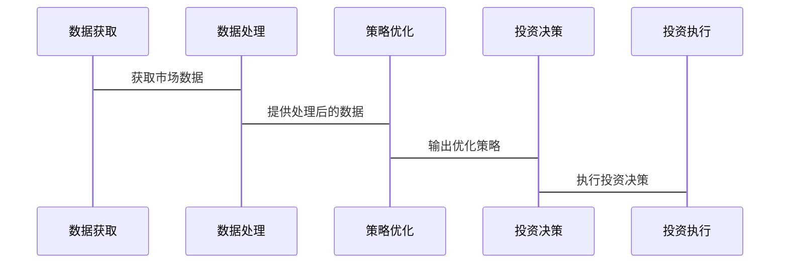

                 


# AI agents优化价值投资策略的动态调整

> 关键词：AI agents、价值投资策略、动态调整、强化学习、动态规划、系统架构、投资系统

> 摘要：本文探讨AI agents如何通过强化学习和动态规划优化价值投资策略，并实现动态调整。文章从背景介绍、算法原理、系统架构到项目实战，详细分析AI技术在投资领域的应用，展示如何利用AI提升投资决策的效率和准确性。

---

## 第一部分：AI agents与价值投资策略概述

### 第1章：AI agents的基本概念

#### 1.1 AI agents的定义与特点
- **AI agents的定义**：AI agents是能够感知环境、执行任务并做出决策的智能体，具备自主性、反应性和社会性。
- **AI agents的特点**：
  - 自主性：无需外部干预，自主决策。
  - 反应性：能实时感知环境变化并调整行为。
  - 社会性：能与其他智能体或人类进行交互协作。
- **AI agents与传统算法的区别**：AI agents具备动态适应性和自主决策能力，而传统算法通常需要手动调整且不具备自主性。

#### 1.2 价值投资策略的基本原理
- **价值投资的定义**：通过分析企业基本面，寻找被市场低估的投资标的，长期持有以实现收益。
- **价值投资的核心原则**：
  - 质量优先：选择财务健康、行业地位稳固的企业。
  - 价格合理：买入价格低于内在价值。
  - 长期持有：避免频繁交易，降低交易成本。
- **价值投资与AI技术的结合**：利用AI技术分析大量数据，识别潜在投资机会，优化投资组合。

### 第2章：AI agents在投资策略中的应用

#### 2.1 AI agents在金融市场的优势
- **数据处理能力**：AI agents能够快速处理和分析海量市场数据，识别复杂市场模式。
- **模型优化能力**：通过强化学习和动态规划，优化投资策略，提升收益。
- **动态调整能力**：实时监控市场变化，及时调整投资组合，降低风险。

#### 2.2 价值投资策略的动态调整
- **动态调整的必要性**：市场环境不断变化，静态策略难以应对复杂情况。
- **动态调整的实现方式**：通过AI agents实时监控市场数据，动态评估投资标的的价值，调整投资组合。
- **动态调整的优化目标**：最大化投资收益，最小化风险。

---

## 第二部分：AI agents的算法与模型

### 第3章：强化学习算法

#### 3.1 强化学习的基本原理
- **强化学习的定义**：一种通过智能体与环境交互，通过试错学习优化策略的算法。
- **强化学习的核心要素**：
  - 状态（State）：智能体所处的环境情况。
  - 动作（Action）：智能体在状态下的决策。
  - 奖励（Reward）：智能体决策后获得的反馈。
  - 策略（Policy）：智能体在状态下的动作选择概率分布。
- **强化学习的数学模型**：
  $$ Q(s, a) = r + \gamma \max_{a'} Q(s', a') $$
  其中，\( Q(s, a) \) 是状态-动作对的价值，\( r \) 是奖励，\( \gamma \) 是折扣因子。

#### 3.2 强化学习在投资策略中的应用
- **状态空间的定义**：市场指数、个股价格、财务指标等。
- **动作空间的定义**：买入、卖出、持有等。
- **奖励函数的设计**：基于投资收益、风险指标（如波动率）设计奖励函数，例如：
  $$ R = \text{收益} - \text{风险} $$

### 第4章：动态规划算法

#### 4.1 动态规划的基本原理
- **动态规划的定义**：一种通过分解问题、解决子问题来优化整体的算法。
- **动态规划的核心步骤**：
  1. 确定状态和转移方程。
  2. 计算状态值函数。
  3. 根据状态值函数制定策略。
- **动态规划的数学模型**：
  $$ V(s) = \max_a \left( r + \gamma V(s') \right) $$

#### 4.2 动态规划在投资策略中的应用
- **动态规划模型**：通过状态转移方程建模市场变化，计算不同状态下的最优投资策略。
- **动态规划的算法实现**：使用贝尔曼方程求解最优策略，例如：
  $$ \pi(s) = \arg\max_a \left( r + \gamma V(s') \right) $$

---

## 第三部分：系统架构与设计

### 第5章：系统架构设计

#### 5.1 问题场景介绍
- **问题场景**：构建一个AI驱动的价值投资系统，能够实时监控市场数据，动态调整投资组合。
- **项目介绍**：设计一个基于强化学习和动态规划的AI投资系统，优化价值投资策略。

#### 5.2 系统功能设计
- **领域模型类图**：展示系统各组件之间的关系，例如数据获取、策略优化、投资决策等。
- **系统架构设计**：使用分层架构，包括数据层、算法层、决策层和执行层。

#### 5.3 系统架构图（Mermaid）


#### 5.4 系统接口设计
- **API接口**：提供数据获取、策略优化、决策执行等功能的接口。
- **数据接口**：与金融市场数据源对接，获取实时数据。

#### 5.5 系统交互流程图（Mermaid）


---

## 第四部分：项目实战

### 第6章：环境安装与核心实现

#### 6.1 环境安装
- **安装Python**：安装Python 3.8及以上版本。
- **安装TensorFlow和Keras**：用于强化学习模型的训练。
- **安装Pandas和NumPy**：用于数据处理和分析。

#### 6.2 核心实现
- **强化学习实现**：使用Keras搭建强化学习模型，训练策略网络。
- **动态规划实现**：使用动态规划算法优化投资策略，计算状态值函数。

#### 6.3 代码示例
```python
import numpy as np
import tensorflow as tf
from tensorflow.keras import layers

# 强化学习模型
class DQN:
    def __init__(self, state_dim, action_dim):
        self.state_dim = state_dim
        self.action_dim = action_dim
        self.model = self.build_model()
    
    def build_model(self):
        model = tf.keras.Sequential()
        model.add(layers.Dense(64, activation='relu', input_dim=self.state_dim))
        model.add(layers.Dense(self.action_dim))
        return model

    def act(self, state):
        state = tf.convert_to_tensor(state)
        with tf.GradientTape() as tape:
            prediction = self.model(state)
            action = tf.argmax(prediction, axis=1).numpy()[0]
        return action

# 动态规划模型
def dynamic_planning():
    import numpy as np
    states = 10
    actions = 3
    V = np.zeros(states)
    for _ in range(100):
        for s in range(states):
            for a in range(actions):
                next_state = ...  # 根据状态转移模型计算
                V[s] = max(V[s], reward(s, a) + 0.9 * V[next_state])
    return V
```

---

## 第五部分：案例分析与优化

### 第7章：案例分析

#### 7.1 案例背景
- **案例目标**：优化价值投资策略，实现动态调整。
- **案例数据**：选取某行业的股票数据，训练AI模型。

#### 7.2 案例分析
- **动态调整过程**：展示AI agents如何根据市场变化调整投资组合。
- **优化效果**：对比传统策略和AI优化策略的收益和风险。

#### 7.3 优化方法
- **优化策略**：结合强化学习和动态规划，进一步优化投资策略。
- **优化结果**：展示优化后的收益和风险指标。

---

## 第六部分：未来展望与挑战

### 第8章：未来展望

#### 8.1 未来趋势
- **技术进步**：AI技术的进一步发展将推动投资策略的优化。
- **多模态数据**：结合文本、图像等多种数据源，提升投资决策的准确性。

#### 8.2 挑战与解决方案
- **技术挑战**：数据量大、计算复杂度高，需要更高效的算法和计算资源。
- **伦理挑战**：AI投资可能引发市场操纵等问题，需建立监管机制。

---

## 作者信息

作者：AI天才研究院/AI Genius Institute & 禅与计算机程序设计艺术 /Zen And The Art of Computer Programming

