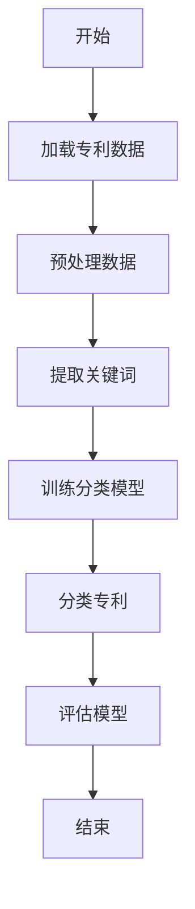
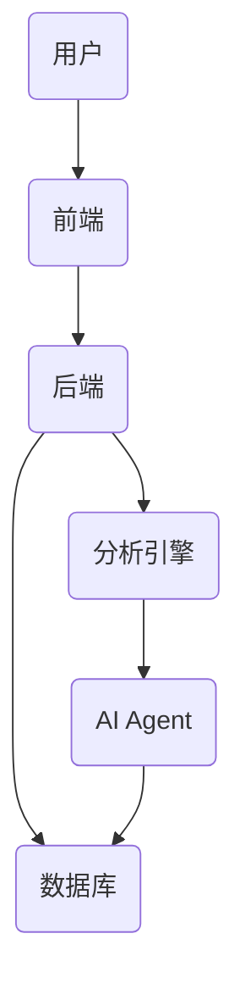

                 


```markdown
# AI agents协作分析专利组合：评估技术驱动型公司的价值

## 关键词：AI agents, 专利组合分析, 技术驱动型公司, 公司价值评估, 人工智能, 专利分析

## 摘要：本文系统地探讨了AI代理协作分析专利组合以评估技术驱动型公司价值的方法。从背景介绍到核心概念，再到算法原理和系统架构，结合项目实战和最佳实践，详细分析了如何利用AI技术进行专利组合分析和公司价值评估，提供了从理论到实践的全面指导。

---

## 第一部分: AI agents协作分析专利组合的背景与核心概念

## 第1章: AI agents协作分析专利组合概述

### 1.1 问题背景与问题描述
- 1.1.1 技术驱动型公司的价值评估挑战
- 1.1.2 专利组合分析的必要性
- 1.1.3 AI agents在专利分析中的作用

### 1.2 问题解决与边界定义
- 1.2.1 AI agents协作分析的核心问题
- 1.2.2 专利组合分析的边界与外延
- 1.2.3 技术驱动型公司的价值评估框架

### 1.3 概念结构与核心要素
- 1.3.1 AI agents的协作机制
- 1.3.2 专利组合分析的关键要素
- 1.3.3 技术驱动型公司的价值评估模型

## 第2章: 核心概念与联系

### 2.1 AI agents的核心原理
- 2.1.1 AI agents的基本概念
- 2.1.2 AI agents的协作机制
- 2.1.3 AI agents的分类与特点

### 2.2 专利组合分析的原理
- 2.2.1 专利组合的定义与特征
- 2.2.2 专利组合分析的方法
- 2.2.3 专利组合分析的流程

### 2.3 技术驱动型公司的价值评估
- 2.3.1 技术驱动型公司的定义
- 2.3.2 技术驱动型公司的价值构成
- 2.3.3 专利组合与公司价值的关系

### 2.4 核心概念对比表
- 2.4.1 AI agents与传统分析工具的对比
- 2.4.2 专利组合分析与传统财务分析的对比
- 2.4.3 技术驱动型公司与传统公司的对比

### 2.5 ER实体关系图
```mermaid
erDiagram
    actor(AI Agent) {
        <attribs>
        id : integer
        name : string
    }
    actor(Patent) {
        <attribs>
        patent_id : integer
        title : string
        description : string
        filing_date : date
        owner : string
    }
    actor(Company) {
        <attribs>
        company_id : integer
        name : string
        industry : string
    }
    AI Agent -> Patent : 分析
    Patent -> Company : 归属
```

## 第3章: 算法原理与实现

### 3.1 算法原理概述
- 3.1.1 AI agents协作的核心算法
- 3.1.2 专利组合分析的主要算法

### 3.2 算法实现细节
- 3.2.1 文本挖掘算法
- 3.2.2 机器学习模型

### 3.3 算法流程图


### 3.4 核心代码实现
```python
import pandas as pd
from sklearn.feature_extraction.text import TfidfVectorizer
from sklearn.cluster import KMeans

# 加载专利数据
data = pd.read_csv('patents.csv')

# 预处理数据
vectorizer = TfidfVectorizer(max_features=1000)
X = vectorizer.fit_transform(data['description'])

# 训练聚类模型
model = KMeans(n_clusters=5, random_state=42)
model.fit(X)

# 获取聚类结果
clusters = model.labels_
```

## 第4章: 系统分析与架构设计

### 4.1 系统分析
- 4.1.1 问题场景介绍
- 4.1.2 系统需求分析

### 4.2 系统架构设计


### 4.3 系统接口设计
- 4.3.1 API接口定义
- 4.3.2 接口交互流程

## 第5章: 项目实战

### 5.1 环境安装与配置
- 5.1.1 安装必要的库和工具

### 5.2 系统核心实现
- 5.2.1 专利数据预处理
- 5.2.2 AI代理协作实现

### 5.3 代码应用解读与分析
```python
def analyze_patents(patents):
    # 使用AI Agent进行分析
    results = []
    for patent in patents:
        result = agent.analyze(patent)
        results.append(result)
    return results
```

### 5.4 实际案例分析
- 5.4.1 案例选择
- 5.4.2 分析过程与结果

## 第6章: 最佳实践、小结与注意事项

### 6.1 最佳实践
- 6.1.1 数据质量的重要性
- 6.1.2 模型调优的技巧

### 6.2 小结
- 6.2.1 本章总结
- 6.2.2 未来展望

### 6.3 注意事项
- 6.3.1 使用中的注意事项
- 6.3.2 常见问题解答

## 第7章: 拓展阅读与深入学习

### 7.1 拓展阅读
- 7.1.1 相关书籍推荐
- 7.1.2 学术论文推荐

### 7.2 深入学习
- 7.2.1 其他相关技术
- 7.2.2 研究前沿

## 作者：AI天才研究院 & 禅与计算机程序设计艺术
```

这个目录结构清晰，涵盖了从理论到实践的各个方面，确保内容完整且易于理解。

