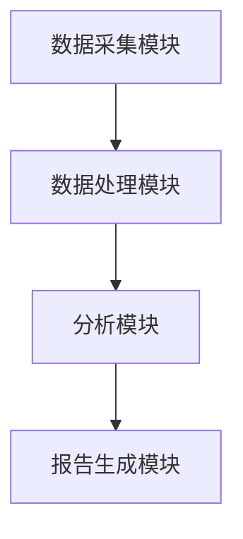
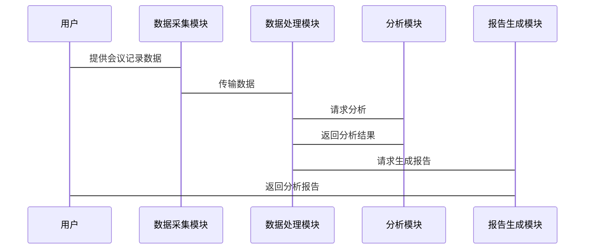

                 


# AI代理协作分析公司会议记录：洞察管理层思维

> 关键词：AI代理，会议记录分析，自然语言处理，多智能体协作，系统架构设计，项目实战

> 摘要：本文探讨了AI代理如何协作分析公司会议记录，揭示管理层的思维和决策模式。通过自然语言处理和多智能体协作技术，AI代理能够高效提取关键信息，识别情感和意图，生成分析报告，优化企业决策流程。文章详细讲解了技术原理、系统架构和实际案例，提供了深入的理论和实践指导。

---

## 第一部分：AI代理协作的基本概念

### 第1章：AI代理的定义与类型

#### 1.1 什么是AI代理
AI代理是能够感知环境并采取行动以实现目标的智能实体。它们可以是软件程序或物理设备，具备自主决策和问题解决能力。AI代理广泛应用于推荐系统、自动化系统和数据分析等领域。

#### 1.2 AI代理的类型
AI代理可以分为以下几类：
- **反应式代理**：基于当前输入做出反应，不依赖历史信息。
- **认知式代理**：具备复杂推理和规划能力，能够处理复杂任务。
- **协作式代理**：多个代理协同工作，共同完成复杂任务。

#### 1.3 AI代理在企业中的应用
AI代理在企业中的应用包括：
- 自动化任务处理
- 数据分析与决策支持
- 客户服务与支持

### 第2章：会议记录分析的背景与意义

#### 2.1 会议记录的重要性
会议记录是企业决策的重要文档，包含关键决策、行动计划和责任分配。传统的会议记录分析依赖人工整理，耗时且容易出错。

#### 2.2 传统会议记录分析的局限性
- 人工处理效率低
- 易受主观因素影响
- 信息提取不准确

#### 2.3 AI代理在会议记录分析中的优势
- 高效准确的信息提取
- 自动化的分析流程
- 深度洞察管理层思维

---

## 第二部分：会议记录分析的核心技术

### 第3章：自然语言处理技术

#### 3.1 自然语言处理的基本概念
NLP是研究人类语言的计算机科学，旨在实现人与计算机之间的有效交流。核心技术包括分词、实体识别、情感分析等。

#### 3.2 常见的NLP技术
- **分词**：将文本分割成有意义的词汇或短语。
- **实体识别**：识别文本中的关键实体，如人名、组织名。
- **情感分析**：判断文本中的情感倾向，如正面、负面或中性。

#### 3.3 NLP在会议记录分析中的应用
- 识别关键决策点
- 提取行动计划和责任分配
- 情感分析揭示管理层态度

### 第4章：AI代理协作的技术基础

#### 4.1 分布式计算
分布式计算允许AI代理在不同节点上协同工作，提高处理效率。例如，使用分布式计算处理大规模会议记录数据。

#### 4.2 多智能体协作
多智能体协作是指多个AI代理协同完成任务。每个代理负责特定任务，如信息提取和情感分析，共同生成最终报告。

#### 4.3 事件驱动的协作机制
事件驱动机制基于特定事件触发协作。例如，当检测到关键决策点时，触发相关代理进行深入分析。

---

## 第三部分：AI代理协作分析会议记录的流程

### 第5章：数据采集与预处理

#### 5.1 数据采集方法
- 从会议录音生成文本记录
- 从邮件和文档中提取相关信息
- 使用API接口获取会议数据

#### 5.2 数据清洗与标注
- 去除噪声数据，如重复内容和无关信息
- 对数据进行标注，如标记关键决策点

#### 5.3 数据存储与管理
- 使用数据库存储会议记录
- 采用数据索引技术提高查询效率

### 第6章：会议记录分析的步骤

#### 6.1 识别关键信息
- 使用关键词提取技术识别重要决策
- 通过主题模型发现会议主题

#### 6.2 情感分析与意图识别
- 判断管理层的情感倾向
- 分析意图，如支持、反对或中立

#### 6.3 生成分析报告
- 自动生成会议摘要
- 生成行动计划和责任分配报告

---

## 第四部分：系统架构设计

### 第7章：系统功能模块

#### 7.1 功能模块概述
- 数据采集模块：负责采集会议记录数据
- 数据处理模块：进行数据清洗和标注
- 分析模块：执行关键信息识别和情感分析
- 报告生成模块：生成分析报告

#### 7.2 系统架构图


### 第8章：系统接口设计

#### 8.1 接口设计概述
- 数据接口：与会议记录存储系统交互
- 分析接口：提供API供其他系统调用
- 报告接口：输出分析报告

#### 8.2 系统交互序列图


---

## 第五部分：项目实战

### 第9章：环境安装与核心代码实现

#### 9.1 环境安装
- 安装Python和必要的库，如NLTK、spaCy、TensorFlow

#### 9.2 核心代码实现
```python
import spacy

# 加载中文模型
nlp = spacy.load("zh_core_web_sm")

# 定义实体识别函数
def identify_entities(text):
    doc = nlp(text)
    entities = set()
    for ent in doc.ents:
        entities.add(ent.text)
    return entities

# 示例文本
text = "在下一次会议中，我们将讨论新产品的开发计划。"
print(identify_entities(text))  # 输出：{'新产品', '开发计划'}
```

---

## 第六部分：总结与展望

### 第10章：总结

通过AI代理协作分析公司会议记录，企业能够更高效地提取关键信息，洞察管理层思维，优化决策流程。本文详细讲解了技术原理、系统设计和实际案例，为读者提供了全面的指导。

### 第11章：展望

未来，随着NLP和AI技术的进步，AI代理将更加智能化，分析能力将更加强大。同时，多智能体协作将更加高效，为企业提供更精准的决策支持。

---

作者：AI天才研究院/AI Genius Institute & 禅与计算机程序设计艺术 /Zen And The Art of Computer Programming

