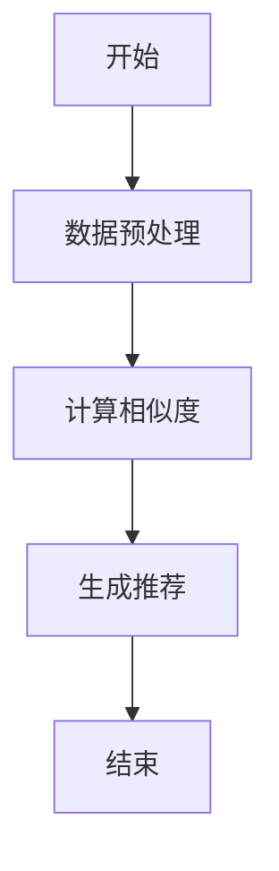
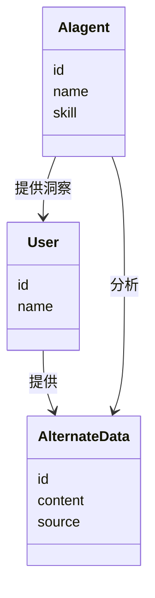
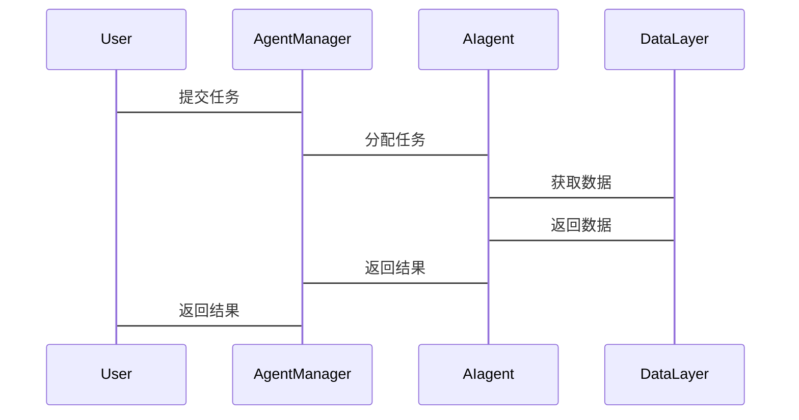

                 


# AI agents协作分析替代数据：获取独特洞察

**关键词：** AI agents, 替代数据, 数据分析, 协作机制, 独特洞察

**摘要：**  
在数据分析领域，AI agents的协作分析替代数据已成为获取独特洞察的重要方法。本文将系统地探讨AI agents如何通过协作处理替代数据，揭示其独特的优势和应用场景。通过分析算法原理、系统架构及实际案例，本文为读者提供全面的视角，帮助理解并应用AI agents在替代数据分析中的潜力。

---

# 第1章: AI agents协作分析替代数据概述

## 1.1 问题背景与描述
### 1.1.1 传统数据分析的局限性
传统数据分析依赖于结构化数据，但在现实场景中，大量有价值的信息存在于非结构化数据（如文本、图像、音频等）中。AI agents通过协作，能够有效处理这些替代数据，挖掘潜在价值。

### 1.1.2 替代数据的定义与特点
替代数据是指非传统的数据形式，例如社交媒体文本、传感器数据、日志文件等。这些数据具有多样性和复杂性，需要借助AI技术进行处理。

### 1.1.3 AI agents在数据分析中的作用
AI agents作为智能代理，能够自动化地从替代数据中提取信息、识别模式，并提供洞察。它们通过协作机制，显著提高了数据分析的效率和准确性。

## 1.2 问题解决与边界
### 1.2.1 替代数据如何提供独特洞察
通过分析替代数据，AI agents可以发现传统数据中难以捕捉的模式和趋势，例如从社交媒体数据中预测市场趋势。

### 1.2.2 AI agents协作的优势
AI agents的协作能力使其能够分工合作，分别处理不同类型的数据，从而提高整体分析效率。

### 1.2.3 边界与外延
替代数据分析的边界在于数据质量和可用性，而其外延则包括更广泛的应用场景，如实时数据分析。

## 1.3 概念结构与核心要素
### 1.3.1 核心概念组成
- 替代数据
- AI agents
- 协作机制

### 1.3.2 关键技术与工具
- 自然语言处理
- 机器学习算法
- 分布式计算框架

### 1.3.3 案例分析
通过一个社交媒体 sentiment 分析的案例，展示AI agents如何协作处理替代数据，提供实时情感分析。

---

# 第2章: AI agents协作的核心概念与联系

## 2.1 核心概念原理
### 2.1.1 AI agents的基本原理
AI agents通过感知环境、执行任务和学习优化，实现对替代数据的分析。

### 2.1.2 替代数据的处理流程
包括数据采集、预处理、分析和可视化四个阶段。

### 2.1.3 协作机制的数学模型
协作机制可以用图论模型表示，其中节点代表AI agents，边代表协作关系。

## 2.2 核心概念属性特征对比
| 属性 | 替代数据 | AI agents |
|------|----------|------------|
| 数据类型 | 非结构化 | 智能代理 |
| 数据来源 | 多样化 | 分布式 |
| 数据处理 | 复杂 | 高效 |

## 2.3 ER实体关系图
```mermaid
erDiagram
    agent AIagent {
        id
        name
    }
    data AlternateData {
        id
        content
        source
    }
    AIagent -->> AlternateData: 处理
    AlternateData -->> AIagent: 提供
```

---

# 第3章: 算法原理与数学模型

## 3.1 协同过滤算法
### 3.1.1 算法流程


### 3.1.2 Python实现
```python
def collaborative_filtering(data, user):
    # 数据预处理
    processed_data = preprocess(data)
    # 计算相似度
    similarity_matrix = compute_similarity(processed_data)
    # 生成推荐
    recommendations = generate_recommendations(similarity_matrix, user)
    return recommendations
```

### 3.1.3 数学模型
$$ \text{相似度} = \frac{\sum (x_i - \bar{x})(y_i - \bar{y})}{\sqrt{\sum (x_i - \bar{x})^2} \sqrt{\sum (y_i - \bar{y})^2}} $$

---

# 第4章: 系统分析与架构设计方案

## 4.1 问题场景介绍
描述一个AI agents协作分析替代数据的典型应用场景，例如实时社交媒体情感分析。

## 4.2 系统功能设计
### 4.2.1 领域模型类图


### 4.2.2 系统架构图


## 4.3 接口设计与交互
### 4.3.1 接口设计
- 用户接口：提交任务、获取结果
- AI agent接口：接收指令、返回结果

### 4.3.2 交互序列图


---

# 第5章: 项目实战

## 5.1 环境安装
### 5.1.1 安装Python
```bash
pip install python3
```

### 5.1.2 安装依赖
```bash
pip install numpy pandas scikit-learn
```

## 5.2 核心代码实现
### 5.2.1 数据预处理
```python
import pandas as pd

def preprocess(data):
    return data.dropna()
```

### 5.2.2 情感分析实现
```python
from sklearn.feature_extraction.text import TfidfVectorizer
from sklearn.naive_bayes import MultinomialNB

def analyze_sentiment(texts):
    vectorizer = TfidfVectorizer()
    X = vectorizer.fit_transform(texts)
    clf = MultinomialNB()
    clf.fit(X, labels)
    return clf.predict(X)
```

## 5.3 案例分析
通过一个社交媒体情感分析的案例，详细解读代码实现和结果分析。

## 5.4 项目小结
总结项目实现的关键点和经验教训。

---

# 第6章: 最佳实践与注意事项

## 6.1 最佳实践
- 数据预处理是关键
- 选择合适的算法
- 定期优化模型

## 6.2 小结
AI agents协作分析替代数据的应用前景广阔，但仍需克服数据质量和协作效率的挑战。

## 6.3 注意事项
- 数据隐私保护
- 模型可解释性
- 系统可扩展性

## 6.4 拓展阅读
推荐相关书籍和论文，供读者深入学习。

---

**作者：AI天才研究院 & 禅与计算机程序设计艺术**

