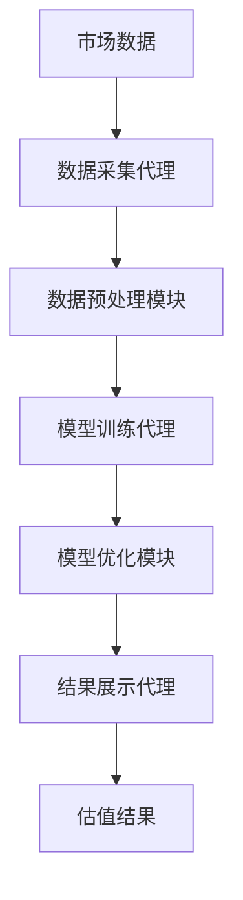
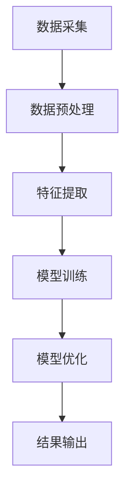
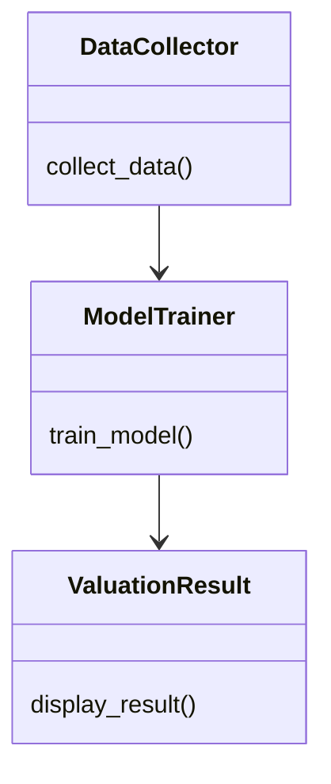
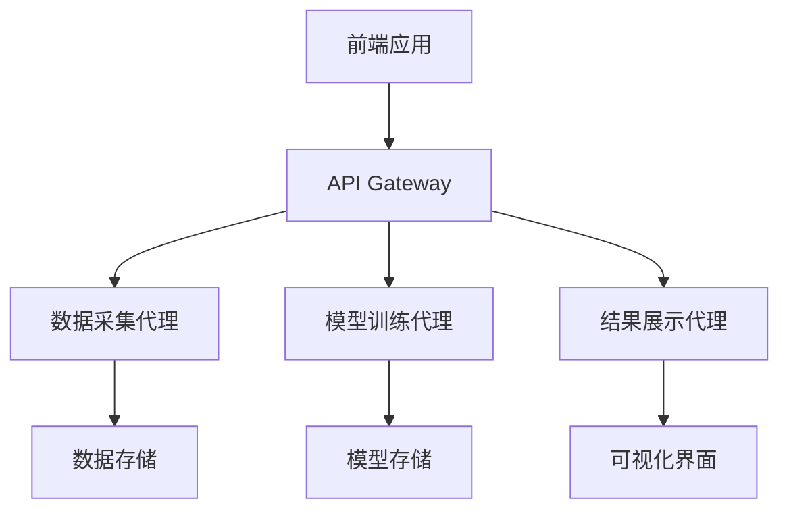
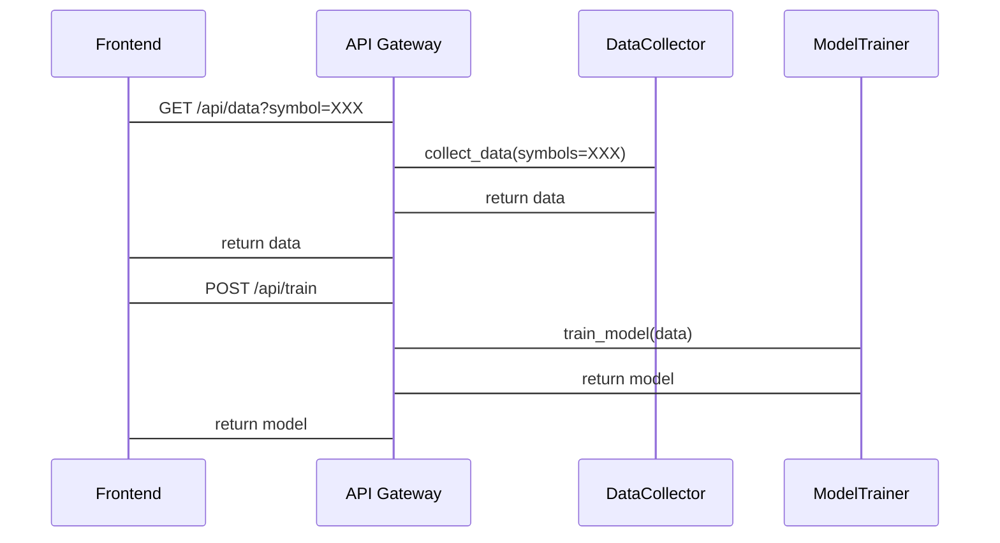

                 


# AI agents协作构建动态估值模型：适应快速变化的市场

> 关键词：AI代理，动态估值模型，市场变化，协作机制，实时更新

> 摘要：本文探讨了AI代理如何协作构建动态估值模型，以适应快速变化的市场环境。通过分析AI代理的核心概念、算法原理、系统架构及实际案例，本文展示了如何利用AI代理的实时数据处理和协作能力，动态调整估值模型，从而在市场波动中保持竞争力。文章还提供了详细的系统设计、代码实现和最佳实践，为读者提供了全面的技术指导。

---

## 第一部分: AI代理协作构建动态估值模型的背景与基础

### 第1章: 动态估值模型的背景与问题描述

#### 1.1 动态估值模型的背景
##### 1.1.1 传统估值模型的局限性
传统的估值模型（如加权平均模型、时间序列分析等）在面对市场快速变化时，往往无法实时更新，导致估值结果滞后或偏差。例如，在股票交易中，市场情绪、政策变化等因素可能导致传统模型的估值结果与实际市场情况脱节。

##### 1.1.2 市场快速变化的需求
现代市场环境复杂多变，如金融市场的瞬时波动、供应链的实时调整需求等，要求估值模型能够快速响应数据变化，实时更新估值结果。这种需求推动了对动态估值模型的迫切需求。

##### 1.1.3 AI代理在动态估值中的作用
AI代理具备实时数据处理、分布式协作和自适应优化的能力，能够弥补传统估值模型的不足，成为动态估值模型的核心驱动力。

#### 1.2 问题描述与目标
##### 1.2.1 问题背景分析
在快速变化的市场中，如何构建一个能够实时更新、自适应调整的估值模型，是当前技术挑战的核心。

##### 1.2.2 动态估值模型的目标
动态估值模型的目标是实时捕捉市场变化，快速调整估值结果，以应对市场波动带来的挑战。

##### 1.2.3 AI代理协作的核心问题
AI代理需要通过协作实现数据共享、任务分配和结果优化，确保动态估值模型的高效性和准确性。

### 第2章: AI代理协作的基本概念与核心要素

#### 2.1 AI代理的定义与特点
##### 2.1.1 AI代理的定义
AI代理是一种能够感知环境、自主决策并采取行动的智能实体，具备学习、推理和自适应能力。

##### 2.1.2 AI代理的核心特点
- **实时性**：能够快速响应数据变化。
- **分布式协作**：通过多代理协作实现任务分解和结果优化。
- **自适应性**：能够根据环境变化调整行为和模型参数。

##### 2.1.3 AI代理的分类与应用场景
- **数据采集代理**：负责实时数据的采集和预处理。
- **模型训练代理**：负责模型的训练和优化。
- **结果展示代理**：负责将估值结果展示给用户。

#### 2.2 动态估值模型的构建要素
##### 2.2.1 数据来源与处理
- 数据来源：市场数据（如股票价格、供需变化等）、用户反馈、历史数据。
- 数据处理：数据清洗、特征提取、数据增强。

##### 2.2.2 模型结构与参数
- 模型结构：回归模型、时间序列模型、神经网络模型。
- 模型参数：权重、偏置、超参数（如学习率、迭代次数）。

##### 2.2.3 评估指标与优化方法
- 评估指标：均方误差（MSE）、R²系数、调整后的贝克尔准则。
- 优化方法：梯度下降、Adam优化器、遗传算法。

### 第3章: AI代理协作与动态估值模型的关系

#### 3.1 AI代理协作的核心机制
##### 3.1.1 代理间的信息交互
- 数据共享：通过消息队列或数据库实现数据实时同步。
- 任务分配：通过分布式任务调度系统分配模型训练任务。

##### 3.1.2 代理间的任务分配
- 基于负载均衡的代理调度：确保每个代理承担合理的任务量。
- 基于优先级的任务分配：优先处理高优先级任务。

##### 3.1.3 代理间的协同优化
- 联合优化：通过分布式计算实现模型参数的全局优化。
- 协同学习：多个代理共享知识和经验，共同优化模型。

#### 3.2 动态估值模型的动态性与适应性
##### 3.2.1 动态估值模型的动态性
- 实时更新：模型参数能够根据最新数据实时调整。
- 自适应性：模型结构能够根据环境变化自动优化。

##### 3.2.2 模型的自适应能力
- 在线学习：模型能够实时更新参数，适应新数据。
- 模型切换：在特定条件下切换模型结构，以应对不同市场环境。

##### 3.2.3 模型的实时更新机制
- 数据驱动的更新：基于实时数据流更新模型参数。
- 策略驱动的更新：基于预定义策略触发模型结构调整。

---

## 第二部分: AI代理协作构建动态估值模型的核心概念与联系

### 第4章: 核心概念与原理

#### 4.1 核心概念原理
##### 4.1.1 AI代理协作的核心机制
- **分布式计算**：通过多代理协作实现计算任务的并行处理。
- **协同优化**：通过知识共享和经验积累优化模型性能。

##### 4.1.2 动态估值模型的动态性
- **实时更新**：模型参数能够根据最新数据实时调整。
- **自适应性**：模型结构能够根据环境变化自动优化。

#### 4.2 概念属性特征对比
| 概念 | 属性 | 特征 |
|------|------|------|
| AI代理 | 分布式协作 | 多代理协同完成任务 |
| 动态估值模型 | 实时性 | 模型参数实时更新 |
| 市场变化 | 快速响应 | 模型能够快速适应市场波动 |

#### 4.3 实体关系图


---

## 第三部分: 算法原理讲解

### 第5章: 算法原理与实现

#### 5.1 算法原理
##### 5.1.1 动态估值模型的数学模型
$$ y(t) = \beta_0 + \beta_1x_1(t) + \beta_2x_2(t) + \epsilon(t) $$
其中，$\epsilon(t)$是误差项，表示模型预测值与实际值之间的偏差。

##### 5.1.2 基于AI代理的协作优化
$$ \theta(t+1) = \theta(t) + \alpha(\theta^*(t) - \theta(t)) $$
其中，$\theta$是模型参数，$\alpha$是学习率，$\theta^*$是优化目标。

#### 5.2 算法流程


#### 5.3 算法实现
```python
import numpy as np
from sklearn.linear_model import LinearRegression

class DynamicValuationModel:
    def __init__(self, learning_rate=0.1):
        self.lr = learning_rate
        self.theta = np.random.randn(2, 1)  # 示例参数

    def update_theta(self, X, y_true):
        y_pred = X.dot(self.theta)
        error = y_true - y_pred
        gradient = (X.T.dot(error)) / len(X)
        self.theta += self.lr * gradient

# 示例使用
X = np.array([[1, 2], [3, 4], [5, 6]]).T
y_true = np.array([3, 7, 11])
model = DynamicValuationModel()
model.update_theta(X, y_true)
print(model.theta)
```

---

## 第四部分: 系统分析与架构设计方案

### 第6章: 系统分析与架构设计

#### 6.1 问题场景介绍
- **场景1**：股票价格预测。
- **场景2**：供应链库存管理。

#### 6.2 系统功能设计
##### 6.2.1 领域模型设计


##### 6.2.2 系统架构设计


#### 6.3 系统接口设计
##### 6.3.1 数据接口
- 数据采集接口：`GET /api/data?symbol=XXX`
- 数据存储接口：`POST /api/data`

##### 6.3.2 模型接口
- 模型训练接口：`POST /api/train`
- 模型预测接口：`POST /api/predict`

#### 6.4 系统交互流程


---

## 第五部分: 项目实战

### 第7章: 项目实战与案例分析

#### 7.1 环境安装
```bash
pip install numpy pandas scikit-learn
```

#### 7.2 核心代码实现
##### 7.2.1 数据预处理
```python
import pandas as pd
import numpy as np

def preprocess_data(data: pd.DataFrame) -> pd.DataFrame:
    # 假设data包含'price'和'volume'两列
    data['log_price'] = np.log(data['price'])
    data['log_volume'] = np.log(data['volume'])
    return data[['log_price', 'log_volume']]
```

##### 7.2.2 模型训练
```python
from sklearn.linear_model import LinearRegression

def train_model(X: pd.DataFrame, y: pd.Series) -> LinearRegression:
    model = LinearRegression()
    model.fit(X, y)
    return model
```

##### 7.2.3 结果评估
```python
from sklearn.metrics import mean_squared_error

def evaluate_model(y_true: pd.Series, y_pred: pd.Series) -> float:
    return mean_squared_error(y_true, y_pred)
```

#### 7.3 项目实战小结
- **成功经验**：通过AI代理协作实现了动态估值模型的实时更新。
- **经验教训**：数据质量和模型调参对最终结果影响重大。

---

## 第六部分: 最佳实践与注意事项

### 第8章: 最佳实践与小结

#### 8.1 最佳实践 tips
- **数据质量**：确保数据的实时性和准确性。
- **模型调参**：合理选择学习率和优化算法。
- **性能监控**：实时监控模型性能，及时调整。

#### 8.2 未来研究方向
- **多模态数据应用**：结合文本、图像等多模态数据提升估值精度。
- **模型可解释性**：提高模型的可解释性，便于用户理解和信任。

---

## 附录

### 附录A: 参考文献
- [1] 《机器学习实战》, 周志华
- [2] 《深度学习》, Ian Goodfellow

### 附录B: 工具安装指南
```bash
pip install numpy scikit-learn
```

### 附录C: 术语表
- **动态估值模型**：能够实时更新的估值模型。
- **AI代理**：具备智能的代理实体，能够自主决策和协作。

---

## 作者：AI天才研究院 & 禅与计算机程序设计艺术

---

希望这篇文章能够为读者提供关于AI代理协作构建动态估值模型的全面指导和深入分析，帮助读者理解其原理和应用。

