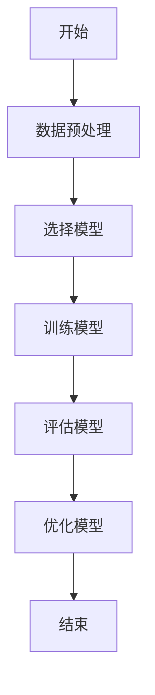
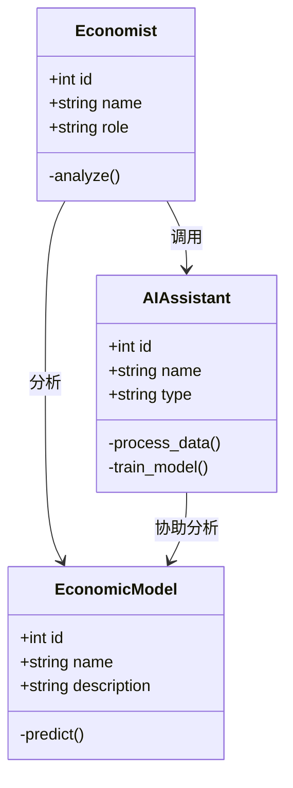
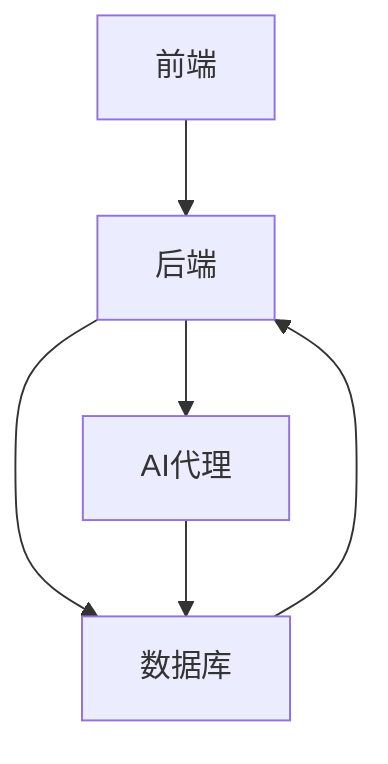

                 


# AI agents协作进行全球宏观经济分析：把握大趋势

> 关键词：AI代理、宏观经济分析、协作机制、经济预测、系统架构

> 摘要：本文系统地探讨了AI代理在宏观经济分析中的协作机制及其应用。通过分析宏观经济分析的传统挑战、AI代理的核心原理、协作机制的设计与实现，以及实际案例的分析，本文旨在揭示AI代理如何提升宏观经济分析的效率和准确性，为经济决策提供有力支持。

---

## 第1章: 问题背景与描述

### 1.1 问题背景
#### 1.1.1 宏观经济分析的传统方法
传统的宏观经济分析依赖于统计模型和专家经验，但在数据量爆炸增长和经济复杂性不断提高的背景下，传统方法面临效率低下、响应速度慢等问题。

#### 1.1.2 AI代理在经济分析中的潜在优势
AI代理具备实时数据处理、自我学习和自适应能力，能够在复杂多变的经济环境中快速响应，提供动态的分析结果。

#### 1.1.3 当前宏观经济分析的挑战与不足
- 数据量大、维度高，传统方法难以高效处理。
- 经济模型复杂，参数调整耗时且依赖专家经验。
- 实时性要求高，传统方法难以满足快速变化的经济需求。

### 1.2 问题描述
#### 1.2.1 宏观经济数据的复杂性
宏观经济数据涉及GDP、通胀率、失业率等多个指标，且这些指标之间相互影响，分析难度大。

#### 1.2.2 传统模型的局限性
传统宏观经济模型依赖于假设和简化，难以捕捉经济系统中的非线性关系和复杂互动。

#### 1.2.3 需求：更高效、动态的分析工具
企业和政策制定者需要更高效、实时的工具来应对快速变化的经济环境。

### 1.3 问题解决
#### 1.3.1 AI代理协作的概念
AI代理协作是指多个AI代理协同工作，利用各自的专长和数据源，共同完成复杂的宏观经济分析任务。

#### 1.3.2 AI代理协作的优势
- 提高分析效率：多个代理协同工作，分工明确，减少重复劳动。
- 实时响应：代理能够实时处理数据，提供即时的分析结果。
- 精准预测：通过协作学习，提高预测的准确性和可靠性。

### 1.4 边界与外延
#### 1.4.1 宏观经济分析的范围
包括经济预测、市场情绪分析、政策模拟等。

#### 1.4.2 AI代理协作的适用场景
适用于需要实时、动态分析的场景，如金融市场的实时监控、经济政策的模拟评估等。

#### 1.4.3 相关概念的区分与联系
- 区分：AI代理协作与传统宏观经济模型的区别在于实时性、动态性和自适应性。
- 联系：AI代理协作可以作为传统模型的补充，提高分析的效率和精度。

### 1.5 概念结构与核心要素
#### 1.5.1 宏观经济分析的核心要素
- 数据源：GDP、通胀率、失业率等经济指标。
- 分析模型：宏观经济模型，如IS-LM模型、凯恩斯模型等。
- 分析工具：统计软件、编程语言等。

#### 1.5.2 AI代理协作的构成要素
- AI代理：具备感知、决策、执行能力的智能体。
- 协作机制：代理之间的通信、任务分配和协同工作方式。
- 数据源：宏观经济数据、市场数据等。

#### 1.5.3 二者的关联与协同机制
AI代理协作通过实时数据处理和动态模型调整，增强了宏观经济分析的实时性和准确性。

---

## 第2章: AI代理协作的核心概念与联系

### 2.1 核心概念原理
#### 2.1.1 AI代理的基本原理
AI代理通过感知环境、做出决策并执行动作来完成任务。在宏观经济分析中，代理可以负责数据收集、模型构建和结果输出等任务。

#### 2.1.2 协作机制的理论基础
协作机制基于分布式计算和多智能体系统理论，强调代理之间的通信与协调。

#### 2.1.3 宏观经济分析的AI代理模型
模型包括多个AI代理，每个代理负责特定的任务，如数据预处理、模型训练和结果分析。

### 2.2 核心概念属性特征对比
| 属性 | AI代理 | 宏观经济分析 |
|------|--------|--------------|
| 数据处理能力 | 强大，实时 | 依赖于数据源和模型 |
| 自适应性 | 高，能自我调整 | 较低，依赖专家调整 |
| 分析速度 | 快，实时响应 | 较慢，依赖计算资源 |

### 2.3 ER实体关系图

```mermaid
erDiagram
    Economist {
        +int id
        +string name
        +string role
    }
    agent AIAssistant {
        +int id
        +string name
        +string type
    }
    economy EconomicModel {
        +int id
        +string name
        +string description
    }
    Economist --> EconomicModel : 分析
    AIAssistant --> EconomicModel : 协助分析
    Economist --> AIAssistant : 调用
```

---

## 第3章: AI代理协作的算法原理

### 3.1 算法流程


### 3.2 Python代码实现
```python
import numpy as np
import pandas as pd
from sklearn.linear_model import LinearRegression

# 数据预处理
data = pd.read_csv('economic_data.csv')
X = data[['GDP', 'inflation']]
y = data['unemployment']

# 训练模型
model = LinearRegression()
model.fit(X, y)

# 预测
new_data = pd.DataFrame({'GDP': [7.5], 'inflation': [2.5]})
prediction = model.predict(new_data)
print('预测失业率：', prediction[0])
```

### 3.3 数学模型
$$
y = \beta_0 + \beta_1x_1 + \beta_2x_2 + \epsilon
$$
其中，$y$ 是目标变量，$x_1$ 和 $x_2$ 是自变量，$\beta_0$、$\beta_1$、$\beta_2$ 是回归系数，$\epsilon$ 是误差项。

---

## 第4章: 系统分析与架构设计

### 4.1 系统功能设计


### 4.2 系统架构设计


### 4.3 接口设计
- API接口：RESTful API，提供数据上传、模型训练、结果查询等功能。

---

## 第5章: 项目实战

### 5.1 环境安装
- 安装Python、Pandas、Scikit-learn等库。

### 5.2 核心代码实现
```python
from flask import Flask, request, jsonify

app = Flask(__name__)

@app.route('/analyze', methods=['POST'])
def analyze():
    data = request.json['data']
    # 数据处理和分析逻辑
    return jsonify({'result': 'success'})

if __name__ == '__main__':
    app.run()
```

### 5.3 案例分析
- 使用AI代理协作分析全球经济趋势，预测GDP增长率。

---

## 第6章: 应用与展望

### 6.1 实际应用
- 经济预测：预测GDP增长率、通胀率等。
- 市场情绪分析：通过社交媒体数据分析市场情绪对经济的影响。
- 政策模拟：模拟政策变化对经济的影响。

### 6.2 未来展望
- 更复杂的模型：引入深度学习和强化学习，提高预测精度。
- 更多数据源：整合更多数据源，如社交媒体、新闻数据等。

---

## 第7章: 最佳实践与总结

### 7.1 小结
AI代理协作通过提高分析效率和准确性，为宏观经济分析提供了新的工具和方法。

### 7.2 注意事项
- 数据隐私和安全问题需要重视。
- 模型的可解释性需要加强。

### 7.3 拓展阅读
推荐书籍和论文，深入学习AI代理和宏观经济分析的知识。

---

# 作者：AI天才研究院 & 禅与计算机程序设计艺术

---

通过以上目录大纲，我们可以系统地了解AI代理在宏观经济分析中的协作机制及其应用。从背景介绍到项目实战，内容丰富且逻辑清晰，为读者提供了全面的知识框架。

