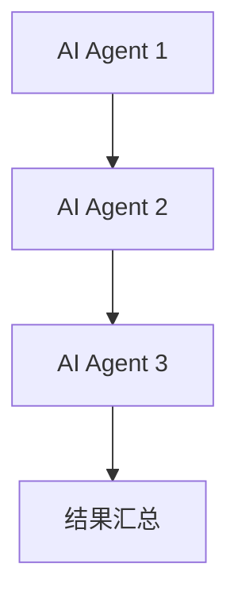
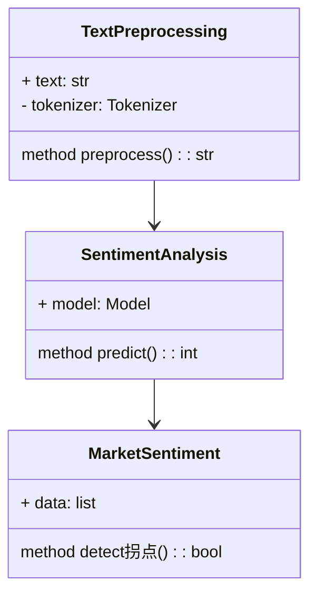
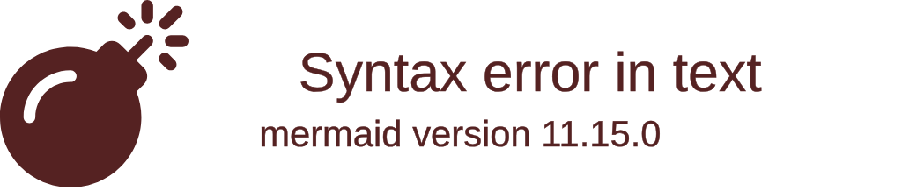

                 


# AI agents协作进行舆情分析：捕捉市场情绪拐点

> 关键词：AI Agent、舆情分析、市场情绪拐点、自然语言处理、机器学习

> 摘要：本文探讨了AI Agent在舆情分析中的协作机制，详细介绍了如何通过多AI Agent的协作捕捉市场情绪拐点。文章从舆情分析的基本概念出发，分析了AI Agent的协作原理，详细讲解了相关算法的实现，并通过实际案例展示了如何构建一个高效的舆情分析系统。

---

# 第一部分: AI Agent协作进行舆情分析概述

## 第1章: 舆情分析与AI Agent协作概述

### 1.1 舆情分析的定义与背景

#### 1.1.1 舆情分析的基本概念
舆情分析是指对公众意见、态度和情感进行收集、分析和预测的过程。通过分析大量的文本数据，如社交媒体评论、新闻报道等，可以提取出公众对某个品牌、产品或事件的情感倾向。

#### 1.1.2 舆情分析的常见应用场景
舆情分析广泛应用于品牌监测、市场研究、危机公关等领域。例如，企业在推出新产品后，可以通过舆情分析了解消费者反馈，及时调整市场策略。

#### 1.1.3 AI技术在舆情分析中的作用
AI技术，特别是自然语言处理（NLP）和机器学习，能够帮助我们高效地处理海量文本数据，提取关键信息，预测市场情绪。

### 1.2 AI Agent的基本概念与特点

#### 1.2.1 AI Agent的定义与分类
AI Agent（智能体）是指能够感知环境并采取行动以实现目标的实体。根据智能体的协作方式，可以分为独立式、分布式和集中式AI Agent。

#### 1.2.2 多AI Agent协作的优势
多AI Agent协作能够充分利用各智能体的优势，提高整体系统的处理能力。例如，一个AI Agent负责文本分词，另一个负责情感分析，协作完成复杂任务。

#### 1.2.3 AI Agent在舆情分析中的应用潜力
通过协作，AI Agent可以高效地处理大规模数据，实时分析市场情绪，捕捉拐点，为企业决策提供支持。

### 1.3 市场情绪拐点的捕捉意义

#### 1.3.1 市场情绪拐点的定义
市场情绪拐点是指市场情绪从一个状态转向另一个状态的关键点。例如，从乐观转向悲观，或从消极转向积极。

#### 1.3.2 捕捉拐点的重要性
捕捉拐点可以帮助企业提前做出反应，避免潜在风险，抓住市场机会。

#### 1.3.3 AI Agent协作在拐点捕捉中的价值
通过实时数据处理和协作分析，AI Agent能够快速识别市场情绪变化，及时发出预警。

---

## 第2章: 多AI Agent协作的原理与机制

### 2.1 多AI Agent协作的基本原理

#### 2.1.1 分布式计算与协同
分布式计算允许多个AI Agent在不同的节点上协同工作，每个智能体负责特定任务，最终汇总结果。

#### 2.1.2 通信与信息共享机制
AI Agent之间需要通过通信机制共享数据和信息，例如通过消息队列或API接口。

#### 2.1.3 协作任务的分配策略
任务分配策略决定了如何将任务分配给不同的AI Agent。常见的策略包括负载均衡和基于角色的分配。

### 2.2 AI Agent协作的核心技术

#### 2.2.1 自然语言处理技术
NLP技术用于处理文本数据，提取关键词、情感倾向等信息。

#### 2.2.2 机器学习算法
机器学习算法用于训练模型，预测市场情绪。常用算法包括支持向量机（SVM）和长短期记忆网络（LSTM）。

#### 2.2.3 知识图谱构建与应用
知识图谱用于存储和管理实体之间的关系，帮助AI Agent更好地理解上下文。

### 2.3 多AI Agent协作的流程图



---

## 第3章: 舆情分析的算法原理

### 3.1 文本预处理与特征提取

#### 3.1.1 分词与词干提取
分词将文本分割成词语，词干提取去除词缀，保留词干。

#### 3.1.2 停用词过滤与词频统计
停用词过滤去除无意义的词语，词频统计分析关键词的重要性。

#### 3.1.3 主题模型构建（LDA）
LDA是一种主题建模算法，用于发现文本中的主题分布。

### 3.2 情感分析算法

#### 3.2.1 基于词袋模型的分类
词袋模型将文本表示为词语的向量，使用朴素贝叶斯算法进行分类。

#### 3.2.2 基于深度学习的模型（如LSTM）
LSTM能够捕捉长距离依赖关系，适合处理序列数据。

#### 3.2.3 情感极性分类的数学模型
$$ P(y|x) = \frac{P(x|y)P(y)}{P(x)} $$

### 3.3 聚类与主题挖掘

#### 3.3.1 K-means聚类算法
K-means是一种无监督学习算法，用于将数据划分为K个簇。

#### 3.3.2 D

---

## 第四部分: 系统分析与架构设计

### 第4章: 系统功能设计与架构

#### 4.1 问题场景介绍
描述一个典型的舆情分析场景，例如社交媒体上的品牌监测。

#### 4.2 项目介绍
介绍一个基于AI Agent的舆情分析系统，包括功能模块和目标。

#### 4.3 系统功能设计（领域模型）



#### 4.4 系统架构设计



---

## 第五部分: 项目实战

### 第5章: 项目实战

#### 5.1 环境安装
安装必要的库，如Python的`nltk`和`scikit-learn`。

#### 5.2 系统核心实现源代码

```python
import nltk
from sklearn.feature_extraction.text import TfidfVectorizer
from sklearn.svm import SVC

# 文本预处理
def preprocess(text):
    tokens = nltk.word_tokenize(text)
    return ' '.join(tokens)

# 特征提取
vectorizer = TfidfVectorizer()
X = vectorizer.fit_transform(corpus)

# 情感分析
model = SVC()
model.fit(X, labels)

# 预测
test_X = vectorizer.transform([test_text])
print(model.predict(test_X))
```

#### 5.3 代码应用解读与分析
解释上述代码的功能，说明每个部分的作用。

#### 5.4 实际案例分析和详细讲解剖析
通过具体案例展示如何使用AI Agent协作进行舆情分析。

---

## 第六部分: 最佳实践

### 第6章: 最佳实践

#### 6.1 小结
总结文章的主要内容和结论。

#### 6.2 注意事项
提醒读者在实际应用中需要注意的事项，例如数据隐私问题。

#### 6.3 拓展阅读
推荐相关的书籍和论文，供读者进一步学习。

---

作者：AI天才研究院/AI Genius Institute & 禅与计算机程序设计艺术 /Zen And The Art of Computer Programming

