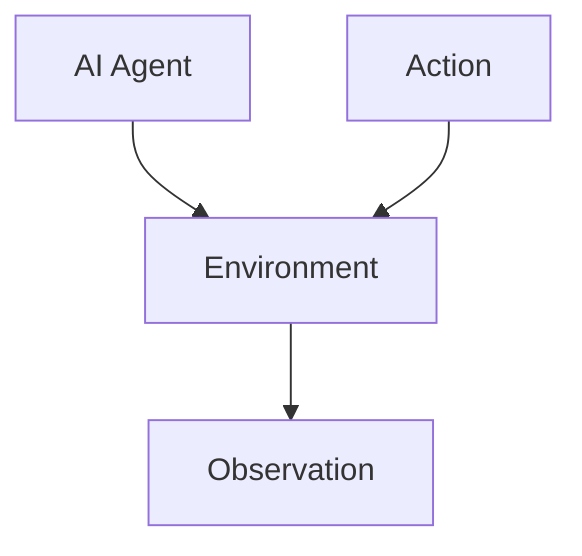
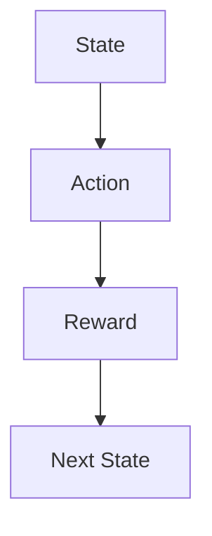
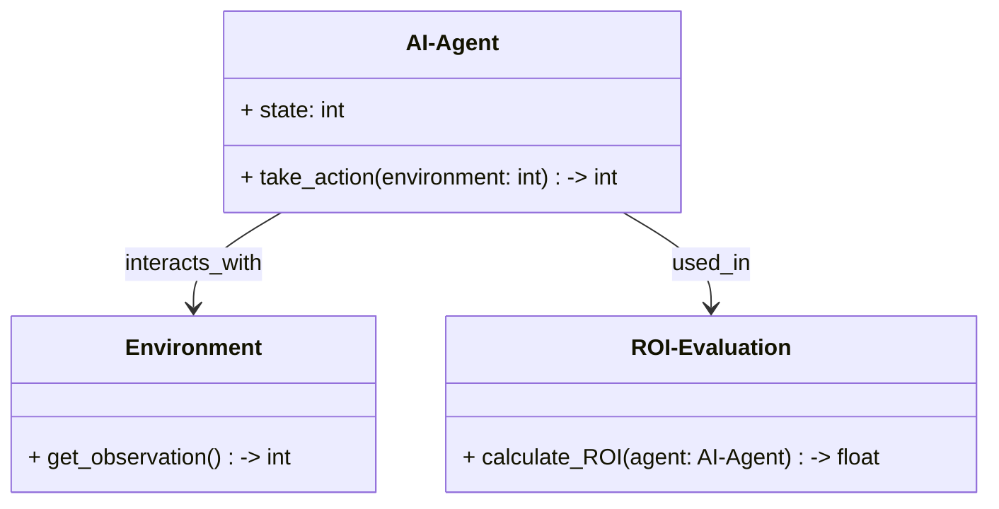
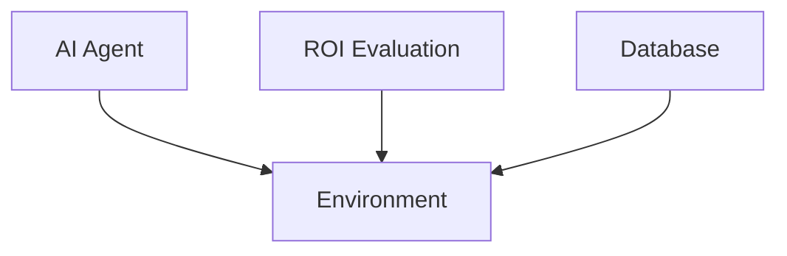

                 


# AI agents在公司数字化转型ROI评估中的应用

## 关键词：AI代理, 数字化转型, ROI评估, 人工智能, 投资回报率

## 摘要：  
随着数字化转型的深入推进，企业面临着如何高效评估投资回报率（ROI）的挑战。AI代理作为一种强大的工具，能够通过自动化、智能化的方式优化ROI评估流程。本文将详细探讨AI代理在公司数字化转型中的应用，分析其核心概念、算法原理、系统架构以及实际案例，为企业提供有效的ROI评估解决方案。

---

# 第一部分：AI代理与数字化转型背景

## 第1章：AI代理与数字化转型概述

### 1.1 AI代理的基本概念  
#### 1.1.1 AI代理的定义与类型  
AI代理（AI Agents）是指能够感知环境、自主决策并执行任务的智能体。根据功能和应用场景的不同，AI代理可以分为以下几类：  
1. **简单反射代理**：基于预设规则执行任务，适用于简单的重复性操作。  
2. **基于模型的反射代理**：通过内部模型理解和预测环境变化，适用于复杂场景。  
3. **目标驱动代理**：以明确目标为导向，优化决策过程。  

#### 1.1.2 数字化转型的背景与目标  
数字化转型是指通过技术手段（如AI、大数据、云计算等）对企业业务流程、运营模式和组织结构进行改造，以提升效率和竞争力。其核心目标包括：  
1. 提高业务流程的自动化水平。  
2. 优化资源配置，降低成本。  
3. 增强数据驱动的决策能力。  

#### 1.1.3 AI代理在数字化转型中的作用  
AI代理通过自动化处理、实时反馈和智能优化，能够显著提升数字化转型的效率和效果。例如，AI代理可以用于自动化数据分析、客户行为预测和业务流程优化。

### 1.2 ROI评估的重要性  
#### 1.2.1 ROI的定义与计算方法  
ROI（Return on Investment）是衡量投资项目收益与成本比的重要指标，公式为：  
$$ ROI = \frac{净收益}{总投资} \times 100\% $$  
其中，净收益等于收益减去成本。

#### 1.2.2 数字化转型中的ROI挑战  
在数字化转型中，企业需要投入大量资源，但如何量化这些投入的回报是一个难题。传统ROI评估方法通常依赖人工分析，耗时且不够精确。

#### 1.2.3 AI代理如何优化ROI评估  
AI代理可以通过以下方式提升ROI评估的效率和准确性：  
1. **自动化数据采集**：实时收集业务数据，减少人工干预。  
2. **智能预测模型**：基于历史数据预测未来的收益和成本。  
3. **动态优化建议**：根据实时数据调整投资策略，最大化收益。

---

## 第2章：AI代理的核心概念与联系

### 2.1 核心概念原理  
#### 2.1.1 AI代理的核心要素  
AI代理的核心要素包括：  
1. **感知能力**：通过传感器或数据接口获取环境信息。  
2. **决策能力**：基于感知信息做出决策。  
3. **执行能力**：通过执行器或接口执行决策。  

#### 2.1.2 代理与环境的交互机制  
AI代理通过以下步骤与环境交互：  
1. **感知环境**：获取当前状态。  
2. **决策制定**：基于状态和目标选择行动。  
3. **执行行动**：将决策转化为具体操作。  
4. **反馈接收**：根据环境反馈调整策略。  

#### 2.1.3 ROI评估的关键指标  
除了净收益和总投资外，ROI评估还需要考虑以下指标：  
1. **投资回收期（Payback Period）**：投资完全收回所需的时间。  
2. **内部收益率（IRR）**：项目的预期收益率。  

### 2.2 核心概念对比表格  
以下是不同AI代理类型在ROI评估中的对比：

| **代理类型**       | **应用场景**               | **优点**                           | **缺点**                           |
|--------------------|---------------------------|------------------------------------|------------------------------------|
| 简单反射代理       | 数据采集与初步分析         | 实现快速反馈                       | 适用于简单场景                     |
| 基于模型的代理     | 复杂场景下的预测与优化     | 高精度预测                         | 需大量数据训练                     |
| 目标驱动代理       | 业务流程优化与成本控制     | 最大化收益                         | 实现复杂，需要明确目标             |

### 2.3 ER实体关系图与Mermaid流程图  
#### 2.3.1 实体关系图  


---

## 第3章：AI代理的算法原理

### 3.1 算法原理概述  
#### 3.1.1 强化学习与监督学习  
1. **强化学习**：通过试错机制不断优化决策，适用于复杂场景。  
2. **监督学习**：基于已知数据训练模型，适用于有监督的任务。  

#### 3.1.2 算法选择与优化  
在ROI评估中，可以根据具体需求选择合适的算法。例如，强化学习适用于动态环境，而监督学习适用于静态数据。

### 3.2 Mermaid流程图  
#### 3.2.1 强化学习流程  


### 3.3 Python代码实现  
#### 3.3.1 简单AI代理代码示例  
```python
class AI-Agent:
    def __init__(self):
        self.state = 0
    def take_action(self, environment):
        # 简单策略
        return 1 if environment > 0 else 0
```

---

## 第4章：数学模型与公式

### 4.1 ROI评估的数学模型  
#### 4.1.1 基于强化学习的ROI预测  
在强化学习框架中，AI代理通过与环境交互，不断优化其决策以最大化收益。例如，可以使用Q-learning算法：

$$ Q(s, a) = Q(s, a) + \alpha (r + \gamma Q(s', a') - Q(s, a)) $$

其中：  
- \( s \)：当前状态  
- \( a \)：动作  
- \( r \)：奖励  
- \( \gamma \)：折扣因子  
- \( \alpha \)：学习率  

#### 4.1.2 基于监督学习的ROI预测  
在监督学习中，AI代理通过训练数据预测未来的ROI。例如，可以使用线性回归模型：

$$ ROI = \beta_0 + \beta_1 x_1 + \beta_2 x_2 + \ldots + \beta_n x_n $$

其中：  
- \( x_i \)：输入特征  
- \( \beta_i \)：回归系数  

---

## 第5章：系统分析与架构设计

### 5.1 问题场景介绍  
假设某公司希望优化其数字化转型项目的ROI评估流程。通过引入AI代理，公司可以实时监控项目进展并动态调整策略。

### 5.2 项目介绍  
项目目标是开发一个基于AI代理的ROI评估系统，实现以下功能：  
1. 实时数据采集与分析。  
2. 自动化预测与优化建议。  
3. 可视化报告生成。  

### 5.3 系统功能设计  
#### 5.3.1 领域模型（Mermaid类图）  


### 5.4 系统架构设计  
#### 5.4.1 系统架构图  


### 5.5 系统接口设计  
系统接口包括：  
1. **AI Agent接口**：接收环境数据并返回动作。  
2. **ROI Evaluation接口**：接收AI代理的决策并计算ROI。  

### 5.6 系统交互设计  
#### 5.6.1 交互流程图  
```mermaid
graph TD
A[User] --> B[AI Agent]: request action
B --> C[Environment]: execute action
C --> B: return observation
B --> D[ROI Evaluation]: update ROI
D --> A: display ROI
```

---

## 第6章：项目实战

### 6.1 环境安装  
需要安装以下工具：  
1. Python 3.x  
2. Mermaid图生成工具  
3. 机器学习库（如TensorFlow、Scikit-learn）  

### 6.2 系统核心实现  
#### 6.2.1 AI代理代码实现  
```python
class AI-Agent:
    def __init__(self):
        self.state = 0
    def take_action(self, environment):
        # 示例策略：当环境状态大于0时采取行动
        return 1 if environment > 0 else 0
```

#### 6.2.2 ROI评估代码实现  
```python
def calculate_ROI(agent, environment):
    action = agent.take_action(environment)
    reward = environment * action
    return reward / action
```

### 6.3 实际案例分析  
假设某公司在数字化转型中投入了100万元，通过AI代理优化后，净收益为120万元。则ROI为：  
$$ ROI = \frac{120 - 100}{100} \times 100\% = 20\% $$  

### 6.4 代码应用解读  
AI代理通过实时调整策略，帮助公司在项目中实现了更高的净收益。例如，在某个阶段，AI代理根据环境数据动态调整资源分配，从而提高了整体收益。

---

## 第7章：总结与展望

### 7.1 最佳实践  
1. 在ROI评估中，建议优先选择目标驱动代理，因为其能够直接优化业务目标。  
2. 使用强化学习算法时，需要确保环境数据的实时性和准确性。  

### 7.2 小结  
通过引入AI代理，企业可以显著提升数字化转型中的ROI评估效率和精度。AI代理不仅能够自动化处理复杂任务，还能通过智能优化帮助企业在竞争中占据优势。

### 7.3 注意事项  
1. AI代理的应用需要结合企业的具体场景，不能一刀切。  
2. 数据隐私和安全问题也需要在设计和实施过程中重点关注。  

### 7.4 拓展阅读  
1. Russell, S., & Norvig, P. (2010). 《人工智能：一种现代的方法》。  
2. Sutton, R. S., & Barto, A. G. (2018). 《强化学习：理论与算法》。  

---

## 作者：AI天才研究院/AI Genius Institute & 禅与计算机程序设计艺术 /Zen And The Art of Computer Programming

