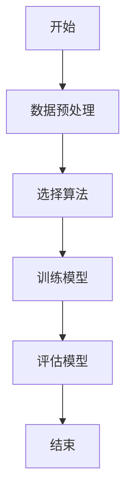
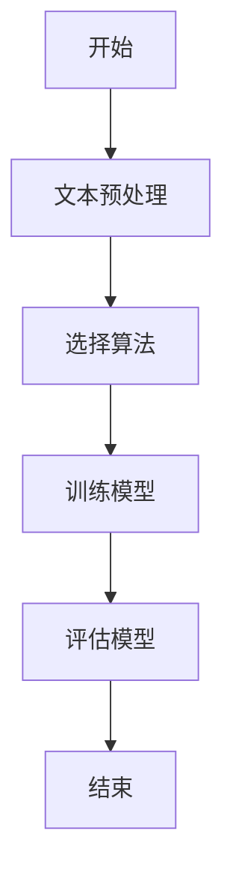
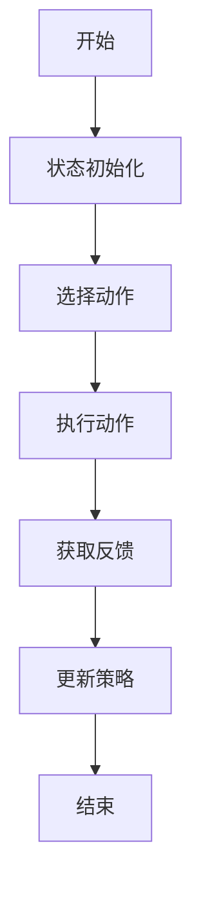
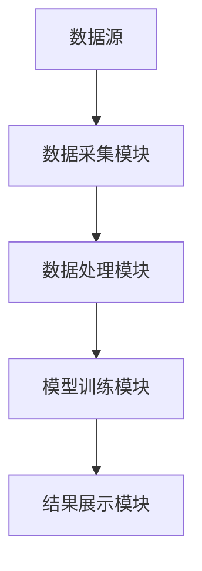

                 


# AI Agents在公司数字化转型效果评估中的应用

## 关键词：AI代理，数字化转型，效果评估，机器学习，系统架构

## 摘要：  
随着数字化转型的深入推进，企业需要一种更高效、更智能的方式来评估转型效果。AI代理作为一种新兴的技术手段，能够通过机器学习、自然语言处理和强化学习等算法，帮助企业实时监控和分析转型过程中的关键指标，从而优化决策并提升整体效果。本文将从AI代理的核心概念、算法原理、系统架构到实际应用，全面探讨AI代理在公司数字化转型效果评估中的应用价值和实现方法。

---

# 第1章: AI代理与数字化转型概述

## 1.1 数字化转型的背景与挑战

### 1.1.1 数字化转型的定义与目标  
数字化转型是指通过信息技术手段（如大数据、人工智能、云计算等）对企业业务流程、运营模式和组织结构进行重构，以提高效率、降低成本并创造新的价值。其目标是将企业从传统的业务模式转变为以数据驱动为核心的现代企业。

### 1.1.2 数字化转型中的常见问题  
在数字化转型过程中，企业通常会面临以下问题：  
1. **数据孤岛**：企业内部数据分散在不同系统中，难以统一分析和利用。  
2. **效率低下**：传统的人工评估方法耗时长、成本高且容易出错。  
3. **决策滞后**：由于数据处理和分析的延迟，企业难以实时调整策略。  
4. **缺乏量化指标**：数字化转型效果难以量化，难以评估投资回报。

### 1.1.3 AI代理在数字化转型中的作用  
AI代理可以通过自动化数据处理、实时监控和智能分析，帮助企业克服上述问题。它能够快速处理大量数据，提供实时反馈，并优化业务流程。

## 1.2 AI代理的定义与特点

### 1.2.1 AI代理的基本概念  
AI代理是一种能够感知环境、自主决策并执行任务的智能系统。它能够通过与用户或系统的交互，完成特定的任务。

### 1.2.2 AI代理的核心特点  
1. **自主性**：AI代理能够自主决策，无需人工干预。  
2. **反应性**：AI代理能够实时感知环境变化并做出响应。  
3. **学习能力**：AI代理可以通过机器学习不断优化自身算法。  
4. **适应性**：AI代理能够根据环境变化调整自身行为。

### 1.2.3 AI代理与传统IT系统的区别  
传统IT系统通常是基于规则的系统，无法自主学习和优化。而AI代理则具备学习和优化能力，能够适应复杂多变的环境。

## 1.3 数字化转型效果评估的重要性

### 1.3.1 数字化转型效果评估的必要性  
数字化转型效果评估是衡量转型成果的重要手段，能够帮助企业发现不足并优化策略。

### 1.3.2 传统评估方法的局限性  
传统评估方法通常依赖人工分析，耗时长、成本高且容易出错。

### 1.3.3 AI代理在评估中的优势  
AI代理能够快速处理大量数据，提供实时反馈，并优化业务流程。

## 1.4 本章小结  
本章介绍了数字化转型的背景、常见问题及AI代理在其中的作用，为后续章节奠定了基础。

---

# 第2章: AI代理的核心概念与联系

## 2.1 AI代理的核心概念

### 2.1.1 AI代理的组成要素  
AI代理通常由感知模块、决策模块和执行模块组成。

### 2.1.2 AI代理的功能模块  
1. **感知模块**：负责收集环境中的数据。  
2. **决策模块**：基于数据进行分析并制定策略。  
3. **执行模块**：根据决策结果执行任务。

### 2.1.3 AI代理的运行机制  
AI代理通过感知环境、分析数据、制定策略和执行任务，实现对数字化转型效果的评估和优化。

## 2.2 AI代理的核心原理

### 2.2.1 AI代理的感知与决策  
AI代理通过传感器或数据接口感知环境，利用机器学习算法分析数据并制定决策。

### 2.2.2 AI代理的学习与优化  
AI代理通过强化学习和反馈机制不断优化自身算法。

### 2.2.3 AI代理的执行与反馈  
AI代理根据决策结果执行任务，并通过反馈机制不断优化自身的运行。

## 2.3 AI代理与数字化转型效果评估的关系

### 2.3.1 AI代理在效果评估中的角色  
AI代理能够实时监控转型过程中的关键指标，提供实时反馈。

### 2.3.2 AI代理如何优化评估过程  
AI代理能够快速处理大量数据，提供精准的评估结果。

### 2.3.3 AI代理在评估中的具体应用场景  
1. **数据收集与分析**：AI代理能够自动收集和分析转型过程中的数据。  
2. **实时监控**：AI代理能够实时监控转型过程中的关键指标。  
3. **优化建议**：AI代理能够根据分析结果提供优化建议。

## 2.4 本章小结  
本章详细介绍了AI代理的核心概念和运行机制，并探讨了其在数字化转型效果评估中的具体应用。

---

# 第3章: AI代理的算法原理与数学模型

## 3.1 AI代理的算法原理

### 3.1.1 机器学习算法在AI代理中的应用  
机器学习算法（如支持向量机、随机森林等）用于分类和回归任务。

### 3.1.2 自然语言处理算法在AI代理中的应用  
自然语言处理算法（如词袋模型、TF-IDF等）用于文本分析任务。

### 3.1.3 强化学习算法在AI代理中的应用  
强化学习算法（如Q-learning、Deep Q-Network等）用于决策优化任务。

## 3.2 AI代理的数学模型

### 3.2.1 机器学习模型的数学表达  
以线性回归为例，其数学表达式为：  
$$ y = \beta_0 + \beta_1x + \epsilon $$  

### 3.2.2 自然语言处理模型的数学表达  
以词袋模型为例，其数学表达式为：  
$$ P(word|document) = \frac{count(word, document)}{\sum_{word'} count(word', document)} $$  

### 3.2.3 强化学习模型的数学表达  
以Q-learning算法为例，其数学表达式为：  
$$ Q(s, a) = Q(s, a) + \alpha [r + \max Q(s', a') - Q(s, a)] $$  

## 3.3 AI代理的算法流程图

### 3.3.1 机器学习算法流程图  


### 3.3.2 自然语言处理算法流程图  


### 3.3.3 强化学习算法流程图  


## 3.4 本章小结  
本章介绍了AI代理中常用的算法原理，并通过数学模型和流程图展示了其具体实现方式。

---

# 第4章: AI代理的系统分析与架构设计

## 4.1 系统功能设计

### 4.1.1 系统功能模块划分  
AI代理系统通常包括数据采集模块、数据处理模块、模型训练模块和结果展示模块。

### 4.1.2 系统功能流程设计  
数据采集模块 --> 数据处理模块 --> 模型训练模块 --> 结果展示模块。

### 4.1.3 系统功能的实现方式  
1. **数据采集**：通过API接口获取实时数据。  
2. **数据处理**：使用Python的Pandas库进行数据清洗和特征提取。  
3. **模型训练**：使用Scikit-learn库训练机器学习模型。  
4. **结果展示**：通过可视化工具（如Matplotlib）展示分析结果。

## 4.2 系统架构设计

### 4.2.1 系统架构的总体设计  


### 4.2.2 系统架构的详细设计  
AI代理系统采用分层架构，包括数据层、业务逻辑层和表示层。

### 4.2.3 系统架构的优缺点分析  
优点：模块化设计便于维护和扩展；缺点：初期开发成本较高。

## 4.3 系统接口设计

### 4.3.1 系统接口的定义  
AI代理系统需要与企业现有系统对接，通常通过RESTful API实现数据交互。

### 4.3.2 系统接口的实现  
使用Python的Flask框架搭建API接口，提供数据采集和结果查询功能。

### 4.3.3 系统接口的测试  
通过Postman工具进行接口测试，确保API正常运行。

## 4.4 系统交互设计

### 4.4.1 系统交互的场景描述  
用户通过网页界面提交请求，系统返回分析结果。

### 4.4.2 系统交互的流程设计  
用户 --> 界面 --> 系统 --> 数据处理 --> 返回结果。

### 4.4.3 系统交互的序列图  
```mermaid
sequenceDiagram
    user ->+> 界面: 提交请求
    界面 ->+> 系统: 调用API
    系统 ->+> 数据层: 获取数据
    数据层 --> 系统: 返回数据
    系统 --> 界面: 返回结果
    界面 --> user: 显示结果
```

## 4.5 本章小结  
本章详细介绍了AI代理系统的功能设计、架构设计和接口设计，为后续章节的实现奠定了基础。

---

# 第5章: AI代理的项目实战

## 5.1 项目环境安装

### 5.1.1 安装Python环境  
使用Anaconda安装Python 3.8及以上版本。

### 5.1.2 安装相关库  
安装NumPy、Pandas、Scikit-learn、Flask等库。

## 5.2 系统核心实现源代码

### 5.2.1 数据采集模块  
```python
import requests

def get_data():
    response = requests.get('http://api.example.com/data')
    return response.json()
```

### 5.2.2 数据处理模块  
```python
import pandas as pd

def process_data(data):
    df = pd.DataFrame(data)
    # 数据清洗和特征提取
    return df
```

### 5.2.3 模型训练模块  
```python
from sklearn.model import LinearRegression

def train_model(data):
    X = data[['feature1', 'feature2']]
    y = data['target']
    model = LinearRegression()
    model.fit(X, y)
    return model
```

### 5.2.4 结果展示模块  
```python
import matplotlib.pyplot as plt

def visualize_result(data):
    plt.scatter(data['feature'], data['target'])
    plt.xlabel('Feature')
    plt.ylabel('Target')
    plt.show()
```

## 5.3 代码应用解读与分析  
通过上述代码，我们可以实现数据的采集、处理、训练和可视化展示。

## 5.4 实际案例分析  
以某企业数字化转型效果评估为例，展示AI代理如何通过上述步骤实现效果评估。

## 5.5 本章小结  
本章通过实际案例展示了AI代理在数字化转型效果评估中的具体实现过程。

---

# 第6章: 最佳实践与注意事项

## 6.1 最佳实践  
1. **数据质量**：确保数据的准确性和完整性。  
2. **模型选择**：根据具体场景选择合适的算法。  
3. **系统集成**：确保AI代理能够与企业现有系统无缝对接。

## 6.2 小结  
通过本文的介绍，我们可以看到AI代理在数字化转型效果评估中的巨大潜力。

## 6.3 注意事项  
1. **数据隐私**：注意保护企业的数据隐私。  
2. **系统稳定性**：确保系统的稳定运行。  
3. **团队协作**：加强团队协作，确保项目的顺利推进。

## 6.4 拓展阅读  
建议读者进一步阅读相关技术文献，深入了解AI代理的最新研究成果。

---

# 作者：AI天才研究院/AI Genius Institute & 禅与计算机程序设计艺术 /Zen And The Art of Computer Programming

