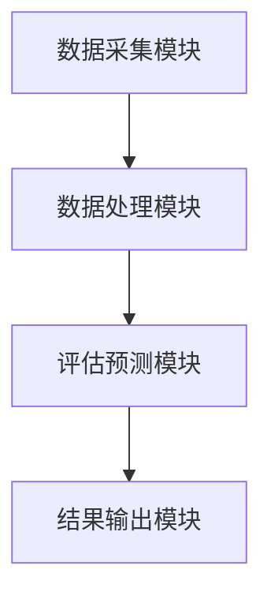
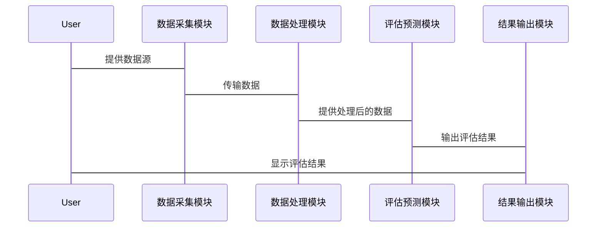

                 


# AI agents在公司无形资产价值评估中的创新应用

## 关键词：AI agents，无形资产，价值评估，机器学习，智能代理

## 摘要

随着人工智能技术的迅速发展，AI agents（智能代理）在公司无形资产价值评估中的应用日益广泛。传统的无形资产评估方法通常依赖于繁琐的手工分析和经验判断，而AI agents通过机器学习和大数据分析，能够显著提高评估的效率和准确性。本文将深入探讨AI agents在无形资产评估中的创新应用，包括其核心概念、算法原理、系统架构设计以及实际项目中的应用案例。通过本文的分析，读者将了解如何利用AI技术提升无形资产评估的智能化水平。

---

# 目录

1. [摘要](#摘要)
2. [关键词](#关键词)
3. [目录](#目录)
4. [第1章：AI agents与无形资产价值评估概述](#第1章)
5. [第2章：AI agents与无形资产评估的核心概念](#第2章)
6. [第3章：AI agents评估算法的数学模型](#第3章)
7. [第4章：系统架构设计](#第4章)
8. [第5章：项目实战](#第5章)
9. [第6章：最佳实践、小结、注意事项与拓展阅读](#第6章)
10. [作者](#作者)

---

## 第1章：AI agents与无形资产价值评估概述

### 1.1 AI agents的定义与特点

#### 1.1.1 AI agents的基本概念

AI agents是指能够感知环境、自主决策并执行任务的智能系统。它们可以基于输入的数据，通过机器学习算法进行分析和推理，从而实现特定的目标。

#### 1.1.2 AI agents的核心特点

- **自主性**：AI agents能够自主决策，无需人工干预。
- **反应性**：能够实时感知环境变化并做出反应。
- **学习能力**：通过机器学习算法不断优化自身的模型。
- **适应性**：能够适应不同的数据和环境条件。

#### 1.1.3 AI agents与传统评估方法的区别

传统评估方法依赖于人工分析和经验判断，而AI agents能够通过数据驱动的方式，快速处理大量信息并提供准确的评估结果。

---

### 1.2 公司无形资产的定义与分类

#### 1.2.1 无形资产的基本概念

无形资产是指企业拥有但没有实物形态的资产，主要包括品牌、专利、商标、商誉、客户关系等。

#### 1.2.2 无形资产的主要分类

- **品牌资产**：包括品牌知名度、品牌忠诚度等。
- **专利资产**：包括发明专利、实用新型专利等。
- **商誉资产**：企业整体价值超过其有形资产的部分。
- **客户关系资产**：客户资源的价值。
- **技术资产**：包括技术诀窍、技术文档等。

#### 1.2.3 无形资产评估的难点与挑战

- 数据获取困难：无形资产的价值往往难以量化。
- 数据多样性：涉及多个维度的复杂数据。
- 数据动态变化：无形资产的价值会随市场变化而波动。

---

### 1.3 AI agents在无形资产价值评估中的优势

#### 1.3.1 提高评估效率

AI agents能够快速处理大量数据，显著提高评估效率。

#### 1.3.2 增强评估准确性

通过机器学习算法，AI agents能够发现数据中的复杂关系，提高评估的准确性。

#### 1.3.3 降低评估成本

自动化评估过程可以显著降低人力和时间成本。

---

## 第2章：AI agents与无形资产评估的核心概念

### 2.1 AI agents在无形资产评估中的核心原理

#### 2.1.1 数据驱动的评估方法

AI agents通过分析大量的历史数据，识别数据中的模式和趋势，从而进行评估。

#### 2.1.2 AI agents的自适应学习能力

通过机器学习算法，AI agents能够不断优化自身的模型，适应新的数据和环境变化。

#### 2.1.3 多维度数据的整合与分析

AI agents能够整合来自不同来源的多维度数据，进行全面分析，提高评估的准确性。

---

### 2.2 无形资产评估的核心要素

#### 2.2.1 无形资产的经济价值

无形资产的经济价值是其在市场上的表现，受到市场需求、竞争状况等多种因素的影响。

#### 2.2.2 无形资产的市场价值

市场价值是基于市场交易数据和市场趋势进行评估的结果。

#### 2.2.3 无形资产的风险评估

包括市场风险、法律风险和技术风险等因素。

---

### 2.3 AI agents与无形资产评估的关联性分析

#### 2.3.1 数据输入与处理

AI agents需要收集和处理大量的数据，包括市场数据、财务数据和行业数据等。

#### 2.3.2 模型构建与训练

通过机器学习算法，构建和训练评估模型，用于预测无形资产的价值。

#### 2.3.3 结果输出与解释

AI agents将评估结果输出，并进行解释和可视化，帮助用户理解和应用评估结果。

---

## 第3章：AI agents评估算法的数学模型

### 3.1 神经网络模型在无形资产评估中的应用

#### 3.1.1 神经网络的基本结构

神经网络由输入层、隐藏层和输出层组成，能够通过非线性激活函数进行特征提取和分类。

#### 3.1.2 神经网络的训练过程

通过反向传播算法和梯度下降方法，优化神经网络的权重参数。

#### 3.1.3 神经网络在无形资产评估中的具体应用

用于预测无形资产的市场价值和风险评估。

---

### 3.2 支持向量机在无形资产评估中的应用

#### 3.2.1 支持向量机的基本原理

支持向量机通过构建超平面，将数据分成不同的类别，用于分类和回归任务。

#### 3.2.2 支持向量机的训练过程

通过求解最优化问题，找到最佳的超平面和支持向量。

#### 3.2.3 支持向量机在无形资产评估中的具体应用

用于评估无形资产的价值和风险。

---

### 3.3 随机森林在无形资产评估中的应用

#### 3.3.1 随机森林的基本原理

随机森林通过构建多个决策树，并通过投票或平均的方式进行预测。

#### 3.3.2 随机森林的训练过程

通过随机选择特征和样本，构建多棵决策树，并进行集成学习。

#### 3.3.3 随机森林在无形资产评估中的具体应用

用于评估无形资产的市场价值和风险。

---

### 3.4 算法比较与优化

#### 3.4.1 不同算法的优缺点对比

- 神经网络：高精度，但需要大量数据和计算资源。
- 支持向量机：适用于小规模数据，但计算复杂。
- 随机森林：速度快，适合大规模数据。

#### 3.4.2 算法优化策略

通过交叉验证和超参数调优，优化算法的性能。

#### 3.4.3 算法选择的依据与原则

根据数据规模、计算资源和评估目标选择合适的算法。

---

## 第4章：系统架构设计

### 4.1 系统功能设计

#### 4.1.1 数据采集模块

负责采集市场数据、财务数据和行业数据。

#### 4.1.2 数据处理模块

对数据进行清洗、特征提取和预处理。

#### 4.1.3 评估预测模块

利用机器学习模型进行评估预测，并输出结果。

---

### 4.2 系统架构设计

#### 4.2.1 系统架构图



#### 4.2.2 接口设计

- 数据输入接口：接收外部数据源的数据。
- 模型训练接口：用于训练和优化评估模型。
- 结果输出接口：将评估结果输出给用户。

---

### 4.3 系统交互设计

#### 4.3.1 系统交互流程图



---

## 第5章：项目实战

### 5.1 环境安装

安装Python、机器学习库（如scikit-learn、TensorFlow）和数据分析库（如Pandas、NumPy）。

### 5.2 核心实现源代码

```python
import pandas as pd
from sklearn.ensemble import RandomForestRegressor
from sklearn.model_selection import train_test_split
from sklearn.metrics import mean_squared_error

# 加载数据
data = pd.read_csv('intangible_assets.csv')

# 数据预处理
X = data.drop('value', axis=1)
y = data['value']

# 划分训练集和测试集
X_train, X_test, y_train, y_test = train_test_split(X, y, test_size=0.2, random_state=42)

# 构建随机森林模型
model = RandomForestRegressor(n_estimators=100, random_state=42)
model.fit(X_train, y_train)

# 预测结果
y_pred = model.predict(X_test)

# 评估模型
 mse = mean_squared_error(y_test, y_pred)
 print(f'Mean Squared Error: {mse}')
```

### 5.3 代码应用解读与分析

上述代码展示了如何利用随机森林算法进行无形资产评估。首先，数据被加载并预处理，然后划分训练集和测试集，构建模型并进行训练，最后进行预测和评估。

---

### 5.4 实际案例分析

以某公司品牌价值评估为例，通过数据采集和模型训练，AI agents能够快速预测品牌价值，并提供风险评估和市场趋势分析。

---

## 第6章：最佳实践、小结、注意事项与拓展阅读

### 6.1 最佳实践

- 数据预处理是关键，确保数据质量和完整性。
- 选择合适的算法，根据数据规模和计算资源进行优化。
- 定期更新模型，适应市场变化。

### 6.2 小结

本文详细介绍了AI agents在无形资产评估中的创新应用，包括其核心概念、算法原理、系统架构设计和实际案例分析。通过AI技术的应用，无形资产评估的效率和准确性得到了显著提升。

### 6.3 注意事项

- 数据隐私和安全问题需要高度重视。
- 模型的可解释性是实际应用中的重要考量。
- 需要持续监控和优化模型性能。

### 6.4 拓展阅读

- 深度学习在金融领域的应用。
- 自然语言处理在资产评估中的创新应用。

---

## 作者

作者：AI天才研究院/AI Genius Institute & 禅与计算机程序设计艺术/Zen And The Art of Computer Programming

---

以上是《AI agents在公司无形资产价值评估中的创新应用》的技术博客文章的完整内容，涵盖了从理论到实践的各个方面，帮助读者全面理解AI agents在无形资产评估中的创新应用和实现方法。

