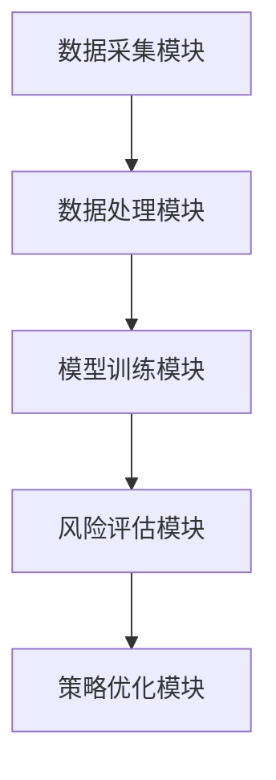
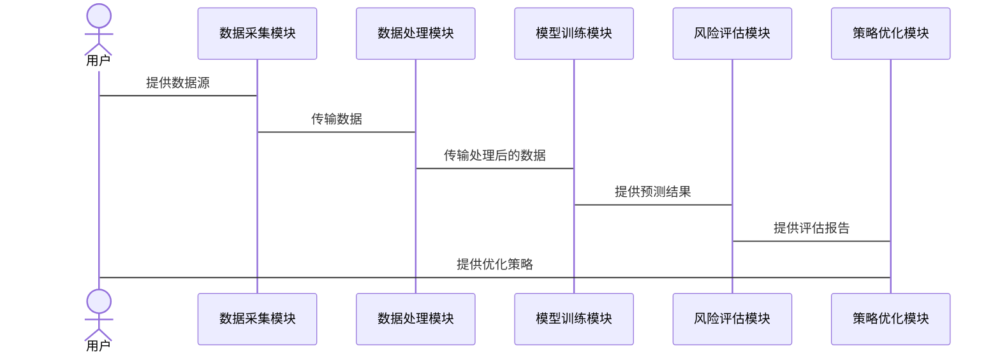

                 


# AI agents在公司气候变化适应能力评估中的应用

## 关键词：AI代理，气候变化适应能力，企业风险管理，机器学习，深度学习

## 摘要：  
随着气候变化的加剧，企业面临着越来越大的适应能力挑战。AI代理作为一种强大的技术工具，正在被广泛应用于公司气候变化适应能力的评估中。本文将从背景、核心概念、算法原理、系统设计、项目实战等多方面深入探讨AI代理在气候变化适应能力评估中的应用，为企业提供一种高效、智能的解决方案。

---

## 第一部分: 气候变化适应能力评估的背景与挑战

### 第1章: 气候变化适应能力评估概述

#### 1.1 气候变化对企业的影响  
气候变化不仅影响自然环境，还对企业运营产生了深远的影响。例如，极端天气事件（如洪水、干旱、飓风）可能导致企业供应链中断、财产损失和声誉受损。此外，气候变化还可能引发政策变化，例如碳排放限制政策的实施，迫使企业调整生产和运营模式。  

#### 1.2 企业适应气候变化的重要性  
企业适应气候变化的能力直接关系到其长期生存和发展。通过评估和优化适应能力，企业可以更好地应对气候变化带来的风险，抓住潜在的市场机会，并提升自身的竞争力。  

#### 1.3 AI代理在适应能力评估中的作用  
AI代理作为一种智能化工具，能够帮助企业高效地收集、分析和处理大量数据，快速识别气候变化带来的风险，并制定最优的应对策略。相比传统的人工评估方法，AI代理具有高效性、准确性、实时性等显著优势。  

---

## 第二部分: AI代理的核心概念与原理

### 第2章: AI代理的核心概念与原理  

#### 2.1 AI代理的基本原理  
AI代理是一种能够感知环境、自主决策并采取行动的智能实体。它通常包括以下几个核心要素：  
1. **感知层**：通过传感器、数据库等获取环境信息。  
2. **决策层**：利用机器学习算法对信息进行分析和决策。  
3. **行动层**：根据决策结果执行相应的操作。  

#### 2.2 AI代理在适应能力评估中的应用  
AI代理在气候变化适应能力评估中的应用主要体现在以下几个方面：  
1. **数据收集与处理**：AI代理可以实时收集与气候变化相关的数据（如温度、降水、风速等），并进行清洗和预处理。  
2. **风险预测与评估**：通过机器学习算法，AI代理可以预测未来可能出现的极端天气事件，并评估其对企业的影响。  
3. **策略优化**：基于预测结果，AI代理可以帮助企业制定最优的适应策略，例如调整供应链布局、优化能源使用等。  

#### 2.3 AI代理的核心概念对比  
以下是AI代理与其他传统评估方法的对比：  

| 对比维度        | AI代理                      | 传统评估方法                |
|-----------------|-----------------------------|-----------------------------|
| 数据处理能力    | 高效、自动化                 | 低效、依赖人工               |
| 预测准确性       | 高，基于大数据和机器学习     | 低，依赖经验判断             |
| 实时性           | 强，能够实时响应             | 弱，通常需要定期评估         |
| 可扩展性         | 强，适用于大规模数据         | 弱，难以处理海量数据         |

---

## 第三部分: AI代理在适应能力评估中的算法原理

### 第3章: AI代理的算法原理  

#### 3.1 常见AI代理算法介绍  
AI代理的核心算法主要包括以下几种：  

1. **机器学习算法**  
   - **线性回归**：用于预测连续型变量，例如预测未来某地区的气温变化。  
   - **随机森林**：用于分类和回归问题，适用于处理高维数据。  

2. **深度学习算法**  
   - **卷积神经网络（CNN）**：适用于图像识别和处理。  
   - **循环神经网络（RNN）**：适用于时间序列数据的分析。  

3. **强化学习算法**  
   - **Q-Learning**：适用于动态环境下的策略优化。  

#### 3.2 适应能力评估中的算法选择  
在气候变化适应能力评估中，选择合适的算法至关重要。以下是算法选择的依据和影响因素：  

1. **数据类型与规模**：  
   - 如果数据量小且维度低，可以选择线性回归或决策树。  
   - 如果数据量大且维度高，可以选择随机森林或深度学习算法。  

2. **任务类型**：  
   - 如果任务是分类（如预测极端天气事件的类型），可以选择随机森林或支持向量机（SVM）。  
   - 如果任务是回归（如预测气温变化），可以选择线性回归或神经网络。  

3. **计算资源**：  
   - 如果计算资源有限，可以选择计算效率高的算法，如线性回归或决策树。  
   - 如果计算资源充足，可以选择深度学习算法，尽管其训练时间较长，但效果更优。  

#### 3.3 算法原理与数学模型  

##### 3.3.1 线性回归  
线性回归是一种简单而强大的预测模型，其基本假设是因变量与自变量之间存在线性关系。其数学模型如下：  
$$ y = \beta_0 + \beta_1 x_1 + \beta_2 x_2 + \cdots + \beta_n x_n + \epsilon $$  
其中，$y$ 是因变量，$x_i$ 是自变量，$\beta_i$ 是回归系数，$\epsilon$ 是误差项。  

##### 3.3.2 随机森林  
随机森林是一种基于决策树的集成学习算法，通过构建多棵决策树并取其预测结果的多数投票作为最终结果。其优势在于能够处理高维数据，并且具有较强的抗过拟合能力。  

---

## 第四部分: AI代理在适应能力评估中的系统设计

### 第4章: 系统分析与架构设计  

#### 4.1 系统功能设计  
以下是气候变化适应能力评估系统的功能模块设计：  

1. **数据采集模块**  
   - 从多种数据源（如气象数据、企业运营数据）获取相关信息。  
2. **数据处理模块**  
   - 对数据进行清洗、预处理和特征提取。  
3. **模型训练模块**  
   - 使用机器学习算法对数据进行训练，生成预测模型。  
4. **风险评估模块**  
   - 基于预测模型，评估气候变化对企业的影响。  
5. **策略优化模块**  
   - 根据评估结果，制定最优的适应策略。  

#### 4.2 系统架构设计  

##### 4.2.1 系统架构图  
以下是系统的总体架构图：  



##### 4.2.2 系统交互流程图  
以下是系统的交互流程图：  



---

## 第五部分: 项目实战

### 第5章: 项目实战  

#### 5.1 项目背景与目标  
假设某跨国公司希望评估其在全球不同地区的气候变化适应能力，并制定相应的优化策略。  

#### 5.2 环境安装与数据准备  
1. **环境安装**  
   - 安装Python、Jupyter Notebook、scikit-learn、xgboost等工具。  
2. **数据准备**  
   - 数据来源：公开气象数据、企业运营数据等。  
   - 数据格式：CSV、Excel等。  

#### 5.3 系统核心实现  

##### 5.3.1 数据预处理  
```python
import pandas as pd
import numpy as np

# 读取数据
data = pd.read_csv('climate_data.csv')

# 数据清洗
data.dropna(inplace=True)
data['date'] = pd.to_datetime(data['date'])
data.set_index('date', inplace=True)
```

##### 5.3.2 模型训练  
```python
from sklearn.model_selection import train_test_split
from sklearn.ensemble import RandomForestRegressor
from sklearn.metrics import mean_squared_error

# 数据分割
X = data[['temperature', 'precipitation', 'wind_speed']]
y = data['climate_impact']

X_train, X_test, y_train, y_test = train_test_split(X, y, test_size=0.2, random_state=42)

# 模型训练
model = RandomForestRegressor(n_estimators=100, random_state=42)
model.fit(X_train, y_train)

# 模型预测
y_pred = model.predict(X_test)

# 模型评估
mse = mean_squared_error(y_test, y_pred)
print(f'Mean Squared Error: {mse}')
```

##### 5.3.3 结果分析  
通过模型预测，可以得出不同地区的气候变化对企业的影响，并制定相应的优化策略。  

---

## 第六部分: 最佳实践与总结

### 第6章: 最佳实践与总结  

#### 6.1 小结  
AI代理在气候变化适应能力评估中的应用为企业提供了高效、智能的解决方案。通过机器学习算法，企业可以快速识别风险，优化适应策略，并提升自身的抗风险能力。  

#### 6.2 注意事项  
1. 数据质量是评估结果的关键，需确保数据的准确性和完整性。  
2. 模型的选择需根据具体场景和数据特点进行，避免盲目追求复杂算法。  
3. 需定期更新模型和数据，以应对气候变化的动态变化。  

#### 6.3 拓展阅读  
1. 《机器学习实战》  
2. 《深度学习》  
3. 《气候变化经济学》  

---

## 作者：AI天才研究院/AI Genius Institute & 禅与计算机程序设计艺术 /Zen And The Art of Computer Programming

