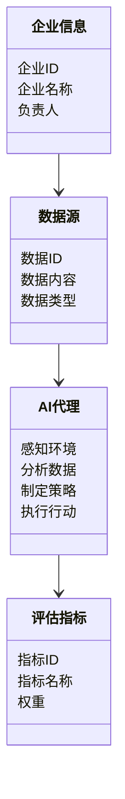
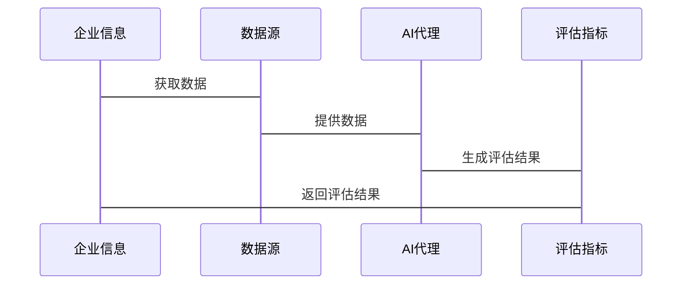

                 


# AI 代理在公司社会责任评估中的应用

> **关键词**：AI代理、公司社会责任、评估系统、智能化工具、决策支持

> **摘要**：本文探讨了AI代理在公司社会责任评估中的应用，分析了其核心概念、算法原理、系统架构以及实际案例。通过详细的技术分析和项目实战，展示了如何利用AI代理提升社会责任评估的效率和准确性。

---

## 第1章: AI 代理与公司社会责任评估的背景与基础

### 1.1 AI 代理的基本概念

#### 1.1.1 AI 代理的定义
AI代理（Artificial Intelligence Agent）是指能够感知环境、自主决策并采取行动以实现目标的智能实体。它通过传感器接收信息，利用计算模型处理数据，并通过执行器采取行动。

#### 1.1.2 AI 代理的核心特征
- **自主性**：无需外部干预，自主完成任务。
- **反应性**：能实时感知环境变化并做出反应。
- **目标导向**：所有行动均以实现特定目标为导向。

#### 1.1.3 AI 代理在企业中的应用潜力
AI代理在企业中的应用领域包括客户支持、自动化决策、风险管理等。在社会责任评估中，AI代理可以用于数据收集、分析和决策支持。

---

### 1.2 公司社会责任评估的基本概念

#### 1.2.1 公司社会责任的定义
公司社会责任（Corporate Social Responsibility，CSR）是指企业在追求经济利益的同时，还需承担对社会、环境和利益相关者的责任。

#### 1.2.2 社会责任评估的主要维度
- **环境责任**：评估企业在环境保护方面的表现。
- **社会责任**：评估企业在员工权益、社区贡献等方面的表现。
- **经济责任**：评估企业在合规经营、纳税等方面的表现。

#### 1.2.3 社会责任评估的现状与挑战
目前，社会责任评估主要依赖人工审核，存在效率低、成本高等问题。引入AI代理可以提高评估的效率和准确性。

---

### 1.3 AI 代理在社会责任评估中的应用价值

#### 1.3.1 提高评估效率的潜力
AI代理可以快速处理大量数据，显著提高评估效率。

#### 1.3.2 数据分析能力的优势
AI代理可以通过机器学习技术分析非结构化数据，发现隐藏的模式和趋势。

#### 1.3.3 个性化评估方案的可能性
AI代理可以根据不同企业的特点，定制个性化的评估方案。

---

## 第2章: AI 代理与社会责任评估的核心概念

### 2.1 AI 代理的核心原理

#### 2.1.1 AI 代理的决策机制
AI代理通过感知环境、分析数据、制定策略并执行行动来完成任务。

#### 2.1.2 知识表示与推理方法
知识表示可以采用规则、语义网络等形式，推理过程则通过逻辑推理或机器学习模型完成。

#### 2.1.3 学习与自适应能力
AI代理可以通过监督学习、无监督学习或强化学习不断优化自身的决策能力。

---

### 2.2 社会责任评估的框架

#### 2.2.1 评估指标体系
常见的社会责任评估指标包括环境影响、员工满意度、社区贡献等。

#### 2.2.2 数据收集与处理
数据来源包括企业报告、新闻媒体、社交媒体等，需进行清洗和预处理。

#### 2.2.3 评估结果的可视化
通过图表、报告等形式直观展示评估结果，便于企业理解和改进。

---

### 2.3 AI 代理与社会责任评估的关联性

#### 2.3.1 数据驱动的评估模式
AI代理可以利用大数据技术进行全方位分析，提供更精准的评估结果。

#### 2.3.2 智能化评估工具的开发
AI代理可以作为智能化工具，辅助人类完成复杂的社会责任评估任务。

#### 2.3.3 代理系统在决策支持中的作用
AI代理可以通过预测和模拟，为企业提供决策支持，优化社会责任表现。

---

## 第3章: AI 代理在社会责任评估中的算法原理

### 3.1 基于规则的AI代理算法

#### 3.1.1 规则库的构建
规则库通常包括企业行为准则、社会责任标准等，用于指导AI代理的决策。

#### 3.1.2 基于规则的决策过程
AI代理根据预设规则匹配输入数据，生成评估结果。

#### 3.1.3 规则的可解释性
基于规则的算法具有较高的可解释性，便于人类理解和验证。

---

### 3.2 基于机器学习的AI代理算法

#### 3.2.1 监督学习与无监督学习的应用
- **监督学习**：用于分类任务，如判断企业行为是否符合社会责任标准。
- **无监督学习**：用于聚类任务，如发现潜在的社会责任风险。

#### 3.2.2 神经网络模型的构建
深度学习模型如卷积神经网络（CNN）和循环神经网络（RNN）可以用于处理复杂的文本数据。

#### 3.2.3 模型的训练与优化
通过大量社会责任相关数据训练模型，并通过交叉验证优化性能。

---

### 3.3 混合式AI代理算法

#### 3.3.1 规则与机器学习的结合
混合式算法结合规则和机器学习的优势，既能保证结果的可解释性，又能提高准确性。

#### 3.3.2 混合式算法的优势
- **准确性**：利用规则和机器学习的双重优势。
- **灵活性**：适用于不同场景和数据类型。

#### 3.3.3 混合式算法的实现步骤
1. 数据预处理：清洗和标注数据。
2. 规则提取：从历史数据中提取专家经验。
3. 模型训练：训练机器学习模型。
4. 结果融合：将规则和模型结果进行加权融合。

---

## 第4章: 社会责任评估的数学模型与公式

### 4.1 评估指标的加权模型

#### 4.1.1 指标权重的确定方法
指标权重通常通过层次分析法（AHP）或专家评分法确定。

#### 4.1.2 加权计算公式
$$ \text{评估得分} = \sum_{i=1}^{n} w_i \times s_i $$
其中，\( w_i \) 是指标 \( i \) 的权重，\( s_i \) 是指标 \( i \) 的得分。

---

## 第5章: 系统分析与架构设计方案

### 5.1 问题场景介绍

公司社会责任评估系统需要处理大量异构数据，包括文本、图像和视频等。传统的评估方法效率低、成本高，难以满足企业的需求。

---

### 5.2 系统功能设计

#### 5.2.1 领域模型


---

#### 5.2.2 系统架构设计


---

#### 5.2.3 系统接口设计


---

## 第6章: 项目实战

### 6.1 环境安装

```bash
pip install numpy pandas scikit-learn matplotlib
```

---

### 6.2 系统核心实现源代码

```python
import numpy as np
from sklearn.model_selection import train_test_split
from sklearn.metrics import accuracy_score

# 示例数据集
X = np.array([[1, 2], [3, 4], [5, 6], [7, 8]])
y = np.array([0, 1, 0, 1])

# 数据分割
X_train, X_test, y_train, y_test = train_test_split(X, y, test_size=0.25)

# 机器学习模型训练
from sklearn.tree import DecisionTreeClassifier
clf = DecisionTreeClassifier()
clf.fit(X_train, y_train)

# 模型预测
y_pred = clf.predict(X_test)

# 计算准确率
print("准确率:", accuracy_score(y_test, y_pred))
```

---

### 6.3 代码应用解读与分析

上述代码实现了基于决策树的分类模型，用于对社会责任评估数据进行分类。训练完成后，模型可以预测新的数据点的类别。

---

### 6.4 实际案例分析

以某公司为例，利用上述模型评估其社会责任表现。通过分析结果，帮助企业识别改进方向。

---

## 第7章: 最佳实践

### 7.1 小结

本文详细探讨了AI代理在公司社会责任评估中的应用，分析了其核心概念、算法原理和系统架构，展示了实际案例和代码实现。

---

### 7.2 注意事项

- **数据质量**：确保数据的准确性和完整性。
- **模型可解释性**：避免过于复杂的模型影响结果的理解。
- **合规性**：确保评估过程符合相关法律法规。

---

### 7.3 拓展阅读

- 《人工智能：一种现代的方法》
- 《企业社会责任评估指南》

---

## 作者：AI天才研究院 & 禅与计算机程序设计艺术

---

本文详细探讨了AI代理在公司社会责任评估中的应用，分析了其核心概念、算法原理和系统架构，展示了实际案例和代码实现。通过本文，读者可以深入了解如何利用AI技术提升社会责任评估的效率和准确性。

